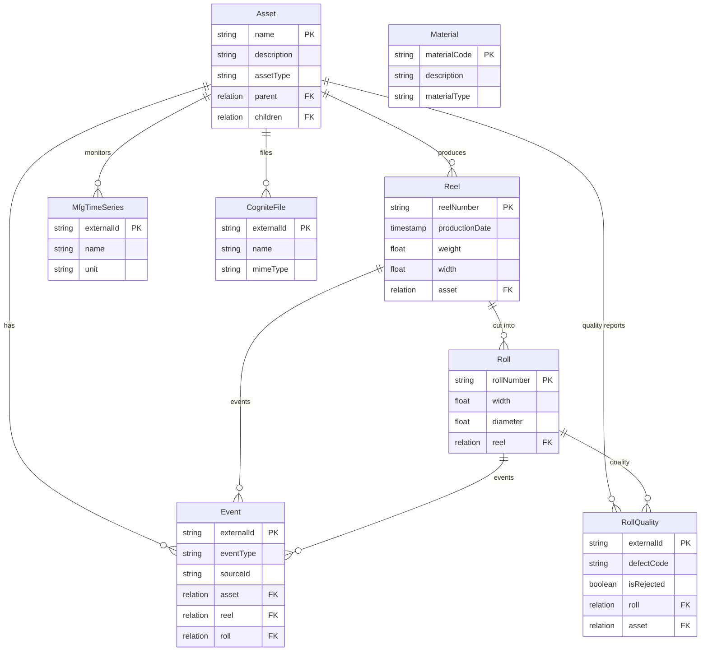
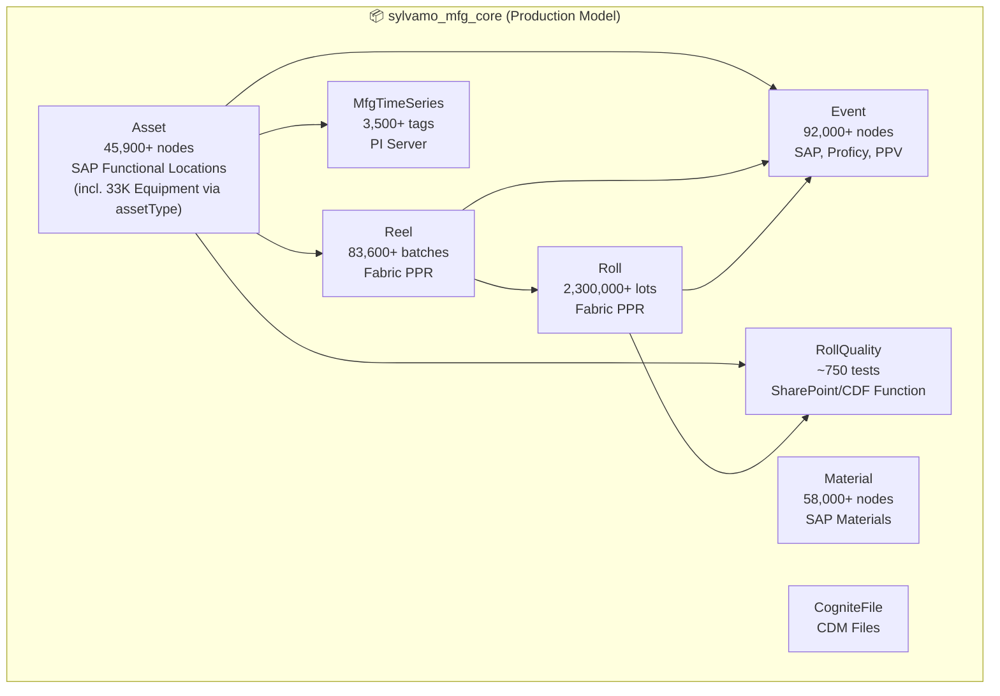
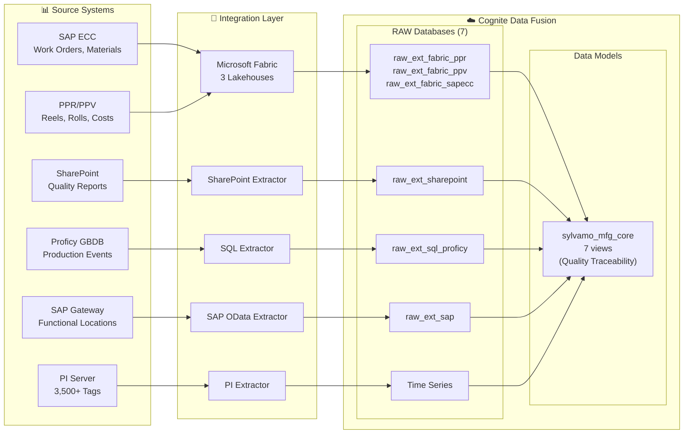

# Sylvamo Cognite Project

**CDF implementation for Sylvamo paper manufacturing operations**

> Manufacturing data model for paper production - built on Cognite Data Model (CDM)

This repository contains the data model specification for Sylvamo's manufacturing operations in Cognite Data Fusion (CDF).

## Overview

Sylvamo's primary data model in CDF is **sylvamo_mfg_core**, built on the Cognite Data Model (CDM) for Industrial Tools compatibility. A secondary extended model exists for additional use cases.

### sylvamo_mfg_core (Primary Production Model)

| Component | Value |
|-----------|-------|
| **Schema Space** | `sylvamo_mfg_core_schema` |
| **Instance Space** | `sylvamo_mfg_core_instances` |
| **Data Model** | `SylvamoMfgCore/v1` |
| **Views** | 7 custom (Asset, Event, Material, MfgTimeSeries, Reel, Roll, RollQuality) + CDM views |
| **Instances** | 450,000+ nodes |
| **Use Case** | **Quality Traceability** (Roll → Reel → Quality Tests) |

> **Note:** CogniteFile is a CDM view, not a custom Sylvamo view. Equipment is modeled as Asset subtypes with `assetType` classification (see [ADR-001](docs/reference/data-model/decisions/ADR-001-ASSET-EQUIPMENT.md)).

## Entity Relationship Diagram

### sylvamo_mfg_core (Production Model)



### Diagram Legend

#### Relationship Symbols (Crow's Foot Notation)

| Symbol | Meaning | Example |
|--------|---------|---------|
| `\|\|--o{` | **One-to-Many**: One parent has many children | Asset `\|\|--o{` Reel means one Asset produces many Reels |
| `}o--\|\|` | **Many-to-One**: Many children belong to one parent | Roll `}o--\|\|` Reel means many Rolls come from one Reel |
| `\|\|` | **One** (exactly one) | The single line indicates "one" side |
| `o{` | **Many** (zero or more) | The crow's foot (fork) indicates "many" side |

#### Relationship Labels

| Label | Business Meaning |
|-------|------------------|
| **"produces"** | Asset produces Reels (paper production) |
| **"has"** | Asset has Events (work orders, production events) |
| **"monitors"** | Asset is monitored by MfgTimeSeries (PI tags) |
| **"quality reports"** | Asset has RollQuality reports |
| **"files"** | Asset has associated CogniteFiles (P&IDs, drawings) |
| **"cut into"** | Reel is cut into Rolls |
| **"events"** | Reel/Roll has production Events |
| **"quality"** | Roll has quality test results |

#### Property Types

| Notation | Meaning |
|----------|---------|
| `PK` | **Primary Key** - Unique identifier for the entity |
| `FK` | **Foreign Key** - Reference to another entity |
| `string` | Text value |
| `float` | Decimal number |
| `timestamp` | Date and time |
| `boolean` | True/False |
| `relation` | Link to another entity |

## Flow Diagram



## Use Cases

### Use Case 2: Paper Quality Association ✅
**Objective:** Associate paper quality metrics with production data to track quality trends across plants.

| Scenario | Query | Status |
|----------|-------|--------|
| Quality Traceability | Roll → Reel → Quality Tests | ✅ Verified |
| Inter-Plant Tracking | Package status Eastover → Sumpter | ✅ Verified |
| Recipe Compliance | Target vs Actual quality comparison | ✅ Verified |
| Production Dashboard | Summary metrics across all entities | ✅ Verified |

**[See Full Query Examples →](docs/reference/use-cases/USE_CASES_AND_QUERIES.md)**

### Use Case 1: Material Cost & PPV Analysis ✅
**Objective:** Track purchase price variance for raw materials and link to products.

| Scenario | Query | Status |
|----------|-------|--------|
| PPV Analysis by Material | List all materials with PPV changes | ✅ Verified |
| Product Cost Impact | Link costs to ProductDefinition | ✅ Verified |
| Period-over-Period | Compare current vs prior costs | ✅ Verified |

**[See Full Query Examples →](docs/reference/use-cases/USE_CASES_AND_QUERIES.md)**

---

## Key Design Decisions

Based on guidance from Johan Stabekk (Cognite ISA Expert, Jan 28, 2026) and subsequent analysis:

1. **Equipment as Asset subtypes** via `assetType` classification (ADR-001) - QuickStart Pattern
2. **Reel** as ISA Batch (paper reel = batch)
3. **Roll** as ISA MaterialLot (sellable unit)
4. **CDM Asset hierarchy** from SAP Functional Locations (9 levels)
5. **RollQuality** linked to both Roll and Asset for quality traceability

> **[ADR-001: Asset/Equipment Modeling →](docs/reference/data-model/decisions/ADR-001-ASSET-EQUIPMENT.md)** | **[Full Changelog →](docs/reference/data-model/changelog/CHANGELOG-0001.md)**

## Sprint 3 (Current)

**Sprint Duration:** February 16 - March 2, 2026

| Workstream | Focus |
|------------|-------|
| Contextualization | P&ID annotation, PPR/PPV data |
| Data Quality | Reel/Roll scheduling, quality data |
| Demos | CDF Industrial Tools, Atlas AI Agents |

Sprint 2 completed February 13, 2026. See [archive](docs/archive/2026-02-sprint2-completed/) for completed sprint artifacts.

## Documentation

**[Full Documentation Index →](docs/README.md)**

### Reference Documentation (by topic)

**📊 Data & Pipeline**
- [**CDF Pipeline Overview**](docs/reference/CDF_PIPELINE_OVERVIEW.md) — End-to-end: extractors, RAW, transformations, CDF functions
- **Data Model**
  - [MFG Core Data Model](docs/reference/data-model/MFG_CORE_DATA_MODEL.md) — 7 core views, Quality Traceability use case
  - [MFG Core + PPV (Proposed)](docs/reference/data-model/MFG_CORE_WITH_PPV.md) — Proposed PPV integration into mfg_core
  - [MFG Extended Data Model](docs/reference/data-model/MFG_EXTENDED_DATA_MODEL.md) — 8 extended views, PPV/Cost Analysis use case
  - [Data Model Specification](docs/reference/data-model/DATA_MODEL_SPECIFICATION.md) — Complete spec with all containers, properties, and examples
  - [Guide for Stakeholders](docs/reference/data-model/DATA_MODEL_FOR_STAKEHOLDERS.md) — Non-technical overview with flow diagrams and business examples
  - [Transformations](docs/reference/data-model/TRANSFORMATIONS.md) — SQL transformations, data flow, examples
- **Extractors & Sources**
  - [Extractors](docs/reference/extractors/EXTRACTORS.md) — Extractor configurations and status
  - [Data Pipeline & Sources](docs/reference/extractors/DATA_PIPELINE_AND_SOURCES.md) — Data sources, transformations, refresh schedules

**🏗️ Architecture & Governance**
- [Architecture Decisions & Roadmap](docs/reference/data-model/ARCHITECTURE_DECISIONS_AND_ROADMAP.md) — ISA-95 alignment, ADRs, roadmap
- [ADR-001: Asset/Equipment](docs/reference/data-model/decisions/ADR-001-ASSET-EQUIPMENT.md) — ISA-95 Equipment modeling as Asset subtypes
- [Changelog](docs/reference/data-model/changelog/CHANGELOG-0001.md) — Chronological record of data model changes

**🔧 Operations**
- [CI/CD Overview](docs/reference/cicd/CICD_OVERVIEW.md) — CI/CD pipeline setup for CDF deployments
- [Code Change Workflow](docs/reference/workflows/CODE_CHANGE_WORKFLOW.md) — End-to-end: code changes, validation, Jira, changelog

**📋 Use Cases**
- [Use Cases & Queries](docs/reference/use-cases/USE_CASES_AND_QUERIES.md) — Verified use case scenarios with real data

**📚 Planning & Reference**
- [Sprint 3 Plan](docs/internal/sprint-planning/SPRINT_3_PLAN.md) — Current sprint - Contextualization, demos, data quality
- [Sprint 2 Archive](docs/archive/2026-02-sprint2-completed/) — Completed sprint artifacts
- [ISA Alignment](docs/reference/data-model/COGNITE_ISA_EXTENSION_AND_SYLVAMO_ALIGNMENT.md) — ISA-95/88 alignment analysis
- [Johan's Guidance](docs/reference/data-model/JOHAN_ISA95_GUIDANCE_SUMMARY.md) — Expert recommendations from Cognite

## Extractors

| Extractor | Source | Status | Data Target |
|-----------|--------|--------|-------------|
| **Fabric Connector** | Microsoft Fabric Lakehouse | ✅ Running | `raw_ext_fabric_ppr`, `raw_ext_fabric_ppv`, `raw_ext_fabric_sapecc` |
| **PI Extractor** | PI Server (3,500+ tags) | ✅ Running | Time Series, `raw_ext_pi` |
| **SharePoint Extractor** | SharePoint Online | ✅ Running | `raw_ext_sharepoint` |
| **SAP OData Extractor** | SAP Gateway | ✅ Running | `raw_ext_sap` |
| **SQL Extractor** | Proficy GBDB | ✅ Running | `raw_ext_sql_proficy` |

### RAW Database Naming Convention

All extractor-managed databases use the prefix `raw_ext_<extractor>_<source>`:

| Database | Extractor | Description |
|----------|-----------|-------------|
| `raw_ext_fabric_ppr` | Fabric Connector | Paper Production Reporting (Reels, Rolls) |
| `raw_ext_fabric_ppv` | Fabric Connector | Purchase Price Variance / Cost data |
| `raw_ext_fabric_sapecc` | Fabric Connector | SAP ECC data (Work Orders, Materials) |
| `raw_ext_pi` | PI Extractor | Time series metadata |
| `raw_ext_sap` | SAP OData | SAP master data (Functional Locations) |
| `raw_ext_sql_proficy` | SQL Extractor | Proficy lab test results |
| `raw_ext_sharepoint` | SharePoint Extractor | Documents and quality reports |

**[See Full Extractor Documentation →](docs/reference/extractors/EXTRACTORS.md)**

## Data Pipeline



### RAW to Data Model Mapping

| Source System | RAW Database | Target View | Model |
|---------------|--------------|-------------|-------|
| SAP Functional Locations | `raw_ext_sap/floc_*` | Asset | mfg_core |
| SAP Materials | `raw_ext_fabric_sapecc/materials` | Material | mfg_core |
| PPR (via Fabric) | `raw_ext_fabric_ppr/ppr_hist_reel` | Reel | mfg_core |
| PPR (via Fabric) | `raw_ext_fabric_ppr/ppr_hist_roll` | Roll | mfg_core |
| SharePoint | `raw_ext_sharepoint/roll_quality` | RollQuality | mfg_core |
| PI Server | Time Series API | MfgTimeSeries | mfg_core |

**[See Full Data Pipeline Documentation →](docs/reference/extractors/DATA_PIPELINE_AND_SOURCES.md)** | **[Data Source Registry →](docs/reference/extractors/DATA_SOURCE_REGISTRY.md)**

## CI/CD for CDF

CDF is deployed using the **Cognite Toolkit CLI** (`cdf`) through standard CI/CD pipelines.

**Sylvamo Repository:** [Industrial-Data-Landscape-IDL](https://dev.azure.com/SylvamoCorp/_git/Industrial-Data-Landscape-IDL) (Azure DevOps)

### Tech Stack

| Component | Technology |
|-----------|------------|
| **Deploy Tool** | Cognite Toolkit CLI (`cdf`) |
| **Package** | `cognite-toolkit` (pip) or Docker `cognite/toolkit:<version>` |
| **Key Commands** | `cdf build`, `cdf deploy --dry-run`, `cdf deploy` |
| **Platform** | Azure DevOps (SylvamoCorp) |

### CI/CD Flow

```
┌─────────────────────────────────────────────────────────────────┐
│  FEATURE BRANCH (PR)                                            │
│    cdf build → cdf deploy --dry-run                             │
│    ✓ Validates config, shows what WOULD change                  │
└─────────────────────────────────────────────────────────────────┘
                              │ merge
                              ▼
┌─────────────────────────────────────────────────────────────────┐
│  MAIN BRANCH                                                    │
│    cdf build → cdf deploy                                       │
│    ✓ Applies changes to CDF                                     │
│    Environment promotion: DEV → STAGING → PROD (with approvals) │
└─────────────────────────────────────────────────────────────────┘
```

### Authentication

Pipelines authenticate via **OAuth2 client credentials** (Entra ID service principal):

| Environment Variable | Description |
|---------------------|-------------|
| `LOGIN_FLOW` | `client_credentials` |
| `CDF_CLUSTER` | `az-eastus-1` |
| `CDF_PROJECT` | `sylvamo-dev` |
| `IDP_CLIENT_ID` | Service Principal App ID |
| `IDP_CLIENT_SECRET` | Service Principal Secret |
| `IDP_TENANT_ID` | Entra ID Tenant |

Secrets stored in **project-level Variable Groups** in the SylvamoCorp ADO project, injected as env vars at runtime.

**[See Full CI/CD Documentation →](docs/reference/cicd/CICD_OVERVIEW.md)** | **[Code Change Workflow →](docs/reference/workflows/CODE_CHANGE_WORKFLOW.md)**

## Real Data Statistics

> **Verified:** February 17, 2026 against CDF sylvamo-dev project

### sylvamo_mfg_core (Production Model)

| Entity | Count | Source | Status |
|--------|-------|--------|--------|
| Asset | 45,900+ | SAP Functional Locations (9 levels, with ISA-95 assetType classification) | ✅ |
| Event | 92,000+ | SAP Work Orders, Proficy, PPV | ✅ |
| Material | 58,000+ | SAP Material Master | ✅ |
| MfgTimeSeries | 3,500+ | PI Server (3 servers) | ✅ |
| Reel | 83,600+ | `raw_ext_fabric_ppr/ppr_hist_reel` | ✅ |
| Roll | 2,300,000+ | `raw_ext_fabric_ppr/ppr_hist_roll` | ✅ |
| RollQuality | ~750 | `raw_ext_sharepoint/roll_quality` + CDF Function (349+ linked to Asset) | ✅ |
| CogniteFile | 97+ | CDF Files (P&IDs, drawings) | ✅ |
| **TOTAL** | **450,000+** | Real production data | |

> **ISA-95 Equipment Modeling (ADR-001):** Equipment is modeled as Asset subtypes with `assetType='Equipment'` (33,072 leaf-level assets). See [ADR-001-ASSET-EQUIPMENT.md](docs/reference/data-model/decisions/ADR-001-ASSET-EQUIPMENT.md).

### Data Model Summary

| Model | Status | Views | Total Instances | Purpose |
|-------|--------|-------|-----------------|---------|
| `sylvamo_mfg_core` | **Production** | 7 | 450,000+ | Core entities (Asset, Reel, Roll, Material, Quality) |
| `sylvamo_mfg_extended` | Secondary | 8 | 50,000+ | Activities (WorkOrder, ProductionOrder, CostEvent) |
| `sylvamo_mfg` | **Deprecated** | 0 | 0 | Legacy POC - no longer in use |

## GraphQL Query Examples

### Query Reels with Rolls (mfg_core)

```graphql
{
  listReel(first: 10) {
    items {
      externalId
      reelNumber
      productionDate
      asset { name }
      rolls {
        items {
          rollNumber
          width
        }
      }
    }
  }
}
```

### Query Assets by Equipment Type

```graphql
{
  listAsset(filter: { assetType: { eq: "Equipment" } }, first: 10) {
    items {
      externalId
      name
      assetType
      parent { name }
    }
  }
}
```

### Query Roll Quality with Asset Link

```graphql
{
  listRollQuality(first: 10) {
    items {
      externalId
      defectCode
      isRejected
      roll { rollNumber }
      asset { name assetType }
    }
  }
}
```

## License

Internal use only - Cognite/Sylvamo

---

*Updated: February 2026*
*Verified against CDF sylvamo-dev project*
