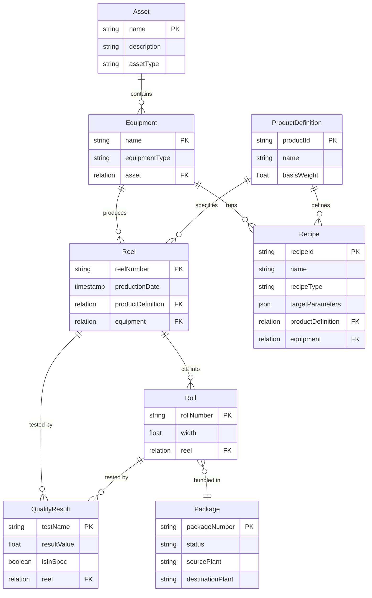
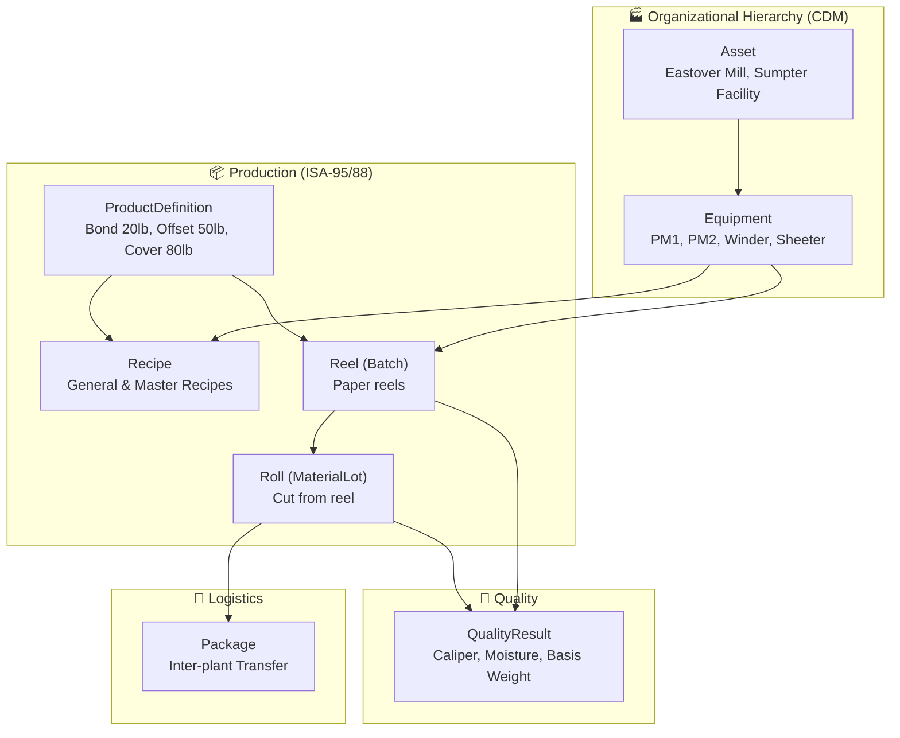

# Sylvamo Manufacturing Data Model

**ISA-95/ISA-88 aligned data model for paper manufacturing**

This repository contains the data model specification for Sylvamo's manufacturing operations in Cognite Data Fusion (CDF).

## Overview

The `sylvamo_mfg` data model implements ISA-95 and ISA-88 standards adapted for paper manufacturing, with extensions for inter-plant traceability.

| Component | Value |
|-----------|-------|
| **Space** | `sylvamo_mfg` |
| **Data Model** | `sylvamo_manufacturing/v3` |
| **Views** | 8 (Asset, Equipment, ProductDefinition, Recipe, Reel, Roll, Package, QualityResult) |
| **Sample Data** | 38 nodes |

## Entity Relationship Diagram



## Flow Diagram



## Key Design Decisions

Based on guidance from Johan Stabekk (Cognite ISA Expert, Jan 28, 2026):

1. **CDM Asset + Equipment** instead of ISA Site/Unit hierarchy
2. **Reel** as ISA Batch (paper reel = batch)
3. **Roll** as ISA MaterialLot (sellable unit)
4. **Package** entity for inter-plant traceability (Sylvamo extension)
5. **Recipe** entity following ISA-88 (general, site, master, control types)

## Documentation

| Document | Description |
|----------|-------------|
| [Data Model Diagram](docs/SYLVAMO_MFG_DATA_MODEL_DIAGRAM.md) | Full entity diagram with properties |
| [Alignment Document](docs/COGNITE_ISA_EXTENSION_AND_SYLVAMO_ALIGNMENT.md) | ISA-95/88 alignment analysis |
| [Johan's Guidance](docs/JOHAN_ISA95_GUIDANCE_SUMMARY.md) | Expert recommendations |

## Sample Data

| Entity | Count | Examples |
|--------|-------|----------|
| Asset | 2 | Eastover Mill, Sumpter Facility |
| Equipment | 4 | PM1, PM2, Winder 1, Sheeter 1 |
| ProductDefinition | 3 | Bond 20lb, Offset 50lb, Cover 80lb |
| Recipe | 4 | 1 general + 3 master recipes |
| Reel | 3 | PM1-20260128-001, PM1-20260128-002, PM2-20260128-001 |
| Roll | 11 | Cut from reels (8.5" and 6.0" widths) |
| Package | 3 | Shipped, InTransit, Received |
| QualityResult | 8 | Caliper, Moisture, Basis Weight, Brightness |

## GraphQL Query Example

```graphql
{
  listReel {
    items {
      reelNumber
      productionDate
      productDefinition { name basisWeight }
      equipment { name equipmentType }
    }
  }
}
```

## License

Internal use only - Cognite/Sylvamo

---

*Created: January 28, 2026*
