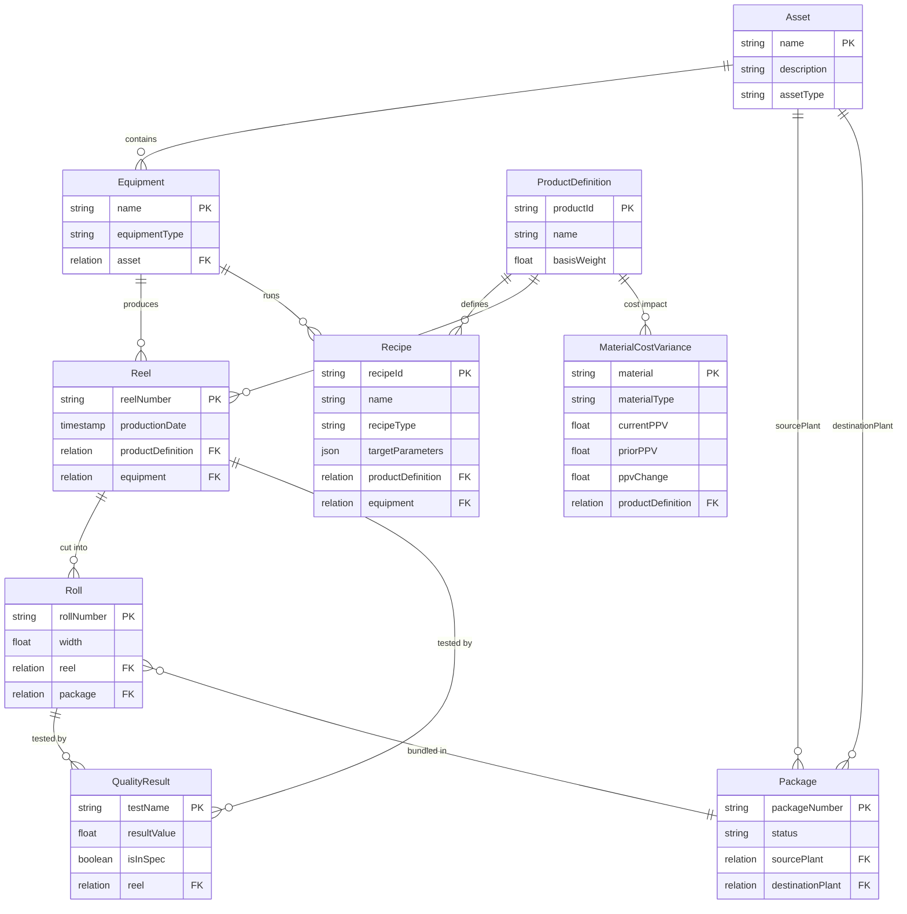
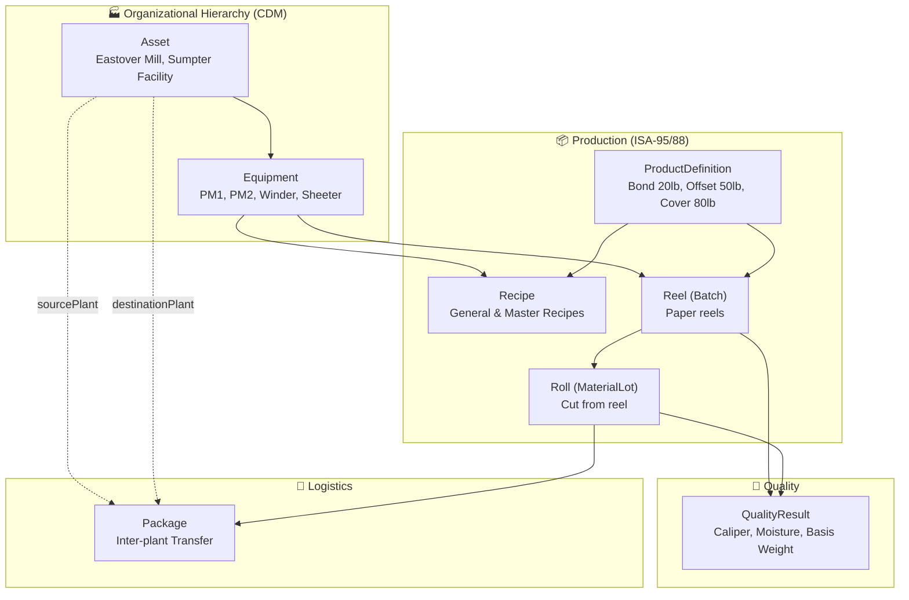
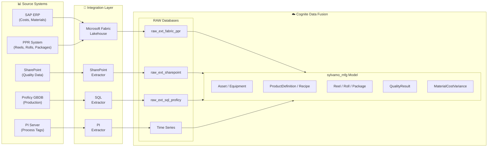

# Sylvamo Manufacturing Data Model

**ISA-95/ISA-88 aligned data model for paper manufacturing**

This repository contains the data model specification for Sylvamo's manufacturing operations in Cognite Data Fusion (CDF).

## Overview

The `sylvamo_mfg` data model implements ISA-95 and ISA-88 standards adapted for paper manufacturing, with extensions for inter-plant traceability.

| Component | Value |
|-----------|-------|
| **Space** | `sylvamo_mfg` |
| **Data Model** | `sylvamo_manufacturing/v9` |
| **Views** | 9 (Asset, Equipment, ProductDefinition, Recipe, Reel, Roll, Package, QualityResult, MaterialCostVariance) |
| **View Versions** | All views now use typed relations for GraphQL traversal |
| **Real Data** | 197 nodes (from actual Sylvamo systems) |

## Entity Relationship Diagram



### Diagram Legend

#### Relationship Symbols (Crow's Foot Notation)

| Symbol | Meaning | Example |
|--------|---------|---------|
| `\|\|--o{` | **One-to-Many**: One parent has many children | Asset `\|\|--o{` Equipment means one Asset contains many Equipment |
| `}o--\|\|` | **Many-to-One**: Many children belong to one parent | Roll `}o--\|\|` Package means many Rolls are bundled in one Package |
| `\|\|` | **One** (exactly one) | The single line indicates "one" side |
| `o{` | **Many** (zero or more) | The crow's foot (fork) indicates "many" side |

#### Relationship Labels

| Label | Business Meaning |
|-------|------------------|
| **"contains"** | Asset contains Equipment (physical hierarchy) |
| **"produces"** | Equipment produces Reels |
| **"runs"** | Equipment runs Recipes |
| **"defines"** | ProductDefinition defines what a Recipe makes |
| **"specifies"** | ProductDefinition specifies what a Reel is |
| **"cost impact"** | MaterialCostVariance affects ProductDefinition costs |
| **"cut into"** | Reel is cut into Rolls |
| **"tested by"** | Reel/Roll is tested by QualityResult |
| **"bundled in"** | Roll is bundled in Package |
| **"sourcePlant"** | Package ships FROM this Asset |
| **"destinationPlant"** | Package ships TO this Asset |

#### Property Types

| Notation | Meaning |
|----------|---------|
| `PK` | **Primary Key** - Unique identifier for the entity |
| `FK` | **Foreign Key** - Reference to another entity |
| `string` | Text value |
| `float` | Decimal number |
| `timestamp` | Date and time |
| `boolean` | True/False |
| `json` | Structured data object |
| `relation` | Link to another entity |

## Flow Diagram



## Use Cases

### Use Case 2: Paper Quality Association ✅
**Objective:** Associate paper quality metrics with production data to track quality trends across plants.

| Scenario | Query | Status |
|----------|-------|--------|
| Quality Traceability | Roll → Reel → Quality Tests | ✅ Verified |
| Inter-Plant Tracking | Package status Eastover → Sumpter | ✅ Verified |
| Recipe Compliance | Target vs Actual quality comparison | ✅ Verified |
| Production Dashboard | Summary metrics across all entities | ✅ Verified |

**[See Full Query Examples →](docs/USE_CASES_AND_QUERIES.md)**

### Use Case 1: Material Cost & PPV Analysis ✅
**Objective:** Track purchase price variance for raw materials and link to products.

| Scenario | Query | Status |
|----------|-------|--------|
| PPV Analysis by Material | List all materials with PPV changes | ✅ Verified |
| Product Cost Impact | Link costs to ProductDefinition | ✅ Verified |
| Period-over-Period | Compare current vs prior costs | ✅ Verified |

**[See Full Query Examples →](docs/USE_CASES_AND_QUERIES.md)**

---

## Key Design Decisions

Based on guidance from Johan Stabekk (Cognite ISA Expert, Jan 28, 2026):

1. **CDM Asset + Equipment** instead of ISA Site/Unit hierarchy
2. **Reel** as ISA Batch (paper reel = batch)
3. **Roll** as ISA MaterialLot (sellable unit)
4. **Package** entity for inter-plant traceability (Sylvamo extension)
5. **Recipe** entity following ISA-88 (general, site, master, control types)

## Sprint 2 Plan (Current)

**Sprint Duration:** February 2 - February 13, 2026

| Workstream | Focus | Status |
|------------|-------|--------|
| Search Experience | Link Events, Files, TimeSeries to Assets | **6/9 Done** |
| UC2 Data Quality | Reel/Roll scheduling, turnupTime, quality data | Investigation |
| Data Completeness | PPR limits, Sumter assets, PPV source | Blocked (SAP freeze) |

### Search Experience Progress

| Task | Story | Status | Result |
|------|-------|--------|--------|
| Proficy Events → Assets | SVQS-148 | Done | PM1/PM2 linked via PU_Id |
| Work Orders → Assets | SVQS-146 | Done | Linked via FUNCTIONAL_LOCATION |
| Time Series → Assets | SVQS-143 | Done | 3,390 linked (1,695 PM1 + 1,695 PM2) |
| Files → Assets | SVQS-152 | Done | 45 linked to Eastover Mill |
| Files reverse relation | SVQS-151 | Done | Asset.files enabled |
| ProductionEvent | SVQS-150 | Closed | Duplicate of SVQS-148 |
| P&ID Contextualization | SVQS-144 | Pending | - |
| Event Type Field | SVQS-145 | Pending | - |
| Validation Demo | SVQS-159 | Pending | - |

**[See Full Sprint 2 Plan →](docs/SPRINT_2_PLAN.md)** | **[Story Mapping →](docs/SPRINT_2_STORY_MAPPING.md)**

## Documentation

| Document | Description |
|----------|-------------|
| [**Sprint 2 Plan**](docs/SPRINT_2_PLAN.md) | Current sprint implementation plan with contextualization roadmap |
| [**Sprint 2 Story Mapping**](docs/SPRINT_2_STORY_MAPPING.md) | Mapping between plan phases and Jira stories (17 active) |
| [**Guide for Stakeholders**](docs/DATA_MODEL_FOR_STAKEHOLDERS.md) | Non-technical overview with flow diagrams and business examples |
| [**Data Model Walkthrough**](docs/DATA_MODEL_WALKTHROUGH.md) | Step-by-step example tracing paper from production to delivery |
| [**Use Cases & Queries**](docs/USE_CASES_AND_QUERIES.md) | Verified use case scenarios with real data query examples |
| [**Extractors**](docs/EXTRACTORS.md) | Extractor configurations and status (Fabric, PI, SharePoint, SQL) |
| [**CI/CD Overview**](docs/CICD_OVERVIEW.md) | CI/CD pipeline setup for CDF deployments (ADO, GitHub, GitLab) |
| [**Data Pipeline & Sources**](docs/DATA_PIPELINE_AND_SOURCES.md) | Data sources, transformations, and refresh schedules |
| [**Data Model Specification**](docs/DATA_MODEL_SPECIFICATION.md) | Complete spec with all containers, properties, and examples |
| [Data Model Diagram](docs/SYLVAMO_MFG_DATA_MODEL_DIAGRAM.md) | Visual diagrams with Mermaid |
| [Expert Scenarios](docs/USE_CASE_VALIDATION_EXPERT_SCENARIOS.md) | Industry use cases enabled by this model |
| [ISA Alignment](docs/COGNITE_ISA_EXTENSION_AND_SYLVAMO_ALIGNMENT.md) | ISA-95/88 alignment analysis |
| [Johan's Guidance](docs/JOHAN_ISA95_GUIDANCE_SUMMARY.md) | Expert recommendations from Cognite |
| [**Appendix: sylvamo_mfg_core**](docs/APPENDIX_MFG_CORE_MODEL.md) | CDM-integrated data model (Draft for Discussion) |

## Extractors

| Extractor | Source | Status | Data Target |
|-----------|--------|--------|-------------|
| **Fabric Connector** | Microsoft Fabric Lakehouse | ✅ Running | `raw_ext_fabric_ppr`, `raw_ext_fabric_ppv` |
| **PI Extractor** | PI Server (75 tags) | ✅ Running | Time Series, `raw_ext_pi` |
| **SharePoint Extractor** | SharePoint Online | ✅ Running | `raw_ext_sharepoint` |
| **SAP OData Extractor** | SAP Gateway | ✅ Running | `raw_ext_sap` |
| **SQL Extractor** | Proficy GBDB | ⏳ Configured | `raw_ext_sql_proficy` |

### RAW Database Naming Convention

All extractor-managed databases use the prefix `raw_ext_<extractor>_<source>`:

| Database | Extractor | Description |
|----------|-----------|-------------|
| `raw_ext_fabric_ppr` | Fabric Connector | Paper Production Reporting (Reels, Rolls, Packages) |
| `raw_ext_fabric_ppv` | Fabric Connector | Purchase Price Variance / Cost data |
| `raw_ext_pi` | PI Extractor | Time series metadata |
| `raw_ext_sap` | SAP OData | SAP master data |
| `raw_ext_sql_proficy` | SQL Extractor | Proficy lab test results |
| `raw_ext_sharepoint` | SharePoint Extractor | Documents and quality reports |

**[See Full Extractor Documentation →](docs/EXTRACTORS.md)**

## Data Pipeline



| Source System | RAW Database | Target Entity |
|---------------|--------------|---------------|
| SAP (via Fabric) | `raw_ext_fabric_ppv/ppv_snapshot` | MaterialCostVariance |
| PPR (via Fabric) | `raw_ext_fabric_ppr/ppr_hist_reel` | Reel |
| PPR (via Fabric) | `raw_ext_fabric_ppr/ppr_hist_roll` | Roll |
| PPR (via Fabric) | `raw_ext_fabric_ppr/ppr_hist_package` | Package |
| SharePoint | `raw_ext_sharepoint/roll_quality` | QualityResult |

**[See Full Data Pipeline Documentation →](docs/DATA_PIPELINE_AND_SOURCES.md)**

## CI/CD for CDF

CDF is deployed using the **Cognite Toolkit CLI** (`cdf`) through standard CI/CD pipelines.

**Sylvamo Repository:** [Industrial-Data-Landscape-IDL](https://dev.azure.com/SylvamoCorp/_git/Industrial-Data-Landscape-IDL) (Azure DevOps)

### Tech Stack

| Component | Technology |
|-----------|------------|
| **Deploy Tool** | Cognite Toolkit CLI (`cdf`) |
| **Package** | `cognite-toolkit` (pip) or Docker `cognite/toolkit:<version>` |
| **Key Commands** | `cdf build`, `cdf deploy --dry-run`, `cdf deploy` |
| **Platforms** | GitHub Actions, Azure DevOps, GitLab CI/CD |

### CI/CD Flow

```
┌─────────────────────────────────────────────────────────────────┐
│  FEATURE BRANCH (PR)                                            │
│    cdf build → cdf deploy --dry-run                             │
│    ✓ Validates config, shows what WOULD change                  │
└─────────────────────────────────────────────────────────────────┘
                              │ merge
                              ▼
┌─────────────────────────────────────────────────────────────────┐
│  MAIN BRANCH                                                    │
│    cdf build → cdf deploy                                       │
│    ✓ Applies changes to CDF                                     │
│    Environment promotion: DEV → STAGING → PROD (with approvals) │
└─────────────────────────────────────────────────────────────────┘
```

### Authentication

Pipelines authenticate via **OAuth2 client credentials** (Entra ID service principal):

| Environment Variable | Description |
|---------------------|-------------|
| `LOGIN_FLOW` | `client_credentials` |
| `CDF_CLUSTER` | e.g., `westeurope-1` |
| `CDF_PROJECT` | e.g., `sylvamo-dev` |
| `IDP_CLIENT_ID` | Service Principal App ID |
| `IDP_CLIENT_SECRET` | Service Principal Secret |
| `IDP_TENANT_ID` | Entra ID Tenant |

Secrets stored in **project-level Variable Groups** in the SylvamoCorp ADO project, injected as env vars at runtime.

**[See Full CI/CD Documentation →](docs/CICD_OVERVIEW.md)**

## Real Data Statistics

| Entity | Count | Source |
|--------|-------|--------|
| Asset | 2 | Eastover Mill, Sumpter Facility |
| Equipment | 3 | EMP01, EMW01, Sheeter 1 |
| ProductDefinition | 2 | Wove Paper 20lb/24lb |
| Reel | 61,000+ | `raw_ext_fabric_ppr/ppr_hist_reel` |
| Roll | 200,000+ | `raw_ext_fabric_ppr/ppr_hist_roll` |
| Package | 50,000+ | `raw_ext_fabric_ppr/ppr_hist_package` |
| QualityResult | 21 | `raw_ext_sharepoint/roll_quality` |
| MaterialCostVariance | 176 | `raw_ext_fabric_ppv/ppv_snapshot` |
| **TOTAL** | **300,000+** | Real production data |

## GraphQL Query Example

```graphql
{
  listReel {
    items {
      reelNumber
      productionDate
      productDefinition { name basisWeight }
      equipment { name equipmentType }
    }
  }
}
```

## License

Internal use only - Cognite/Sylvamo

---

*Updated: February 4, 2026*
