# Sylvamo Cognite Project

**CDF implementation for Sylvamo paper manufacturing operations**

> Manufacturing data model for paper production - built on Cognite Data Model (CDM)

This repository contains the data model specification for Sylvamo's manufacturing operations in Cognite Data Fusion (CDF).

## Overview

Sylvamo has **two production data models** in CDF, built on the Cognite Data Model (CDM) for Industrial Tools compatibility.

### sylvamo_mfg_core (Production Model) - Current Presentation Focus

| Component | Value |
|-----------|-------|
| **Schema Space** | `sylvamo_mfg_core_schema` |
| **Instance Space** | `sylvamo_mfg_core_instances` |
| **Data Model** | `SylvamoMfgCore/vv1` |
| **Views** | 7 custom (Asset, Event, Material, MfgTimeSeries, Reel, Roll, RollQuality) + CDM views |
| **Instances** | 450,000+ nodes |
| **Use Case** | **Quality Traceability** (Roll → Reel → Quality Tests) |

> **Note:** CogniteFile is a CDM view, not a custom Sylvamo view. See [MFG_CORE_DATA_MODEL.md](docs/reference/data-model/MFG_CORE_DATA_MODEL.md) for the correct entity diagram.

### sylvamo_mfg_extended (Extended Model) - Coming Later

| Component | Value |
|-----------|-------|
| **Schema Space** | `sylvamo_mfg_ext_schema` |
| **Instance Space** | `sylvamo_mfg_ext_instances` |
| **Data Model** | `sylvamo_mfg_extended/v1` |
| **Views** | 8 (WorkOrder, ProductionOrder, ProductionEvent, CostEvent, Equipment, MaintenanceActivity, Notification, Operation) |
| **Instances** | 50,000+ nodes |
| **Use Case** | **PPV/Cost Analysis** (CostEvent → Material → cost variance) |

> **Note:** The extended model builds on mfg_core. Entities like CostEvent link to Material from mfg_core.

## Entity Relationship Diagram

### sylvamo_mfg_core (Production Model)


### sylvamo_mfg_extended (Extended Model)


### Diagram Legend

#### Relationship Symbols (Crow's Foot Notation)

| Symbol | Meaning | Example |
|--------|---------|---------|
| `\|\|--o{` | **One-to-Many**: One parent has many children | Asset `\|\|--o{` Equipment means one Asset contains many Equipment |
| `}o--\|\|` | **Many-to-One**: Many children belong to one parent | Roll `}o--\|\|` Package means many Rolls are bundled in one Package |
| `\|\|` | **One** (exactly one) | The single line indicates "one" side |
| `o{` | **Many** (zero or more) | The crow's foot (fork) indicates "many" side |

#### Relationship Labels

| Label | Business Meaning |
|-------|------------------|
| **"contains"** | Asset contains Equipment (physical hierarchy) |
| **"produces"** | Equipment produces Reels |
| **"runs"** | Equipment runs Recipes |
| **"defines"** | ProductDefinition defines what a Recipe makes |
| **"specifies"** | ProductDefinition specifies what a Reel is |
| **"cost impact"** | MaterialCostVariance affects ProductDefinition costs |
| **"cut into"** | Reel is cut into Rolls |
| **"tested by"** | Reel/Roll is tested by QualityResult |
| **"bundled in"** | Roll is bundled in Package |
| **"sourcePlant"** | Package ships FROM this Asset |
| **"destinationPlant"** | Package ships TO this Asset |

#### Property Types

| Notation | Meaning |
|----------|---------|
| `PK` | **Primary Key** - Unique identifier for the entity |
| `FK` | **Foreign Key** - Reference to another entity |
| `string` | Text value |
| `float` | Decimal number |
| `timestamp` | Date and time |
| `boolean` | True/False |
| `json` | Structured data object |
| `relation` | Link to another entity |

## Flow Diagram


## Use Cases

### Use Case 2: Paper Quality Association ✅
**Objective:** Associate paper quality metrics with production data to track quality trends across plants.

| Scenario | Query | Status |
|----------|-------|--------|
| Quality Traceability | Roll → Reel → Quality Tests | ✅ Verified |
| Inter-Plant Tracking | Package status Eastover → Sumpter | ✅ Verified |
| Recipe Compliance | Target vs Actual quality comparison | ✅ Verified |
| Production Dashboard | Summary metrics across all entities | ✅ Verified |

**[See Full Query Examples →](docs/reference/use-cases/USE_CASES_AND_QUERIES.md)**

### Use Case 1: Material Cost & PPV Analysis ✅
**Objective:** Track purchase price variance for raw materials and link to products.

| Scenario | Query | Status |
|----------|-------|--------|
| PPV Analysis by Material | List all materials with PPV changes | ✅ Verified |
| Product Cost Impact | Link costs to ProductDefinition | ✅ Verified |
| Period-over-Period | Compare current vs prior costs | ✅ Verified |

**[See Full Query Examples →](docs/reference/use-cases/USE_CASES_AND_QUERIES.md)**

---

## Key Design Decisions

Based on guidance from Johan Stabekk (Cognite ISA Expert, Jan 28, 2026):

1. **CDM Asset + Equipment** instead of ISA Site/Unit hierarchy
2. **Reel** as ISA Batch (paper reel = batch)
3. **Roll** as ISA MaterialLot (sellable unit)
4. **Package** entity for inter-plant traceability (Sylvamo extension)
5. **Recipe** entity following ISA-88 (general, site, master, control types)

## Sprint 2 Plan (Current)

**Sprint Duration:** February 2 - February 13, 2026

| Workstream | Focus | Status |
|------------|-------|--------|
| Search Experience | Link Events, Files, TimeSeries to Assets | **6/9 Done** |
| UC2 Data Quality | Reel/Roll scheduling, turnupTime, quality data | Investigation |
| Data Completeness | PPR limits, Sumter assets, PPV source | Blocked (SAP freeze) |

### Search Experience Progress

| Task | Story | Status | Result |
|------|-------|--------|--------|
| Proficy Events → Assets | SVQS-148 | Done | PM1/PM2 linked via PU_Id |
| Work Orders → Assets | SVQS-146 | Done | Linked via FUNCTIONAL_LOCATION |
| Time Series → Assets | SVQS-143 | Done | 3,390 linked (1,695 PM1 + 1,695 PM2) |
| Files → Assets | SVQS-152 | Done | 45 linked to Eastover Mill |
| Files reverse relation | SVQS-151 | Done | Asset.files enabled |
| ProductionEvent | SVQS-150 | Closed | Duplicate of SVQS-148 |
| P&ID Contextualization | SVQS-144 | Pending | - |
| Event Type Field | SVQS-145 | Pending | - |
| Validation Demo | SVQS-159 | Pending | - |

**[See Full Sprint 2 Plan →](docs/internal/sprint-planning/SPRINT_2_PLAN.md)** | **[Story Mapping →](docs/internal/sprint-planning/SPRINT_2_STORY_MAPPING.md)**

## Documentation

**[Full Documentation Index →](docs/README.md)**

### Reference Documentation (Polished)

| Document | Description |
|----------|-------------|
| [**MFG Core Data Model**](docs/reference/data-model/MFG_CORE_DATA_MODEL.md) | **CORRECTED** - 7 core views only, relationships, Mermaid diagram |
| [**Data Model Specification**](docs/reference/data-model/DATA_MODEL_SPECIFICATION.md) | Complete spec with all containers, properties, and examples |
| [**Guide for Stakeholders**](docs/reference/data-model/DATA_MODEL_FOR_STAKEHOLDERS.md) | Non-technical overview with flow diagrams and business examples |
| [**Data Model Walkthrough**](docs/reference/data-model/DATA_MODEL_WALKTHROUGH.md) | Step-by-step example tracing paper from production to delivery |
| [**Transformations**](docs/reference/data-model/TRANSFORMATIONS.md) | Complete transformation docs - 24 SQL transformations, data flow, examples |
| [Data Model Diagram](docs/reference/data-model/SYLVAMO_MFG_DATA_MODEL_DIAGRAM.md) | Visual diagrams with Mermaid |
| [**Appendix: sylvamo_mfg_core**](docs/reference/data-model/APPENDIX_MFG_CORE_MODEL.md) | CDM-integrated data model (Draft for Discussion) |
| [**Architecture Decisions & Roadmap**](docs/reference/data-model/ARCHITECTURE_DECISIONS_AND_ROADMAP.md) | **Main doc** - ISA-95 alignment, 5 ADRs, roadmap, recommendations |
| [**Extractors**](docs/reference/extractors/EXTRACTORS.md) | Extractor configurations and status (Fabric, PI, SharePoint, SQL) |
| [**CI/CD Overview**](docs/reference/extractors/CICD_OVERVIEW.md) | CI/CD pipeline setup for CDF deployments (ADO, GitHub, GitLab) |
| [**Data Pipeline & Sources**](docs/reference/extractors/DATA_PIPELINE_AND_SOURCES.md) | Data sources, transformations, and refresh schedules |
| [**Use Cases & Queries**](docs/reference/use-cases/USE_CASES_AND_QUERIES.md) | Verified use case scenarios with real data query examples |
| [Expert Scenarios](docs/reference/use-cases/USE_CASE_VALIDATION_EXPERT_SCENARIOS.md) | Industry use cases enabled by this model |

### Internal Working Documents

| Document | Description |
|----------|-------------|
| [**Sprint 2 Plan**](docs/internal/sprint-planning/SPRINT_2_PLAN.md) | Current sprint implementation plan with contextualization roadmap |
| [**Sprint 2 Story Mapping**](docs/internal/sprint-planning/SPRINT_2_STORY_MAPPING.md) | Mapping between plan phases and Jira stories (17 active) |
| [ISA Alignment](docs/reference/data-model/COGNITE_ISA_EXTENSION_AND_SYLVAMO_ALIGNMENT.md) | ISA-95/88 alignment analysis |
| [Johan's Guidance](docs/reference/data-model/JOHAN_ISA95_GUIDANCE_SUMMARY.md) | Expert recommendations from Cognite |

## Extractors

| Extractor | Source | Status | Data Target |
|-----------|--------|--------|-------------|
| **Fabric Connector** | Microsoft Fabric Lakehouse | ✅ Running | `raw_ext_fabric_ppr`, `raw_ext_fabric_ppv` |
| **PI Extractor** | PI Server (75 tags) | ✅ Running | Time Series, `raw_ext_pi` |
| **SharePoint Extractor** | SharePoint Online | ✅ Running | `raw_ext_sharepoint` |
| **SAP OData Extractor** | SAP Gateway | ✅ Running | `raw_ext_sap` |
| **SQL Extractor** | Proficy GBDB | ⏳ Configured | `raw_ext_sql_proficy` |

### RAW Database Naming Convention

All extractor-managed databases use the prefix `raw_ext_<extractor>_<source>`:

| Database | Extractor | Description |
|----------|-----------|-------------|
| `raw_ext_fabric_ppr` | Fabric Connector | Paper Production Reporting (Reels, Rolls, Packages) |
| `raw_ext_fabric_ppv` | Fabric Connector | Purchase Price Variance / Cost data |
| `raw_ext_pi` | PI Extractor | Time series metadata |
| `raw_ext_sap` | SAP OData | SAP master data |
| `raw_ext_sql_proficy` | SQL Extractor | Proficy lab test results |
| `raw_ext_sharepoint` | SharePoint Extractor | Documents and quality reports |

**[See Full Extractor Documentation →](docs/reference/extractors/EXTRACTORS.md)**

## Data Pipeline

```mermaid
flowchart LR
    subgraph Sources["📊 Source Systems"]
        SAPECC["SAP ECC<br/>Work Orders, Materials"]
        SAPGW["SAP Gateway<br/>Functional Locations"]
        PPR["PPR/PPV<br/>Reels, Rolls, Costs"]
        SP["SharePoint<br/>Quality Reports"]
        PROF["Proficy GBDB<br/>Production Events"]
        PI["PI Server<br/>3,500+ Tags"]
    end

    subgraph Integration["🔄 Integration Layer"]
        FAB["Microsoft Fabric<br/>3 Lakehouses"]
        SPX["SharePoint Extractor"]
        SQLX["SQL Extractor"]
        PIX["PI Extractor"]
        SAPX["SAP OData Extractor"]
    end

    subgraph CDF["☁️ Cognite Data Fusion"]
        subgraph RAW["RAW Databases (7)"]
            R1["raw_ext_fabric_ppr<br/>raw_ext_fabric_ppv<br/>raw_ext_fabric_sapecc"]
            R2["raw_ext_sharepoint"]
            R3["raw_ext_sql_proficy"]
            R4["raw_ext_sap"]
            TS["Time Series"]
        end
        subgraph Models["Data Models"]
            CORE["sylvamo_mfg_core<br/>7 views<br/>(Quality Traceability)"]
            EXT["sylvamo_mfg_extended<br/>8 views<br/>(PPV/Cost Analysis)"]
        end
    end

    SAPECC --> FAB
    PPR --> FAB
    SAPGW --> SAPX --> R4
    FAB --> R1
    SP --> SPX --> R2
    PROF --> SQLX --> R3
    PI --> PIX --> TS

    R1 --> CORE
    R2 --> CORE
    R3 --> CORE
    R4 --> CORE
    TS --> CORE
    R1 --> EXT
```



### RAW to Data Model Mapping

| Source System | RAW Database | Target View | Model |
|---------------|--------------|-------------|-------|
| SAP Functional Locations | `raw_ext_sap/floc_*` | Asset | mfg_core |
| SAP Materials | `raw_ext_fabric_sapecc/materials` | Material | mfg_core |
| PPR (via Fabric) | `raw_ext_fabric_ppr/ppr_hist_reel` | Reel | mfg_core |
| PPR (via Fabric) | `raw_ext_fabric_ppr/ppr_hist_roll` | Roll | mfg_core |
| SharePoint | `raw_ext_sharepoint/roll_quality` | RollQuality | mfg_core |
| PI Server | Time Series API | MfgTimeSeries | mfg_core |
| SAP Work Orders | `raw_ext_fabric_sapecc/sapecc_work_orders` | WorkOrder | mfg_extended |
| SAP Production Orders | `raw_ext_fabric_ppr/*` | ProductionOrder | mfg_extended |
| Proficy | `raw_ext_sql_proficy/*` | ProductionEvent | mfg_extended |
| PPV (via Fabric) | `raw_ext_fabric_ppv/ppv_snapshot` | CostEvent | mfg_extended |

**[See Full Data Pipeline Documentation →](docs/reference/extractors/DATA_PIPELINE_AND_SOURCES.md)** | **[Data Source Registry →](docs/reference/extractors/DATA_SOURCE_REGISTRY.md)**

## CI/CD for CDF

CDF is deployed using the **Cognite Toolkit CLI** (`cdf`) through standard CI/CD pipelines.

**Sylvamo Repository:** [Industrial-Data-Landscape-IDL](https://dev.azure.com/SylvamoCorp/_git/Industrial-Data-Landscape-IDL) (Azure DevOps)

### Tech Stack

| Component | Technology |
|-----------|------------|
| **Deploy Tool** | Cognite Toolkit CLI (`cdf`) |
| **Package** | `cognite-toolkit` (pip) or Docker `cognite/toolkit:<version>` |
| **Key Commands** | `cdf build`, `cdf deploy --dry-run`, `cdf deploy` |
| **Platforms** | GitHub Actions, Azure DevOps, GitLab CI/CD |

### CI/CD Flow

```
┌─────────────────────────────────────────────────────────────────┐
│  FEATURE BRANCH (PR)                                            │
│    cdf build → cdf deploy --dry-run                             │
│    ✓ Validates config, shows what WOULD change                  │
└─────────────────────────────────────────────────────────────────┘
                              │ merge
                              ▼
┌─────────────────────────────────────────────────────────────────┐
│  MAIN BRANCH                                                    │
│    cdf build → cdf deploy                                       │
│    ✓ Applies changes to CDF                                     │
│    Environment promotion: DEV → STAGING → PROD (with approvals) │
└─────────────────────────────────────────────────────────────────┘
```

### Authentication

Pipelines authenticate via **OAuth2 client credentials** (Entra ID service principal):

| Environment Variable | Description |
|---------------------|-------------|
| `LOGIN_FLOW` | `client_credentials` |
| `CDF_CLUSTER` | e.g., `westeurope-1` |
| `CDF_PROJECT` | e.g., `sylvamo-dev` |
| `IDP_CLIENT_ID` | Service Principal App ID |
| `IDP_CLIENT_SECRET` | Service Principal Secret |
| `IDP_TENANT_ID` | Entra ID Tenant |

Secrets stored in **project-level Variable Groups** in the SylvamoCorp ADO project, injected as env vars at runtime.

**[See Full CI/CD Documentation →](docs/reference/extractors/CICD_OVERVIEW.md)**

## Real Data Statistics

> **Verified:** February 13, 2026 against CDF sylvamo-dev project

### sylvamo_mfg_core (Production Model)

| Entity | Count | Source | Status |
|--------|-------|--------|--------|
| Asset | 44,000+ | SAP Functional Locations (9 levels) | ✅ |
| Event | 92,000+ | SAP Work Orders, Proficy, PPV | ✅ |
| Material | 58,000+ | SAP Material Master | ✅ |
| MfgTimeSeries | 3,500+ | PI Server (3 servers) | ✅ |
| Reel | 83,600+ | `raw_ext_fabric_ppr/ppr_hist_reel` | ✅ |
| Roll | 2,300,000+ | `raw_ext_fabric_ppr/ppr_hist_roll` | ✅ |
| RollQuality | 580 | `raw_ext_sharepoint/roll_quality` | ✅ |
| CogniteFile | 97+ | CDF Files (P&IDs, drawings) | ✅ |
| **TOTAL** | **450,000+** | Real production data | |

### sylvamo_mfg_extended (Extended Model)

| Entity | Count | Source | Status |
|--------|-------|--------|--------|
| WorkOrder | 10,000+ | SAP IW28 via Fabric (407K in RAW) | ✅ |
| ProductionOrder | 10,000+ | SAP Production Orders | ✅ |
| ProductionEvent | 10,000+ | Proficy GBDB | ✅ |
| CostEvent | 716 | `raw_ext_fabric_ppv/ppv_snapshot` | ✅ |
| MaintenanceActivity | 10,000+ | Derived from WorkOrder | ✅ |
| Equipment | 0 | Pending - no source yet | ❌ |
| Notification | 0 | Pending - need SAP IW29 | ❌ |
| Operation | 0 | Pending - need AUFK+AFKO+AFVC join | ❌ |
| **TOTAL** | **50,000+** | Extended activities | |

### Data Model Comparison

| Model | Status | Views | Total Instances | Purpose |
|-------|--------|-------|-----------------|---------|
| `sylvamo_mfg_core` | **Production** | 8 | 450,000+ | Core entities (Asset, Reel, Roll, Material) |
| `sylvamo_mfg_extended` | **Production** | 8 | 50,000+ | Activities (WorkOrder, ProductionOrder, CostEvent) |
| `sylvamo_mfg` | **Deprecated** | 0 | 0 | Legacy POC - no longer in use |

## GraphQL Query Examples

### Query Reels with Rolls (mfg_core)

```graphql
{
  listReel(first: 10) {
    items {
      externalId
      reelNumber
      productionDate
      asset { name }
      rolls {
        items {
          rollNumber
          width
        }
      }
    }
  }
}
```

### Query Work Orders with Operations (mfg_extended)

```graphql
{
  listWorkOrder(first: 10) {
    items {
      externalId
      orderNumber
      description
      status
      asset { name }
      operations {
        items {
          operationNumber
          description
        }
      }
    }
  }
}
```

### Cross-Model Query: Production Order → Reel → Roll Quality

```graphql
{
  listProductionOrder(first: 5) {
    items {
      orderNumber
      reel {
        reelNumber
        rolls(first: 3) {
          items {
            rollNumber
            qualityResults {
              items {
                defectCode
                isRejected
              }
            }
          }
        }
      }
    }
  }
}
```

## License

Internal use only - Cognite/Sylvamo

---

*Updated: February 13, 2026*  
*Verified against CDF sylvamo-dev project*
