# Sylvamo Manufacturing Data Model

**ISA-95/ISA-88 aligned data model for paper manufacturing**

This repository contains the data model specification for Sylvamo's manufacturing operations in Cognite Data Fusion (CDF).

## Overview

The `sylvamo_mfg` data model implements ISA-95 and ISA-88 standards adapted for paper manufacturing, with extensions for inter-plant traceability.

| Component | Value |
|-----------|-------|
| **Space** | `sylvamo_mfg` |
| **Data Model** | `sylvamo_manufacturing/v9` |
| **Views** | 9 (Asset, Equipment, ProductDefinition, Recipe, Reel, Roll, Package, QualityResult, MaterialCostVariance) |
| **View Versions** | All views now use typed relations for GraphQL traversal |
| **Real Data** | 197 nodes (from actual Sylvamo systems) |

## Entity Relationship Diagram


## Flow Diagram


## Use Cases

### Use Case 2: Paper Quality Association ✅
**Objective:** Associate paper quality metrics with production data to track quality trends across plants.

| Scenario | Query | Status |
|----------|-------|--------|
| Quality Traceability | Roll → Reel → Quality Tests | ✅ Verified |
| Inter-Plant Tracking | Package status Eastover → Sumpter | ✅ Verified |
| Recipe Compliance | Target vs Actual quality comparison | ✅ Verified |
| Production Dashboard | Summary metrics across all entities | ✅ Verified |

**[See Full Query Examples →](docs/USE_CASES_AND_QUERIES.md)**

### Use Case 1: Material Cost & PPV Analysis ✅
**Objective:** Track purchase price variance for raw materials and link to products.

| Scenario | Query | Status |
|----------|-------|--------|
| PPV Analysis by Material | List all materials with PPV changes | ✅ Verified |
| Product Cost Impact | Link costs to ProductDefinition | ✅ Verified |
| Period-over-Period | Compare current vs prior costs | ✅ Verified |

**[See Full Query Examples →](docs/USE_CASES_AND_QUERIES.md)**

---

## Key Design Decisions

Based on guidance from Johan Stabekk (Cognite ISA Expert, Jan 28, 2026):

1. **CDM Asset + Equipment** instead of ISA Site/Unit hierarchy
2. **Reel** as ISA Batch (paper reel = batch)
3. **Roll** as ISA MaterialLot (sellable unit)
4. **Package** entity for inter-plant traceability (Sylvamo extension)
5. **Recipe** entity following ISA-88 (general, site, master, control types)

## Documentation

| Document | Description |
|----------|-------------|
| [**Guide for Stakeholders**](docs/DATA_MODEL_FOR_STAKEHOLDERS.md) | Non-technical overview with flow diagrams and business examples |
| [**Data Model Walkthrough**](docs/DATA_MODEL_WALKTHROUGH.md) | Step-by-step example tracing paper from production to delivery |
| [**Use Cases & Queries**](docs/USE_CASES_AND_QUERIES.md) | Verified use case scenarios with real data query examples |
| [**Extractors**](docs/EXTRACTORS.md) | Extractor configurations and status (Fabric, PI, SharePoint, SQL) |
| [**Data Pipeline & Sources**](docs/DATA_PIPELINE_AND_SOURCES.md) | Data sources, transformations, and refresh schedules |
| [**Data Model Specification**](docs/DATA_MODEL_SPECIFICATION.md) | Complete spec with all containers, properties, and examples |
| [Data Model Diagram](docs/SYLVAMO_MFG_DATA_MODEL_DIAGRAM.md) | Visual diagrams with Mermaid |
| [Expert Scenarios](docs/USE_CASE_VALIDATION_EXPERT_SCENARIOS.md) | Industry use cases enabled by this model |
| [ISA Alignment](docs/COGNITE_ISA_EXTENSION_AND_SYLVAMO_ALIGNMENT.md) | ISA-95/88 alignment analysis |
| [Johan's Guidance](docs/JOHAN_ISA95_GUIDANCE_SUMMARY.md) | Expert recommendations from Cognite |

## Extractors

| Extractor | Source | Status | Data Target |
|-----------|--------|--------|-------------|
| **Fabric Connector** | Microsoft Fabric Lakehouse | ✅ Running | `raw_sylvamo_fabric` |
| **PI Extractor** | PI Server (75 tags) | ✅ Running | Time Series |
| **SharePoint Extractor** | SharePoint Online | ✅ Running | `raw_sylvamo_pilot` |
| **SAP OData Extractor** | SAP Gateway | ✅ Running | `raw_sylvamo_sap` |
| **SQL Extractor** | Proficy GBDB | ⏳ Configured | `raw_sylvamo_proficy` |

**[See Full Extractor Documentation →](docs/EXTRACTORS.md)**

## Data Pipeline

```mermaid
flowchart LR
    subgraph Sources["📊 Source Systems"]
        SAP["SAP ERP<br/>(Costs, Materials)"]
        PPR["PPR System<br/>(Reels, Rolls, Packages)"]
        SP["SharePoint<br/>(Quality Data)"]
        PROF["Proficy GBDB<br/>(Production)"]
        PI["PI Server<br/>(Process Tags)"]
    end

    subgraph Integration["🔄 Integration Layer"]
        FAB["Microsoft Fabric<br/>Lakehouse"]
        SPX["SharePoint<br/>Extractor"]
        SQLX["SQL<br/>Extractor"]
        PIX["PI<br/>Extractor"]
    end

    subgraph CDF["☁️ Cognite Data Fusion"]
        subgraph RAW["RAW Databases"]
            R1["raw_sylvamo_fabric"]
            R2["raw_sylvamo_pilot"]
            R3["raw_sylvamo_proficy"]
            TS["Time Series"]
        end
        subgraph DM["sylvamo_mfg Model"]
            V1["Asset / Equipment"]
            V2["ProductDefinition / Recipe"]
            V3["Reel / Roll / Package"]
            V4["QualityResult"]
            V5["MaterialCostVariance"]
        end
    end

    SAP --> FAB
    PPR --> FAB
    FAB --> R1
    SP --> SPX --> R2
    PROF --> SQLX --> R3
    PI --> PIX --> TS

    R1 --> DM
    R2 --> DM
    R3 --> DM
    TS --> DM
```



| Source System | RAW Database | Target Entity |
|---------------|--------------|---------------|
| SAP (via Fabric) | `raw_sylvamo_fabric/ppv_snapshot` | MaterialCostVariance |
| PPR (via Fabric) | `raw_sylvamo_fabric/ppr_hist_reel` | Reel |
| PPR (via Fabric) | `raw_sylvamo_fabric/ppr_hist_roll` | Roll |
| PPR (via Fabric) | `raw_sylvamo_fabric/ppr_hist_package` | Package |
| SharePoint | `raw_sylvamo_pilot/sharepoint_roll_quality` | QualityResult |

**[See Full Data Pipeline Documentation →](docs/DATA_PIPELINE_AND_SOURCES.md)**

## Real Data Statistics

| Entity | Count | Source |
|--------|-------|--------|
| Asset | 2 | Eastover Mill, Sumpter Facility |
| Equipment | 3 | EMP01, EMW01, Sheeter 1 |
| ProductDefinition | 2 | Wove Paper 20lb/24lb |
| Reel | 50 | `raw_sylvamo_fabric/ppr_hist_reel` |
| Roll | 19 | `raw_sylvamo_fabric/ppr_hist_roll` |
| Package | 50 | `raw_sylvamo_fabric/ppr_hist_package` |
| QualityResult | 21 | `raw_sylvamo_pilot/sharepoint_roll_quality` |
| MaterialCostVariance | 176 | `raw_sylvamo_fabric/ppv_snapshot` |
| **TOTAL** | **197** | Real production data |

## GraphQL Query Example

```graphql
{
  listReel {
    items {
      reelNumber
      productionDate
      productDefinition { name basisWeight }
      equipment { name equipmentType }
    }
  }
}
```

## License

Internal use only - Cognite/Sylvamo

---

*Created: January 28, 2026*
