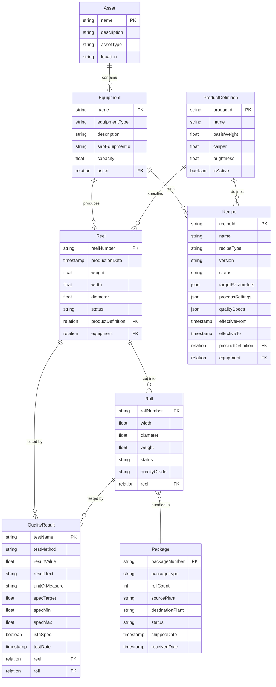
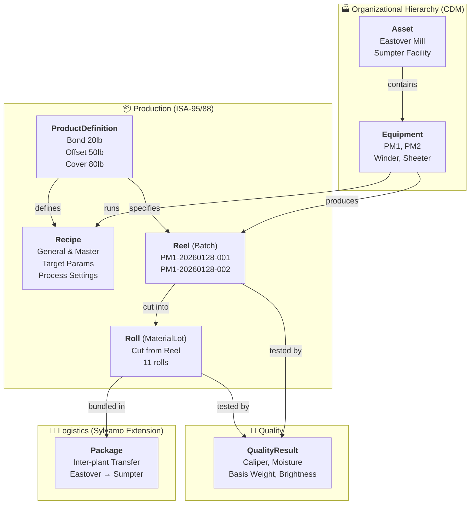

# Sylvamo Manufacturing Data Model Diagram

**Space:** `sylvamo_mfg`  
**Data Model:** `sylvamo_manufacturing/v3`  
**Date:** 2026-01-28

---

## Entity Relationship Diagram



---

## Flow Diagram



---

## Detailed Property Tables

### Asset (CDM)
| Property | Type | Description |
|----------|------|-------------|
| `name` | Text | Asset name (e.g., "Eastover Mill") |
| `description` | Text | Asset description |
| `assetType` | Text | Type: Mill, Facility, etc. |
| `location` | Text | Physical location |

### Equipment (CDM)
| Property | Type | Description |
|----------|------|-------------|
| `name` | Text | Equipment name (e.g., "Paper Machine 1") |
| `equipmentType` | Text | Type: PaperMachine, Winder, Sheeter |
| `description` | Text | Equipment description |
| `sapEquipmentId` | Text | SAP equipment identifier |
| `capacity` | Float | Production capacity |
| **`asset`** | **Relation → Asset** | Parent asset |

### ProductDefinition (ISA-95)
| Property | Type | Description |
|----------|------|-------------|
| `productId` | Text | Product identifier (e.g., "BOND-20") |
| `name` | Text | Product name (e.g., "Bond 20lb") |
| `basisWeight` | Float | Paper basis weight (lb) |
| `caliper` | Float | Paper thickness (mils) |
| `brightness` | Float | Brightness (%) |
| `isActive` | Boolean | Active product flag |

### Recipe (ISA-88)
| Property | Type | Description |
|----------|------|-------------|
| `recipeId` | Text | Recipe identifier |
| `name` | Text | Recipe name |
| `recipeType` | Text | general, site, master, control |
| `version` | Text | Recipe version |
| `status` | Text | approved, draft, obsolete |
| `targetParameters` | JSON | Target quality params |
| `processSettings` | JSON | Machine settings |
| `qualitySpecs` | JSON | Min/max/target specs |
| `effectiveFrom` | Timestamp | Effective start |
| `effectiveTo` | Timestamp | Effective end |
| **`productDefinition`** | **Relation → ProductDefinition** | What it makes |
| **`equipment`** | **Relation → Equipment** | Where it runs |

### Reel (ISA-95 Batch)
| Property | Type | Description |
|----------|------|-------------|
| `reelNumber` | Text | Reel identifier |
| `productionDate` | Timestamp | When produced |
| `weight` | Float | Reel weight |
| `width` | Float | Reel width |
| `diameter` | Float | Reel diameter |
| `status` | Text | Production status |
| **`productDefinition`** | **Relation → ProductDefinition** | Paper grade |
| **`equipment`** | **Relation → Equipment** | Paper machine |

### Roll (ISA-95 MaterialLot)
| Property | Type | Description |
|----------|------|-------------|
| `rollNumber` | Text | Roll identifier |
| `width` | Float | Roll width (inches) |
| `diameter` | Float | Roll diameter |
| `weight` | Float | Roll weight |
| `status` | Text | Roll status |
| `qualityGrade` | Text | Quality grade |
| **`reel`** | **Relation → Reel** | Source reel |

### Package (Sylvamo Extension)
| Property | Type | Description |
|----------|------|-------------|
| `packageNumber` | Text | Package identifier |
| `packageType` | Text | Type of package |
| `rollCount` | Integer | Number of rolls |
| `sourcePlant` | Text | Origin plant |
| `destinationPlant` | Text | Destination plant |
| `status` | Text | Shipped, InTransit, Received |
| `shippedDate` | Timestamp | Ship date |
| `receivedDate` | Timestamp | Receive date |

### QualityResult (ISA-95)
| Property | Type | Description |
|----------|------|-------------|
| `testName` | Text | Test name (Caliper, Moisture, etc.) |
| `testMethod` | Text | Testing method |
| `resultValue` | Float | Numeric result |
| `resultText` | Text | Text result |
| `unitOfMeasure` | Text | Unit (mils, %, lb, etc.) |
| `specTarget` | Float | Target specification |
| `specMin` | Float | Minimum specification |
| `specMax` | Float | Maximum specification |
| `isInSpec` | Boolean | Pass/fail flag |
| `testDate` | Timestamp | When tested |
| **`reel`** | **Relation → Reel** | Tested reel |
| **`roll`** | **Relation → Roll** | Tested roll |

---

## Relationship Summary

| From | Relation | To | Cardinality | Description |
|------|----------|----|----|-------------|
| **Equipment** | `asset` | Asset | N:1 | Equipment belongs to Asset |
| **Recipe** | `productDefinition` | ProductDefinition | N:1 | Recipe makes Product |
| **Recipe** | `equipment` | Equipment | N:1 | Recipe runs on Equipment |
| **Reel** | `productDefinition` | ProductDefinition | N:1 | Reel is a Product |
| **Reel** | `equipment` | Equipment | N:1 | Reel made on Equipment |
| **Roll** | `reel` | Reel | N:1 | Roll cut from Reel |
| **QualityResult** | `reel` | Reel | N:1 | QR tests Reel |
| **QualityResult** | `roll` | Roll | N:1 | QR tests Roll |

---

## Sample Data Flow

```
Eastover Mill (Asset)
    └── Paper Machine 1 (Equipment)
            ├── Recipe: Bond 20lb Master Recipe
            │       └── ProductDefinition: Bond 20lb
            │
            └── Reel: PM1-20260128-001
                    ├── ProductDefinition: Bond 20lb
                    ├── QualityResult: Caliper=4.05, Moisture=5.4%
                    │
                    └── Roll: PM1-20260128-001-R01
                            └── Package: PKG-EO-SU-20260128-001
                                    └── Destination: Sumpter Facility
```

---

## GraphQL Query Example

```graphql
{
  listReel {
    items {
      reelNumber
      productionDate
      productDefinition { name basisWeight }
      equipment { name equipmentType }
    }
  }
}
```

**Result:**
```json
{
  "listReel": {
    "items": [
      {
        "reelNumber": "PM1-20260128-001",
        "productionDate": "2026-01-27T20:16:35+00:00",
        "productDefinition": { "name": "Bond 20lb", "basisWeight": 20.0 },
        "equipment": { "name": "Paper Machine 1 (PM1)", "equipmentType": "PaperMachine" }
      }
    ]
  }
}
```
