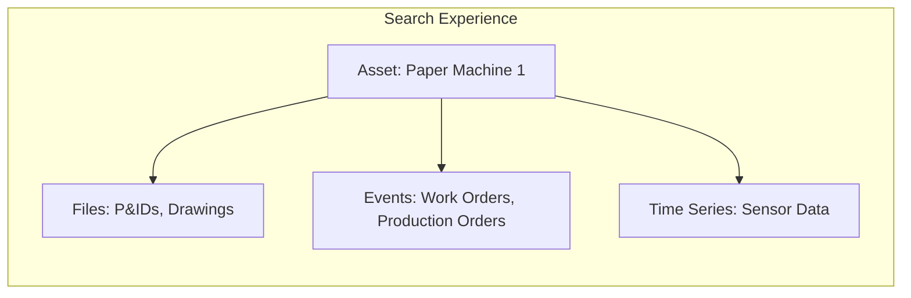
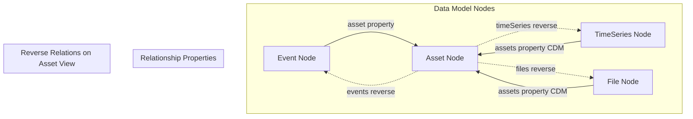
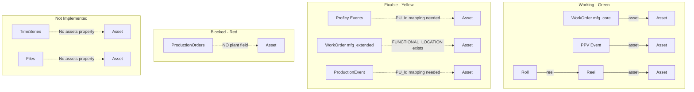
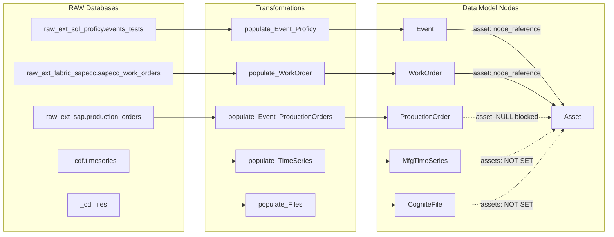
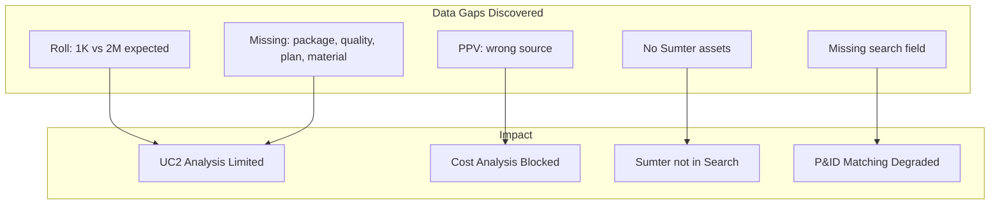

> **ARCHIVED - Sprint 2 Completed (Feb 2-13, 2026).** This is a historical record. See [Sprint Planning README](../../internal/sprint-planning/README.md) for current sprint.

# Sprint 2 Implementation Plan

**Sprint Duration:** February 2 - February 13, 2026  
**Goal:** Enable Search Experience + UC2 Data Quality

---

## Executive Summary

Sprint 2 focuses on completing the contextualization gaps to enable Elise's search experience vision, while also addressing UC2 data quality issues raised by Anvar and data completeness gaps identified by Cam/Valmir/Max.

| Workstream | Owner | Status |
|------------|-------|--------|
| Search Experience (Contextualization) | Fernando | In Progress |
| UC2 Data Quality | Anvar/Fernando | Investigation |
| Data Completeness | Cam/Valmir | Blocked (SAP freeze) |

---

## Current State vs. Requirements

| Requirement | Current State | Gap |
|-------------|---------------|-----|
| Asset hierarchy | ✅ Working | None |
| Events → Assets | ⚠️ Partial (WorkOrders in mfg_core linked) | Proficy (fixable), ProductionOrders (BLOCKED - no plant field), WorkOrder extended (fixable) |
| Event type field | ✅ `eventType` exists | Verify values are set correctly |
| Files → Assets | ❌ Not implemented | Full gap + missing reverse relation on Asset view |
| TimeSeries → Assets | ❌ Not implemented | Full gap |
| P&ID contextualization | ❌ Not done | Needs entity matching with tokenization fix |

---

## Relationship Architecture

### Target: The Search Experience

When a user clicks on an **Asset** (e.g., Paper Machine 1), they should see:



### How Relationships Work in CDF Data Model

Relationships are created via **direct relation properties** on nodes:



**Key concept:** 
- The **source node** (Event, TimeSeries, File) has a property pointing TO the Asset
- The **Asset view** has reverse relations to navigate BACK to those nodes
- Both directions are needed for the Search experience to work

### Current State: What's Linked vs Not



### Data Flow: RAW → Transformation → Data Model



---

## Phase 1: Event Contextualization

### 1.1 Fix Proficy Events → Asset Link

**File:** `populate_Event_Proficy.Transformation.sql`

**Mapping discovered:**
- `PU_Id = 4` → PM1 → `floc:0769-06-01-010`
- `PU_Id = 5` → PM2 → `floc:0769-06-01-020`

**SQL fix:**
```sql
CASE 
    WHEN PU_Id = 4 THEN node_reference('{{ mfgCoreInstanceSpace }}', 'floc:0769-06-01-010')
    WHEN PU_Id = 5 THEN node_reference('{{ mfgCoreInstanceSpace }}', 'floc:0769-06-01-020')
    ELSE cast(null as STRUCT<space: STRING, externalId: STRING>)
END as asset
```

### 1.2 Production Orders → Asset Link (BLOCKED)

**Source:** `raw_ext_sap.production_orders`

**Data gap:** The `production_orders` table does NOT contain `plant` or `work_center` fields. Only material and timing information is available.

**Status:** Blocked pending SAP data enhancement

### 1.3 Enable WorkOrder → Asset Link (mfg_extended)

**File:** `populate_WorkOrder.Transformation.sql`

**Field available:** `FUNCTIONAL_LOCATION` column exists in `sapecc_work_orders`

**SQL fix:**
```sql
CASE 
    WHEN `FUNCTIONAL_LOCATION` IS NOT NULL 
    THEN node_reference('{{ mfgCoreInstanceSpace }}', concat('floc:', cast(`FUNCTIONAL_LOCATION` as STRING)))
    ELSE cast(null as STRUCT<space: STRING, externalId: STRING>)
END as asset
```

### 1.4 Enable ProductionEvent → Asset Link (mfg_extended)

**File:** `populate_ProductionEvent.Transformation.sql`

**Action:** Use same PU_Id mapping as Proficy events

### 1.5 Verify Event Type Field Usage

**Already exists:** `eventType` property in container

**Values to verify:**
- `ProductionEvent` - Proficy events
- `WorkOrder` - SAP work orders
- `PPV` - Purchase Price Variance events
- `ProductionOrder` - SAP production orders

---

## Phase 2: Time Series Contextualization

### 2.1 Update TimeSeries → Asset Link

**File:** `populate_TimeSeries.Transformation.sql`

**Tag naming patterns discovered:**
- `401*` = O2 Reactor / Bleaching area
- `321*` = Level indicators
- `471*`, `472*` = Paper machine tags (BW=Basis Weight, CP=Caliper, MS=Moisture)

**Paper Machine mapping:**
- `471*`, `472*` tags → PM1/PM2 assets

**Action:**
1. Add `assets` property population using tag prefix parsing
2. Paper machine tags link to:
   - PM1: `floc:0769-06-01-010`
   - PM2: `floc:0769-06-01-020`

---

## Phase 3: File Contextualization

### 3.1 Add `files` Reverse Relation to Asset View

**File:** `Asset.View.yaml`

**Add:**
```yaml
files:
  source:
    space: cdf_cdm
    externalId: CogniteFile
  through:
    identifier: assets
  connectionType: multi_reverse_direct_relation
```

### 3.2 Update Files → Asset Link (Structured)

**File:** `populate_Files.Transformation.sql`

**Action:** Parse file metadata to create asset links where identifiable

### 3.3 P&ID Contextualization (Unstructured)

**Scope:** 2-3 P&ID documents, major equipment only (cleaners, deaeration vessels)

**Tokenization fix needed:**
- Current: searches single words (e.g., "vacuum")
- Required: full equipment names (e.g., "Deaeration System Number One Vacuum Pump")

**Workflow:**
1. Select 2-3 P&IDs from Eastover SharePoint folder
2. Run entity detection with Diagrams API
3. Configure entity matcher for multi-word equipment names
4. Validate annotations
5. Verify results appear in CDF Search

---

## Phase 4: Validation and Demo Prep

### 4.1 Verify Search Experience

Test in Cognite Fusion:
1. Navigate to Paper Machine asset (PM1 or PM2)
2. Verify contextualized files appear (P&IDs)
3. Verify contextualized events appear (with type filtering)
4. Navigate to child assets and verify time series appear

### 4.2 Industrial Canvas Demo

- Select a paper machine asset
- Add related P&IDs (contextualized files)
- Add work orders/events
- Add time series from instrumentation
- Verify all elements are linked

---

## Phase 5: UC2 Data Quality Issues (Anvar)

### 5.1 Reel/Roll Transformations Not Scheduled

**Current state:** `populate_Reel` and `populate_Roll` have no schedule configuration

**Action:** Add schedule files aligned with Fabric PPR ingestion timing

### 5.2 Missing `turnupTime` Property on Reel

**Investigation needed:**
1. Check if `ppr_hist_reel` RAW table has a turnup time column
2. If yes, add property to `MfgReel.Container.yaml` and update transformation

### 5.3 Property Naming: `productionDate` vs `manufacturedDate`

**Current state:** Container uses `productionDate`, populated from `REEL_MANUFACTURED_DATE`

**Options:**
1. Keep `productionDate` and document the mapping
2. Add `manufacturedDate` as an alias
3. Rename to `manufacturedDate` (breaking change)

### 5.4 Sumter Quality Reports - Only 21 Rows

**Investigation needed:**
1. Check SharePoint list directly for row count
2. Verify extraction script is running on schedule
3. Determine if Eastover quality data should also be extracted

---

## Phase 6: Data Completeness Issues (Cam/Valmir/Max Meeting)

### 6.1 PPR Roll Data - Extractor Limit

**Issue:** Only 1,019 rolls ingested but should be ~2 million

**Root cause:** Configuration limit in the Fabric PPR extractor

**Action:** Remove or increase limit in extractor configuration

### 6.2 Missing PPR Tables

**Missing tables that should come from same Fabric lakehouse:**
- `history_package`
- `history_role_quality`
- `history_plan`
- `history_material`

**Action:** Add these tables to the Fabric PPR extractor configuration

### 6.3 PPV Report - Wrong Data Source

**Issue:** Current PPV data gives averages, not weekly price fluctuations

**Correct source:** Purchase order based report showing "actual GR price"

**Timeline:** Available after SAP freeze ends (Thursday)

### 6.4 Sumter Assets Missing from Hierarchy

**Current state:** Only Eastover (0769) assets in CDF

**Missing:** Sumter assets (plant code 0519 - needs verification)

**Action:** Run same asset hierarchy query with Sumter plant code

### 6.5 New Search/Sort Field for Asset Hierarchy

**Discovery:** Valmir found a new query with an additional column that helps with P&ID contextualization

**Action:** Get query from Valmir and add field to asset hierarchy

---

## Task Summary

### Search Experience (Elise)

| Task | File | Status | Result |
|------|------|--------|--------|
| Proficy Events → Asset | `populate_Event_Proficy.Transformation.sql` | ✅ **Done** | PM1/PM2 linked via PU_Id |
| Production Orders → Asset | `populate_Event_ProductionOrders.Transformation.sql` | 🔴 BLOCKED | No plant field |
| WorkOrder → Asset | `populate_Event_WorkOrders.Transformation.sql` | ✅ **Done** | Linked via FUNCTIONAL_LOCATION |
| ProductionEvent → Asset | `populate_ProductionEvent.Transformation.sql` | ✅ Duplicate | Closed (same as SVQS-148) |
| TimeSeries → Asset | `populate_TimeSeries.Transformation.sql` | ✅ **Done** | 3,390 linked (1,695 PM1 + 1,695 PM2) |
| Asset `files` reverse relation | `Asset.View.yaml` | ✅ **Done** | Asset.files enabled |
| Files → Asset | `populate_Files.Transformation.sql` | ✅ **Done** | 45 linked to Eastover Mill |
| P&ID Entity Matching | `annotate_files.py` | ⬜ Pending | - |
| Validation | Cognite Fusion Search | ⬜ Pending | - |

### UC2 Data Quality (Anvar)

| Task | Status |
|------|--------|
| Reel/Roll scheduling | ⬜ Pending |
| turnupTime property | 🔍 Investigation |
| Property naming review | 🔍 Discussion needed |
| Sumter quality data | 🔍 Investigation |

### Data Completeness (Cam/Valmir/Max)

| Task | Status |
|------|--------|
| PPR Roll limit | ⬜ Ready |
| Missing PPR tables | ⬜ Ready |
| PPV source update | 🔴 Blocked (SAP freeze) |
| Sumter assets | ⬜ Ready |
| Asset search field | 🔍 Awaiting query |

---

## Dependencies and Blockers

### Contextualization Blockers

1. **Assets must exist first:** All transformations depend on Asset nodes being populated
2. **Production Orders data gap:** `raw_ext_sap.production_orders` lacks `plant` and `work_center` fields
3. **PI Tag → Asset mapping:** Need to finalize tag prefix → functional location mapping
4. **Entity Matching configuration:** Need to configure multi-word tokenization for P&IDs

### Data Completeness Blockers

1. **PPR Roll limit:** Extractor configured with limit of ~1K, should be ~2M
2. **Missing PPR tables:** `history_package`, `history_role_quality`, `history_plan`, `history_material`
3. **PPV wrong source:** Need purchase order based report (available after SAP freeze Thursday)
4. **Sumter assets missing:** Need to add plant code 0519 to asset hierarchy query
5. **Asset search field missing:** Valmir's new query column needed for P&ID contextualization

### External Dependencies

1. **SAP freeze:** Ends Thursday - blocks PPV data source update
2. **Valmir's query:** Need to get the new asset hierarchy query with search field
3. **SharePoint access:** ✅ Resolved - Max has access via Mike

---

## Data Completeness Diagram



---

## Jira Stories (17 active)

### Original Stories (Planning Meeting - Feb 2)

| Jira Key | Summary |
|----------|---------|
| [SVQS-142](https://cognitedata.atlassian.net/browse/SVQS-142) | Deliver Data Model V1 to support Use Case 2 development |
| [SVQS-143](https://cognitedata.atlassian.net/browse/SVQS-143) | Contextualize PI scanner tags for Use Case 2 |
| [SVQS-144](https://cognitedata.atlassian.net/browse/SVQS-144) | Contextualize 2-3 P&ID documents (major equipment only) |
| [SVQS-145](https://cognitedata.atlassian.net/browse/SVQS-145) | Add type field to Events for filtering in Search |
| [SVQS-146](https://cognitedata.atlassian.net/browse/SVQS-146) | Contextualize work orders to major equipment assets |
| [SVQS-147](https://cognitedata.atlassian.net/browse/SVQS-147) | Demonstrate Use Case 2 progress via Streamlit diagnostic app |

### New Stories (Plan Breakdown - Feb 4)

| Jira Key | Summary | Phase |
|----------|---------|-------|
| [SVQS-148](https://cognitedata.atlassian.net/browse/SVQS-148) | Contextualize Proficy Events to Paper Machine Assets | Phase 1 |
| ~~SVQS-149~~ | ~~Enable WorkOrder Extended Asset Relation~~ | **DUPLICATE of SVQS-146** |
| [SVQS-150](https://cognitedata.atlassian.net/browse/SVQS-150) | Enable ProductionEvent Asset Relation (mfg_extended) | Phase 1 |
| [SVQS-151](https://cognitedata.atlassian.net/browse/SVQS-151) | Add Files Reverse Relation to Asset View | Phase 3 |
| [SVQS-152](https://cognitedata.atlassian.net/browse/SVQS-152) | Link Files to Assets via Metadata Parsing | Phase 3 |
| [SVQS-153](https://cognitedata.atlassian.net/browse/SVQS-153) | UC2: Add Schedule for Reel/Roll Transformations | Phase 5 |
| [SVQS-154](https://cognitedata.atlassian.net/browse/SVQS-154) | UC2: Investigate turnupTime Property | Phase 5 |
| [SVQS-155](https://cognitedata.atlassian.net/browse/SVQS-155) | Data Completeness: Fix PPR Roll Extractor Limit | Phase 6 |
| [SVQS-156](https://cognitedata.atlassian.net/browse/SVQS-156) | Data Completeness: Add Missing PPR Tables | Phase 6 |
| [SVQS-157](https://cognitedata.atlassian.net/browse/SVQS-157) | Data Completeness: Add Sumter Assets | Phase 6 |
| [SVQS-158](https://cognitedata.atlassian.net/browse/SVQS-158) | Data Completeness: Add Asset Search Field | Phase 6 |
| [SVQS-159](https://cognitedata.atlassian.net/browse/SVQS-159) | Validate Search Experience: End-to-End Demo | Phase 4 |

---

## Meeting References

- Sprint 2 Planning: Feb 2, 2026
- Data Completeness (Cam/Valmir/Max): Feb 4, 2026

---

*Last Updated: February 4, 2026*
