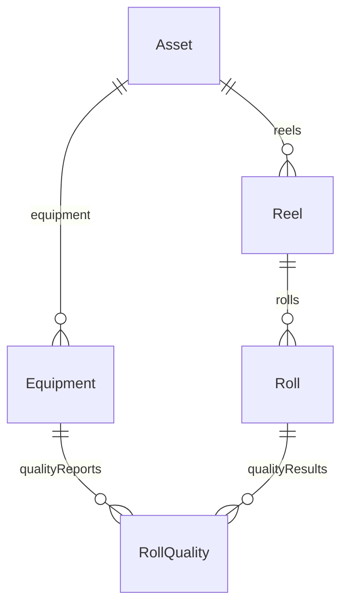

# sylvamo_mfg_core with Equipment Linkage

> **⚠️ SUPERSEDED:** This document proposed a separate Equipment entity. 
> We adopted a different approach: **Equipment as Asset subtypes** (QuickStart Pattern).
> 
> See **[ADR-001-ASSET-EQUIPMENT.md](../../reference/data-model/decisions/ADR-001-ASSET-EQUIPMENT.md)** for the architectural decision.

---

## Current Implementation (February 2026)

Based on ISA-95 and Cognite QuickStart recommendations, we model Equipment as **Asset nodes with `assetType='Equipment'`** rather than a separate entity.

### Key Points

1. **No separate Equipment container/view** - Equipment is classified via `assetType` on Asset
2. **33,072 assets** have `assetType='Equipment'` (leaf-level nodes in hierarchy)
3. **RollQuality links to Asset** (via `asset` relation), not to a separate Equipment entity
4. **Asset hierarchy follows ISA-95 Equipment hierarchy:**
   - Level 2: Area
   - Level 3: System
   - Level 4: SubSystem
   - Level 5: Unit
   - Level 6: EquipmentModule
   - Level 7+: Equipment

### Benefits

- Aligns with ISA-95 Equipment hierarchy standard
- Enables filtering by asset type in CDF Fusion sidebar
- Follows Cognite QuickStart Pattern (simplicity)
- No need for separate transformation to create Equipment nodes

### Related

- **Jira:** [SVQS-243](https://cognitedata.atlassian.net/browse/SVQS-243), [SVQS-244](https://cognitedata.atlassian.net/browse/SVQS-244)
- **ADR:** [ADR-001-ASSET-EQUIPMENT.md](../../reference/data-model/decisions/ADR-001-ASSET-EQUIPMENT.md)

---

## Original Proposal (Archived Below)

The original proposal below suggested creating a separate Equipment entity. This was superseded by ADR-001.

Click to expand original proposal

### ORIGINAL: Fixed Diagram with Equipment Container

### ORIGINAL: Equipment Instances Proposed

| externalId | name | equipmentType | asset |
|------------|------|---------------|-------|
| equip:sheeter_no_1 | Sheeter No.1 | Sheeter | → Asset |
| equip:sheeter_no_2 | Sheeter No.2 | Sheeter | → Asset |
| equip:sheeter_no_3 | Sheeter No.3 | Sheeter | → Asset |
| equip:roll_prep | Roll Prep | RollPrep | → Asset |

**Why this was not adopted:**
- Creates redundant entities (Equipment already exists in SAP as functional locations)
- More complex than necessary
- ISA-95 "Equipment" = functional hierarchy, not separate physical asset entity
- QuickStart Pattern recommends Asset subtypes, not separate Equipment

---

*Updated: February 17, 2026*
*Original: February 16, 2026*
