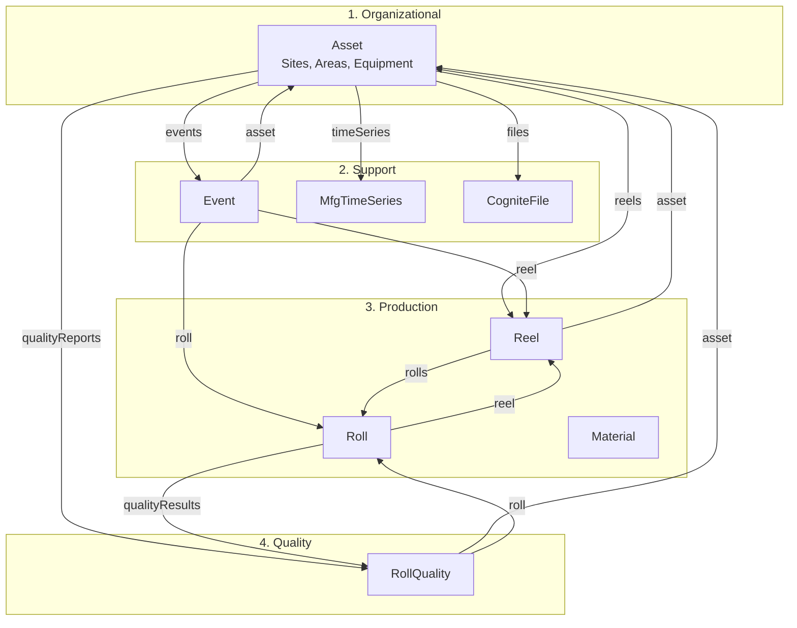

# sylvamo_mfg_core Diagram — Presentation Walkthrough

Use this guide to walk the audience through the Manufacturing Flow diagram (Organizational | Support | Production | Quality).

---

## Diagram (short labels — avoids text behind boxes)

Use short arrow labels so text doesn't overlap or render behind boxes:

---

## Scenario — Follow the data through a typical flow

Use this narrative alongside the diagram. It tells the story of how the data connects:

> **Imagine a paper reel is produced on Paper Machine 1 (PM1).** The **Asset** (PM1) is where it happens. As the reel is made, **MfgTimeSeries** sensors collect caliper, moisture, and speed data from that asset. A **Reel** record is created and linked to the asset via **reels** — we know exactly which machine produced it.
>
> **The reel is then cut into rolls** at the winder or sheeter. Each **Roll** links back to its parent **Reel** via **reel**, and the Reel links to its **rolls**. That’s our traceability: from any roll, we can trace back to the reel and the asset.
>
> **Along the way, Events are logged** — work orders at the asset, production events for the reel, quality inspections for a roll. Each Event links to **asset**, **reel**, and **roll**, so one work order tells you where it happened and which product it affected.
>
> **If a defect is found**, an operator creates a **RollQuality** report in SharePoint. That report links to the **roll** (which roll) and the **asset** (where the defect was found). From that report, we can trace back: Roll → Reel → Asset, plus all related events and time series. That’s the value of a connected data model.

---

## Walkthrough — Follow the Diagram Top to Bottom

### 1. Organizational
> "**Asset** is the foundation — sites, areas, equipment. Eastover Mill, PM1, the Winder. Everything connects back to where it happened."

---

### 2. Support (from Asset)
> "From Asset we have three support links:"
> - **events** — Work orders, production orders, cost events that happen at this asset
> - **timeSeries** — PI and Proficy sensor data linked to the asset
> - **files** — P&IDs, procedures, documentation

---

### 3. Production
> "**Reel** — paper reels produced at an asset. The **reels** link from Asset shows which reels came from which machine."
> 
> "**Roll** — cut from a reel. **rolls** from Reel, **reel** from Roll — that's our traceability: which reel was this roll cut from?"
> 
> "**Material** — SAP material master. The **asset** link ties materials to the asset context where they're used."

---

### 4. Quality
> "**RollQuality** — defect reports from SharePoint. **qualityResults** from Roll shows which rolls have quality data. **roll** from RollQuality links each report to the specific roll. **asset** links to where the defect was found."

---

### 5. Event connections
> "**Event** sits in the middle — it links to **asset**, **reel**, and **roll**. So one work order can tell you where it happened, which reel it affected, and which roll. That's the power of connected data."

---

## Quick Reference — What Each Label Means

| Label | Direction | What to say |
|-------|-----------|-------------|
| **reels** | Asset → Reel | "Reels produced at this asset" |
| **asset** | Reel, Event, RollQuality, Material → Asset | "Where it happened / which asset" |
| **events** | Asset → Event | "Events at this asset" |
| **timeSeries** | Asset → MfgTimeSeries | "Sensors linked to this asset" |
| **files** | Asset → CogniteFile | "Docs and P&IDs for this asset" |
| **rolls** | Reel → Roll | "Rolls cut from this reel" |
| **reel** | Roll, Event, CogniteFile → Reel | "Parent reel / which reel" |
| **roll** | Event, RollQuality → Roll | "Which roll this applies to" |
| **qualityResults** | Roll → RollQuality | "Quality reports for this roll" |
| **qualityReports** | Asset → RollQuality | "Quality reports at this asset" |

---

## Suggested Order to Point at the Diagram

1. **Asset** — "Start here: our hierarchy"
2. **Asset → Reel (reels)** — "Production flow begins"
3. **Reel → Roll (rolls)** — "Reel to roll traceability"
4. **Asset → Event (events)** — "Events at assets"
5. **Event → asset, reel, roll** — "Event ties them together"
6. **Asset → timeSeries, files** — "Support data"
7. **Roll → RollQuality (qualityResults)** — "Quality on the roll"

---

## If Asked

- **"Why no Equipment?"** — Equipment is Asset with `assetType='Equipment'`. Same hierarchy, simpler model.
- **"Where's Material in the flow?"** — Material links to Asset via **asset**. It's reference data (SAP master).
- **"How many nodes?"** — 2.8M+ in mfg_core. Roll is largest (~85%), then Event (~8%).
