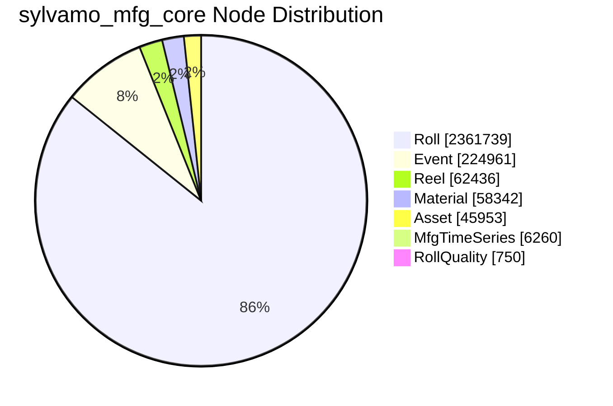
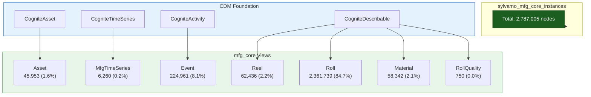
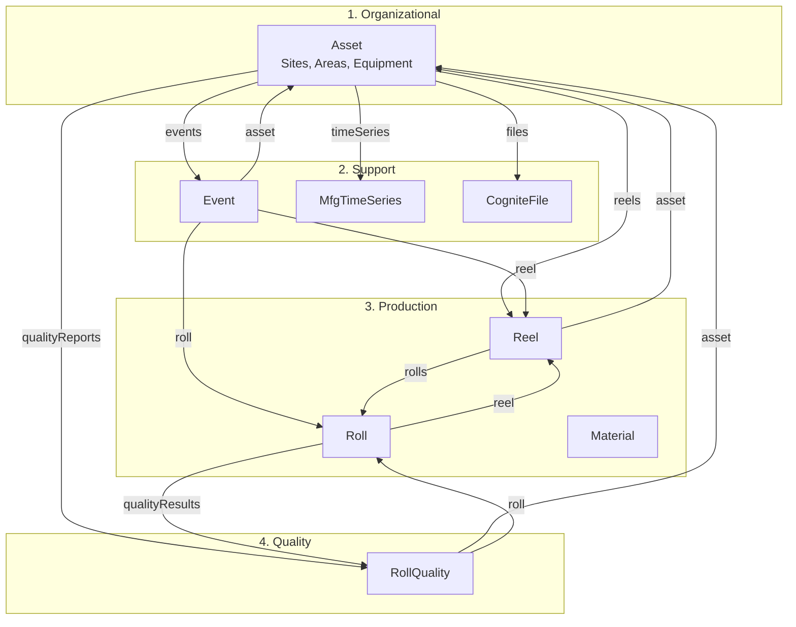
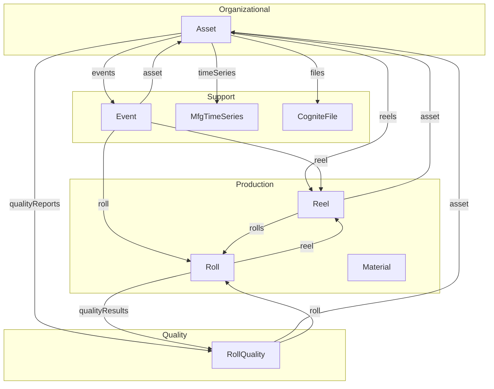

# sylvamo_mfg_core Node Distribution

**Source:** CDF `sylvamo-dev` (live data)  
**Total nodes:** 2,787,005  
**Refresh:** `python scripts/mfg_core_node_distribution.py 2>/dev/null` (from project root)

---

## 1. Pie Chart

---
## 2. Flowchart (Hierarchy)

---
## 3. Manufacturing Flow (CDF-verified relationships)

**Source:** `python scripts/inspect_cdf_model_relations.py` — relationships extracted from live CDF model.

**Presentation guide:** [MFG_CORE_DIAGRAM_PRESENTATION_GUIDE.md](MFG_CORE_DIAGRAM_PRESENTATION_GUIDE.md) — step-by-step walkthrough and speaker notes.

### 3a. Diagram (short labels — avoids text behind boxes)

### 3a-2. Scenario — How the data connects in practice

> **Imagine a paper reel is produced on Paper Machine 1 (PM1).** The **Asset** (PM1) is where it happens. As the reel is made, **MfgTimeSeries** sensors collect caliper, moisture, and speed data from that asset. A **Reel** record is created and linked to the asset via **reels** — we know exactly which machine produced it.
>
> **The reel is then cut into rolls** at the winder or sheeter. Each **Roll** links back to its parent **Reel** via **reel**, and the Reel links to its **rolls**. That's our traceability: from any roll, we can trace back to the reel and the asset.
>
> **Along the way, Events are logged** — work orders at the asset, production events for the reel, quality inspections for a roll. Each Event links to **asset**, **reel**, and **roll**, so one work order tells you where it happened and which product it affected.
>
> **If a defect is found**, an operator creates a **RollQuality** report in SharePoint. That report links to the **roll** (which roll) and the **asset** (where the defect was found). From that report, we can trace back: Roll → Reel → Asset, plus all related events and time series. That's the value of a connected data model.

### 3b. Diagram (compact, no explanations)

---
## 4. Table Summary
| View | Count | % of Total |
|------|------:|----------:|
| Roll | 2,361,739 | 84.7% |
| Event | 224,961 | 8.1% |
| Reel | 62,436 | 2.2% |
| Material | 58,342 | 2.1% |
| Asset | 45,953 | 1.6% |
| MfgTimeSeries | 6,260 | 0.2% |
| RollQuality | 750 | 0.0% |
