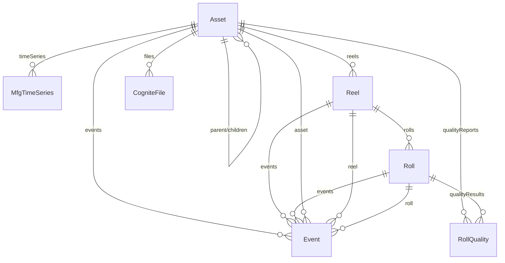
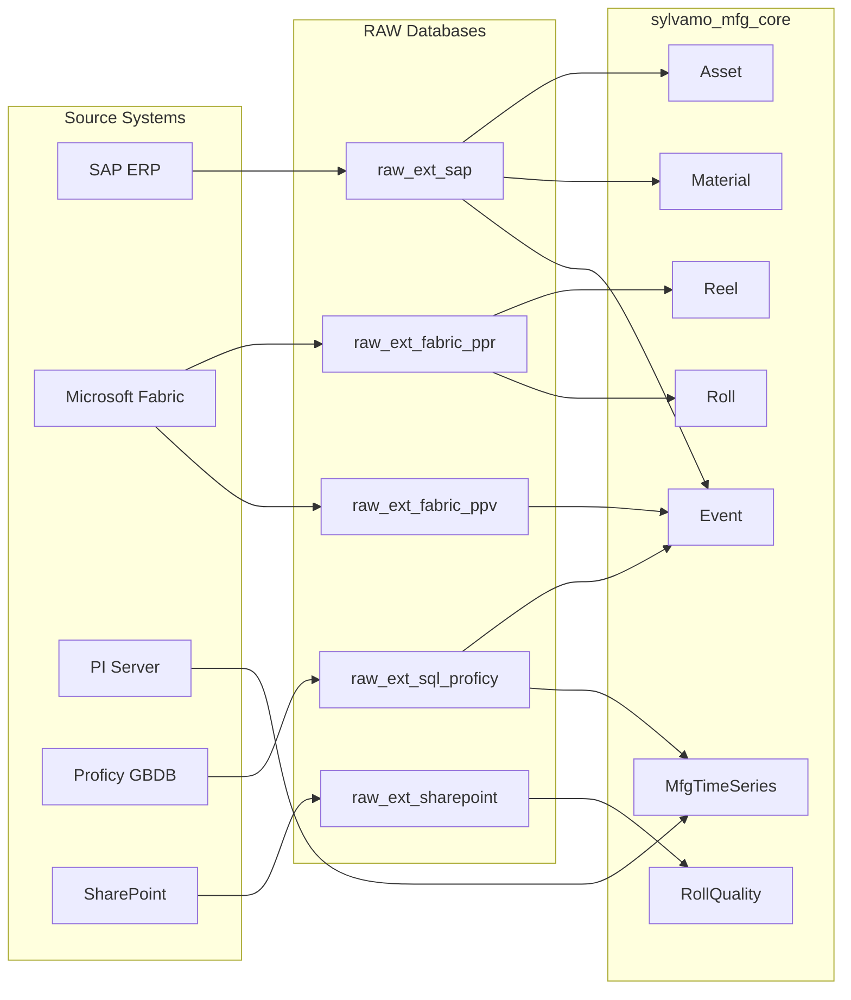
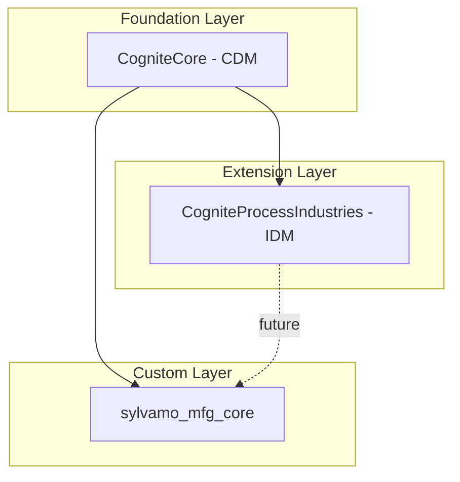
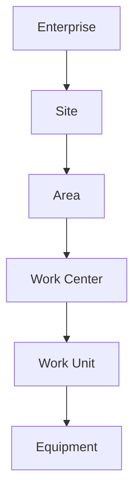
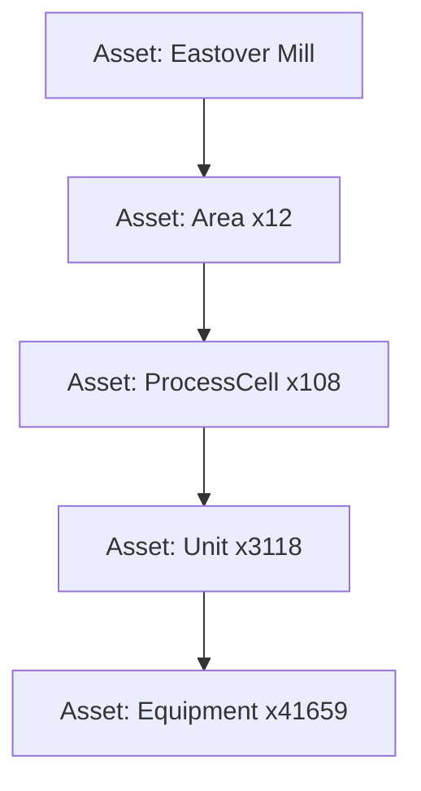
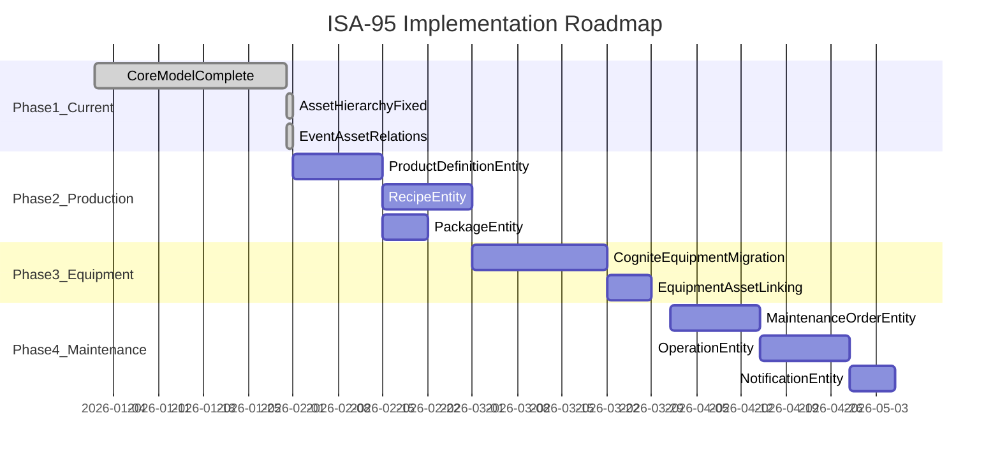

# Sylvamo Data Model Architecture

> **Purpose:** Architecture Decision Document for Sylvamo Manufacturing Data Model  
> **Prepared for:** Sylvamo Architecture Review Meeting  
> **Date:** January 31, 2026  
> **Status:** Draft for Discussion

---

## Executive Summary

This document consolidates the current state, design decisions, and roadmap for Sylvamo's manufacturing data model in Cognite Data Fusion (CDF). It addresses:

1. **Current Implementation** - The `sylvamo_mfg_core` model with ~366K nodes
2. **ISA-95 Alignment** - How the model aligns with Cognite's ISA-95 framework
3. **Architecture Decisions** - Key decisions made and rationale
4. **Roadmap** - Path to full ISA-95 compliance

---

## Table of Contents

1. [Current Data Model Overview](#1-current-data-model-overview)
2. [Model Comparison: Current vs ISA-95](#2-model-comparison-current-vs-isa-95)
3. [Architecture Decisions](#3-architecture-decisions)
4. [Cognite ISA-95 Framework](#4-cognite-isa-95-framework)
5. [Gap Analysis](#5-gap-analysis)
6. [Roadmap: ISA-95 Full Implementation](#6-roadmap-isa-95-full-implementation)
7. [Recommendations](#7-recommendations)

---

## 1. Current Data Model Overview

### 1.1 Model Structure

**Space:** `sylvamo_mfg_core_schema`  
**Instance Space:** `sylvamo_mfg_core_instances`  
**Version:** v1

### 1.2 Entities and Instance Counts

| Entity | Count | CDM Interfaces | Purpose |
|--------|-------|----------------|---------|
| **Asset** | 45,953 | CogniteAsset, CogniteDescribable, CogniteSourceable | SAP functional locations (Eastover, Sumter) |
| **Event** | 100,000+ | CogniteActivity, CogniteDescribable, CogniteSourceable | Unified events (work orders, production orders, Proficy, PPV) |
| **Reel** | 61,335 | CogniteDescribable, CogniteSourceable | Paper reels (ISA-95 Batch) |
| **Roll** | 100,000+ | CogniteDescribable, CogniteSourceable | Paper rolls (ISA-95 MaterialLot) |
| **Material** | 58,342 | CogniteDescribable, CogniteSourceable | SAP materials |
| **MfgTimeSeries** | 3,532+ | CogniteTimeSeries, CogniteDescribable, CogniteSourceable | PI/Proficy time series |
| **RollQuality** | 180 | CogniteDescribable, CogniteSourceable | Quality test results |
| **TOTAL** | **~366,000** | | |

### 1.3 Entity Relationship Diagram

### 1.4 Data Sources and Transformations

---

## 2. Model Comparison: Current vs ISA-95

### 2.1 Entity Mapping

| ISA-95 Concept | Sylvamo Entity | Status | Notes |
|----------------|----------------|--------|-------|
| **Enterprise** | Asset (root) | Implemented | Eastover Mill as root asset |
| **Site** | Asset (assetType=Site) | Implemented | Using CDM Asset hierarchy |
| **Area** | Asset (assetType=Area) | Implemented | 12 areas |
| **ProcessCell** | Asset (assetType=ProcessCell) | Implemented | 108 process cells |
| **Unit** | Asset (assetType=Unit) | Implemented | 3,118 units |
| **Equipment** | Asset (assetType=Equipment) | Partial | 41,659 equipment; no separate CogniteEquipment |
| **ProductDefinition** | - | Not Implemented | Exists in mfg_data module |
| **Recipe** | - | Not Implemented | Exists in mfg_data module |
| **Batch** | Reel | Implemented | reelNumber, productionDate, gradeCode |
| **MaterialLot** | Roll | Implemented | rollNumber, reel relation |
| **MaterialSublot** | - | Not Needed | Rolls not subdivided |
| **QualityResult** | RollQuality | Implemented | testName, resultValue, isInSpec |
| **MaintenanceOrder** | Event (WorkOrder) | Partial | Unified in Event entity |
| **ProductionOrder** | Event (ProductionOrder) | Partial | Unified in Event entity |
| **Package** | - | Not Implemented | Exists in mfg_data module |

### 2.2 CDM Interface Usage

| CDM Interface | Used By | Notes |
|---------------|---------|-------|
| CogniteAsset | Asset | Full hierarchy with parent/children |
| CogniteDescribable | All entities | name, description, tags, aliases |
| CogniteSourceable | All entities | sourceId for traceability |
| CogniteActivity | Event | startTime, endTime, assets |
| CogniteTimeSeries | MfgTimeSeries | isStep, type, unit, timeSeries link |
| CogniteFile | CogniteFile | Linked to assets |
| CogniteEquipment | Not used | Equipment modeled as Asset |
| CogniteMaintenanceOrder | Not used | Work orders in unified Event |
| CogniteOperation | Not used | Available in mfg_extended |

---

## 3. Architecture Decisions

### 3.1 Decisions Made

| # | Decision | Rationale | Source |
|---|----------|-----------|--------|
| **AD-1** | Use CDM Asset hierarchy instead of ISA-95 Site/Unit | Simpler; CDM provides hierarchy; ISA levels mapped via `assetType` property | Johan Stabekk guidance |
| **AD-2** | Unified Event entity for all activity types | Reduces complexity; single place for work orders, production orders, Proficy events | Architecture review |
| **AD-3** | Reel = ISA-95 Batch | Paper reel is the production batch unit | ISA-95 alignment |
| **AD-4** | Roll = ISA-95 MaterialLot | Paper roll is the sellable/shippable unit | ISA-95 alignment |
| **AD-5** | Single schema space with separate instance space | Clean separation of schema and data | Best practices |
| **AD-6** | Use `assetType` for ISA-95 level classification | Enables filtering by level without separate entities | Simplicity |
| **AD-7** | TimeSeries linked to assets via `assets` property | Enables CDM reverse relation for asset→timeSeries | CDM compatibility |

### 3.2 Trade-offs

| Decision | Benefit | Trade-off |
|----------|---------|-----------|
| Unified Event | Single entity, simpler queries | Event types distinguished by `eventType` string, not type safety |
| Asset for Equipment | Simpler hierarchy | No separate CogniteEquipment; no equipment-specific properties |
| No ProductDefinition | Simpler model | Cannot link reels to product specs |
| No Recipe | Simpler model | Cannot track recipe parameters |

---

## 4. Cognite ISA-95 Framework

### 4.1 Cognite's Model Stack

### 4.2 CDM Core Entities

| Entity | Purpose | Sylvamo Usage |
|--------|---------|---------------|
| **CogniteAsset** | Functional locations with hierarchy | Asset |
| **CogniteEquipment** | Physical equipment | Not used (modeled as Asset) |
| **CogniteActivity** | Work over time | Event |
| **CogniteTimeSeries** | Time series data | MfgTimeSeries |
| **CogniteFile** | Documents | Linked to assets |
| **CogniteAssetClass** | Asset classification | Not used |
| **CogniteAssetType** | Asset type | Not used |

### 4.3 Process Industries IDM Entities

| Entity | Purpose | Sylvamo Usage |
|--------|---------|---------------|
| **CogniteMaintenanceOrder** | Work orders | Not used (in Event) |
| **CogniteOperation** | Work order operations | Available in mfg_extended |
| **CogniteNotification** | Maintenance notifications | Not used |

### 4.4 ISA-95 Hierarchy (Standard)

### 4.5 Sylvamo Current Hierarchy

---

## 5. Gap Analysis

### 5.1 Structural Gaps

| Gap | Current State | ISA-95 Target | Priority |
|-----|---------------|---------------|----------|
| **No CogniteEquipment** | Equipment as Asset | Separate Equipment entity | Medium |
| **No ProductDefinition** | Not implemented | Define paper grades, specs | High |
| **No Recipe** | Not implemented | Track production recipes | Low |
| **No Package** | Not implemented | Inter-plant transfer tracking | Medium |
| **Unified Event** | All activities in Event | Separate MaintenanceOrder, ProductionOrder | Medium |
| **No Operations** | Not used | Work order operations | Low |

### 5.2 Data Quality Gaps

| Gap | Issue | Impact | Priority |
|-----|-------|--------|----------|
| **Asset hierarchy gaps** | 105 intermediate levels were missing | Fixed Jan 31, 2026 | Resolved |
| **Event-Asset linking** | Not all events have asset relation | Limited traceability | High |
| **TimeSeries preview** | Classic TS not linked to model | No sparklines in search | Medium |
| **File preview** | Classic files not linked to model | No preview in search | Medium |

### 5.3 Documentation Gaps

| Gap | Issue | Action |
|-----|-------|--------|
| Version inconsistencies | v2, v7, v9 referenced | Standardize to v1 (current) |
| Missing ADR directory | Decisions scattered | Create formal ADRs |
| Broken doc references | Some docs missing | Remove or create |

---

## 6. Roadmap: ISA-95 Full Implementation

### 6.1 Phased Approach

### 6.2 Phase Details

#### Phase 1: Current State (Complete)

- **sylvamo_mfg_core** with 7 entities
- ~366K nodes populated
- Asset hierarchy with 45,953 nodes
- Event unification complete
- TimeSeries and Files linked

#### Phase 2: Production Model Enhancement

**Goal:** Add ISA-95 production concepts

| Entity | Source | Properties |
|--------|--------|------------|
| ProductDefinition | SAP materials | productId, name, basisWeight, gradeCode |
| Recipe | SAP/Proficy | recipeId, type (general, site, master), targetParameters |
| Package | Fabric PPR | packageNumber, sourcePlant, destinationPlant, rolls |

**Migration Strategy:**
1. Create containers/views in `sylvamo_mfg_core_schema`
2. Create transformations from existing RAW data
3. Link Reel → ProductDefinition
4. Link Roll → Package

#### Phase 3: Equipment Separation

**Goal:** Separate physical equipment from functional locations

| Change | Before | After |
|--------|--------|-------|
| Equipment | Asset (assetType=Equipment) | CogniteEquipment entity |
| Linking | Parent-child in Asset | Equipment.asset → Asset |
| Properties | Generic | equipmentType, manufacturer, model, serialNumber |

**Migration Strategy:**
1. Create Equipment view implementing CogniteEquipment
2. Migrate ~41K equipment nodes
3. Update Asset hierarchy to exclude equipment
4. Update relationships

#### Phase 4: Maintenance Model

**Goal:** Full ISA-95 maintenance model

| Entity | CDM Interface | Purpose |
|--------|---------------|---------|
| MaintenanceOrder | CogniteMaintenanceOrder | Work orders |
| Operation | CogniteOperation | Work order items |
| Notification | CogniteNotification | Defect reports |

**Migration Strategy:**
1. Split Event (WorkOrder) → MaintenanceOrder
2. Create Operation from SAP operations
3. Link to Equipment and Asset

---

## 7. Recommendations

### 7.1 Short-term (Next Sprint)

1. **Complete Event-Asset linking** - All events should have asset relation
2. **Add ProductDefinition** - Link reels to paper grades
3. **Document current model** - Update version references to v1

### 7.2 Medium-term (Q1 2026)

1. **Implement Package entity** - Enable inter-plant traceability
2. **Consider Equipment separation** - Evaluate ROI for maintenance use cases
3. **Create formal ADRs** - Document decisions for future reference

### 7.3 Long-term (Q2-Q3 2026)

1. **Full ISA-95 compliance** - Implement remaining entities as needed
2. **IDM integration** - Use CogniteProcessIndustries for maintenance
3. **Multi-plant support** - Extend model for additional mills

### 7.4 Decision Points for Meeting

1. **Equipment Separation:** Should we separate Equipment from Asset now or wait for maintenance use cases?
2. **ProductDefinition Priority:** Is linking reels to product specs a priority for quality analysis?
3. **Package Entity:** Is inter-plant tracking needed now?
4. **IDM Adoption:** Should we migrate to CogniteMaintenanceOrder for work orders?

---

## Appendix A: Module Inventory

### Current Toolkit Modules

| Module | Purpose | Entities |
|--------|---------|----------|
| **mfg_core** | Core manufacturing model | Asset, Event, Reel, Roll, MfgTimeSeries, Material, RollQuality |
| **mfg_data** | ISA-95 reference schema | Asset, Equipment, ProductDefinition, Recipe, Reel, Roll, Package, QualityResult |
| **mfg_extended** | Maintenance/production activities | WorkOrder, ProductionOrder, ProductionEvent, CostEvent, Operation |
| **mfg_location** | Location filter | Location filter configuration |

### Transformation Count

| Module | Transformations |
|--------|-----------------|
| mfg_core | 19 |
| mfg_extended | 6 |

---

## Appendix B: References

- [Cognite Core Data Model](https://docs.cognite.com/cdf/dm/dm_reference/dm_core_data_model)
- [Cognite Process Industries Data Model](https://docs.cognite.com/cdf/dm/dm_reference/dm_process_industry_data_model)
- [ISA-95 OPC Reference](https://reference.opcfoundation.org/ISA-95/v100/docs/4)
- [Johan Stabekk ISA-95 Guidance (Jan 28, 2026)](../data-model/JOHAN_ISA95_GUIDANCE_SUMMARY.md)
- [sylvamo_mfg_core Appendix](https://github.com/fbarsoba-cognite/sylvamo-data-model/blob/main/docs/APPENDIX_MFG_CORE_MODEL.md)

---

## Appendix C: Glossary

| Term | Definition |
|------|------------|
| **CDM** | Cognite Core Data Model - foundation entities |
| **IDM** | Industry Data Model - process industry extensions |
| **ISA-95** | International standard for enterprise-control integration |
| **ISA-88** | International standard for batch control |
| **Batch** | Production run (Reel in paper manufacturing) |
| **MaterialLot** | Produced material unit (Roll in paper manufacturing) |
| **Functional Location** | System/process that supports industrial function (Asset) |
| **Equipment** | Physical device (pump, motor, sensor) |

---

*Document generated: January 31, 2026*
