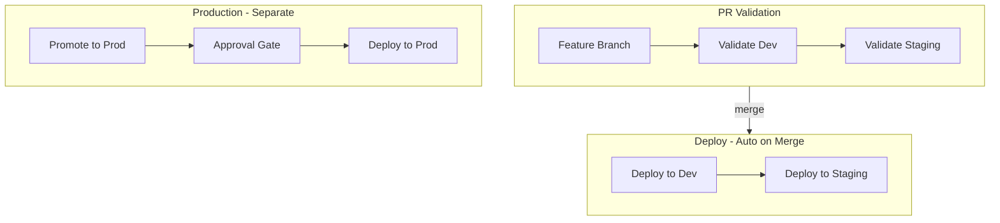

# CI/CD Complete Setup Guide for Sylvamo

**A Comprehensive Step-by-Step Guide for Setting Up CI/CD Pipelines for Cognite Data Fusion**

This guide walks you through the complete setup of CI/CD pipelines for deploying Cognite Data Fusion (CDF) resources across dev, staging, and production environments using Azure DevOps. It combines setup instructions, troubleshooting insights, and best practices learned from real-world implementation.

---

## Table of Contents

1. [Overview and Concepts](#overview-and-concepts)
2. [Prerequisites](#prerequisites)
3. [Repository Structure](#repository-structure)
4. [Step 1: Prepare Pipeline YAML Files](#step-1-prepare-pipeline-yaml-files)
5. [Step 2: Create Variable Groups](#step-2-create-variable-groups)
6. [Step 3: Create ADO Environments](#step-3-create-ado-environments)
7. [Step 4: Create Pipelines in Azure DevOps](#step-4-create-pipelines-in-azure-devops)
8. [Step 5: Configure Branch Policies](#step-5-configure-branch-policies)
9. [Step 6: Verify Config Files Match Variables](#step-6-verify-config-files-match-variables)
10. [Step 7: Test the Setup](#step-7-test-the-setup)
11. [CDF IAM Groups Setup](#cdf-iam-groups-setup)
12. [Troubleshooting Common Issues](#troubleshooting-common-issues)
13. [Complete Pipeline YAML Reference](#complete-pipeline-yaml-reference)

---

## Overview and Concepts

### What is CI/CD for CDF?

Cognite Data Fusion (CDF) is a cloud service that you deploy **to**, not **inside**. Think of it like deploying to AWS or Azure - it's an external API endpoint.

**Key Concepts:**

| Concept | What It Means |
|---------|---------------|
| **CDF** | Cloud service (like Salesforce or Snowflake) - we deploy TO it |
| **Cognite Toolkit** | CLI tool (`cdf` command) - your deployment tool |
| **Three Commands** | `cdf build` → validates configs<br>`cdf deploy --dry-run` → previews changes<br>`cdf deploy` → applies changes |
| **Authentication** | Service principal (robot account) with client ID + secret |
| **Secrets Storage** | Azure DevOps Variable Groups - injected at runtime |

### CI/CD Flow

```
┌─────────────────────────────────────────────────────────────────┐
│                        FEATURE BRANCH                           │
├─────────────────────────────────────────────────────────────────┤
│  PR Created → CI Pipeline Triggers                              │
│                                                                 │
│    ┌──────────┐      ┌─────────────┐                            │
│    │ cdf build│ ───▶ │ cdf deploy  │  ✓ Shows what WOULD change│
│    │          │      │ --dry-run   │    (like terraform plan)   │
│    └──────────┘      └─────────────┘                            │
│                                                                 │
│  Merge → CD Pipeline Triggers                                   │
│                                                                 │
│    ┌──────────┐      ┌─────────────┐                            │
│    │ cdf build│ ───▶ │ cdf deploy  │  ✓ Applies changes to CDF │
│    └──────────┘      └─────────────┘                            │
│                                                                 │
│  Environment promotion: DEV → STAGING → PROD (with approvals)  │
└─────────────────────────────────────────────────────────────────┘
```

**Key Point:** Two-step safety net
1. **PR stage:** `--dry-run` shows what WOULD change (like `terraform plan`)
2. **Merge stage:** `deploy` actually applies changes (like `terraform apply`)

Nothing changes in CDF until code is merged to main.

### Pipeline Architecture (Sylvamo Implementation)

At Sylvamo, the deploy pipeline deploys to **Dev and Staging only**. Production uses a **separate pipeline** (promote-to-prod) that runs weekly or manually, with an approval gate.



> **Tip:** Add screenshots of your pipelines to [`images/`](images/README.md) (e.g., Pipelines list, Variable groups, Branch policy).

See [Step 4.4: Create Promote-to-Production Pipeline](#44-create-promote-to-production-pipeline) and [CI/CD Hands-On Learnings](CICD_HANDS_ON_LEARNINGS.md) for details.

---

## Branch Strategy

### Trunk-Based: Main Branch Only

We use a trunk-based model:

- **Single source of truth:** `main` branch only (no `dev`, `staging`, or `prod` branches)
- **Environment-specific configs:** `config.dev.yaml`, `config.staging.yaml`, `config.prod.yaml` define which CDF project each environment targets
- **Feature branches** target `main`; PR validation runs before merge

See [CI/CD Hands-On Learnings - Branch Strategy](CICD_HANDS_ON_LEARNINGS.md#branch-strategy) for more details.

---

## Prerequisites

Before starting, ensure you have:

- ✅ **Azure DevOps Access:**
  - Access to SylvamoCorp organization
  - Access to `Industrial-Data-Landscape-IDL` repository
  - Permissions to create pipelines, variable groups, and environments

- ✅ **CDF Access:**
  - Access to dev, staging, and production CDF projects
  - Service principal credentials for each environment
  - Understanding of your CDF project names (`sylvamo-dev`, `sylvamo-test`, `sylvamo-prod`)

- ✅ **Azure AD Access:**
  - Access to Azure Active Directory / Entra ID
  - Service principal client IDs and secrets
  - Tenant ID

- ✅ **Repository Access:**
  - Local clone of `Industrial-Data-Landscape-IDL` repository
  - Write access to `main` branch (or ability to create PRs)

- ✅ **Knowledge:**
  - Basic understanding of YAML
  - Familiarity with Azure DevOps
  - Understanding of Git workflows

---

## Repository Structure

Your repository should have this structure:

```
Industrial-Data-Landscape-IDL/
  sylvamo/                    # Organization directory
    config.dev.yaml           # → points to DEV CDF project
    config.staging.yaml       # → points to STAGING CDF project  
    config.prod.yaml          # → points to PROD CDF project
    modules/                  # Toolkit modules (resources to deploy)
      admin/
      mfg_core/
      mfg_extended/
      ...
  .devops/                    # Pipeline definitions
    dry-run-pipeline.yml      # PR validation pipeline
    deploy-pipeline.yml       # Multi-stage deployment pipeline
    test-all-environments.yml # Manual validation pipeline
  cdf.toml                    # Toolkit configuration
```

**Key Files:**

- **`config.<env>.yaml`** - Defines target CDF project and which modules to deploy
- **`modules/`** - Contains the actual CDF resources (data models, transformations, etc.)
- **`.devops/*.yml`** - Pipeline definitions for Azure DevOps

**Important:** The `project:` value in each `config.<env>.yaml` must match the `CDF_PROJECT` variable in the corresponding variable group (enforced by Toolkit for staging/prod).

---

## Step 1: Prepare Pipeline YAML Files

### 1.1 Verify Pipeline Files Exist

Ensure these files exist in your repository's `.devops/` folder:

- `.devops/dry-run-pipeline.yml` - PR validation pipeline
- `.devops/deploy-pipeline.yml` - Multi-stage deployment pipeline
- `.devops/test-all-environments.yml` - Manual validation pipeline

### 1.2 Verify Pipeline YAML is Correct

**Critical Requirements for `deploy-pipeline.yml`:**

✅ **Checkout Step:** Must include `checkout: self` as first step in all jobs
✅ **Working Directory:** All script steps must have `workingDirectory: 'sylvamo'`
✅ **Build Environment:** All `cdf build` commands must include `--env <environment>`
✅ **Environment Variables:** All `cdf deploy` commands (dry-run and actual) must have `env:` section
✅ **Docker Version:** Container image version must match modules version

**Example of Correct Structure:**

```yaml
steps:
  - checkout: self  # ← Required first step
  - script: cdf build --env dev  # ← Must specify environment
    displayName: 'Build'
    workingDirectory: 'sylvamo'  # ← Required
  - script: cdf deploy --dry-run --env dev
    displayName: 'Validate Deployment (Dry Run)'
    workingDirectory: 'sylvamo'
    env:  # ← Required for authentication
      IDP_CLIENT_SECRET: $(IDP_CLIENT_SECRET)
      INGESTION_CLIENT_ID: $(INGESTION_CLIENT_ID)
      INGESTION_CLIENT_SECRET: $(INGESTION_CLIENT_SECRET)
```

**⚠️ Common Mistakes to Avoid:**

- ❌ Missing `checkout: self` → Results in "workingDirectory not found"
- ❌ Missing `--env` on `cdf build` → Builds for wrong environment
- ❌ Missing `env:` on dry-run steps → Authentication failures
- ❌ Wrong Docker version → Version mismatch errors

See [Complete Pipeline YAML Reference](#complete-pipeline-yaml-reference) for the full corrected version.

### 1.3 Commit Pipeline Files

Ensure all pipeline files are committed to the `main` branch:

```bash
git add .devops/
git commit -m "Add CI/CD pipeline definitions"
git push origin main
```

---

## Step 2: Create Variable Groups

Variable groups store CDF credentials securely. You need three groups (one per environment).

### 2.1 Navigate to Variable Groups

1. Go to: **Pipelines → Library → Variable groups**
2. URL: `https://dev.azure.com/SylvamoCorp/Industrial-Data-Landscape-IDL/_library?itemType=VariableGroups`

### 2.2 Create Dev Variable Group

**Name:** `dev-toolkit-credentials` (or `dev-toolkit-credentials-fernando` if creating a test version)

**Steps:**

1. Click **"+ Variable group"**
2. **Variable group name:** `dev-toolkit-credentials`
3. **Description:** `Credentials for CDF dev environment`
4. **Link secrets from an Azure key vault:** Leave **OFF** (unless using Key Vault)
5. **Add variables:** Click "+ Add" and add these one by one:

| Variable Name | Value | Secret? | Notes |
|---|---|---|---|
| `CDF_CLUSTER` | `az-eastus-1` | No | Your CDF cluster name |
| `CDF_PROJECT` | `sylvamo-dev` | No | Must match `config.dev.yaml` |
| `LOGIN_FLOW` | `client_credentials` | No | Authentication method |
| `IDP_CLIENT_ID` | (Your Azure AD App ID) | No | Service Principal Client ID |
| `IDP_CLIENT_SECRET` | (Your Azure AD Secret) | **Yes** | Click padlock icon |
| `IDP_TENANT_ID` | (Your Tenant ID) | No | Azure AD Tenant ID |
| `CDF_URL` | `https://az-eastus-1.cognitedata.com` | No | Your cluster URL |
| `IDP_TOKEN_URL` | `https://login.microsoftonline.com/{TENANT_ID}/oauth2/v2.0/token` | No | Optional (auto-configured) |
| `INGESTION_CLIENT_ID` | (Same as IDP_CLIENT_ID or separate) | No | Ingestion SP Client ID |
| `INGESTION_CLIENT_SECRET` | (Same as IDP_CLIENT_SECRET or separate) | **Yes** | Click padlock icon |

6. **Grant Pipeline Permission:**
   - Click **"Pipeline permissions"** button (top right)
   - Click **"+"** button
   - Select `Industrial-Data-Landscape-IDL`
   - Click **"Save"**
   - Close the modal

7. Click **"Save"** to save the variable group

**⚠️ Important:**
- Mark `IDP_CLIENT_SECRET` and `INGESTION_CLIENT_SECRET` as **Secret** (padlock icon)
- Grant pipeline permission **before** saving (or you'll get permission errors)
- Ensure `CDF_PROJECT` matches your actual dev project name

### 2.3 Create Staging Variable Group

**Name:** `staging-toolkit-credentials`

**Steps:**

1. Click **"+ Variable group"**
2. **Variable group name:** `staging-toolkit-credentials`
3. **Description:** `Credentials for CDF staging environment`
4. **Add variables:** Same as dev, but:
   - `CDF_PROJECT` = `sylvamo-test` (or your staging project name)
   - Use staging environment credentials (if different from dev)
5. **Grant Pipeline Permission:** Same as dev
6. Click **"Save"**

### 2.4 Create Production Variable Group

**Name:** `prod-toolkit-credentials`

**Steps:**

1. Click **"+ Variable group"**
2. **Variable group name:** `prod-toolkit-credentials`
3. **Description:** `Credentials for CDF production environment`
4. **Add variables:** Same as staging, but:
   - `CDF_PROJECT` = `sylvamo-prod` (or your production project name)
   - Use production environment credentials (if different)
5. **Grant Pipeline Permission:** Same as dev
6. Click **"Save"**

### 2.5 Verify Variable Groups

**Checklist:**

- [ ] All three variable groups exist
- [ ] All required variables are present
- [ ] Secrets are marked as secret (padlock icon)
- [ ] Pipeline permissions are granted to `Industrial-Data-Landscape-IDL`
- [ ] `CDF_PROJECT` values match your actual CDF project names

**Troubleshooting:** If you see "Variable group could not be found" errors, see [Variable Group Permission Issues](#variable-group-permission-issues).

---

## Step 3: Create ADO Environments

Environments enable approval gates for staging and production deployments.

### 3.1 Create Staging Environment

**Steps:**

1. Navigate to: **Pipelines → Environments**
2. URL: `https://dev.azure.com/SylvamoCorp/Industrial-Data-Landscape-IDL/_library?itemType=Environments`
3. Click **"+ Create environment"**
4. **Name:** `staging` (must match exactly - case-sensitive)
5. **Description:** `Staging environment for CDF deployments`
6. **Resource type:** Select **"None"**
7. Click **"Create"**

**Add Approval Gate:**

1. Click on the `staging` environment you just created
2. Click **"Approvals and checks"** → **"+ Add check"**
3. Select **"Approvals"**
4. **Approvers:** Add yourself or team lead
5. **Minimum number of approvers:** 1
6. Click **"Create"**

### 3.2 Create Production Environment

**Steps:**

1. Click **"+ Create environment"**
2. **Name:** `production` (must match exactly - case-sensitive)
3. **Description:** `Production environment for CDF deployments`
4. **Resource type:** Select **"None"**
5. Click **"Create"**

**Add Approval Gate:**

1. Click on the `production` environment
2. Click **"Approvals and checks"** → **"+ Add check"**
3. Select **"Approvals"**
4. **Approvers:** Add yourself or team lead
5. **Minimum number of approvers:** 1
6. Click **"Create"**

### 3.3 Verify Environments

**Checklist:**

- [ ] `staging` environment exists
- [ ] `production` environment exists
- [ ] Each has at least 1 approver configured
- [ ] Environment names match exactly what's in pipeline YAML (`environment: 'staging'`)

**⚠️ Important:** Environment names in pipeline YAML must match exactly (case-sensitive).

---

## Step 4: Create Pipelines in Azure DevOps

### 4.1 Create PR Validation Pipeline

**Purpose:** Validates changes before merging to main (dry-run only).

**Steps:**

1. Navigate to: **Pipelines → Pipelines**
2. URL: `https://dev.azure.com/SylvamoCorp/Industrial-Data-Landscape-IDL/_build`
3. Click **"Create Pipeline"** (or **"New Pipeline"**)
4. **Where is your code?** Select **"Azure Repos Git"**
5. **Select a repository:** Choose **Industrial-Data-Landscape-IDL**
6. **Configure your pipeline:** Select **"Existing Azure Pipelines YAML file"**
7. **Branch:** `main`
8. **Path:** `.devops/dry-run-pipeline.yml`
9. Click **"Continue"**
10. **Review:** Verify the YAML is displayed correctly
11. Click **"Save"** (or **"Run"** to test immediately)
12. **Rename:** Click three dots (⋯) → **"Rename/move"** → Name: **"PR Validation"**

### 4.2 Create Deployment Pipeline

**Purpose:** Multi-stage deployment (dev → staging). At Sylvamo, this deploys to **Dev and Staging only**; Production uses a separate promote-to-prod pipeline (Step 4.4).

**Steps:**

1. Click **"New Pipeline"** button
2. **Where is your code?** Select **"Azure Repos Git"**
3. **Select a repository:** Choose **Industrial-Data-Landscape-IDL`
4. **Configure your pipeline:** Select **"Existing Azure Pipelines YAML file"**
5. **Branch:** `main`
6. **Path:** `.devops/deploy-pipeline.yml`
7. Click **"Continue"**
8. **Review:** Verify the YAML is displayed correctly
9. Click **"Save"**
10. **Rename:** Name it **"Deploy to Dev & Staging (Auto on Merge)"**

**⚠️ Important:** If you see errors about variable groups or working directories, see [Troubleshooting Common Issues](#troubleshooting-common-issues).

### 4.3 Create Test All Environments Pipeline

**Purpose:** Manual validation pipeline for all environments.

**Steps:**

1. Click **"New Pipeline"** button
2. **Where is your code?** Select **"Azure Repos Git"**
3. **Select a repository:** Choose **Industrial-Data-Landscape-IDL`
4. **Configure your pipeline:** Select **"Existing Azure Pipelines YAML file"**
5. **Branch:** `main`
6. **Path:** `.devops/test-all-environments.yml`
7. Click **"Continue"**
8. **Review:** Verify the YAML is displayed correctly
9. Click **"Save"**
10. **Rename:** Name it **"Test All Environments (Manual)"**

### 4.4 Create Promote-to-Production Pipeline

**Purpose:** Production deployment. Runs weekly (Monday 8am UTC) or manually. Uses the `production` ADO environment with an approval gate.

**Steps:**

1. Click **"New Pipeline"** button
2. **Where is your code?** Select **"Azure Repos Git"**
3. **Select a repository:** Choose **Industrial-Data-Landscape-IDL**
4. **Configure your pipeline:** Select **"Existing Azure Pipelines YAML file"**
5. **Branch:** `main`
6. **Path:** `.devops/promote-to-prod-pipeline.yml`
7. Click **"Continue"**
8. **Review:** Verify the YAML shows build, dry-run, and deploy for prod
9. Click **"Save"**
10. **Rename:** Name it **"Promote to Production (Weekly/Manual)"**

**Note:** Ensure `.devops/promote-to-prod-pipeline.yml` exists in your repo. It should have `trigger: none`, a `schedules` block for weekly runs, and use `environment: 'production'` for the approval gate.

### 4.5 Verify Pipelines

**Checklist:**

- [ ] Four pipelines appear in Pipelines list (PR Validation, Deploy, Test All, Promote to Prod)
- [ ] PR Validation pipeline can be run manually
- [ ] Deploy pipeline shows two stages (Dev, Staging); Promote-to-Prod pipeline exists for Production
- [ ] No errors when viewing pipeline YAML

---

## Step 5: Configure Branch Policies

Make PR validation required before merging to main.

### 5.1 Set Up Branch Policy

**Steps:**

1. Navigate to: **Repos → Branches**
2. URL: `https://dev.azure.com/SylvamoCorp/Industrial-Data-Landscape-IDL/_git/Industrial-Data-Landscape-IDL/branches`
3. Find **`main`** branch
4. Click **"..."** (three dots) next to `main` branch
5. Select **"Branch policies"**
6. Under **"Build validation"**, click **"+ Add build policy"**
7. **Build pipeline:** Select **"PR Validation"** (the pipeline you created)
8. **Display name:** `PR Validation Pipeline`
9. **Trigger:** Automatic
10. **Policy requirement:** **Required** (must pass before merge)
11. **Minimum number of reviewers:** 1 (or as per your policy)
12. Click **"Save"`

### 5.2 Verify Branch Policy

**Checklist:**

- [ ] Branch policy is configured on `main` branch
- [ ] PR Validation pipeline is listed as required
- [ ] Policy shows as "Required"

**Expected Behavior:**
- PRs targeting `main` will automatically trigger PR Validation pipeline
- PR cannot be merged until pipeline passes
- Failed pipelines block merge

---

## Step 6: Verify Config Files Match Variables

**⚠️ Critical:** The Toolkit enforces that `project:` in config files matches `CDF_PROJECT` in variable groups for staging/prod environments.

### 6.1 Check Config Files

**In ADO Repository:**

1. Navigate to: **Repos → Files**
2. Go to `sylvamo/config.dev.yaml`
3. Verify: `project: sylvamo-dev`
4. Go to `sylvamo/config.staging.yaml`
5. Verify: `project: sylvamo-test` (or your staging project name)
6. Go to `sylvamo/config.prod.yaml`
7. Verify: `project: sylvamo-prod` (or your production project name)

### 6.2 Fix Placeholder Values

**If you see placeholders like `<my-project-staging>`:**

1. Click **"Edit"** on the config file
2. Replace placeholder with actual project name:
   ```yaml
   environment:
     name: staging
     project: sylvamo-test  # ← Must match CDF_PROJECT in variable group
   ```
3. Click **"Commit"** → **"Commit"`

### 6.3 Verification Checklist

**For each environment:**

- [ ] `config.dev.yaml` → `project: sylvamo-dev` matches `CDF_PROJECT` in `dev-toolkit-credentials`
- [ ] `config.staging.yaml` → `project: sylvamo-test` matches `CDF_PROJECT` in `staging-toolkit-credentials`
- [ ] `config.prod.yaml` → `project: sylvamo-prod` matches `CDF_PROJECT` in `prod-toolkit-credentials`

**Troubleshooting:** If you see "Project name mismatch" errors, see [Project Name Mismatch Errors](#project-name-mismatch-errors).

---

## Step 7: Test the Setup

### 7.1 Test PR Validation Pipeline

**Steps:**

1. Create a test branch:
   ```bash
   git checkout -b test/pr-validation-$(date +%Y%m%d)
   ```

2. Make a small change (e.g., add a comment):
   ```bash
   echo "# Test change for PR validation - $(date)" >> sylvamo/config.dev.yaml
   ```

3. Commit and push:
   ```bash
   git add .
   git commit -m "Test: PR validation pipeline"
   git push origin test/pr-validation-$(date +%Y%m%d)
   ```

4. Create PR targeting `main` branch

5. **Verify:**
   - ✅ PR Validation pipeline triggers automatically
   - ✅ Pipeline appears in "Checks" section
   - ✅ `cdf build` step succeeds
   - ✅ `cdf deploy --dry-run` step succeeds
   - ✅ PR shows "All checks passed"
   - ✅ PR can be merged

### 7.2 Test Dev Deployment

**Steps:**

1. Merge the test PR to `main`
2. **Verify:**
   - ✅ Deployment pipeline triggers automatically
   - ✅ DeployDev stage runs (no approval needed)
   - ✅ `cdf build --env dev` succeeds
   - ✅ `cdf deploy --dry-run --env dev` succeeds
   - ✅ `cdf deploy --env dev` succeeds
   - ✅ Changes appear in dev CDF project

### 7.3 Test Staging Approval Gate

**Steps:**

1. After Dev deployment succeeds, check pipeline status
2. **Verify:**
   - ✅ DeployStaging stage shows "Waiting for approval"
   - ✅ Approval notification appears
   - ✅ Navigate to Pipelines → Environments → `staging`
   - ✅ Click on pending approval
   - ✅ Review dry-run output
   - ✅ Click **"Approve"**
   - ✅ Pipeline continues automatically
   - ✅ Staging deployment succeeds

### 7.4 Test Production Approval Gate

**Steps:**

1. After Staging deployment succeeds
2. **Verify:**
   - ✅ DeployProd stage shows "Waiting for approval"
   - ✅ Approval notification appears
   - ✅ Approve production deployment
   - ✅ Production deployment succeeds

### 7.5 Complete Testing Checklist

- [ ] PR Validation pipeline works
- [ ] Dev auto-deployment works
- [ ] Staging approval gate works
- [ ] Production approval gate works
- [ ] All environments receive deployments correctly
- [ ] No errors in pipeline logs

---

## CDF IAM Groups Setup

Each CDF project needs IAM groups for the deployment service principal and other access. Staging and production projects may have different capability restrictions than dev.

### Bootstrap cognite_toolkit_service_principal

The deployment service principal must have `groupsAcl:LIST` (and related capabilities) in each target CDF project. If the group does not exist:

1. **Manual bootstrap (CDF Fusion UI):** Create a group with `sourceId` matching your Azure AD service principal, and minimal capabilities (e.g., `groupsAcl:LIST,READ,CREATE,UPDATE,DELETE`).
2. **Or copy from dev:** Use CDF API or scripts to copy groups from `sylvamo-dev` to `sylvamo-test` and `sylvamo-prod`.

### Restricted Capabilities in Staging/Production

Staging and production CDF projects (`sylvamo-test`, `sylvamo-prod`) may restrict WRITE access to legacy APIs. Update Group YAML files to use **READ only** for:

- `annotationsAcl`
- `assetsAcl`
- `relationshipsAcl`

**Location:** `sylvamo/modules/admin/auth/cognite_toolkit_service_principal.Group.yaml`

**Example fix:**

```yaml
# Before (fails in staging/prod)
- annotationsAcl:
    actions: [READ, WRITE, SUGGEST, REVIEW]

# After (works)
- annotationsAcl:
    actions: [READ]
```

See [CI/CD Pipeline Troubleshooting - Invalid Capabilities](CICD_PIPELINE_TROUBLESHOOTING.md#invalid-capabilities-cdf-iam) and [CI/CD Hands-On Learnings](CICD_HANDS_ON_LEARNINGS.md#cdf-iam-groups) for details.

---

## Troubleshooting Common Issues

This section covers the most common issues encountered during setup, with solutions based on real-world troubleshooting.

### Variable Group Permission Issues

**Error:**
```
Variable group dev-toolkit-credentials could not be found. 
The variable group does not exist or has not been authorized for use.
```

**Solution:**
1. Go to Pipelines → Library → Variable groups
2. Click on the variable group
3. Click "Pipeline permissions"
4. Click "+" → Select `Industrial-Data-Landscape-IDL` → Save
5. Save the variable group

**Prevention:** Always grant pipeline permissions when creating variable groups.

---

### Pipeline Version Mismatch Errors

**Error:**
```
ToolkitVersionError: The version of the modules (0.7.78) does not match 
the version of the installed CLI (0.5.35).
```

**Solution:**
Update Docker image version in pipeline YAML to match modules version:

```yaml
container:
  image: cognite/toolkit:0.7.78  # Match your modules version
```

**How to find modules version:**
- Check `cdf.toml`: `version = "0.7.78"`
- Or check `sylvamo/build_info.dev.yaml`

**Prevention:** Keep Docker image version in sync with modules version.

---

### Missing Environment Variables

**Error:**
```
ERROR (ToolkitMissingValueError): The login flow 'client_credentials' requires 
the following environment variables: IDP_CLIENT_SECRET.
```

**Solution:**
Add `env:` section to **all** `cdf deploy` commands (both dry-run and actual):

```yaml
- script: cdf deploy --dry-run --env dev
  displayName: 'Validate Deployment (Dry Run)'
  workingDirectory: 'sylvamo'
  env:  # ← Add this section
    IDP_CLIENT_SECRET: $(IDP_CLIENT_SECRET)
    INGESTION_CLIENT_ID: $(INGESTION_CLIENT_ID)
    INGESTION_CLIENT_SECRET: $(INGESTION_CLIENT_SECRET)
```

**Prevention:** Always add `env:` sections to both dry-run and deploy steps.

---

### Working Directory Not Found

**Error:**
```
##[error] Not found workingDirectory: /_w/1/s/sylvamo
```

**Solution:**

1. **Add checkout step:**
   ```yaml
   steps:
     - checkout: self  # ← Add this first
     - script: cdf build
       workingDirectory: 'sylvamo'
   ```

2. **Verify repository structure:** Ensure `sylvamo/` directory exists in repo

**Prevention:** Always include `checkout: self` when using containers.

---

### Project Name Mismatch Errors

**Error:**
```
ERROR (ToolkitEnvError): Project name mismatch between project set in the 
environment section of 'config.staging.yaml' and the environment variable 'CDF_PROJECT', 
<my-project-staging> ≠ sylvamo-test.
```

**Solution:**

1. Check `config.staging.yaml`: `project: <my-project-staging>` (placeholder)
2. Check variable group: `CDF_PROJECT = sylvamo-test`
3. Update config file to match:
   ```yaml
   environment:
     name: staging
     project: sylvamo-test  # ← Must match CDF_PROJECT exactly
   ```

**Prevention:** Use consistent project naming and validate before committing.

---

### Authentication Failures

**Error:**
```
CogniteAuthError: Error generating access token: invalid_client, 401, 
AADSTS7000215: Invalid client secret provided.
```

**Solution:**

1. **Check secret expiration:** Azure AD secrets expire
2. **Generate new secret:** Azure Portal → App registrations → Certificates & secrets
3. **Update variable group:** Replace `IDP_CLIENT_SECRET` with new value
4. **Mark as secret:** Click padlock icon in ADO
5. **Verify service principal permissions:** Ensure SP has CDF access

**Prevention:** Document secret expiration dates, set reminders.

---

### Build Created for Wrong Environment

**Error:**
```
ERROR (ToolkitEnvError): Expected to deploy for 'staging' environment, 
but the last build was created for the 'dev' environment.
```

**Solution:**

Add `--env` parameter to **all** `cdf build` commands:

```yaml
- script: cdf build --env staging  # ← Must specify environment
  displayName: 'Build'
  workingDirectory: 'sylvamo'
```

**Prevention:** Always use `--env` parameter with `cdf build`.

---

## Complete Pipeline YAML Reference

Here's the complete, corrected `deploy-pipeline.yml` with all fixes applied:

```yaml
# .devops/deploy-pipeline.yml
trigger:
  branches:
    include:
      - main  # Triggers on push to main (after merge)

pool:
  vmImage: 'ubuntu-latest'

# Deploy to DEV first
stages:
  - stage: DeployDev
    displayName: 'Deploy to Dev'
    variables:
      - group: dev-toolkit-credentials
    jobs:
      - job: Deploy
        container:
          image: cognite/toolkit:0.7.78  # Match your modules version
        steps:
          - checkout: self  # Required for container jobs
          - script: cdf build --env dev  # Must specify environment
            displayName: 'Build'
            workingDirectory: 'sylvamo'
          - script: cdf deploy --dry-run --env dev
            displayName: 'Validate Deployment (Dry Run)'
            workingDirectory: 'sylvamo'
            env:  # Required for authentication
              IDP_CLIENT_SECRET: $(IDP_CLIENT_SECRET)
              INGESTION_CLIENT_ID: $(INGESTION_CLIENT_ID)
              INGESTION_CLIENT_SECRET: $(INGESTION_CLIENT_SECRET)
          - script: cdf deploy --env dev
            displayName: 'Deploy to Dev CDF'
            workingDirectory: 'sylvamo'
            env:  # Required for authentication
              IDP_CLIENT_SECRET: $(IDP_CLIENT_SECRET)
              INGESTION_CLIENT_ID: $(INGESTION_CLIENT_ID)
              INGESTION_CLIENT_SECRET: $(INGESTION_CLIENT_SECRET)

  - stage: DeployStaging
    displayName: 'Deploy to Staging'
    dependsOn: DeployDev
    variables:
      - group: staging-toolkit-credentials
    jobs:
      - deployment: Deploy
        environment: 'staging'  # ADO Environment with approval
        container:
          image: cognite/toolkit:0.7.78
        strategy:
          runOnce:
            deploy:
              steps:
                - checkout: self
                - script: cdf build --env staging
                  displayName: 'Build'
                  workingDirectory: 'sylvamo'
                - script: cdf deploy --dry-run --env staging
                  displayName: 'Validate Deployment (Dry Run)'
                  workingDirectory: 'sylvamo'
                  env:
                    IDP_CLIENT_SECRET: $(IDP_CLIENT_SECRET)
                    INGESTION_CLIENT_ID: $(INGESTION_CLIENT_ID)
                    INGESTION_CLIENT_SECRET: $(INGESTION_CLIENT_SECRET)
                - script: cdf deploy --env staging
                  displayName: 'Deploy to Staging CDF'
                  workingDirectory: 'sylvamo'
                  env:
                    IDP_CLIENT_SECRET: $(IDP_CLIENT_SECRET)
                    INGESTION_CLIENT_ID: $(INGESTION_CLIENT_ID)
                    INGESTION_CLIENT_SECRET: $(INGESTION_CLIENT_SECRET)

  - stage: DeployProd
    displayName: 'Deploy to Production'
    dependsOn: DeployStaging
    variables:
      - group: prod-toolkit-credentials
    jobs:
      - deployment: Deploy
        environment: 'production'  # ADO Environment with approval gate
        container:
          image: cognite/toolkit:0.7.78
        strategy:
          runOnce:
            deploy:
              steps:
                - checkout: self
                - script: cdf build --env prod
                  displayName: 'Build'
                  workingDirectory: 'sylvamo'
                - script: cdf deploy --dry-run --env prod
                  displayName: 'Validate Deployment (Dry Run)'
                  workingDirectory: 'sylvamo'
                  env:
                    IDP_CLIENT_SECRET: $(IDP_CLIENT_SECRET)
                    INGESTION_CLIENT_ID: $(INGESTION_CLIENT_ID)
                    INGESTION_CLIENT_SECRET: $(INGESTION_CLIENT_SECRET)
                - script: cdf deploy --env prod
                  displayName: 'Deploy to Production CDF'
                  workingDirectory: 'sylvamo'
                  env:
                    IDP_CLIENT_SECRET: $(IDP_CLIENT_SECRET)
                    INGESTION_CLIENT_ID: $(INGESTION_CLIENT_ID)
                    INGESTION_CLIENT_SECRET: $(INGESTION_CLIENT_SECRET)
```

**Key Points:**

1. ✅ **Checkout:** `checkout: self` as first step in all jobs
2. ✅ **Working Directory:** `workingDirectory: 'sylvamo'` on all script steps
3. ✅ **Build Environment:** `cdf build --env <env>` with environment specified
4. ✅ **Deploy Environment:** `cdf deploy --env <env>` with environment specified
5. ✅ **Environment Variables:** `env:` section on both dry-run and deploy steps
6. ✅ **Docker Version:** Match `cognite/toolkit` version with modules version
7. ✅ **Variable Groups:** Properly named and permissioned

---

## Quick Reference: Setup Checklist

Use this checklist to verify your setup is complete:

### Prerequisites
- [ ] Azure DevOps access
- [ ] CDF access (dev, staging, prod)
- [ ] Azure AD service principal credentials
- [ ] Repository access

### Pipeline Files
- [ ] `.devops/dry-run-pipeline.yml` exists
- [ ] `.devops/deploy-pipeline.yml` exists
- [ ] `.devops/test-all-environments.yml` exists
- [ ] All files committed to `main` branch

### Variable Groups
- [ ] `dev-toolkit-credentials` created
- [ ] `staging-toolkit-credentials` created
- [ ] `prod-toolkit-credentials` created
- [ ] All required variables present
- [ ] Secrets marked as secret
- [ ] Pipeline permissions granted

### Config Files
- [ ] `config.dev.yaml` → `project: sylvamo-dev` matches variable group
- [ ] `config.staging.yaml` → `project: sylvamo-test` matches variable group
- [ ] `config.prod.yaml` → `project: sylvamo-prod` matches variable group

### Pipelines
- [ ] PR Validation pipeline created
- [ ] Deploy pipeline created; Promote-to-Prod pipeline created
- [ ] Validate All Environments pipeline created
- [ ] All pipelines can be run manually

### Environments
- [ ] `staging` environment created
- [ ] `production` environment created
- [ ] Each has at least 1 approver

### Branch Policies
- [ ] Branch policy configured on `main`
- [ ] PR Validation pipeline required
- [ ] Policy shows as "Required"

### Testing
- [ ] PR Validation pipeline tested
- [ ] Dev deployment tested
- [ ] Staging approval gate tested
- [ ] Production approval gate tested

---

## Additional Resources

- **[CI/CD Testing Guide](CICD_TESTING_GUIDE.md)** - Detailed testing procedures
- **[CI/CD Pipeline Troubleshooting Guide](CICD_PIPELINE_TROUBLESHOOTING.md)** - Comprehensive troubleshooting
- **[CI/CD Overview](CICD_OVERVIEW.md)** - High-level concepts and architecture
- **[ADO Pipelines Setup Steps](ADO_PIPELINE_SETUP.md)** - Original setup guide

---

## Summary

This guide has walked you through:

1. ✅ Understanding CI/CD concepts for CDF
2. ✅ Preparing pipeline YAML files with all required configurations
3. ✅ Creating variable groups with proper permissions
4. ✅ Setting up ADO environments with approval gates
5. ✅ Creating pipelines in Azure DevOps
6. ✅ Configuring branch policies
7. ✅ Verifying config files match variables
8. ✅ Testing the complete setup
9. ✅ Troubleshooting common issues

**Next Steps:**

- Test your setup with a real change
- Train your team on the approval process
- Set up monitoring and alerts
- Schedule regular validation runs

---

*Last Updated: February 8, 2026*
*Based on real-world Sylvamo CI/CD implementation and troubleshooting*
