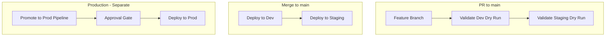

# CI/CD Hands-On Learnings

**Real-world implementation insights from Sylvamo pipeline setup (SVQS-171)**

This document captures learnings from the actual setup of CI/CD pipelines for Cognite Data Fusion (CDF) at Sylvamo. Use these insights when implementing or troubleshooting your own pipelines.

---

## Table of Contents

1. [Branch Strategy](#branch-strategy)
2. [Pipeline Architecture](#pipeline-architecture)
3. [PR Validation](#pr-validation)
4. [CDF IAM Groups](#cdf-iam-groups)
5. [Pipeline Naming](#pipeline-naming)
6. [Git Workflow](#git-workflow)
7. [Key Takeaways](#key-takeaways)

---

## Branch Strategy

### Trunk-Based: Main Branch Only

We migrated from environment-specific branches (`dev`, `staging`, `prod`) to a trunk-based model:

- **Single source of truth:** `main` branch only
- **Environment-specific configs:** `config.dev.yaml`, `config.staging.yaml`, `config.prod.yaml`
- **Same code, different targets:** Each config points to a different CDF project

**Why trunk-based?**

- Simplifies merges and reduces branch drift
- Environment promotion is controlled by pipelines, not branches
- Feature branches target `main`; PR validation runs before merge

**Config files define target:**

```yaml
# config.dev.yaml
environment:
  project: sylvamo-dev

# config.staging.yaml
environment:
  project: sylvamo-test

# config.prod.yaml
environment:
  project: sylvamo-prod
```

---

## Pipeline Architecture

### Deploy Pipeline vs Promote-to-Prod

Our implementation uses two separate pipelines for deployment:

| Pipeline | Trigger | Targets | Approval |
|----------|---------|---------|----------|
| **Deploy to Dev & Staging** | Auto on merge to `main` | Dev, Staging | Dev: none; Staging: none (both auto) |
| **Promote to Production** | Weekly (Monday 8am UTC) + Manual | Production | Approval gate required |

**Why separate Production?**

- Production deployment is a deliberate, controlled event
- Weekly schedule with approval gate gives time for validation
- Manual trigger allows on-demand promotions when needed
- Keeps Production isolated from accidental merges

**Pipeline architecture diagram:**



> **Tip:** Add screenshots of your pipelines (e.g., pipeline list, run view) to [`images/`](images/README.md) to enrich this doc.

---

## PR Validation

### Dry-Run for Both Dev and Staging

The PR validation pipeline runs `cdf build` and `cdf deploy --dry-run` for **both** Dev and Staging environments:

- **Validate Dev:** Ensures config and modules work for `sylvamo-dev`
- **Validate Staging:** Catches staging-specific issues (e.g., CDF IAM restrictions) before merge

**Why validate both?**

- Staging/prod environments may have different CDF IAM restrictions (e.g., legacy API write restrictions)
- Catching incompatible Group YAML files at PR time prevents failed deployments after merge

**Pipeline structure:**

```yaml
stages:
  - stage: ValidateDev
    # cdf build --env dev; cdf deploy --dry-run --env dev
  - stage: ValidateStaging
    dependsOn: ValidateDev
    # cdf build --env staging; cdf deploy --dry-run --env staging
```

---

## CDF IAM Groups

### Copying Groups Between Environments

Each CDF project needs its own IAM groups. We copied groups from `sylvamo-dev` to `sylvamo-test` and `sylvamo-prod`.

**Key groups:**

- `cognite_toolkit_service_principal` – Used by pipelines for deployment
- `cdf-sylvamo-admin`, `cdf-sylvamo-all-read` – Admin and read-only access

**Bootstrap requirement:**

- The deployment service principal must have `groupsAcl:LIST` (and related) in the target project before the toolkit can manage groups
- If missing, create a bootstrap group manually in CDF Fusion UI with minimal capabilities, then use API or toolkit to add full capabilities

### Restricted Capabilities in Staging/Production

**Problem:** Staging and production CDF projects (`sylvamo-test`, `sylvamo-prod`) restrict WRITE access to legacy APIs.

**What this means:** These projects have project-level policies that make certain older ("legacy") CDF APIs read-only. No IAM group—including your deployment service principal—can be granted WRITE access to those APIs in those projects. Dev (`sylvamo-dev`) does not have this restriction, so the same Group YAML that works in dev fails in staging/prod. The restriction is typically set by Cognite or by your organization for security or governance reasons in higher environments.

**Restricted APIs:**

- `annotationsAcl` – WRITE, SUGGEST, REVIEW not allowed
- `assetsAcl` – WRITE not allowed
- `relationshipsAcl` – WRITE not allowed

**Solution:** Update Group YAML files to use READ only for these ACLs in toolkit definitions:

```yaml
# cognite_toolkit_service_principal.Group.yaml
- annotationsAcl:
    actions: [READ]
    scope: {all: {}}
- assetsAcl:
    actions: [READ]
    scope: {all: {}}
- relationshipsAcl:
    actions: [READ]
    scope: {all: {}}
```

**Location:** `sylvamo/modules/admin/auth/cognite_toolkit_service_principal.Group.yaml`

**Error if not fixed:**

```
ResourceUpdateError: 3 invalid capabilitie(s) are present.
invalid capability - write access to the legacy Annotations API is restricted
```

---

## Pipeline Naming

### Clear, Descriptive Names

Use names that immediately convey purpose:

| YAML File | Recommended Name |
|-----------|------------------|
| `dry-run-pipeline.yml` | PR Validation - CDF Toolkit Dry Run |
| `deploy-pipeline.yml` | Deploy to Dev & Staging (Auto on Merge) |
| `promote-to-prod-pipeline.yml` | Promote to Production (Weekly/Manual) |
| `test-all-environments.yml` | Test All Environments (Manual) |

**Why it matters:**

- Branch policy dropdown: easy to select the right pipeline
- Pipeline list: clear what each pipeline does
- Onboarding: new team members understand at a glance

---

## Git Workflow

### Feature Branch → PR → Merge → Auto-Deploy

1. **Create feature branch:** `git checkout -b feature/my-change`
2. **Make changes** in Cursor/IDE
3. **Commit and push:** `git add . && git commit -m "..." && git push`
4. **Create PR** targeting `main`
5. **PR validation** runs automatically (dry-run Dev + Staging)
6. **Merge** after approval and passing checks
7. **Deploy pipeline** runs automatically (Dev → Staging)

**Never push directly to main** – always use PR workflow for review and validation.

### API/SDK Drift

**Problem:** Changes made via CDF API or Python SDK are not tracked in git.

**Solution:** Sync back to git:

1. Use `cdf dump group` (or similar) to extract current state from CDF
2. Create feature branch
3. Copy/update YAML files in `modules/`
4. Commit and PR
5. Merge to deploy consistently across environments

**When to use API vs Toolkit:**

| Scenario | Use API/SDK | Use Toolkit + Git |
|----------|-------------|-------------------|
| New data model | No | Yes |
| New transformation | No | Yes |
| New group | No | Yes |
| One-off data fix | Yes | No |
| Emergency hotfix | Yes (then sync back) | No |

---

## Key Takeaways

### What Worked

- **Trunk-based + config files:** Simple, clear, no branch drift
- **PR dry-run for Dev and Staging:** Catches staging-specific issues early
- **Separate Production pipeline:** Controlled, deliberate promotions
- **Pipeline naming:** Reduces confusion when configuring branch policies
- **Restricted capabilities in Group YAML:** Avoids deployment failures in staging/prod

### What to Avoid

- **Pushing directly to main:** Bypasses review and validation
- **WRITE on annotationsAcl/assetsAcl/relationshipsAcl in staging/prod:** Causes deployment failure
- **Generic pipeline names:** Hard to identify in branch policy dropdown
- **API changes without git sync:** Creates drift between CDF and repo

### Checklist Before Go-Live

- [ ] All Group YAML files use READ only for annotationsAcl, assetsAcl, relationshipsAcl
- [ ] `cognite_toolkit_service_principal` exists in each CDF project with required capabilities
- [ ] Variable groups have pipeline permissions granted
- [ ] Branch policy uses the PR validation pipeline
- [ ] Config files match `CDF_PROJECT` in variable groups

---

## References

- [CI/CD Complete Setup Guide](CICD_COMPLETE_SETUP_GUIDE.md)
- [CI/CD Pipeline Troubleshooting](CICD_PIPELINE_TROUBLESHOOTING.md)
- [CI/CD Hands-On Speaker Notes](CICD_HANDS_ON_SPEAKER_NOTES.md)
- ADO Repo: [Industrial-Data-Landscape-IDL](https://dev.azure.com/SylvamoCorp/_git/Industrial-Data-Landscape-IDL)

---

*Last Updated: February 9, 2026*
*Based on Sylvamo CI/CD implementation (SVQS-171)*
