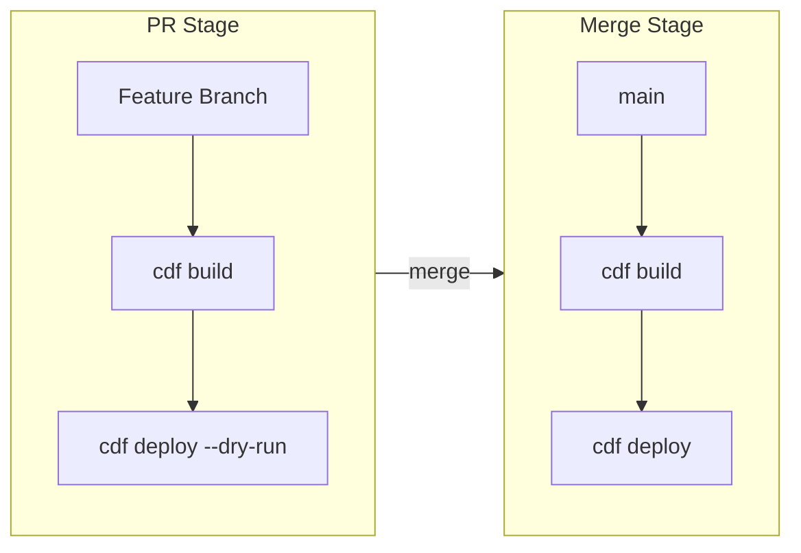

# CI/CD for Cognite Data Fusion (CDF)

**A Technical Overview for Platform Teams**

---

> **TL;DR - The Big Picture**
> 
> - CDF is a cloud service (like Salesforce or Snowflake) - we deploy to it using a CLI tool
> - The CLI tool is called **Cognite Toolkit** (`cdf` command)
> - We run `cdf build` to validate, `cdf deploy --dry-run` to preview, `cdf deploy` to apply
> - Authentication uses a **service principal** (like a robot account) with client ID + secret
> - Secrets are stored in **ADO Variable Groups** and injected into pipelines automatically

---

> **📋 Learning & Presentation Reference**
> 
> **Present in this order:** Overview → Complete Setup Guide → Hands-on session.

| Order | Document | Purpose |
|-------|----------|----------|
| 1 | [CICD_OVERVIEW.md](CICD_OVERVIEW.md) | Phase 1 – Concepts (this page) |
| 2 | [CICD_COMPLETE_SETUP_GUIDE.md](CICD_COMPLETE_SETUP_GUIDE.md) | Phase 2 – Setup steps |
| 2b | [CICD_COMPLETE_SETUP_GUIDE_SPEAKER_NOTES.md](CICD_COMPLETE_SETUP_GUIDE_SPEAKER_NOTES.md) | Speaker notes for Phase 2 |
| 3 | [CICD_HANDS_ON_SPEAKER_NOTES.md](CICD_HANDS_ON_SPEAKER_NOTES.md) | Hands-on session (follow-along) |
| — | [CICD_HANDS_ON_LEARNINGS.md](CICD_HANDS_ON_LEARNINGS.md) | Real-world learnings |
| — | [CICD_PIPELINE_TROUBLESHOOTING.md](CICD_PIPELINE_TROUBLESHOOTING.md) | Troubleshooting |
| — | [CICD_SYSTEM_EXPLANATION.md](CICD_SYSTEM_EXPLANATION.md) | Deep dive |
| — | [CICD_TESTING_GUIDE.md](CICD_TESTING_GUIDE.md) | Testing procedures |
| — | [ADO_PIPELINE_SETUP.md](ADO_PIPELINE_SETUP.md) | ADO pipeline setup |
| — | [ADO_CLONE_REPO.md](ADO_CLONE_REPO.md) | Clone ADO repo |
| — | [images/](images/README.md) | Pipeline screenshots |

### 1-Hour Presentation Outline

| Time | Phase | Topic |
|------|-------|-------|
| 0–15 min | 1. Overview | Intro, CDF as SaaS, flow (PR dry-run → merge deploy), auth, repo structure |
| 15–35 min | 2. Setup Guide | Variable groups, pipelines (PR Validation, Deploy, Promote-to-Prod), branch policy, config checks |
| 35–55 min | 3. Hands-on | Feature branch → PR → validation → merge → deploy; CDF IAM (restricted capabilities) |
| 55–60 min | Q&A | Wrap-up |

**Skip or shorten:** CICD_SYSTEM_EXPLANATION, ADO_CLONE_REPO walkthrough, full troubleshooting scenarios—link for later.

---

## Sylvamo Repository

The Toolkit configuration for Sylvamo is managed in Azure DevOps:

**[Industrial-Data-Landscape-IDL](https://dev.azure.com/SylvamoCorp/_git/Industrial-Data-Landscape-IDL)**

Credentials are stored as **project-level Variable Groups** in the SylvamoCorp ADO project.

---

## What is CDF from a CI/CD Perspective?

CDF is an **external SaaS endpoint**:

```
┌─────────────────┐     HTTPS/OAuth2     ┌─────────────────┐
│  Your CI/CD     │ ──────────────────▶  │  Cognite Data   │
│  Pipeline       │                       │  Fusion (CDF)   │
│  (ADO/GitHub)   │                       │  Cloud SaaS     │
└─────────────────┘                       └─────────────────┘
```

- CDF is hosted in Cognite-managed cloud clusters (e.g., `westeurope-1`)
- Pipelines connect via **HTTPS** using **OAuth2 client credentials**
- Treat it like any external API with a CLI deploy tool

> **Key Point: What does this mean?**
> 
> Think of CDF like deploying to AWS or Azure - it's just an API endpoint in the cloud. Your pipeline authenticates with credentials, then sends commands to create/update resources. Nothing runs "inside" your network.

---

## The CI/CD Tech Stack

| Component | Technology |
|-----------|------------|
| **Deploy Tool** | Cognite Toolkit CLI (`cdf`) |
| **Package** | `cognite-toolkit` (pip) or Docker `cognite/toolkit:<version>` |
| **Key Commands** | `cdf build`, `cdf deploy --dry-run`, `cdf deploy` |
| **Pipeline Definitions** | YAML (platform-specific) |

**Supported Platforms:**
- GitHub Actions → `.github/workflows/*.yml`
- Azure DevOps → `.devops/*.yml`
- GitLab CI/CD → `.gitlab-ci.yml`

**Languages:** Python (CLI runtime), YAML (configs + pipelines)

> **Key Point: What do I need to know?**
> 
> You don't need to write Python code. The Toolkit is a pre-built CLI - you just call it from your pipeline. All configuration is in YAML files.

---

## Repository Structure

```
<repo>/
  sylvamo/                    # organization directory
    config.dev.yaml           # → points to DEV CDF project
    config.staging.yaml       # → points to STAGING CDF project  
    config.prod.yaml          # → points to PROD CDF project
    modules/
      module_a/               # Toolkit modules (resources to deploy)
      module_b/
```

**`config.<env>.yaml` defines:**
- Target CDF project (`project: sylvamo-dev`)
- Which modules to deploy (`selected:` list)

**Created via:** `cdf modules init <organization_dir>`

> **Key Point: One repo, multiple environments**
> 
> The same code deploys to dev, staging, and prod. The only difference is which `config.<env>.yaml` file is used - each points to a different CDF project.

> **Note:** Dev, staging, and prod are **deployment environments** (CDF projects for CI/CD). They are not mills, plants, or physical sites. Mills are organizational units and are separate from deployment promotions.

---

## CI/CD Flow Overview



**Detailed flow:**

```
┌─────────────────────────────────────────────────────────────────┐
│                        FEATURE BRANCH                           │
├─────────────────────────────────────────────────────────────────┤
│  PR Created → CI Pipeline Triggers                              │
│                                                                 │
│    ┌──────────┐      ┌─────────────────┐                        │
│    │ cdf build│ ───▶ │ cdf deploy      │  ✓ Validates config   │
│    └──────────┘      │ --dry-run       │  ✓ Shows what WOULD   │
│                      └─────────────────┘    change in CDF       │
│                                                                 │
│  ✓ Must pass before merge (branch policy)                       │
└─────────────────────────────────────────────────────────────────┘
                              │
                              ▼ merge
┌─────────────────────────────────────────────────────────────────┐
│                         MAIN BRANCH                             │
├─────────────────────────────────────────────────────────────────┤
│  Merge → CD Pipeline Triggers                                   │
│                                                                 │
│    ┌──────────┐      ┌─────────────┐                            │
│    │ cdf build│ ───▶ │ cdf deploy  │  ✓ Applies changes to CDF │
│    └──────────┘      └─────────────┘                            │
│                                                                 │
│  DEV → STAGING (auto); PROD via separate promote-to-prod     │
│  pipeline (weekly/manual with approval).                       │
└─────────────────────────────────────────────────────────────────┘
```

> **Key Point: Two-step safety net**
> 
> 1. **PR stage:** `--dry-run` shows what WOULD change (like `terraform plan`)
> 2. **Merge stage:** `deploy` actually applies changes (like `terraform apply`)
> 
> Nothing changes in CDF until code is merged to main.

---

## Authentication Model

**Pipeline → CDF authentication uses OAuth2 client credentials**

| Environment Variable | Description |
|---------------------|-------------|
| `LOGIN_FLOW` | `client_credentials` |
| `CDF_CLUSTER` | e.g., `westeurope-1` |
| `CDF_PROJECT` | e.g., `sylvamo-dev` |
| `IDP_CLIENT_ID` | Service Principal App ID |
| `IDP_CLIENT_SECRET` | Service Principal Secret |
| `IDP_TENANT_ID` | Entra ID Tenant |

**Sylvamo ADO Configuration:**
```
SylvamoCorp Project → Variable Groups (project-level):
  ├── dev-toolkit-credentials
  ├── staging-toolkit-credentials
  └── prod-toolkit-credentials
```

Secret values marked as **secret** in ADO → injected as env vars at pipeline runtime.

> **Note:** Sylvamo stores credentials at the **project level** in the SylvamoCorp ADO project, making them available to all pipelines in the Industrial-Data-Landscape-IDL repository.

> **Key Point: How authentication works**
> 
> 1. ADO stores credentials in a **Variable Group** (like a secure key-value store)
> 2. Pipeline links to that Variable Group
> 3. ADO automatically injects the values as **environment variables** when the job runs
> 4. The `cdf` CLI reads those env vars to authenticate
> 
> You never see the secrets in code - they're injected at runtime.

---

## Secret Handling Options

### Option A: ADO Variable Groups (Simplest)
```
ADO Variable Group ──▶ Pipeline Env Vars ──▶ Toolkit CLI
     (secrets)              (injected)         (reads ${VAR})
```

### Option B: Azure Key Vault Integration
```
Pipeline Step          Pipeline Step          Pipeline Step
     │                      │                      │
     ▼                      ▼                      ▼
┌─────────┐           ┌──────────┐           ┌───────────┐
│ Auth to │ ────────▶ │ Fetch    │ ────────▶ │ Export as │
│ Key     │           │ Secrets  │           │ Env Vars  │
│ Vault   │           │ from KV  │           │           │
└─────────┘           └──────────┘           └───────────┘
                                                   │
                                                   ▼
                                             cdf deploy
```

Toolkit uses `${VAR_NAME}` placeholders in YAML configs.

> **Key Point: Which option to use?**
> 
> - **Option A (Variable Groups):** Simpler, good for most cases. Sylvamo uses this.
> - **Option B (Key Vault):** More complex, but better if you have centralized secret management policies requiring Key Vault.

---

## Key Takeaways for Platform Teams

| Topic | What to Know |
|-------|--------------|
| **Connection Type** | External SaaS over HTTPS (like any cloud API) |
| **Auth Method** | OAuth2 client credentials via Entra ID service principal |
| **Secrets Storage** | ADO Variable Groups or Azure Key Vault → env vars |
| **CI Pipeline** | `cdf build` + `cdf deploy --dry-run` (PR validation) |
| **CD Pipeline** | `cdf deploy` on main branch merge |
| **Environments** | Separate CDF projects for dev/staging/prod |
| **Approvals** | Use ADO Environments + approval gates for prod |

**Bottom line:** Standard CI/CD patterns apply. CDF is just another external API with a CLI tool.

---

## Sample ADO Pipeline (Dry-Run)

> **What this pipeline does:**
> 
> Runs on every PR to validate changes before merge. If it fails, the PR cannot be merged.

```yaml
trigger:
  - none  # Triggered via PR validation

pool:
  vmImage: 'ubuntu-latest'

variables:
  - group: dev-toolkit-credentials  # Contains CDF auth vars

container:
  image: cognite/toolkit:0.5.35

steps:
  - script: cdf build
    displayName: 'Build Toolkit Modules'

  - script: cdf deploy --dry-run
    displayName: 'Validate Deployment (Dry Run)'
```

---

## Sample ADO Pipeline (Deploy)

> **What this pipeline does:**
> 
> Runs automatically when code is merged to main. Actually deploys changes to CDF.

```yaml
trigger:
  branches:
    include:
      - main

pool:
  vmImage: 'ubuntu-latest'

variables:
  - group: prod-toolkit-credentials

container:
  image: cognite/toolkit:0.5.35

steps:
  - script: cdf build
    displayName: 'Build Toolkit Modules'

  - script: cdf deploy
    displayName: 'Deploy to CDF'
    env:
      IDP_CLIENT_SECRET: $(IDP_CLIENT_SECRET)
```

---

## Additional Documentation

For more detailed information, see:

- **[CI/CD Hands-On Learnings](CICD_HANDS_ON_LEARNINGS.md)** - Real-world learnings from Sylvamo pipeline setup (branch strategy, pipeline architecture, CDF IAM, etc.)
- **[CI/CD System Explanation](CICD_SYSTEM_EXPLANATION.md)** - Comprehensive guide on how the CI/CD system works, use case, code flow, and pipeline details
- **[ADO Pipeline Setup](ADO_PIPELINE_SETUP.md)** - Implementation summary, setup steps, and manual configuration guide
- **[Clone ADO Repository](ADO_CLONE_REPO.md)** - Programmatic repository cloning guide
- **[CI/CD Testing Guide](CICD_TESTING_GUIDE.md)** - Step-by-step guide for testing pipelines, code promotion, and validating deployments across dev, staging, and production

---

*Updated: February 4, 2026*
