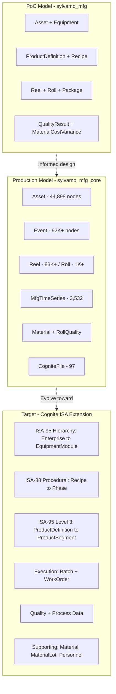
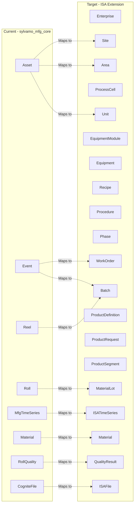
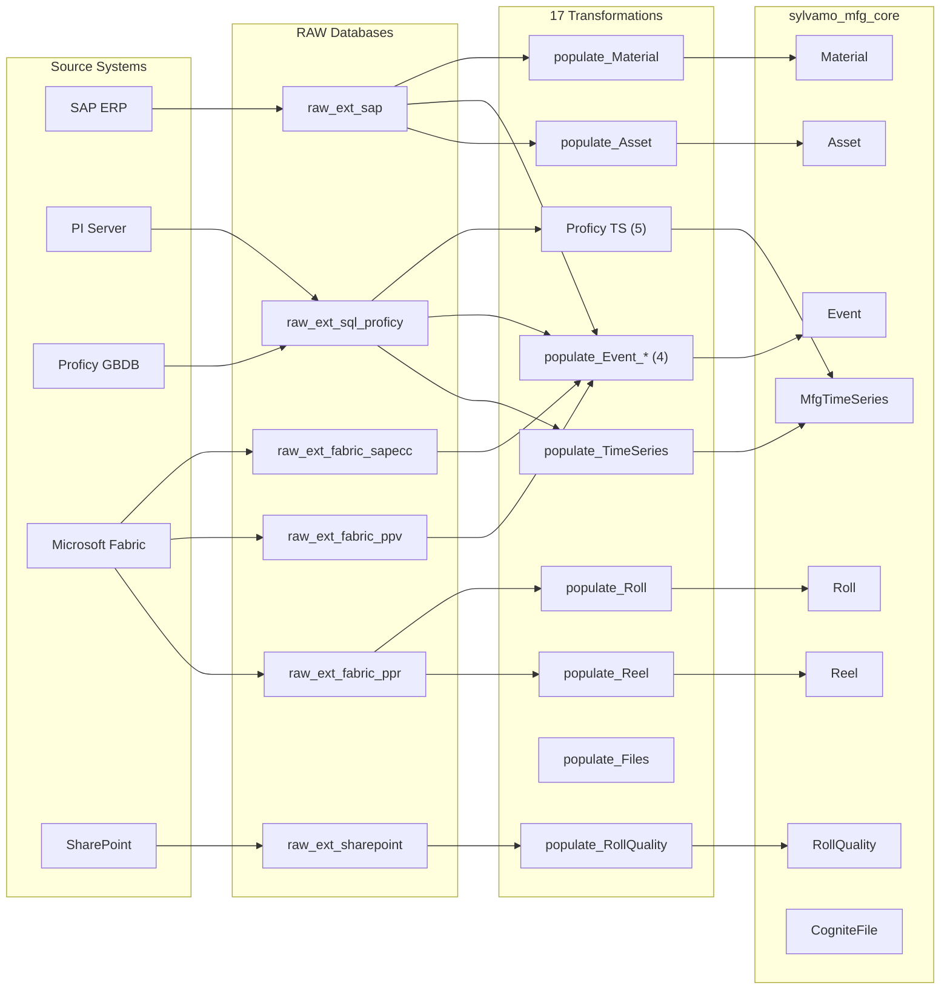
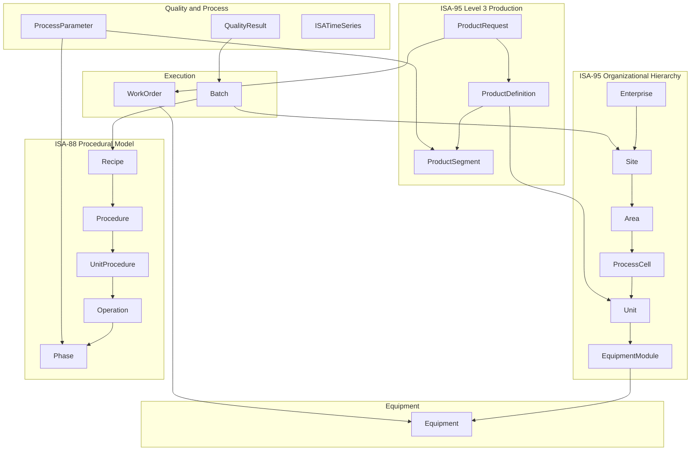
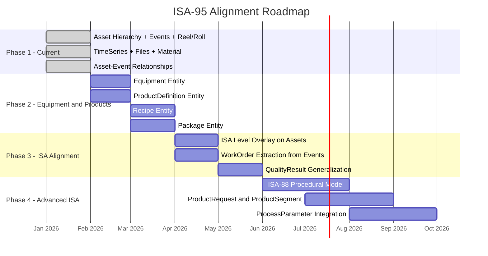

# Sylvamo Data Model: Architecture Decisions & ISA-95 Alignment Roadmap

> **Purpose:** Architecture decision document for Sylvamo stakeholder meeting  
> **Date:** February 2026  
> **Author:** Fernando Barsoba (Cognite)  
> **Status:** For Discussion

---

## Table of Contents

1. [Executive Summary](#1-executive-summary)
2. [Current State: Three Model Layers](#2-current-state-three-model-layers)
3. [Architecture Decisions Made](#3-architecture-decisions-made)
4. [Entity Comparison: Current vs ISA-95 Target](#4-entity-comparison-current-vs-isa-95-target)
5. [sylvamo_mfg_core: What's Deployed Today](#5-sylvamo_mfg_core-whats-deployed-today)
6. [Cognite ISA Manufacturing Extension: The Target Framework](#6-cognite-isa-manufacturing-extension-the-target-framework)
7. [Alignment Analysis: Core Model vs ISA Extension](#7-alignment-analysis-core-model-vs-isa-extension)
8. [Roadmap: Path to Full ISA-95 Alignment](#8-roadmap-path-to-full-isa-95-alignment)
9. [Impact Assessment](#9-impact-assessment)
10. [Recommendations](#10-recommendations)

---

## 1. Executive Summary

Sylvamo's CDF implementation has evolved through three stages:

1. **PoC Model** (`sylvamo_mfg`) - ISA-aligned schema with sample data (9 entities, 197 nodes)
2. **Production Model** (`sylvamo_mfg_core`) - CDM-integrated model with real production data (8 entities, 450K+ nodes)
3. **Target Framework** (Cognite ISA Manufacturing Extension) - Full ISA-95/ISA-88 reference model (25+ entities)

The **production model** (`sylvamo_mfg_core`) is what runs today with 44,898 assets, 92K+ events, 83K+ reels, and 3,500+ time series from real source systems (SAP, PI, Proficy, Fabric, SharePoint).

**Key question for this meeting:** How do we evolve `sylvamo_mfg_core` toward full ISA-95 alignment while preserving the operational data and CDM integration already in place?

---

## 2. Current State: Three Model Layers

### Model Comparison

| Dimension | PoC (`sylvamo_mfg`) | Production (`sylvamo_mfg_core`) | ISA Extension |
|-----------|---------------------|----------------------------------|---------------|
| **Space** | `sylvamo_mfg` | `sylvamo_mfg_core_schema` + `_instances` | `sp_isa_manufacturing` + `sp_isa_instance` |
| **Entities** | 9 views | 8 views (7 custom + CogniteFile) | 25+ views |
| **Real Data** | 197 sample nodes | 450,000+ production nodes | Seed data only |
| **CDM Integration** | Partial | Full (CogniteAsset, CogniteTimeSeries, CogniteActivity) | Full |
| **Transformations** | None | 17 active transformations | Template transformations |
| **Source Systems** | Manual | SAP, PI, Proficy, Fabric, SharePoint | RAW seed CSVs |
| **Location Filter** | Yes | Yes | Yes (EDM + SLM) |
| **Toolkit Managed** | No | Yes (`cdf build` / `cdf deploy`) | Yes |

---

## 3. Architecture Decisions Made

### ADR-1: CDM Asset + Equipment Instead of ISA Organizational Hierarchy

**Decision:** Use CDM `CogniteAsset` for organizational hierarchy instead of ISA-95 Site/Area/ProcessCell/Unit.

**Rationale (per Johan Stabekk, Cognite ISA Expert, Jan 28, 2026):**
- Avoids over-complication for current use cases
- Leverages out-of-the-box CDM capabilities (Search, Canvas, InField)
- Asset hierarchy built from SAP functional locations (44,898 nodes, 9 levels deep)
- CDF location filter works natively with CogniteAsset

**Implication:** When moving to full ISA-95, the Asset hierarchy will be **overlaid** with ISA-95 level annotations (Site, Area, ProcessCell, Unit) rather than replaced.

### ADR-2: Unified Event Entity

**Decision:** Single `Event` entity (implementing `CogniteActivity`) for all event types instead of separate entities per event type.

**Rationale:**
- Simplifies Search experience (all events in one place)
- `eventType` property distinguishes: WorkOrder, ProductionOrder, ProductionEvent, CostEvent
- `eventSubtype` provides further classification
- Direct relations to Asset, Reel, Roll for navigation

**Current event sources:**

| Event Type | Source | Count |
|------------|--------|-------|
| WorkOrder | SAP (via Fabric) | ~223 |
| ProductionOrder | SAP | ~50,000 |
| ProductionEvent | Proficy | ~61 |
| CostEvent | Fabric PPV | ~716 |

### ADR-3: Reel = ISA Batch, Roll = ISA MaterialLot

**Decision:** Paper-manufacturing naming aligned with ISA concepts.

| Sylvamo Entity | ISA-95 Concept | Description |
|----------------|----------------|-------------|
| **Reel** | Batch | Paper reel produced on a machine |
| **Roll** | MaterialLot | Paper roll cut from a reel |

### ADR-4: Schema/Instance Space Separation

**Decision:** Separate spaces for schema (`sylvamo_mfg_core_schema`) and instances (`sylvamo_mfg_core_instances`).

**Rationale:**
- Matches Cognite ISA Extension pattern
- Cleaner access control
- Schema changes don't affect instance space permissions

### ADR-5: MfgTimeSeries with `timeseries` Property Type

**Decision:** Use the CDF `timeseries` property type to link data model nodes to classic CDF Time Series resources.

**Rationale:**
- Enables preview/sparkline in CDF UI
- Links to existing PI extractor time series without data duplication

**Limitation:** Classic time series created before data modeling cannot have `instance_id` set retroactively. Future PI extractor configuration should target data modeling directly.

---

## 4. Entity Comparison: Current vs ISA-95 Target

### Entity Mapping Table

| Current Entity | ISA-95 Equivalent | Alignment Status | Migration Notes |
|----------------|-------------------|------------------|-----------------|
| **Asset** (CogniteAsset) | Site, Area, ProcessCell, Unit | Partial - needs ISA level overlay | Asset hierarchy stays; add `isaLevel` property or ISA views |
| **Event** (CogniteActivity) | WorkOrder, Batch (execution) | Partial - unified vs separate | May split into WorkOrder + Batch or keep unified |
| **Reel** | Batch | Aligned | Add ISA Batch properties (recipe link, phases) |
| **Roll** | MaterialLot | Aligned | Rename or create MaterialLot view on same container |
| **MfgTimeSeries** | ISATimeSeries | Aligned | Add equipment/phase links |
| **Material** | Material | Aligned | Already matches ISA Material |
| **RollQuality** | QualityResult | Aligned | Generalize to QualityResult |
| **CogniteFile** | ISAFile | Aligned | Add ISA entity links |
| -- | Equipment | Not implemented | Create from Asset subtree or SAP equipment master |
| -- | Recipe (ISA-88) | Not implemented | Exists in PoC, needs production data |
| -- | ProductDefinition | Not implemented | Exists in PoC, needs production data |
| -- | ProductRequest | Not implemented | Future |
| -- | ProductSegment | Not implemented | Future |
| -- | Procedure/Phase | Not implemented | Future (ISA-88 batch control) |
| -- | Personnel | Not implemented | Future |

---

## 5. sylvamo_mfg_core: What's Deployed Today

### Data Model Composition

| View | Container | CDM Interface | Nodes | Source |
|------|-----------|---------------|-------|--------|
| **Asset** | MfgAsset | CogniteAsset, CogniteDescribable, CogniteSourceable | 44,898 | SAP `raw_ext_sap.sap_floc_eastover` + `sap_floc_sumter` |
| **MfgTimeSeries** | MfgTimeSeries | CogniteTimeSeries, CogniteDescribable, CogniteSourceable | 3,532 | `_cdf.timeseries` (PI Extractor) |
| **Event** | MfgEvent | CogniteActivity, CogniteDescribable, CogniteSourceable | 92K+ | SAP, Proficy, Fabric |
| **Reel** | MfgReel | CogniteDescribable, CogniteSourceable | 83,600+ | `raw_ext_fabric_ppr.ppr_hist_reel` |
| **Roll** | MfgRoll | CogniteDescribable, CogniteSourceable | 1,000+ | `raw_ext_fabric_ppr.ppr_hist_roll` |
| **Material** | Material | CogniteDescribable, CogniteSourceable | TBD | `raw_ext_sap.materials` |
| **RollQuality** | RollQuality | CogniteDescribable, CogniteSourceable | TBD | `raw_ext_sharepoint.roll_quality` |
| **CogniteFile** | (CDM) | CogniteDescribable, CogniteSourceable | 97 | `_cdf.files` |

### Transformation Pipeline

### Asset Hierarchy Structure

| Level | ISA-95 Equivalent | Count | Example |
|-------|-------------------|-------|---------|
| 1 (Root) | Site | 1 | Eastover Mill (0769) |
| 2 | Area | 12 | Bleaching Systems, Paper Machines |
| 3 | ProcessCell | 108 | Bleach Stock Storage, PM1 Systems |
| 4-5 | Unit | 3,118 | Individual process units |
| 6+ | Equipment | 41,659 | Equipment items |

---

## 6. Cognite ISA Manufacturing Extension: The Target Framework

The Cognite ISA Manufacturing Extension is the official reference model maintained at [cognitedata/library](https://github.com/cognitedata/library/tree/main/modules/models/isa_manufacturing_extension).

### ISA-95/ISA-88 Entity Architecture

### Key ISA Entities Not Yet in sylvamo_mfg_core

| Entity | ISA Standard | Purpose | Priority for Sylvamo |
|--------|-------------|---------|---------------------|
| **Equipment** | CDM + ISA | Physical machines (PM1, PM2, Winders) | High - needed for equipment-centric views |
| **Recipe** | ISA-88 | Production recipes with target parameters | High - exists in PoC |
| **ProductDefinition** | ISA-95 L3 | Paper grade specifications | High - exists in PoC |
| **WorkOrder** | ISA-95 L3 | Currently embedded in Event entity | Medium - may extract from Event |
| **Batch** (explicit) | ISA-88 | Currently mapped to Reel | Low - Reel serves this purpose |
| **ProductRequest** | ISA-95 L3 | Production orders | Low - future |
| **ProductSegment** | ISA-95 L3 | Production steps | Low - future |
| **Procedure/Phase** | ISA-88 | Batch procedural control | Low - future |
| **Personnel** | Supporting | Operator assignment | Low - future |

---

## 7. Alignment Analysis: Core Model vs ISA Extension

### What Already Aligns

| Aspect | sylvamo_mfg_core | ISA Extension | Status |
|--------|------------------|---------------|--------|
| Asset hierarchy (CDM) | CogniteAsset with parent/children | ISAAsset + ISA levels | Aligned (different approach, same outcome) |
| Time Series (CDM) | CogniteTimeSeries | ISATimeSeries | Aligned |
| Events / Activities (CDM) | CogniteActivity | WorkOrder, Batch | Aligned (unified vs. split) |
| Reel = Batch | MfgReel | Batch | Aligned (ISA naming) |
| Roll = MaterialLot | MfgRoll | MaterialLot | Aligned (ISA naming) |
| Material | Material | Material | Aligned |
| Quality | RollQuality | QualityResult | Aligned (paper-specific naming) |
| Files | CogniteFile | ISAFile | Aligned |
| CDM interfaces | Full implementation | Full implementation | Aligned |
| Space separation | schema + instance spaces | schema + instance spaces | Aligned |
| Toolkit deployment | `cdf build` / `cdf deploy` | Same | Aligned |

### What Needs to Change

| Gap | Current State | ISA Target | Effort | Priority |
|-----|---------------|------------|--------|----------|
| **Equipment entity** | Not separate (embedded in Asset tree) | Dedicated Equipment view | Medium | High |
| **Recipe entity** | Not in core (exists in PoC) | Recipe with ISA-88 types | Medium | High |
| **ProductDefinition** | Not in core (exists in PoC) | ISA-95 L3 product specs | Medium | High |
| **ISA level annotations** | Asset.assetType (Site, Area, Unit, Equipment) | Formal ISA hierarchy levels | Low | Medium |
| **WorkOrder extraction** | Part of Event entity | Dedicated WorkOrder view | Medium | Medium |
| **Package entity** | Not in core (exists in PoC) | Sylvamo extension | Low | Medium |
| **ProcessParameter** | Not implemented | ISA-88 parameter definitions | High | Low |
| **Procedure/Phase** | Not implemented | ISA-88 procedural model | High | Low |
| **ProductRequest/Segment** | Not implemented | ISA-95 L3 production mgmt | High | Low |

---

## 8. Roadmap: Path to Full ISA-95 Alignment

### Phase Overview

### Phase 1: Foundation (COMPLETE)

**Status:** Done

- Asset hierarchy from SAP (44,898 nodes)
- Unified Event entity with 4 source systems
- Reel/Roll from Fabric PPR
- MfgTimeSeries from PI extractor
- Material from SAP
- RollQuality from SharePoint
- CogniteFile integration
- Asset-Event bidirectional navigation
- 17 transformations, location filter, toolkit deployment

### Phase 2: Equipment and Products (Next)

**Goal:** Add the three most impactful entities from the ISA model.

**Equipment Entity:**
- Extract from Asset hierarchy (assets where `assetType` = 'Equipment' or specific SAP equipment IDs)
- Or create as a separate view implementing `CogniteEquipment`
- Link to parent Asset, to Reel (produced by), to Event (occurred at)
- Source: SAP equipment master (`raw_ext_sap`)

**ProductDefinition Entity:**
- Paper grade specifications (Bond 20lb, Offset 50lb, etc.)
- Properties: productCode, basisWeight, caliper, brightness, moisture targets
- Link to Reel (product produced), to Recipe (how to produce)
- Source: SAP material master or manual definition

**Recipe Entity (ISA-88):**
- Production recipes with target parameters
- Types: general, site, master, control (per ISA-88)
- Link to ProductDefinition, to Equipment
- Source: Manual definition initially, then from process historian

### Phase 3: ISA Level Overlay

**Goal:** Annotate the existing Asset hierarchy with ISA-95 organizational levels.

**Approach:**
- Add `isaLevel` property to MfgAsset container (or create overlay views)
- Map existing `assetType` values: Site, Area, ProcessCell, Unit, Equipment
- Create ISA-specific views (SiteView, AreaView, UnitView) that filter on `isaLevel`
- Existing Asset hierarchy and data remain unchanged

**WorkOrder Extraction:**
- Currently WorkOrders are Event nodes with `eventType = 'WorkOrder'`
- Create dedicated WorkOrder view (or ISA-compatible view) over same data
- Add WorkOrder-specific properties (priority, status, assignee)

### Phase 4: Advanced ISA-88/95

**Goal:** Full procedural and production management alignment.

- ISA-88 procedural hierarchy (Recipe -> Procedure -> Phase)
- ISA-95 Level 3 production management (ProductRequest, ProductSegment)
- ProcessParameter definitions linked to Phases and ProductSegments
- Personnel entity for operator assignment

---

## 9. Impact Assessment

### What Stays the Same

- **Asset hierarchy** - No changes to existing 44,898 assets
- **Reel/Roll data** - Production data preserved
- **Event data** - All 92K+ events remain
- **Time Series** - PI data and links preserved
- **Transformations** - Existing 17 transformations continue to work
- **Location filter** - CDF Search experience unchanged
- **Toolkit deployment** - Same `cdf build` / `cdf deploy` workflow

### What Changes

| Change | Risk | Mitigation |
|--------|------|------------|
| New entities (Equipment, ProductDefinition, Recipe) | Low - additive | New containers/views, no existing data affected |
| ISA level overlay on Assets | Low - property addition | Add property to existing container, backfill via transformation |
| WorkOrder view extraction | Medium - view change | Create new view over existing Event data (no data migration) |
| RollQuality generalization | Medium - rename/restructure | Can create QualityResult as view alias over RollQuality container |

### Backward Compatibility

All changes in Phases 2-4 are **additive**. The existing `sylvamo_mfg_core` data model, transformations, and location filter continue to work. New entities and views are added alongside existing ones.

---

## 10. Recommendations

### For This Meeting

1. **Confirm Phase 2 scope** - Equipment, ProductDefinition, and Recipe are the highest-value additions
2. **Decide on Equipment approach** - Separate entity vs. view over existing Asset subtree
3. **Decide on Package** - Whether inter-plant tracking is needed for Sumpter operations
4. **Confirm ISA alignment timeline** - Phase 3 (ISA overlay) can happen in parallel with Phase 2

### Strategic Recommendations

1. **Keep the unified Event entity** - Splitting into WorkOrder + other types adds complexity without clear benefit today
2. **Use ISA Extension as reference, not template** - Deploy only the entities Sylvamo needs, not the full 25+ entity model
3. **Overlay ISA levels, don't rebuild** - The SAP functional location hierarchy is the source of truth; ISA levels annotate it
4. **Plan for multi-site** - When Sumpter and other plants come online, the ISA hierarchy (Enterprise -> Site) becomes important
5. **Configure PI extractor for data modeling** - Solve the time series preview limitation by configuring future ingestion to target data model nodes directly

---

## Appendix A: Cognite ISA Manufacturing Extension Entities

Full list of entities in the [Cognite ISA Manufacturing Extension](https://github.com/cognitedata/library/tree/main/modules/models/isa_manufacturing_extension):

| Category | Entities | CDM Interface |
|----------|----------|---------------|
| **ISA-95 Organizational** | Enterprise, Site, Area, ProcessCell, Unit, EquipmentModule | CogniteDescribable |
| **Equipment** | Equipment, ControlModule | CogniteDescribable |
| **ISA-88 Procedural** | Recipe, Procedure, UnitProcedure, Operation, Phase | CogniteDescribable |
| **ISA-95 Level 3** | ProductDefinition, ProductRequest, ProductSegment | CogniteDescribable |
| **Execution** | Batch (CogniteActivity), WorkOrder (CogniteActivity) | CogniteActivity |
| **Quality/Process** | QualityResult, ProcessParameter | CogniteDescribable |
| **Supporting** | Material, MaterialLot, Personnel, ISATimeSeries, ISAFile | Various |

## Appendix B: sylvamo_mfg_core Container Properties

### MfgAsset

| Property | Type | Description |
|----------|------|-------------|
| assetType | text | Site, Area, ProcessCell, Unit, Equipment |
| sapFunctionalLocation | text | SAP FLOC ID |
| plantCode | text | Plant code (0769) |
| workCenterCode | text | SAP Work Center |
| workCenterDescription | text | Work Center description |
| sortField | text | Sort field for ordering |
| mfgPath | text[] | Ordered path from root |
| mfgPathDepth | int32 | Hierarchy depth |
| mfgRootExternalId | text | Root asset external ID |

### MfgEvent

| Property | Type | Description |
|----------|------|-------------|
| eventType | text | WorkOrder, ProductionOrder, ProductionEvent, CostEvent |
| eventSubtype | text | Sub-classification |
| resultValue | float64 | Numeric result |
| resultText | text | Text result |
| unit | text | Unit of measure |
| isInSpec | boolean | In specification flag |
| sourceSystem | text | Source: SAP, Proficy, Fabric-PPV |
| sourceId | text | Source record ID |
| asset | direct | Related Asset |
| reel | direct | Related Reel |
| roll | direct | Related Roll |

### MfgReel

| Property | Type | Description |
|----------|------|-------------|
| reelNumber | text (required) | Reel identifier |
| productionDate | timestamp | Production date |
| weight / width / diameter | float64 | Physical dimensions |
| status | text | Production status |
| gradeCode | text | Paper grade |
| machineSpeed | float64 | Machine speed |
| avgBasisWeight / avgCaliper / avgMoisture | float64 | Quality averages |
| splices | int32 | Splice count |
| turnupTime | timestamp | Production start |
| runTimeInMin | float64 | Production duration |
| asset | direct | Related Asset |

### MfgRoll

| Property | Type | Description |
|----------|------|-------------|
| rollNumber | text (required) | Roll identifier |
| weight / width / diameter | float64 | Physical dimensions |
| status | text | Production status |
| qualityGrade | text | Quality grade |
| cutDate | timestamp | Cut date |
| basisWeight / caliper / moisture | float64 | Quality metrics |
| linearFootage | int32 | Linear footage |
| paperMachine / producingMachine | text | Machine identifiers |
| reel | direct | Parent Reel |

---

*Document generated: February 2026*
