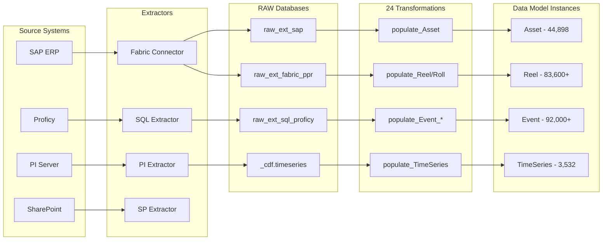

# Sylvamo Data Model: Architecture Decisions & ISA-95 Alignment Roadmap

> **Purpose:** Architecture decision document for Sylvamo stakeholder meeting  
> **Date:** February 2026  
> **Author:** Fernando Barsoba (Cognite)  
> **Status:** For Discussion  
> **Version:** 2.0

---

## Document Information

| Attribute | Value |
|-----------|-------|
| **Project** | Sylvamo CDF Implementation |
| **CDF Tenant** | cdf-production-cognite |
| **Data Model Space** | sylvamo_mfg_core_schema |
| **Instance Space** | sylvamo_mfg_core_instances |
| **Toolkit Config** | sylvamo/config.dev.yaml |
| **GitHub Repo** | [sylvamo-project-documentation](https://github.com/fbarsoba-cognite/sylvamo-project-documentation) |

### Related Documents

| Document | Description |
|----------|-------------|
| [TRANSFORMATIONS.md](TRANSFORMATIONS.md) | **Complete transformation documentation** - 24 SQL transformations, data flow, SQL examples |
| [APPENDIX_MFG_CORE_MODEL.md](APPENDIX_MFG_CORE_MODEL.md) | Complete GraphQL schema and Mermaid diagrams |
| [COGNITE_ISA_EXTENSION_AND_SYLVAMO_ALIGNMENT.md](COGNITE_ISA_EXTENSION_AND_SYLVAMO_ALIGNMENT.md) | Detailed ISA-95/88 alignment analysis |
| [JOHAN_ISA95_GUIDANCE_SUMMARY.md](JOHAN_ISA95_GUIDANCE_SUMMARY.md) | Expert recommendations from Cognite ISA specialist |
| [../extractors/EXTRACTORS.md](../extractors/EXTRACTORS.md) | Extractor configurations (Fabric, PI, SQL, SharePoint) |
| [ISA-95 Standard](https://www.isa.org/standards-and-publications/isa-standards/isa-standards-committees/isa95) | ISA-95 Enterprise-Control Integration |
| [ISA-88 Standard](https://www.isa.org/standards-and-publications/isa-standards/isa-standards-committees/isa88) | ISA-88 Batch Control |
| [Cognite ISA Extension](https://github.com/cognitedata/library/tree/main/modules/models/isa_manufacturing_extension) | Official Cognite reference model |

### Key Stakeholders

| Role | Name/Team | Interest |
|------|-----------|----------|
| **Sylvamo - IT Architecture** | TBD | Data model alignment with enterprise systems |
| **Sylvamo - Operations** | TBD | Usability of CDF applications (Search, InField) |
| **Sylvamo - Engineering** | TBD | Time series and equipment modeling |
| **Cognite - Solution Architect** | Fernando Barsoba | Overall architecture and ISA alignment |
| **Cognite - Data Engineer** | Juan Garcia | Extractors and transformations |
| **Cognite - ISA Expert** | Johan Stabekk | ISA-95/88 model guidance |

### Meeting Objectives

This document is prepared for the Sylvamo Architecture Meeting. The meeting objectives are:

1. **Review current state** - Validate understanding of `sylvamo_mfg_core` as deployed
2. **Confirm architecture decisions** - Get stakeholder buy-in on ADRs 1-10
3. **Align on Phase 2 scope** - Equipment, ProductDefinition, Recipe entities
4. **Discuss ISA-95 alignment timeline** - When to implement full ISA hierarchy
5. **Address multi-site requirements** - Sumpter integration timeline

### Decision Log

| Date | Decision | Outcome | Attendees |
|------|----------|---------|-----------|
| 2026-01-28 | Use CDM Asset instead of ISA hierarchy | Approved (Johan Stabekk) | Fernando, Johan |
| 2026-01-xx | Equipment as separate entity vs. view | TBD | Sylvamo meeting |
| 2026-01-xx | Package entity scope | TBD | Sylvamo meeting |
| 2026-01-xx | Phase 2 timeline | TBD | Sylvamo meeting |

---

## Table of Contents

1. [Executive Summary](#1-executive-summary)
2. [Current State: Three Model Layers](#2-current-state-three-model-layers)
3. [Architecture Decisions Made](#3-architecture-decisions-made)
4. [Entity Comparison: Current vs ISA-95 Target](#4-entity-comparison-current-vs-isa-95-target)
5. [sylvamo_mfg_core: What's Deployed Today](#5-sylvamo_mfg_core-whats-deployed-today)
6. [Cognite ISA Manufacturing Extension: The Target Framework](#6-cognite-isa-manufacturing-extension-the-target-framework)
7. [Alignment Analysis: Core Model vs ISA Extension](#7-alignment-analysis-core-model-vs-isa-extension)
8. [Roadmap: Path to Full ISA-95 Alignment](#8-roadmap-path-to-full-isa-95-alignment)
9. [Impact Assessment](#9-impact-assessment)
10. [Recommendations](#10-recommendations)

11. [Use Cases Enabled](#11-use-cases-enabled)
12. [Multi-Site Considerations](#12-multi-site-considerations)
13. [Technical Implementation Details](#13-technical-implementation-details)
14. [Data Quality and Governance](#14-data-quality-and-governance)
15. [Glossary](#15-glossary)

**Appendices:**
- [A: Cognite ISA Manufacturing Extension Entities](#appendix-a-cognite-isa-manufacturing-extension-entities)
- [B: sylvamo_mfg_core Container Properties](#appendix-b-sylvamo_mfg_core-container-properties)
- [C: CDM Interface Implementation](#appendix-c-cdm-interface-implementation)
- [D: Entity Relationship Diagram](#appendix-d-entity-relationship-diagram)
- [E: Toolkit Module Structure](#appendix-e-toolkit-module-structure)
- [F: Transformation Summary](#appendix-f-transformation-summary)
- [G: External ID Conventions](#appendix-g-external-id-conventions)
- [H: Data Lineage by Entity](#appendix-h-data-lineage-by-entity)

---

## 1. Executive Summary

Sylvamo's CDF implementation has evolved through three stages:

1. **PoC Model** (`sylvamo_mfg`) - ISA-aligned schema with sample data (9 entities, 197 nodes)
2. **Production Model** (`sylvamo_mfg_core`) - CDM-integrated model with real production data (8 entities, 450K+ nodes)
3. **Target Framework** (Cognite ISA Manufacturing Extension) - Full ISA-95/ISA-88 reference model (25+ entities)

The **production model** (`sylvamo_mfg_core`) is what runs today with 44,898 assets, 92K+ events, 83K+ reels, and 3,500+ time series from real source systems (SAP, PI, Proficy, Fabric, SharePoint).

**Key question for this meeting:** How do we evolve `sylvamo_mfg_core` toward full ISA-95 alignment while preserving the operational data and CDM integration already in place?

---

## 2. Current State: Three Model Layers


### Model Comparison

| Dimension | PoC (`sylvamo_mfg`) | Production (`sylvamo_mfg_core`) | ISA Extension |
|-----------|---------------------|----------------------------------|---------------|
| **Space** | `sylvamo_mfg` | `sylvamo_mfg_core_schema` + `_instances` | `sp_isa_manufacturing` + `sp_isa_instance` |
| **Entities** | 9 views | 7 views | 25+ views |
| **Real Data** | 197 sample nodes | 450,000+ production nodes | Seed data only |
| **CDM Integration** | Partial | Full (CogniteAsset, CogniteTimeSeries, CogniteActivity) | Full |
| **Transformations** | None | 17 active transformations | Template transformations |
| **Source Systems** | Manual | SAP, PI, Proficy, Fabric, SharePoint | RAW seed CSVs |
| **Location Filter** | Yes | Yes | Yes (EDM + SLM) |
| **Toolkit Managed** | No | Yes (`cdf build` / `cdf deploy`) | Yes |

---

## 3. Architecture Decisions Made

### ADR-1: CDM Asset + Equipment Instead of ISA Organizational Hierarchy

**Decision:** Use CDM `CogniteAsset` for organizational hierarchy instead of ISA-95 Site/Area/ProcessCell/Unit.

**Rationale (per Johan Stabekk, Cognite ISA Expert, Jan 28, 2026):**
- Avoids over-complication for current use cases
- Leverages out-of-the-box CDM capabilities (Search, Canvas, InField)
- Asset hierarchy built from SAP functional locations (44,898 nodes, 9 levels deep)
- CDF location filter works natively with CogniteAsset

**Implication:** When moving to full ISA-95, the Asset hierarchy will be **overlaid** with ISA-95 level annotations (Site, Area, ProcessCell, Unit) rather than replaced.

### ADR-2: Unified Event Entity

**Decision:** Single `Event` entity (implementing `CogniteActivity`) for all event types instead of separate entities per event type.

**Rationale:**
- Simplifies Search experience (all events in one place)
- `eventType` property distinguishes: WorkOrder, ProductionOrder, ProductionEvent, CostEvent
- `eventSubtype` provides further classification
- Direct relations to Asset, Reel, Roll for navigation

**Current event sources:**

| Event Type | Source | Count |
|------------|--------|-------|
| WorkOrder | SAP (via Fabric) | ~223 |
| ProductionOrder | SAP | ~50,000 |
| ProductionEvent | Proficy | ~61 |
| CostEvent | Fabric PPV | ~716 |

### ADR-3: Reel = ISA Batch, Roll = ISA MaterialLot

**Decision:** Paper-manufacturing naming aligned with ISA concepts.

| Sylvamo Entity | ISA-95 Concept | Description |
|----------------|----------------|-------------|
| **Reel** | Batch | Paper reel produced on a machine |
| **Roll** | MaterialLot | Paper roll cut from a reel |

### ADR-4: Schema/Instance Space Separation

**Decision:** Separate spaces for schema (`sylvamo_mfg_core_schema`) and instances (`sylvamo_mfg_core_instances`).

**Rationale:**
- Matches Cognite ISA Extension pattern
- Cleaner access control
- Schema changes don't affect instance space permissions

### ADR-5: MfgTimeSeries with `timeseries` Property Type

**Decision:** Use the CDF `timeseries` property type to link data model nodes to classic CDF Time Series resources.

**Rationale:**
- Enables preview/sparkline in CDF UI
- Links to existing PI extractor time series without data duplication

**Limitation:** Classic time series created before data modeling cannot have `instance_id` set retroactively. Future PI extractor configuration should target data modeling directly.

### ADR-6: Transformation-Based Data Population

**Decision:** Use CDF Transformations (SQL-based) for all data model population instead of direct SDK writes.

**Rationale:**
- Declarative approach - SQL defines mapping logic
- Built-in scheduling and monitoring
- Automatic retry and error handling
- Version controlled in toolkit YAML files
- Consistent with Cognite best practices

**Trade-off:** Less flexibility than SDK for complex logic, but simpler maintenance.

### ADR-7: RAW as Staging Layer

**Decision:** All source data flows through CDF RAW before transformation to data model.

**Rationale:**
- Preserves raw source data for auditing and debugging
- Decouples extraction from modeling
- Enables re-processing without re-extraction
- Supports data quality validation before modeling

**Pattern:**
```
Source → Extractor → RAW → Transformation → Data Model
```

### ADR-8: External ID Namespacing

**Decision:** All external IDs use a namespace prefix indicating the entity type.

**Rationale:**
- Prevents ID collisions across entity types
- Makes debugging and log analysis easier
- Self-documenting when viewing raw data
- Enables targeted data operations (delete by prefix)

**Examples:**
- `floc:0769-PM1` (Asset from SAP functional location)
- `reel:2024-001` (Reel from production system)
- `ts:PM1.TEMP.PV` (Time series from PI)

### ADR-9: Location Filter via EDM + SLM

**Decision:** Use Cognite's Enterprise Data Model (EDM) + Site Location Mapping (SLM) for location-based data scoping.

**Rationale:**
- Out-of-the-box CDF feature
- Works with CDF Search and all applications
- Simple configuration via toolkit
- Future-proof for multi-site expansion

**Configuration:** `mfg_location` module in toolkit.

### ADR-10: Toolkit Module Separation

**Decision:** Organize toolkit configuration into logical modules:

| Module | Purpose |
|--------|---------|
| `mfg_core` | Core manufacturing data model and transformations |
| `mfg_location` | Location filter configuration |
| `access_management` | Security groups and permissions |
| `admin` | Admin utilities and CI/CD datasets |
| `common` | Shared spaces and base configuration |
| `infield` | InField application configuration |

**Rationale:**
- Enables selective deployment (`cdf deploy --include mfg_core`)
- Clearer ownership and change tracking
- Aligns with team structure

---

## 4. Entity Comparison: Current vs ISA-95 Target


### Entity Mapping Table

| Current Entity | ISA-95 Equivalent | Alignment Status | Migration Notes |
|----------------|-------------------|------------------|-----------------|
| **Asset** (CogniteAsset) | Site, Area, ProcessCell, Unit | Partial - needs ISA level overlay | Asset hierarchy stays; add `isaLevel` property or ISA views |
| **Event** (CogniteActivity) | WorkOrder, Batch (execution) | Partial - unified vs separate | May split into WorkOrder + Batch or keep unified |
| **Reel** | Batch | Aligned | Add ISA Batch properties (recipe link, phases) |
| **Roll** | MaterialLot | Aligned | Rename or create MaterialLot view on same container |
| **MfgTimeSeries** | ISATimeSeries | Aligned | Add equipment/phase links |
| **Material** | Material | Aligned | Already matches ISA Material |
| **RollQuality** | QualityResult | Aligned | Generalize to QualityResult |
| **CogniteFile** | ISAFile | Aligned | Add ISA entity links |
| -- | Equipment | Not implemented | Create from Asset subtree or SAP equipment master |
| -- | Recipe (ISA-88) | Not implemented | Exists in PoC, needs production data |
| -- | ProductDefinition | Not implemented | Exists in PoC, needs production data |
| -- | ProductRequest | Not implemented | Future |
| -- | ProductSegment | Not implemented | Future |
| -- | Procedure/Phase | Not implemented | Future (ISA-88 batch control) |
| -- | Personnel | Not implemented | Future |

---

## 5. sylvamo_mfg_core: What's Deployed Today

### Data Model Composition

| View | Container | CDM Interface | Nodes | Source |
|------|-----------|---------------|-------|--------|
| **Asset** | MfgAsset | CogniteAsset, CogniteDescribable, CogniteSourceable | 44,898 | SAP `raw_ext_sap.sap_floc_eastover` + `sap_floc_sumter` |
| **MfgTimeSeries** | MfgTimeSeries | CogniteTimeSeries, CogniteDescribable, CogniteSourceable | 3,532 | `_cdf.timeseries` (PI Extractor) |
| **Event** | MfgEvent | CogniteActivity, CogniteDescribable, CogniteSourceable | 92K+ | SAP, Proficy, Fabric |
| **Reel** | MfgReel | CogniteDescribable, CogniteSourceable | 83,600+ | `raw_ext_fabric_ppr.ppr_hist_reel` |
| **Roll** | MfgRoll | CogniteDescribable, CogniteSourceable | 1,000+ | `raw_ext_fabric_ppr.ppr_hist_roll` |
| **Material** | Material | CogniteDescribable, CogniteSourceable | TBD | `raw_ext_sap.materials` |
| **RollQuality** | RollQuality | CogniteDescribable, CogniteSourceable | TBD | `raw_ext_sharepoint.roll_quality` |
| **CogniteFile** | (CDM) | CogniteDescribable, CogniteSourceable | 97 | `_cdf.files` |

### Transformation Pipeline


### Asset Hierarchy Structure

| Level | ISA-95 Equivalent | Count | Example |
|-------|-------------------|-------|---------|
| 1 (Root) | Site | 1 | Eastover Mill (0769) |
| 2 | Area | 12 | Bleaching Systems, Paper Machines |
| 3 | ProcessCell | 108 | Bleach Stock Storage, PM1 Systems |
| 4-5 | Unit | 3,118 | Individual process units |
| 6+ | Equipment | 41,659 | Equipment items |

---

## 6. Cognite ISA Manufacturing Extension: The Target Framework

The Cognite ISA Manufacturing Extension is the official reference model maintained at [cognitedata/library](https://github.com/cognitedata/library/tree/main/modules/models/isa_manufacturing_extension).

### ISA-95/ISA-88 Entity Architecture


### Key ISA Entities Not Yet in sylvamo_mfg_core

| Entity | ISA Standard | Purpose | Priority for Sylvamo |
|--------|-------------|---------|---------------------|
| **Equipment** | CDM + ISA | Physical machines (PM1, PM2, Winders) | High - needed for equipment-centric views |
| **Recipe** | ISA-88 | Production recipes with target parameters | High - exists in PoC |
| **ProductDefinition** | ISA-95 L3 | Paper grade specifications | High - exists in PoC |
| **WorkOrder** | ISA-95 L3 | Currently embedded in Event entity | Medium - may extract from Event |
| **Batch** (explicit) | ISA-88 | Currently mapped to Reel | Low - Reel serves this purpose |
| **ProductRequest** | ISA-95 L3 | Production orders | Low - future |
| **ProductSegment** | ISA-95 L3 | Production steps | Low - future |
| **Procedure/Phase** | ISA-88 | Batch procedural control | Low - future |
| **Personnel** | Supporting | Operator assignment | Low - future |

---

## 7. Alignment Analysis: Core Model vs ISA Extension

### What Already Aligns

| Aspect | sylvamo_mfg_core | ISA Extension | Status |
|--------|------------------|---------------|--------|
| Asset hierarchy (CDM) | CogniteAsset with parent/children | ISAAsset + ISA levels | Aligned (different approach, same outcome) |
| Time Series (CDM) | CogniteTimeSeries | ISATimeSeries | Aligned |
| Events / Activities (CDM) | CogniteActivity | WorkOrder, Batch | Aligned (unified vs. split) |
| Reel = Batch | MfgReel | Batch | Aligned (ISA naming) |
| Roll = MaterialLot | MfgRoll | MaterialLot | Aligned (ISA naming) |
| Material | Material | Material | Aligned |
| Quality | RollQuality | QualityResult | Aligned (paper-specific naming) |
| Files | CogniteFile | ISAFile | Aligned |
| CDM interfaces | Full implementation | Full implementation | Aligned |
| Space separation | schema + instance spaces | schema + instance spaces | Aligned |
| Toolkit deployment | `cdf build` / `cdf deploy` | Same | Aligned |

### What Needs to Change

| Gap | Current State | ISA Target | Effort | Priority |
|-----|---------------|------------|--------|----------|
| **Equipment entity** | Not separate (embedded in Asset tree) | Dedicated Equipment view | Medium | High |
| **Recipe entity** | Not in core (exists in PoC) | Recipe with ISA-88 types | Medium | High |
| **ProductDefinition** | Not in core (exists in PoC) | ISA-95 L3 product specs | Medium | High |
| **ISA level annotations** | Asset.assetType (Site, Area, Unit, Equipment) | Formal ISA hierarchy levels | Low | Medium |
| **WorkOrder extraction** | Part of Event entity | Dedicated WorkOrder view | Medium | Medium |
| **Package entity** | Not in core (exists in PoC) | Sylvamo extension | Low | Medium |
| **ProcessParameter** | Not implemented | ISA-88 parameter definitions | High | Low |
| **Procedure/Phase** | Not implemented | ISA-88 procedural model | High | Low |
| **ProductRequest/Segment** | Not implemented | ISA-95 L3 production mgmt | High | Low |

---

## 8. Roadmap: Path to Full ISA-95 Alignment

### Phase Overview


### Phase 1: Foundation (COMPLETE)

**Status:** Done

- Asset hierarchy from SAP (44,898 nodes)
- Unified Event entity with 4 source systems
- Reel/Roll from Fabric PPR
- MfgTimeSeries from PI extractor
- Material from SAP
- RollQuality from SharePoint
- CogniteFile integration
- Asset-Event bidirectional navigation
- 17 transformations, location filter, toolkit deployment

### Phase 2: Equipment and Products (Next)

**Goal:** Add the three most impactful entities from the ISA model.

**Equipment Entity:**
- Extract from Asset hierarchy (assets where `assetType` = 'Equipment' or specific SAP equipment IDs)
- Or create as a separate view implementing `CogniteEquipment`
- Link to parent Asset, to Reel (produced by), to Event (occurred at)
- Source: SAP equipment master (`raw_ext_sap`)

**ProductDefinition Entity:**
- Paper grade specifications (Bond 20lb, Offset 50lb, etc.)
- Properties: productCode, basisWeight, caliper, brightness, moisture targets
- Link to Reel (product produced), to Recipe (how to produce)
- Source: SAP material master or manual definition

**Recipe Entity (ISA-88):**
- Production recipes with target parameters
- Types: general, site, master, control (per ISA-88)
- Link to ProductDefinition, to Equipment
- Source: Manual definition initially, then from process historian

### Phase 3: ISA Level Overlay

**Goal:** Annotate the existing Asset hierarchy with ISA-95 organizational levels.

**Approach:**
- Add `isaLevel` property to MfgAsset container (or create overlay views)
- Map existing `assetType` values: Site, Area, ProcessCell, Unit, Equipment
- Create ISA-specific views (SiteView, AreaView, UnitView) that filter on `isaLevel`
- Existing Asset hierarchy and data remain unchanged

**WorkOrder Extraction:**
- Currently WorkOrders are Event nodes with `eventType = 'WorkOrder'`
- Create dedicated WorkOrder view (or ISA-compatible view) over same data
- Add WorkOrder-specific properties (priority, status, assignee)

### Phase 4: Advanced ISA-88/95

**Goal:** Full procedural and production management alignment.

- ISA-88 procedural hierarchy (Recipe -> Procedure -> Phase)
- ISA-95 Level 3 production management (ProductRequest, ProductSegment)
- ProcessParameter definitions linked to Phases and ProductSegments
- Personnel entity for operator assignment

---

## 9. Impact Assessment

### What Stays the Same

- **Asset hierarchy** - No changes to existing 44,898 assets
- **Reel/Roll data** - Production data preserved
- **Event data** - All 92K+ events remain
- **Time Series** - PI data and links preserved
- **Transformations** - Existing 17 transformations continue to work
- **Location filter** - CDF Search experience unchanged
- **Toolkit deployment** - Same `cdf build` / `cdf deploy` workflow

### What Changes

| Change | Risk | Mitigation |
|--------|------|------------|
| New entities (Equipment, ProductDefinition, Recipe) | Low - additive | New containers/views, no existing data affected |
| ISA level overlay on Assets | Low - property addition | Add property to existing container, backfill via transformation |
| WorkOrder view extraction | Medium - view change | Create new view over existing Event data (no data migration) |
| RollQuality generalization | Medium - rename/restructure | Can create QualityResult as view alias over RollQuality container |

### Backward Compatibility

All changes in Phases 2-4 are **additive**. The existing `sylvamo_mfg_core` data model, transformations, and location filter continue to work. New entities and views are added alongside existing ones.

---

## 10. Recommendations

### For This Meeting

1. **Confirm Phase 2 scope** - Equipment, ProductDefinition, and Recipe are the highest-value additions
2. **Decide on Equipment approach** - Separate entity vs. view over existing Asset subtree
3. **Decide on Package** - Whether inter-plant tracking is needed for Sumpter operations
4. **Confirm ISA alignment timeline** - Phase 3 (ISA overlay) can happen in parallel with Phase 2

### Strategic Recommendations

1. **Keep the unified Event entity** - Splitting into WorkOrder + other types adds complexity without clear benefit today
2. **Use ISA Extension as reference, not template** - Deploy only the entities Sylvamo needs, not the full 25+ entity model
3. **Overlay ISA levels, don't rebuild** - The SAP functional location hierarchy is the source of truth; ISA levels annotate it
4. **Plan for multi-site** - When Sumpter and other plants come online, the ISA hierarchy (Enterprise -> Site) becomes important
5. **Configure PI extractor for data modeling** - Solve the time series preview limitation by configuring future ingestion to target data model nodes directly

---

## 11. Use Cases Enabled

The current `sylvamo_mfg_core` model enables the following use cases:

### UC1: Asset-Centric Search Experience

**Scenario:** Operator searches for "PM1" and sees all related data.


**Enabled by:** Asset hierarchy with `CogniteAsset`, reverse relations to TimeSeries, Events, Files.

### UC2: Production Traceability

**Scenario:** Trace a roll back to its production reel and quality tests.


**Enabled by:** Roll → Reel → Asset relationships, RollQuality entity.

### UC3: Event Analysis by Asset

**Scenario:** Analyze all work orders and production events for a specific area.

| Query | Result |
|-------|--------|
| Events for Bleaching Systems | 5,000+ work orders, production events |
| Events by type for PM1 | Work orders, downtime events, quality events |
| Cost events for Eastover | PPV analysis, material cost variance |

**Enabled by:** Unified Event entity with `eventType`, Asset relationship.

### UC4: Time Series Analysis

**Scenario:** View process data trends for paper machine operations.

| Capability | Status |
|------------|--------|
| Browse time series by asset | Enabled |
| View sparkline preview | Enabled (with `timeseries` property) |
| Correlate with production events | Enabled via Asset relationship |

**Enabled by:** MfgTimeSeries with `timeseries` property type linking to classic CDF Time Series.

### UC5: Quality Management (Future - Phase 2)

**Scenario:** Track quality metrics against product specifications.

| Required Entity | Status |
|-----------------|--------|
| ProductDefinition | Phase 2 |
| Recipe with target parameters | Phase 2 |
| QualityResult linked to ProductDefinition | Phase 3 |

### UC6: Inter-Plant Traceability (Future - Phase 2/3)

**Scenario:** Track paper from Eastover production to Sumpter finishing.

| Required Entity | Status |
|-----------------|--------|
| Package entity | Phase 2 |
| Multi-site Asset hierarchy | Phase 3 |

---

## 12. Multi-Site Considerations

### Current State: Single Site (Eastover)


- 44,898 assets in hierarchy
- All transformations source Eastover data
- Location filter scoped to Eastover

### Future State: Multi-Site (Eastover + Sumpter)


### ISA-95 Enterprise Hierarchy

| Level | Current | Multi-Site |
|-------|---------|------------|
| Enterprise | Not needed | Sylvamo Corporation |
| Site | Eastover Mill | Eastover, Sumpter |
| Area | 12 areas | Per-site areas |
| ProcessCell | 108 cells | Per-site cells |
| Unit | 3,118 units | Per-site units |
| Equipment | 41,659 items | Per-site equipment |

### Multi-Site Implementation Approach

1. **Add Enterprise root node** (optional - only if needed for reporting)
2. **Ingest Sumpter functional locations** from SAP
3. **Create site-scoped location filters** for each plant
4. **Implement Package entity** for inter-plant transfers
5. **Update transformations** to include Sumpter source tables

### Data Considerations

| Aspect | Eastover | Sumpter | Notes |
|--------|----------|---------|-------|
| SAP Plant Code | 0769 | TBD | Different plant codes |
| Functional Locations | sap_floc_eastover | sap_floc_sumter | Already have table |
| PI Server | Eastover PI | Sumpter PI? | May need separate extractor |
| Proficy | Eastover GBDB | Sumpter GBDB? | May need separate instance |

---

## 13. Technical Implementation Details

### Phase 2 Implementation Guide

#### Equipment Entity

**Container Definition:**

```yaml
# MfgEquipment.Container.yaml
externalId: MfgEquipment
usedFor: node
properties:
  equipmentClass:
    name: Equipment Class
    type:
      type: text
    nullable: true
    description: PaperMachine, Winder, Sheeter, Boiler, Pump
  manufacturer:
    name: Manufacturer
    type:
      type: text
    nullable: true
  model:
    name: Model
    type:
      type: text
    nullable: true
  serialNumber:
    name: Serial Number
    type:
      type: text
    nullable: true
  installDate:
    name: Installation Date
    type:
      type: timestamp
    nullable: true
  parentAsset:
    name: Parent Asset
    type:
      type: direct
      container:
        space: "{{ mfgCoreSchemaSpace }}"
        externalId: MfgAsset
    nullable: true
```

**View Definition:**

```yaml
# Equipment.View.yaml
externalId: Equipment
implements:
  - space: cdf_cdm
    externalId: CogniteEquipment
    version: v1
properties:
  equipmentClass:
    container:
      space: "{{ mfgCoreSchemaSpace }}"
      externalId: MfgEquipment
    containerPropertyIdentifier: equipmentClass
  # ... other properties
```

**Transformation SQL:**

```sql
-- populate_Equipment.Transformation.sql
SELECT
    concat('eq:', `equipment_id`) as externalId,
    '{{ mfgCoreInstanceSpace }}' as space,
    `description` as name,
    `equipment_type` as equipmentClass,
    `manufacturer` as manufacturer,
    `model` as model,
    `serial_number` as serialNumber,
    to_timestamp(`install_date`) as installDate,
    node_reference('{{ mfgCoreInstanceSpace }}', 
        concat('floc:', `functional_location`)) as parentAsset
FROM `raw_ext_sap`.`equipment_master`
WHERE `equipment_id` IS NOT NULL
```

#### ProductDefinition Entity

**Container Definition:**

```yaml
# ProductDefinition.Container.yaml
externalId: ProductDefinition
usedFor: node
properties:
  productCode:
    name: Product Code
    type:
      type: text
    nullable: false
  productType:
    name: Product Type
    type:
      type: text
    nullable: true
    description: Bond, Offset, Cover, Specialty
  basisWeight:
    name: Basis Weight
    type:
      type: float64
    nullable: true
    description: Target basis weight (lb/ream)
  caliper:
    name: Caliper
    type:
      type: float64
    nullable: true
    description: Target caliper (mils)
  brightness:
    name: Brightness
    type:
      type: float64
    nullable: true
    description: Target brightness (%)
  moistureTarget:
    name: Moisture Target
    type:
      type: float64
    nullable: true
    description: Target moisture (%)
```

#### Recipe Entity (ISA-88)

**Container Definition:**

```yaml
# Recipe.Container.yaml
externalId: Recipe
usedFor: node
properties:
  recipeType:
    name: Recipe Type
    type:
      type: text
    nullable: true
    description: general, site, master, control
  version:
    name: Version
    type:
      type: text
    nullable: true
  targetParameters:
    name: Target Parameters
    type:
      type: json
    nullable: true
    description: JSON object with target process parameters
  productDefinition:
    name: Product Definition
    type:
      type: direct
      container:
        space: "{{ mfgCoreSchemaSpace }}"
        externalId: ProductDefinition
    nullable: true
  equipment:
    name: Equipment
    type:
      type: direct
      container:
        space: "{{ mfgCoreSchemaSpace }}"
        externalId: MfgEquipment
    nullable: true
```

### Toolkit Deployment Commands

```bash
# Build and validate
cd sylvamo
cdf build --env dev

# Dry run to see changes
cdf deploy --env dev --dry-run

# Deploy to dev
cdf deploy --env dev

# Deploy specific modules
cdf deploy --env dev --include mfg_core --include mfg_extended
```

---

## 14. Data Quality and Governance

### Data Quality Rules

| Entity | Rule | Validation |
|--------|------|------------|
| Asset | `externalId` must start with `floc:` | Transformation SQL |
| Asset | `sapFunctionalLocation` must not be null | Container constraint |
| Reel | `reelNumber` must be unique | Container uniqueness constraint |
| Roll | `rollNumber` must be unique | Container uniqueness constraint |
| Event | `eventType` must be in allowed values | Transformation SQL CASE |
| Event | `startTime` should be before `endTime` | Transformation SQL validation |

### External ID Conventions

| Entity | Pattern | Example |
|--------|---------|---------|
| Asset | `floc:{functional_location}` | `floc:0769-PM1-DRYER` |
| Reel | `reel:{reel_number}_{year}` | `reel:2024-001-PM1_2024` |
| Roll | `roll:{roll_number}` | `roll:R-12345-001` |
| Event | `{source}-event:{id}` | `proficy-event:EVT001` |
| Material | `mat:{material_number}` | `mat:100012345` |
| Equipment | `eq:{equipment_id}` | `eq:EQ-PM1-001` |
| TimeSeries | `ts:{pi_tag}` or `proficy:ts_{tag}` | `ts:PI.PM1.SPEED` |
| File | `dm:{original_id}` | `dm:file-12345` |

### Data Refresh Schedule

| Transformation | Schedule | Notes |
|----------------|----------|-------|
| populate_Asset | Daily 2:00 AM | SAP hierarchy rarely changes |
| populate_Reel | Hourly | Production data |
| populate_Roll | Hourly | Production data |
| populate_Event_* | Every 15 min | Near real-time events |
| populate_TimeSeries | On PI extractor run | Triggered by extractor |
| populate_Material | Weekly | Master data |
| populate_RollQuality | Daily | SharePoint sync |

### Access Control

| Group | Permissions | Scope |
|-------|-------------|-------|
| sylvamo-mfg-admin | Full CRUD | All entities |
| sylvamo-mfg-operator | Read + limited write | Production data |
| sylvamo-mfg-analyst | Read only | All entities |
| sylvamo-mfg-extractor | Write only | RAW + transformations |

---

## 15. Glossary

### ISA-95 Terms

| Term | Definition | Sylvamo Mapping |
|------|------------|-----------------|
| **Enterprise** | Top level of organizational hierarchy | Not implemented (single company) |
| **Site** | Physical production facility | Asset (assetType=Site) - Eastover Mill |
| **Area** | Major functional area within a site | Asset (assetType=Area) - Bleaching, Paper Machines |
| **ProcessCell** | Group of units performing a complete process | Asset (assetType=ProcessCell) |
| **Unit** | Equipment that performs a major processing activity | Asset (assetType=Unit) |
| **EquipmentModule** | Physical equipment at lowest level | Asset (assetType=Equipment) |
| **ProductDefinition** | Specification for a product type | Future - Phase 2 |
| **ProductRequest** | Request to produce a quantity of product | Future - Phase 4 |
| **ProductSegment** | Step in production process | Future - Phase 4 |
| **WorkOrder** | Authorization to perform work | Event (eventType=WorkOrder) |

### ISA-88 Terms

| Term | Definition | Sylvamo Mapping |
|------|------------|-----------------|
| **Batch** | Material being processed as a unit | Reel |
| **Recipe** | Complete set of instructions for making a product | Future - Phase 2 |
| **Procedure** | Strategy for making a batch | Future - Phase 4 |
| **UnitProcedure** | Procedure executed on a single unit | Future - Phase 4 |
| **Operation** | Major processing action | Future - Phase 4 |
| **Phase** | Smallest element of procedural control | Future - Phase 4 |
| **ControlModule** | Equipment entity for control | Not planned |

### Cognite CDM Terms

| Term | Definition | Usage |
|------|------------|-------|
| **CogniteAsset** | CDM interface for hierarchical assets | Asset view implements this |
| **CogniteActivity** | CDM interface for time-bounded activities | Event view implements this |
| **CogniteTimeSeries** | CDM interface for time series data | MfgTimeSeries implements this |
| **CogniteDescribable** | Base interface with name, description | All views implement this |
| **CogniteSourceable** | Interface for source system tracking | All views implement this |
| **CogniteFile** | CDM view for file entities | Used directly |
| **CogniteEquipment** | CDM interface for equipment | Equipment view (Phase 2) |

### Sylvamo-Specific Terms

| Term | Definition |
|------|------------|
| **Reel** | Paper reel produced on a paper machine (= ISA Batch) |
| **Roll** | Paper roll cut from a reel for customer delivery (= ISA MaterialLot) |
| **PM1/PM2** | Paper Machine 1 and 2 at Eastover |
| **Winder** | Equipment that winds paper into rolls |
| **Sheeter** | Equipment that cuts paper into sheets |
| **FLOC** | SAP Functional Location - hierarchical asset identifier |
| **PPR** | Paper Production Reporting system (via Fabric) |
| **PPV** | Purchase Price Variance - cost tracking |
| **Proficy** | GE Proficy process historian database |

---

## Appendix A: Cognite ISA Manufacturing Extension Entities

Full list of entities in the [Cognite ISA Manufacturing Extension](https://github.com/cognitedata/library/tree/main/modules/models/isa_manufacturing_extension):

| Category | Entities | CDM Interface |
|----------|----------|---------------|
| **ISA-95 Organizational** | Enterprise, Site, Area, ProcessCell, Unit, EquipmentModule | CogniteDescribable |
| **Equipment** | Equipment, ControlModule | CogniteDescribable |
| **ISA-88 Procedural** | Recipe, Procedure, UnitProcedure, Operation, Phase | CogniteDescribable |
| **ISA-95 Level 3** | ProductDefinition, ProductRequest, ProductSegment | CogniteDescribable |
| **Execution** | Batch (CogniteActivity), WorkOrder (CogniteActivity) | CogniteActivity |
| **Quality/Process** | QualityResult, ProcessParameter | CogniteDescribable |
| **Supporting** | Material, MaterialLot, Personnel, ISATimeSeries, ISAFile | Various |

## Appendix B: sylvamo_mfg_core Container Properties

### MfgAsset

| Property | Type | Description |
|----------|------|-------------|
| assetType | text | Site, Area, ProcessCell, Unit, Equipment |
| sapFunctionalLocation | text | SAP FLOC ID |
| plantCode | text | Plant code (0769) |
| workCenterCode | text | SAP Work Center |
| workCenterDescription | text | Work Center description |
| sortField | text | Sort field for ordering |
| mfgPath | text[] | Ordered path from root |
| mfgPathDepth | int32 | Hierarchy depth |
| mfgRootExternalId | text | Root asset external ID |

### MfgEvent

| Property | Type | Description |
|----------|------|-------------|
| eventType | text | WorkOrder, ProductionOrder, ProductionEvent, CostEvent |
| eventSubtype | text | Sub-classification |
| resultValue | float64 | Numeric result |
| resultText | text | Text result |
| unit | text | Unit of measure |
| isInSpec | boolean | In specification flag |
| sourceSystem | text | Source: SAP, Proficy, Fabric-PPV |
| sourceId | text | Source record ID |
| asset | direct | Related Asset |
| reel | direct | Related Reel |
| roll | direct | Related Roll |

### MfgReel

| Property | Type | Description |
|----------|------|-------------|
| reelNumber | text (required) | Reel identifier |
| productionDate | timestamp | Production date |
| weight / width / diameter | float64 | Physical dimensions |
| status | text | Production status |
| gradeCode | text | Paper grade |
| machineSpeed | float64 | Machine speed |
| avgBasisWeight / avgCaliper / avgMoisture | float64 | Quality averages |
| splices | int32 | Splice count |
| turnupTime | timestamp | Production start |
| runTimeInMin | float64 | Production duration |
| asset | direct | Related Asset |

### MfgRoll

| Property | Type | Description |
|----------|------|-------------|
| rollNumber | text (required) | Roll identifier |
| weight / width / diameter | float64 | Physical dimensions |
| status | text | Production status |
| qualityGrade | text | Quality grade |
| cutDate | timestamp | Cut date |
| basisWeight / caliper / moisture | float64 | Quality metrics |
| linearFootage | int32 | Linear footage |
| paperMachine / producingMachine | text | Machine identifiers |
| reel | direct | Parent Reel |

---

## Appendix C: CDM Interface Implementation


---

## Appendix D: Entity Relationship Diagram


---

## Appendix E: Toolkit Module Structure

```
sylvamo/modules/
├── mfg_core/              # Core manufacturing model (deployed)
│   ├── data_modeling/
│   │   ├── containers/    # 7 containers
│   │   ├── views/         # 7 views
│   │   └── data_models/
│   └── transformations/   # 17 transformations
├── mfg_extended/          # Extended model (planned - Phase 2)
│   ├── data_modeling/
│   │   ├── containers/    # Equipment, ProductDefinition, Recipe
│   │   └── views/
│   └── transformations/
├── mfg_data/              # Legacy model (sylvamo_mfg v10 - PoC)
└── mfg_location/          # Location filter configuration
```

---

## Appendix F: Transformation Summary

> **See Also:** [TRANSFORMATIONS.md](TRANSFORMATIONS.md) for complete transformation documentation with SQL examples, data flow diagrams, and troubleshooting guide.

### Complete Data Path



### Transformation Inventory

| Transformation | Source | Target | Records |
|----------------|--------|--------|---------|
| tr_populate_Asset | raw_ext_sap.asset_hierarchy | Asset | 44,898 |
| tr_populate_Reel | raw_ext_fabric_ppr.ppr_hist_reel | Reel | 83,600+ |
| tr_populate_Roll | raw_ext_fabric_ppr.ppr_hist_roll | Roll | 1,000+ |
| tr_populate_Material | raw_ext_sap.materials | Material | TBD |
| tr_populate_TimeSeries | _cdf.timeseries | MfgTimeSeries | 3,532 |
| tr_populate_Event_Proficy | raw_ext_sql_proficy.events_tests | Event | ~61 |
| tr_populate_Event_WorkOrders | raw_ext_fabric_sapecc.work_orders | Event | ~223 |
| tr_populate_Event_ProductionOrders | raw_ext_sap.production_orders | Event | ~50,000 |
| tr_populate_Event_PPV | raw_ext_fabric_ppv.ppv_snapshot | Event | ~716 |
| tr_populate_RollQuality | raw_ext_sharepoint.roll_quality | RollQuality | TBD |
| tr_populate_Files | _cdf.files | CogniteFile | 97 |
| tr_create_ProficyTimeSeries_CDF | raw_ext_sql_proficy | CDF TimeSeries | - |
| tr_populate_ProficyTimeSeries | raw_ext_sql_proficy | MfgTimeSeries | - |
| + 11 more transformations | mfg_extended, infield | Various | - |

**Total: 24 transformations** across mfg_core (19), mfg_extended (5), and infield (2) modules.

---

## Appendix G: External ID Conventions

### Namespace Patterns

All external IDs follow a namespace pattern for clarity and uniqueness:

```
{entity_type}:{source_identifier}
```

### Complete External ID Reference

| Entity | Pattern | Components | Example |
|--------|---------|------------|---------|
| **Asset** | `floc:{sap_floc}` | SAP Functional Location | `floc:0769-PM1-DRYER-SECTION` |
| **Reel** | `reel:{reel_number}` | Unique reel identifier | `reel:2024-PM1-00012345` |
| **Roll** | `roll:{roll_number}` | Unique roll identifier | `roll:R-20240115-12345` |
| **Event (SAP WO)** | `sap-wo:{order_number}` | SAP Order Number | `sap-wo:12345678` |
| **Event (Proficy)** | `proficy-event:{event_id}` | Proficy Event ID | `proficy-event:EVT-2024-001` |
| **Event (PPV)** | `ppv-event:{id}` | Fabric PPV record ID | `ppv-event:PPV-2024-001` |
| **Event (ProdOrder)** | `sap-po:{order_number}` | SAP Production Order | `sap-po:1000012345` |
| **Material** | `mat:{material_number}` | SAP Material Number | `mat:100012345` |
| **TimeSeries (PI)** | `ts:{pi_tag}` | PI Tag Name | `ts:PM1.DRYER.TEMP.PV` |
| **TimeSeries (Proficy)** | `proficy:ts_{tag_id}` | Proficy Tag ID | `proficy:ts_12345` |
| **File** | `dm:{source}:{original_id}` | Source + Original ID | `dm:sharepoint:file-12345` |
| **RollQuality** | `rq:{roll_number}:{test}` | Roll + Test Type | `rq:R-12345:brightness` |
| **Equipment** (Phase 2) | `eq:{equipment_id}` | SAP Equipment ID | `eq:10012345` |
| **ProductDef** (Phase 2) | `prod:{product_code}` | Product Code | `prod:BOND-20-WH` |
| **Recipe** (Phase 2) | `recipe:{recipe_id}` | Recipe Identifier | `recipe:PM1-BOND-20-v1` |

### External ID Validation

Transformations should validate external IDs before upsert:

```sql
-- Example validation in transformation
SELECT 
    concat('floc:', 
        CASE 
            WHEN `functional_location` IS NULL THEN 'INVALID'
            WHEN length(`functional_location`) < 4 THEN 'INVALID'
            ELSE `functional_location`
        END
    ) as externalId,
    -- other fields...
FROM source_table
WHERE `functional_location` IS NOT NULL
    AND length(`functional_location`) >= 4
```

---

## Appendix H: Data Lineage by Entity

### Asset Data Lineage


**Fields Mapped:**

| Source Field | Transformation | Target Property |
|--------------|----------------|-----------------|
| `functional_location` | concat('floc:', ...) | externalId |
| `description` | direct | name |
| `floc_type` | mapping | assetType |
| `parent_functional_location` | node_reference | parent |
| `plant_code` | direct | plantCode |
| `work_center_code` | direct | workCenterCode |

### Reel Data Lineage


**Fields Mapped:**

| Source Field | Transformation | Target Property |
|--------------|----------------|-----------------|
| `reel_number` | concat('reel:', ...) | externalId |
| `reel_number` | direct | reelNumber, name |
| `production_date` | to_timestamp | productionDate |
| `weight` | direct | weight |
| `width` | direct | width |
| `grade_code` | direct | gradeCode |
| `machine_id` | node_reference lookup | asset |

### Event Data Lineage


**Event Type Classification:**

| Transformation | eventType Value | eventSubtype Examples |
|----------------|-----------------|----------------------|
| tr_populate_Event_WorkOrders | WorkOrder | Maintenance, Inspection |
| tr_populate_Event_Proficy | ProductionEvent | Test, Quality Check |
| tr_populate_Event_PPV | CostEvent | PPV, Material Variance |
| tr_populate_Event_ProductionOrders | ProductionOrder | Manufacturing Order |

### TimeSeries Data Lineage


**Key Fields:**

| Source | Property | Purpose |
|--------|----------|---------|
| `_cdf.timeseries.external_id` | externalId | Links to CDF time series |
| `_cdf.timeseries.name` | name | Display name |
| `_cdf.timeseries.description` | description | Tag description |
| `_cdf.timeseries.external_id` | timeSeries | Enables preview/sparkline |

### File Data Lineage


---

*Document generated: February 2026*  
*Last updated: February 2026*  
*Version: 2.0*
