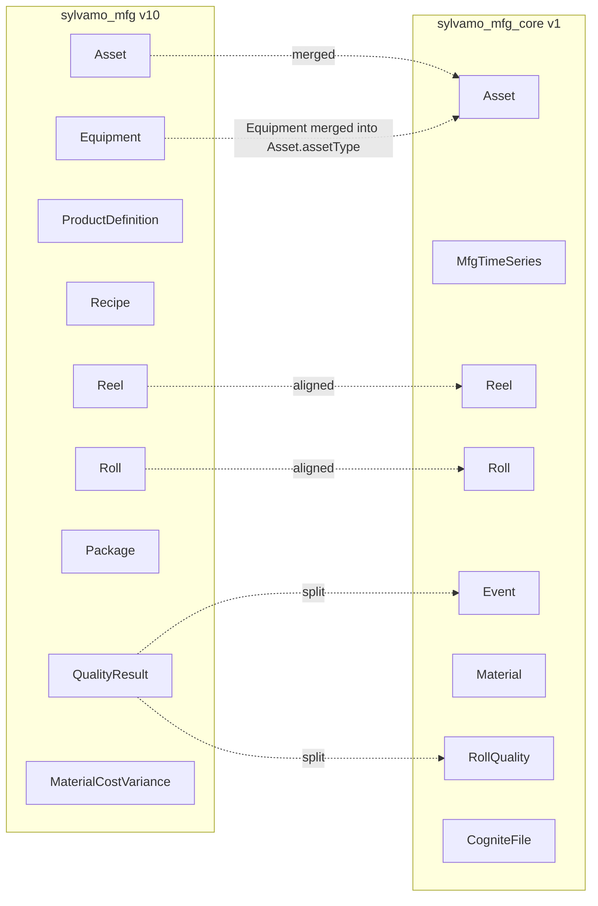
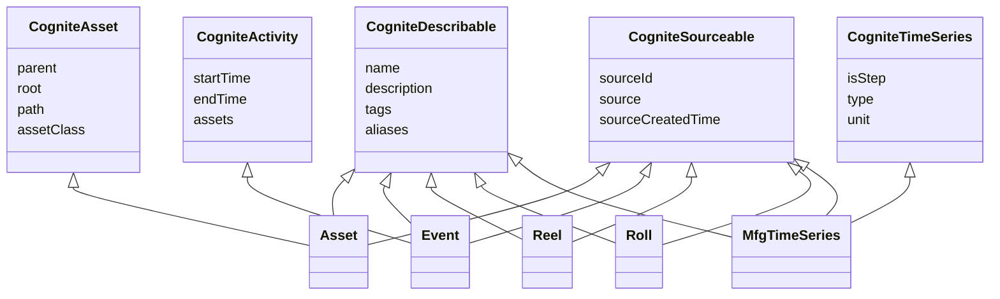
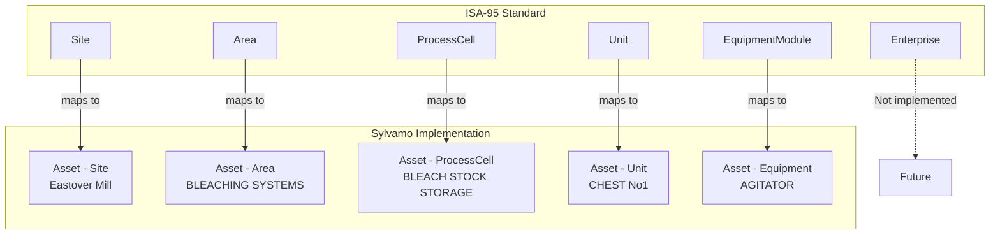
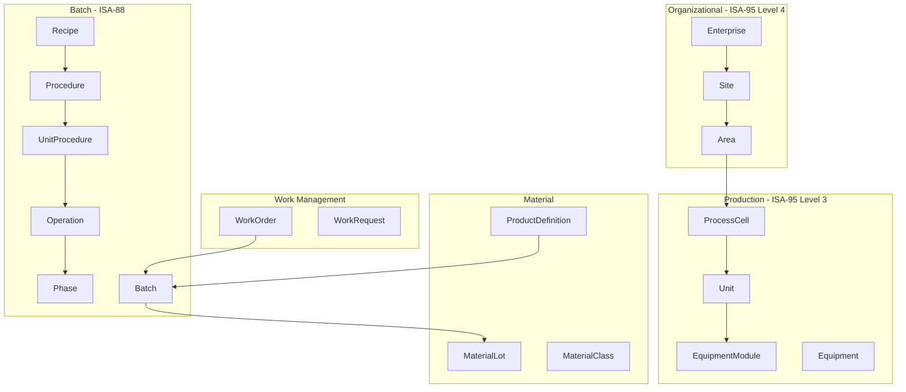
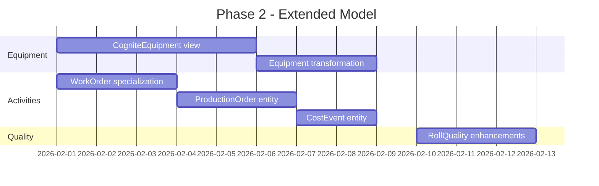
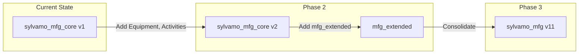
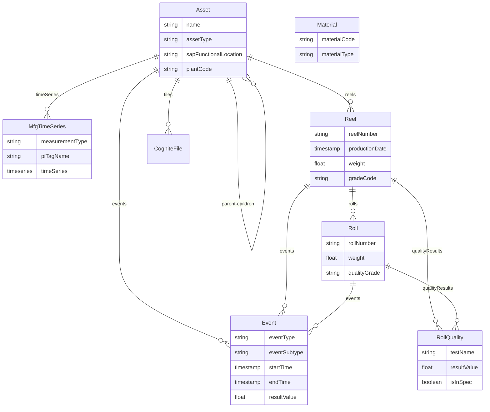

# Sylvamo Data Model Architecture Decision Record

> **Purpose:** Architecture decisions and roadmap for Sylvamo CDF implementation  
> **Audience:** Sylvamo stakeholders, Cognite implementation team  
> **Date:** January 31, 2026  
> **Status:** For Discussion

---

## Executive Summary

This document consolidates the current state of Sylvamo's CDF data models, their alignment with ISA-95/ISA-88 standards, and the roadmap for model evolution. Two data models currently exist:

1. **`sylvamo_mfg`** (v10) - Original ISA-aligned model with 9 views
2. **`sylvamo_mfg_core`** (v1) - CDM-integrated operational model with 8 views

The strategic direction is to **consolidate into a single CDM-integrated model** that maintains ISA-95 alignment while leveraging Cognite's Core Data Model for interoperability.

---

## Table of Contents

1. [Current State](#1-current-state)
2. [Data Model Comparison](#2-data-model-comparison)
3. [ISA-95/ISA-88 Alignment](#3-isa-95isa-88-alignment)
4. [Cognite Manufacturing Extension](#4-cognite-manufacturing-extension)
5. [Gap Analysis](#5-gap-analysis)
6. [Roadmap](#6-roadmap)
7. [Architecture Decisions](#7-architecture-decisions)
8. [Next Steps](#8-next-steps)

---

## 1. Current State

### 1.1 Deployed Data Models

| Model | Space | Version | Views | Instance Count | Status |
|-------|-------|---------|-------|----------------|--------|
| **sylvamo_mfg** | sylvamo_mfg | v10 | 9 | ~300,000 | Original (POC) |
| **sylvamo_mfg_core** | sylvamo_mfg_core_schema | v1 | 8 | ~365,000+ | Production |

### 1.2 sylvamo_mfg_core Instance Counts (CDF)

| Entity | Count | Source |
|--------|-------|--------|
| Asset | 45,953 | SAP Asset Hierarchy |
| Event | 100,000+ | SAP, Proficy, Fabric |
| Material | 58,342 | SAP Materials |
| MfgTimeSeries | 3,532+ | PI Server |
| Reel | 61,335 | Fabric PPR |
| Roll | 100,000+ | Fabric PPR |
| RollQuality | 180 | SharePoint |
| CogniteFile | 97 | CDF Files |

---

## 2. Data Model Comparison

### 2.1 Entity Mapping



### 2.2 Key Differences

| Aspect | sylvamo_mfg | sylvamo_mfg_core |
|--------|-------------|------------------|
| **CDM Integration** | Partial | Full (implements CDM interfaces) |
| **Equipment** | Separate entity | Merged into Asset.assetType |
| **Events** | Multiple specialized types | Unified Event entity |
| **Package** | Included | Not included (future) |
| **Recipe** | Included | Not included (future) |
| **ProductDefinition** | Included | Not included (future) |
| **Time Series** | Basic | Full CDM CogniteTimeSeries |
| **Files** | Not linked | CDM CogniteFile integration |

### 2.3 CDM Interface Implementation



---

## 3. ISA-95/ISA-88 Alignment

### 3.1 ISA-95 Hierarchy Mapping



### 3.2 ISA-95 Level 3 Mapping

| ISA-95 Concept | Sylvamo Entity | Status |
|----------------|----------------|--------|
| **Site** | Asset (assetType=Site) | Implemented |
| **Area** | Asset (assetType=Area) | Implemented |
| **ProcessCell** | Asset (assetType=ProcessCell) | Implemented |
| **Unit** | Asset (assetType=Unit) | Implemented |
| **Equipment** | Asset (assetType=Equipment) | Implemented |
| **Batch** | Reel | Implemented |
| **MaterialLot** | Roll | Implemented |
| **WorkOrder** | Event (eventType=WorkOrder) | Implemented |
| **ProductDefinition** | - | Future (mfg_extended) |
| **Recipe** | - | Future (mfg_extended) |

### 3.3 ISA-88 Alignment

| ISA-88 Concept | Sylvamo Implementation | Notes |
|----------------|------------------------|-------|
| **Batch** | Reel entity | Paper reel = batch |
| **Recipe** | Future | General/Master/Control recipes |
| **Procedure** | Not implemented | Could map to production orders |
| **UnitProcedure** | Not implemented | - |
| **Operation** | Not implemented | - |
| **Phase** | Not implemented | - |

---

## 4. Cognite Manufacturing Extension

### 4.1 Full ISA Manufacturing Extension

Cognite provides a comprehensive ISA-95/ISA-88 template:



### 4.2 Sylvamo vs. Full ISA Template

| ISA Extension Entity | Sylvamo Status | Priority |
|----------------------|----------------|----------|
| Enterprise | Not needed (single company) | N/A |
| Site | Implemented (Asset) | Done |
| Area | Implemented (Asset) | Done |
| ProcessCell | Implemented (Asset) | Done |
| Unit | Implemented (Asset) | Done |
| EquipmentModule | Implemented (Asset) | Done |
| Equipment | Planned (mfg_extended) | High |
| ProductDefinition | Planned (mfg_extended) | Medium |
| Recipe | Planned (mfg_extended) | Low |
| Batch (Reel) | Implemented | Done |
| MaterialLot (Roll) | Implemented | Done |
| WorkOrder | Implemented (Event) | Done |
| Procedure/Phase | Not planned | Low |

---

## 5. Gap Analysis

### 5.1 Current Gaps

| Gap | Description | Impact | Resolution |
|-----|-------------|--------|------------|
| **Equipment Entity** | No separate Equipment view | Cannot link equipment-specific data | Add CogniteEquipment to mfg_extended |
| **ProductDefinition** | Not in mfg_core | Cannot track product specs | Add to mfg_extended |
| **Recipe** | Not in mfg_core | Cannot track recipes | Add to mfg_extended |
| **Package** | Not in mfg_core | No inter-plant tracking | Add to mfg_extended |
| **Reel-Asset Link** | Not populated | Reels not linked to paper machines | Update transformation |
| **Time Series Preview** | Limited | Classic TS not linked | Architectural constraint |

### 5.2 Data Quality Gaps

| Entity | Gap | Status |
|--------|-----|--------|
| Reel | Missing asset link | Transformation update needed |
| Roll | Some orphaned (no reel) | External ID alignment needed |
| RollQuality | Missing asset link | Transformation update needed |
| Event | Proficy events no asset link | PU_Id mapping needed |

---

## 6. Roadmap

### 6.1 Phase 1: Consolidation (Completed)

- Implement sylvamo_mfg_core with CDM integration
- Migrate Asset hierarchy from SAP
- Implement unified Event entity
- Link Time Series, Files to Assets

### 6.2 Phase 2: Extended Model (In Progress)

**Timeline:** February 2026



**Deliverables:**
- Equipment entity (CogniteEquipment)
- Activity specializations (WorkOrder, ProductionOrder, CostEvent)
- ProductDefinition entity
- Enhanced Reel-Asset linking

### 6.3 Phase 3: Full ISA Alignment (Future)

**Timeline:** Q2 2026

- Recipe entity (ISA-88)
- Package entity (inter-plant)
- MaterialCostVariance entity
- Full ISA-95 procedural model (if needed)

### 6.4 Model Evolution Diagram



---

## 7. Architecture Decisions

### ADR-001: Use CDM Interfaces

**Decision:** All entities implement Cognite Data Model (CDM) interfaces.

**Rationale:**
- Ensures interoperability with CDF applications
- Enables standard CDF features (search, preview, etc.)
- Aligns with Cognite best practices

**Consequences:**
- All entities have name, description, sourceId properties
- Asset implements CogniteAsset for hierarchy
- Events implement CogniteActivity for temporal data

---

### ADR-002: Unified Event Entity

**Decision:** Single Event entity with eventType/eventSubtype instead of multiple specialized entities.

**Rationale:**
- Simpler model to maintain
- Flexible for new event types
- Easier querying across event types

**Consequences:**
- eventType field distinguishes: LabTest, WorkOrder, Downtime, etc.
- All events share common properties
- Specialized properties via eventSubtype

---

### ADR-003: Asset Hierarchy via SAP Functional Location

**Decision:** Asset hierarchy mirrors SAP functional location structure.

**Rationale:**
- Single source of truth (SAP)
- Maintains operational alignment
- Enables work order linking

**Consequences:**
- 45,000+ assets from SAP hierarchy
- External IDs use `floc:` prefix
- Parent-child relationships from FLOC structure

---

### ADR-004: Reel as ISA-95 Batch

**Decision:** Reel entity represents ISA-95 Batch concept.

**Rationale:**
- Paper reel is a complete production batch
- Aligns with ISA-95 terminology
- Enables batch traceability

**Consequences:**
- Reel has production date, weight, grade
- Rolls are cut from Reels (Batch to MaterialLot)
- Quality results link to Reel

---

### ADR-005: Separate Schema and Instance Spaces

**Decision:** Use separate spaces for schema (`sylvamo_mfg_core_schema`) and instances (`sylvamo_mfg_core_instances`).

**Rationale:**
- Clear separation of concerns
- Easier access control
- Standard Cognite pattern

**Consequences:**
- Schema space contains views/containers
- Instance space contains data
- Location filter uses `sylvamo_mfg_core_location`

---

## 8. Next Steps

### Immediate Actions (This Sprint)

1. **Complete Event-Asset linking** - Proficy events need PU_Id to Asset mapping
2. **Fix Reel-Asset relationship** - Update transformation to populate asset property
3. **Equipment entity** - Implement in mfg_extended module

### Short-term (February 2026)

1. Deploy mfg_extended module
2. Add ProductDefinition entity
3. Implement activity specializations
4. Update documentation

### Medium-term (Q2 2026)

1. Evaluate full ISA-88 procedural model need
2. Add Package entity for inter-plant
3. Consolidate models if needed

---

## Appendix A: Entity Relationship Diagram



---

## Appendix B: Transformation Summary

| Transformation | Source | Target | Records |
|----------------|--------|--------|---------|
| tr_populate_Asset | raw_ext_sap.asset_hierarchy | Asset | 45,953 |
| tr_populate_Reel | raw_ext_fabric_ppr.ppr_hist_reel | Reel | 61,335 |
| tr_populate_Roll | raw_ext_fabric_ppr.ppr_hist_roll | Roll | 100,000+ |
| tr_populate_Material | raw_ext_sap.materials | Material | 58,342 |
| tr_populate_TimeSeries | _cdf.timeseries | MfgTimeSeries | 3,532 |
| tr_populate_Event_Proficy | raw_ext_sql_proficy.events_tests | Event | ~1,000 |
| tr_populate_Event_WorkOrders | raw_ext_sap.work_orders | Event | ~500 |
| tr_populate_Event_ProductionOrders | raw_ext_sap.production_orders | Event | 50,000 |
| tr_populate_Event_PPV | raw_ext_fabric_ppv.ppv_snapshot | Event | ~700 |
| tr_populate_RollQuality | raw_ext_sharepoint.roll_quality | RollQuality | 180 |
| tr_populate_Files | _cdf.files | CogniteFile | 97 |

---

## Appendix C: Module Structure

```
sylvamo/modules/
├── mfg_core/           # Core manufacturing model (deployed)
│   ├── data_modeling/
│   │   ├── containers/ # 7 containers
│   │   ├── views/      # 7 views
│   │   └── data_models/
│   └── transformations/ # 14 transformations
├── mfg_extended/       # Extended model (planned)
│   ├── data_modeling/
│   │   ├── containers/ # Equipment, Activities
│   │   └── views/
│   └── transformations/
├── mfg_data/           # Legacy model (sylvamo_mfg v10)
└── mfg_location/       # Location filter
```

---

*Document prepared for Sylvamo Architecture Meeting*  
*Last updated: January 31, 2026*
