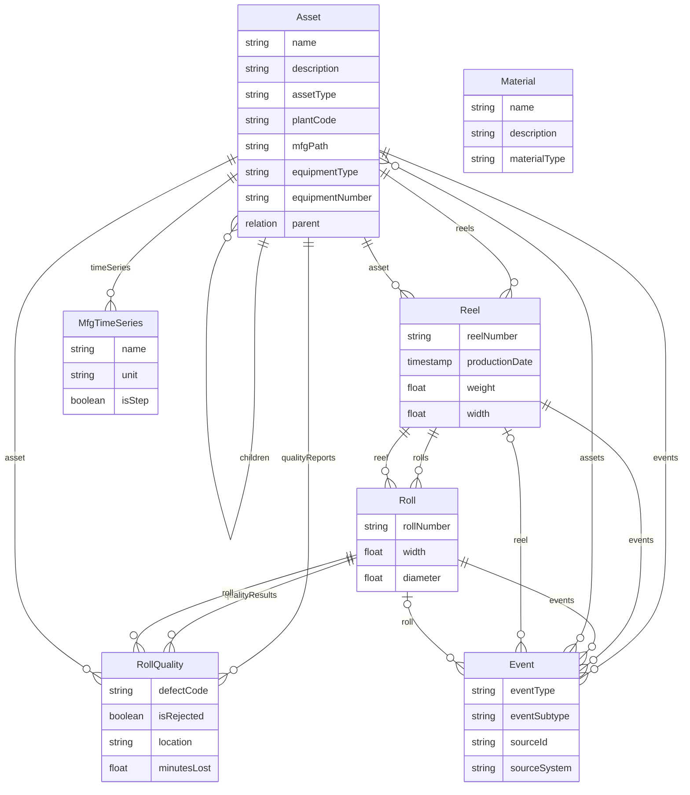

# Sylvamo MFG Core Data Model

> **Note:** This document describes the **sylvamo_mfg_core** model only. Equipment is modeled as Asset nodes with `assetType='Equipment'` (see ADR-001). The extended model (sylvamo_mfg_extended) exists but is not the current focus.

## Model Overview

| Property | Value |
|----------|-------|
| **Space (Schema)** | sylvamo_mfg_core_schema |
| **Space (Instances)** | sylvamo_mfg_core_instances |
| **Data Model** | SylvamoMfgCore |
| **Version** | v2 |
| **Views** | 7 |

## Views in sylvamo_mfg_core

| View | Description | Key Relationships |
|------|-------------|-------------------|
| **Asset** | Mills, plants, equipment (with ISA-95 assetType classification) | parent, children, reels, events, timeSeries, files, qualityReports |
| **Material** | Raw materials, products | source |
| **Reel** | Paper reels (production batches) | asset, rolls, events |
| **Roll** | Paper rolls (material lots) | reel, events, qualityResults |
| **RollQuality** | Quality test results | asset, roll |
| **Event** | Generic events | assets, reel, roll |
| **MfgTimeSeries** | Process time series | assets |

## Entity Relationship Diagram (Core Only)

```
┌─────────────────────────────────────────────────────────────────────────────┐
│                        sylvamo_mfg_core                                     │
├─────────────────────────────────────────────────────────────────────────────┤
│                                                                             │
│    ┌─────────────┐         ┌─────────────┐         ┌─────────────┐         │
│    │   Asset     │         │  Material   │         │MfgTimeSeries│         │
│    ├─────────────┤         ├─────────────┤         ├─────────────┤         │
│    │ name        │         │ name        │         │ name        │         │
│    │ description │         │ description │         │ unit        │         │
│    │ assetType   │         │ materialType│         │ isStep      │         │
│    │ plantCode   │         │             │         │             │         │
│    │ mfgPath   │         │             │         │             │         │
│    └──────┬──────┘         └─────────────┘         └──────┬──────┘         │
│           │                                                │                │
│           │ reels                                   assets │                │
│           ▼                                                │                │
│    ┌─────────────┐                                         │                │
│    │    Reel     │◄────────────────────────────────────────┘                │
│    ├─────────────┤                                                          │
│    │ reelNumber  │                                                          │
│    │ productionDt│                                                          │
│    │ weight      │                                                          │
│    │ width       │                                                          │
│    └──────┬──────┘                                                          │
│           │                                                                 │
│           │ rolls                                                           │
│           ▼                                                                 │
│    ┌─────────────┐         ┌─────────────┐                                  │
│    │    Roll     │────────▶│ RollQuality │                                  │
│    ├─────────────┤ quality ├─────────────┤                                  │
│    │ rollNumber  │ Results │ defectCode  │                                  │
│    │ width       │         │ isRejected  │                                  │
│    │ diameter    │         │ location    │                                  │
│    │             │         │ minutesLost │                                  │
│    └──────┬──────┘         └──────┬──────┘                                  │
│           │                       │                                         │
│           │ events                │ asset                                   │
│           ▼                       ▼                                         │
│    ┌─────────────┐         (links back to Asset)                            │
│    │   Event     │                                                          │
│    ├─────────────┤                                                          │
│    │ eventType   │                                                          │
│    │ eventSubtype│                                                          │
│    │ sourceId    │                                                          │
│    │ sourceSystem│                                                          │
│    └─────────────┘                                                          │
│                                                                             │
└─────────────────────────────────────────────────────────────────────────────┘
```

## Mermaid Diagram



## Key Relationships Explained

### Production Flow
```
Asset (Eastover Mill)
  └── Reel (Paper reel from PM1)
        └── Roll (Individual roll cut from reel)
              └── RollQuality (Quality test results)
```

### Quality Traceability (Use Case 1)
```
RollQuality
  ├── roll → Roll (which roll was tested)
  ├── asset → Asset (Equipment-level asset, e.g. Sheeter No.2)
  └── defectCode, isRejected, minutesLost (quality data)
```

This enables queries like:
- "Which equipment has the most quality defects?"
- "Trace a defective roll back to its reel and production date"
- "Show all quality results for Sheeter No. 2"

## Instance Counts (Live Data)

> **Verified:** February 17, 2026

| View | Instances | Notes |
|------|-----------|-------|
| Asset | 45,900+ | Includes 33,072 with `assetType='Equipment'` |
| Reel | 83,600+ | |
| Roll | 2,300,000+ | |
| RollQuality | ~750 | SharePoint roll quality reports (with asset links) |
| MfgTimeSeries | 3,500+ | |
| Event | 92,000+ | SAP Work Orders, Proficy, PPV |
| Material | 58,000+ | |

### ISA-95 Asset Type Classification

Assets are classified by `assetType` based on hierarchy level:

| Hierarchy Level | assetType | Count |
|-----------------|-----------|-------|
| Level 2 | Area | ~10 |
| Level 3 | System | ~50 |
| Level 4 | SubSystem | ~200 |
| Level 5 | Unit | ~1,000 |
| Level 6 | EquipmentModule | ~10,000 |
| Level 7+ | Equipment | 33,072 |

See [ADR-001-ASSET-EQUIPMENT.md](decisions/ADR-001-ASSET-EQUIPMENT.md) for details.

## What's NOT in mfg_core (mfg_extended - de-emphasized)

Equipment is **not** a separate entity—it is modeled as Asset nodes with `assetType='Equipment'` (see ADR-001). The following entities are in **sylvamo_mfg_extended** (exists in CDF but not current focus):

| Entity | Description | Model |
|--------|-------------|-------|
| CostEvent | PPV/cost variance | mfg_extended |
| WorkOrder | SAP maintenance orders | mfg_extended |
| ProductionOrder | SAP production orders | mfg_extended |
| ProductionEvent | Proficy events | mfg_extended |
| Notification | SAP notifications | mfg_extended |
| Operation | Work order operations | mfg_extended |
| MaintenanceActivity | Maintenance activities | mfg_extended |

---

*Last updated: February 17, 2026*
