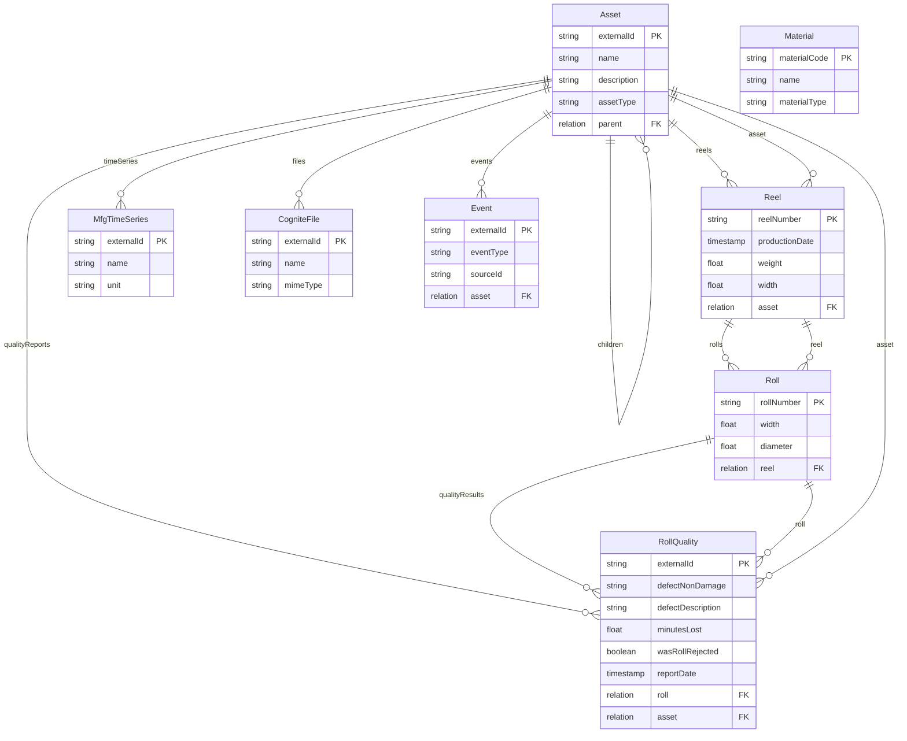
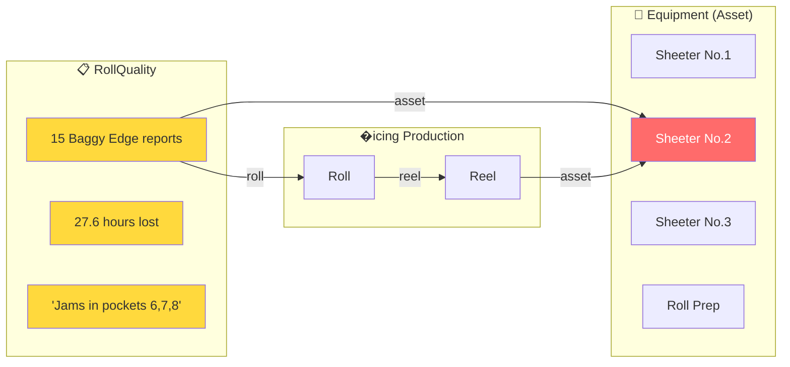

# sylvamo_mfg_core with Equipment Linkage

> **How to enable the "Sheeter No.2 Discovery" via GraphQL**

This document shows the data model structure needed to query quality patterns by equipment.

---

## Current vs. Fixed Diagram

### CURRENT (Missing Link)

```mermaid
erDiagram
    Asset ||--o{ Reel : "reels"
    Asset ||--o{ MfgTimeSeries : "timeSeries"
    Asset ||--o{ CogniteFile : "files"
    
    Reel ||--o{ Roll : "rolls"
    Roll ||--o{ RollQuality : "quality"
    
    RollQuality {
        string externalId PK
        string defectCode
        string equipment
        float minutesLost
        relation roll FK
        relation asset EMPTY
    }

    Asset {
        string name PK
        string assetType
    }
```

**Problem:** `RollQuality.asset` is NULL (shown as EMPTY), and no Asset exists for "Sheeter No.1"

---

### FIXED (With Equipment Link)



---

## The Key Change

```
┌─────────────────────────────────────────────────────────────────┐
│  NEW ASSETS NEEDED                                              │
├─────────────────────────────────────────────────────────────────┤
│  externalId          │ name          │ assetType   │ parent    │
├──────────────────────┼───────────────┼─────────────┼───────────┤
│  asset:sheeter_no_1  │ Sheeter No.1  │ Equipment   │ Eastover  │
│  asset:sheeter_no_2  │ Sheeter No.2  │ Equipment   │ Eastover  │
│  asset:sheeter_no_3  │ Sheeter No.3  │ Equipment   │ Eastover  │
│  asset:roll_prep     │ Roll Prep     │ Equipment   │ Eastover  │
└─────────────────────────────────────────────────────────────────┘

┌─────────────────────────────────────────────────────────────────┐
│  ROLLQUALITY TRANSFORMATION UPDATE                              │
├─────────────────────────────────────────────────────────────────┤
│  Before:  asset = NULL                                          │
│  After:   asset = node_reference('Asset', 'asset:sheeter_no_2') │
└─────────────────────────────────────────────────────────────────┘
```

---

## Visual Flow: Quality to Equipment



---

## GraphQL Query After Fix

```graphql
{
  # Get Sheeter No.2 with all its quality issues
  getAsset(
    instance: { 
      space: "sylvamo_mfg_core_instances", 
      externalId: "asset:sheeter_no_2" 
    }
  ) {
    name                          # "Sheeter No.2"
    assetType                     # "Equipment"
    
    # Reverse relation: all quality reports for this equipment
    qualityReports {
      items {
        defectNonDamage           # "001 - Baggy Edges"
        minutesLost               # 120
        defectDescription         # "Having jams in pockets 6, 7, and 8..."
        reportDate
        wasRollRejected
        
        # Forward relation: which roll had the issue
        roll {
          rollNumber
          reel {
            reelNumber
            productionDate
          }
        }
      }
    }
  }
}
```

**Result:**
```json
{
  "data": {
    "getAsset": {
      "name": "Sheeter No.2",
      "assetType": "Equipment",
      "qualityReports": {
        "items": [
          {
            "defectNonDamage": "001 - Baggy Edges",
            "minutesLost": 120,
            "defectDescription": "Having jams in pockets 6, 7, and 8...",
            "reportDate": "2025-12-17T05:00:00Z",
            "roll": {
              "rollNumber": "E15L20053B",
              "reel": {
                "reelNumber": "E15L20053",
                "productionDate": "2025-12-16T00:00:00Z"
              }
            }
          }
          // ... 14 more records
        ]
      }
    }
  }
}
```

---

## Aggregation Query

```graphql
{
  # Find all equipment with quality issues
  listAsset(
    filter: { assetType: { eq: "Equipment" } }
  ) {
    items {
      name
      qualityReports {
        items {
          minutesLost
          defectNonDamage
        }
      }
    }
  }
}
```

Then aggregate in your app:
```javascript
// Client-side aggregation
const byEquipment = assets.map(asset => ({
  name: asset.name,
  incidents: asset.qualityReports.items.length,
  hoursLost: asset.qualityReports.items.reduce(
    (sum, r) => sum + (r.minutesLost || 0), 0
  ) / 60
}));

// Result:
// Sheeter No.1: 107 incidents, 47.8 hours
// Sheeter No.2: 51 incidents, 46.4 hours  ← THE FINDING
// Roll Prep: 16 incidents, 0 hours
// Sheeter No.3: 5 incidents, 1.5 hours
```

---

## Implementation Checklist

- [ ] **1. Create Equipment Assets** (4 nodes)
- [ ] **2. Update RollQuality transformation** (add asset relation mapping)
- [ ] **3. Deploy** (`cdf deploy`)
- [ ] **4. Verify** GraphQL query works

**Estimated effort:** 2 hours

---

*Created: February 16, 2026*
