# sylvamo_mfg_core with Equipment Linkage

> **How to enable the "Sheeter No.2 Discovery" via GraphQL**

This document shows the data model structure needed to query quality patterns by equipment.

---

## Current vs. Fixed Diagram

### CURRENT (Missing Link)


**Problem:** 
- `RollQuality.equipment` = "Sheeter No.2" (just a STRING, not a relation)
- `RollQuality.asset` = NULL (not linked)
- No `Equipment` entity exists

---

### FIXED (With Equipment Container)


**Fixed:** 
- New `Equipment` container/view added
- `Equipment` links to `Asset` (parent hierarchy)
- `RollQuality.equipment` is now a RELATION to `Equipment`
- Can traverse: `Equipment` → `qualityReports` → all quality issues

---

## The Key Changes

### 1. New Equipment Container

```yaml
# Equipment.Container.yaml
Container:
  space: sylvamo_mfg_core_schema
  externalId: Equipment
  properties:
    name:
      type: text
    equipmentType:
      type: text
    description:
      type: text
    asset:
      type: direct
      source:
        space: sylvamo_mfg_core_schema
        externalId: Asset
```

### 2. New Equipment Instances

```
┌─────────────────────────────────────────────────────────────────┐
│  EQUIPMENT INSTANCES TO CREATE                                  │
├─────────────────────────────────────────────────────────────────┤
│  externalId            │ name          │ equipmentType │ asset  │
├────────────────────────┼───────────────┼───────────────┼────────┤
│  equip:sheeter_no_1    │ Sheeter No.1  │ Sheeter       │ → Asset│
│  equip:sheeter_no_2    │ Sheeter No.2  │ Sheeter       │ → Asset│
│  equip:sheeter_no_3    │ Sheeter No.3  │ Sheeter       │ → Asset│
│  equip:roll_prep       │ Roll Prep     │ RollPrep      │ → Asset│
└─────────────────────────────────────────────────────────────────┘
```

### 3. Update RollQuality View

```yaml
# Add equipment relation to RollQuality.View.yaml
equipment:
  type: direct
  source:
    space: sylvamo_mfg_core_schema
    externalId: Equipment
```

### 4. Update RollQuality Transformation

```sql
-- Map equipment string to Equipment relation
CASE 
    WHEN Equipment = 'Sheeter No.1' 
    THEN node_reference('sylvamo_mfg_core_schema', 'Equipment', 'equip:sheeter_no_1')
    WHEN Equipment = 'Sheeter No.2' 
    THEN node_reference('sylvamo_mfg_core_schema', 'Equipment', 'equip:sheeter_no_2')
    WHEN Equipment = 'Sheeter No.3' 
    THEN node_reference('sylvamo_mfg_core_schema', 'Equipment', 'equip:sheeter_no_3')
    WHEN Equipment = 'Roll Prep' 
    THEN node_reference('sylvamo_mfg_core_schema', 'Equipment', 'equip:roll_prep')
END as equipment
```

---

## Visual Flow: Quality to Equipment

```mermaid
flowchart LR
    subgraph Asset["🏭 Asset Hierarchy"]
        A1["Eastover Mill"]
    end

    subgraph Equipment["🔧 Equipment"]
        S1["Sheeter No.1"]
        S2["Sheeter No.2"]
        S3["Sheeter No.3"]
        RP["Roll Prep"]
    end

    subgraph Quality["📋 RollQuality"]
        Q1["15 Baggy Edge reports"]
        Q2["27.6 hours lost"]
    end

    subgraph Production["📦 Production"]
        R1["Roll"]
        R2["Reel"]
    end

    A1 -->|equipment| S1
    A1 -->|equipment| S2
    A1 -->|equipment| S3
    Q1 -->|equipment| S2
    Q1 -->|roll| R1
    R1 -->|reel| R2

    style S2 fill:#ff6b6b,color:#fff
    style Q1 fill:#ffd93d
    style Q2 fill:#ffd93d
```



---

## GraphQL Query After Fix

```graphql
{
  # Get Sheeter No.2 with all its quality issues
  getEquipment(
    instance: { 
      space: "sylvamo_mfg_core_instances", 
      externalId: "equip:sheeter_no_2" 
    }
  ) {
    name                          # "Sheeter No.2"
    equipmentType                 # "Sheeter"
    
    # Parent asset (mill/plant)
    asset {
      name                        # "Eastover Mill"
    }
    
    # Reverse relation: all quality reports for this equipment
    qualityReports {
      items {
        defectNonDamage           # "001 - Baggy Edges"
        minutesLost               # 120
        defectDescription         # "Having jams in pockets 6, 7, and 8..."
        reportDate
        wasRollRejected
        
        # Forward relation: which roll had the issue
        roll {
          rollNumber
          reel {
            reelNumber
            productionDate
          }
        }
      }
    }
  }
}
```

**Result:**
```json
{
  "data": {
    "getEquipment": {
      "name": "Sheeter No.2",
      "equipmentType": "Sheeter",
      "asset": {
        "name": "Eastover Mill"
      },
      "qualityReports": {
        "items": [
          {
            "defectNonDamage": "001 - Baggy Edges",
            "minutesLost": 120,
            "defectDescription": "Having jams in pockets 6, 7, and 8...",
            "reportDate": "2025-12-17T05:00:00Z",
            "roll": {
              "rollNumber": "E15L20053B",
              "reel": {
                "reelNumber": "E15L20053",
                "productionDate": "2025-12-16T00:00:00Z"
              }
            }
          }
        ]
      }
    }
  }
}
```

---

## Aggregation Query

```graphql
{
  # Find all equipment with quality issues
  listEquipment {
    items {
      name
      equipmentType
      asset {
        name
      }
      qualityReports {
        items {
          minutesLost
          defectNonDamage
        }
      }
    }
  }
}
```

Then aggregate in your app:
```javascript
// Client-side aggregation
const byEquipment = equipment.map(e => ({
  name: e.name,
  plant: e.asset.name,
  incidents: e.qualityReports.items.length,
  hoursLost: e.qualityReports.items.reduce(
    (sum, r) => sum + (r.minutesLost || 0), 0
  ) / 60
}));

// Result:
// Sheeter No.1 (Eastover Mill): 107 incidents, 47.8 hours
// Sheeter No.2 (Eastover Mill): 51 incidents, 46.4 hours  ← THE FINDING
// Roll Prep (Eastover Mill): 16 incidents, 0 hours
// Sheeter No.3 (Eastover Mill): 5 incidents, 1.5 hours
```

---

## Implementation Checklist

- [ ] **1. Create Equipment.Container.yaml** in `mfg_core/data_modeling/containers/`
- [ ] **2. Create Equipment.View.yaml** in `mfg_core/data_modeling/views/`
- [ ] **3. Update RollQuality.View.yaml** - add `equipment` relation
- [ ] **4. Create equipment_instances transformation** (4 nodes: Sheeter No.1/2/3, Roll Prep)
- [ ] **5. Update roll_quality transformation** - map equipment string → relation
- [ ] **6. Deploy** (`cdf build && cdf deploy`)
- [ ] **7. Verify** GraphQL query works

**Estimated effort:** 3-4 hours

---

*Created: February 16, 2026*
