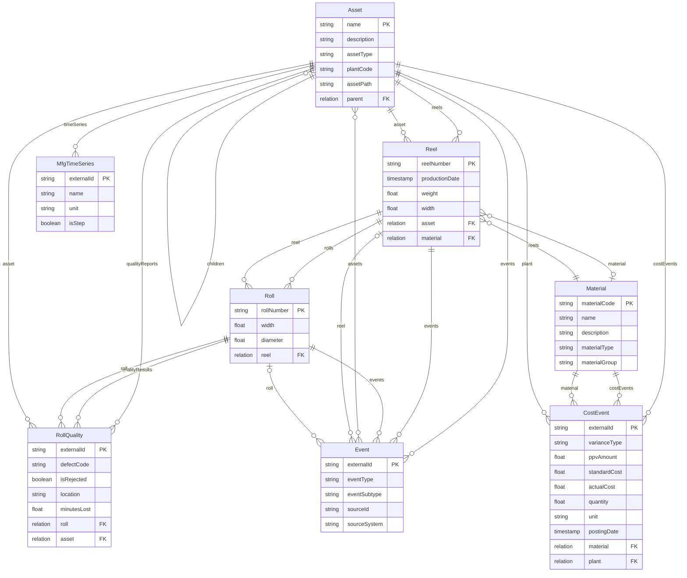
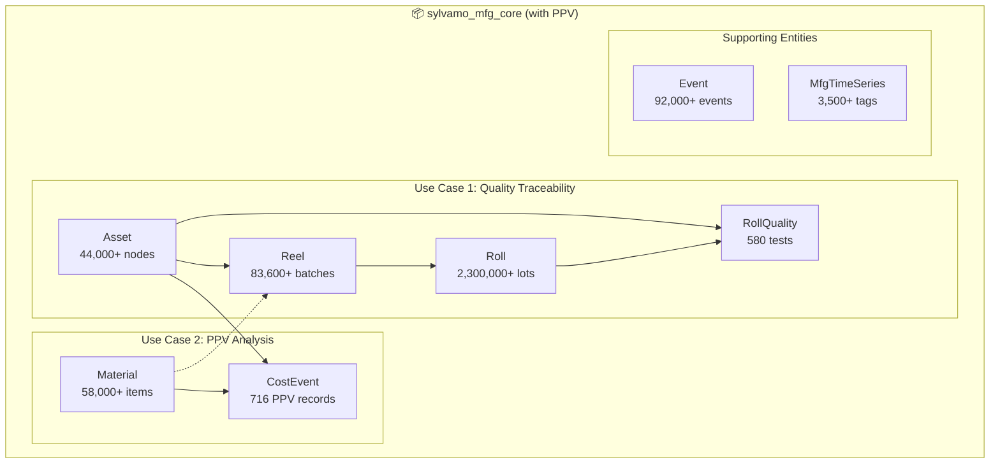
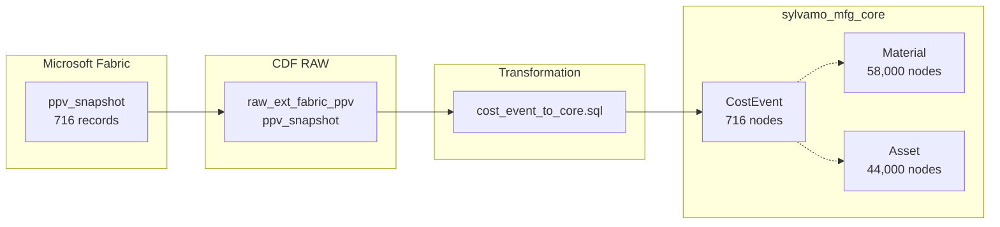

# sylvamo_mfg_core with PPV Integration

> **Proposed Extension: Adding Cost/PPV Tracking to mfg_core**

This document shows how Purchase Price Variance (PPV) could be modeled within the `sylvamo_mfg_core` data model, enabling cost analysis alongside quality traceability.

---

## Current State vs. Proposed

| Aspect | Current (mfg_core) | Proposed (mfg_core + PPV) |
|--------|-------------------|---------------------------|
| **Views** | 7 | 8 (+CostEvent) |
| **Use Cases** | Quality Traceability | Quality + Cost Analysis |
| **PPV Location** | mfg_extended | mfg_core |

---

## Proposed Entity Relationship Diagram



---

## Flow Diagram: Complete mfg_core with PPV



---

## CostEvent Properties

| Property | Type | Description | Source |
|----------|------|-------------|--------|
| `externalId` | string | Unique identifier | Generated |
| `varianceType` | string | "PPV", "FREIGHT", etc. | ppv_snapshot |
| `ppvAmount` | float | Variance amount (USD) | `current_ppv` |
| `standardCost` | float | Expected cost | `standard_cost` |
| `actualCost` | float | Actual paid cost | Calculated |
| `quantity` | float | Material quantity | ppv_snapshot |
| `unit` | string | Unit of measure | ppv_snapshot |
| `postingDate` | timestamp | When variance recorded | ppv_snapshot |
| `material` | relation | → Material | `material_number` |
| `plant` | relation | → Asset (plant) | `plant_code` |

---

## Why Add PPV to mfg_core?

### Benefits

1. **Single Model** - Both use cases (Quality + Cost) in one coherent model
2. **Simpler Queries** - No cross-model joins needed
3. **Material Connection** - PPV directly linked to Material master
4. **Plant Connection** - Cost analysis by location via Asset

### Tradeoffs

1. **Model Size** - Adds ~1,000 nodes
2. **Scope Creep** - mfg_core grows beyond "core"
3. **ISA-95 Alignment** - Cost events might belong in separate domain

---

## GraphQL Query: Material Cost Analysis

```graphql
{
  # Get materials with their PPV
  listMaterial(first: 10, filter: { materialType: { eq: "RAW" } }) {
    items {
      materialCode
      name
      materialType
      costEvents {
        items {
          ppvAmount
          standardCost
          actualCost
          postingDate
          plant {
            name
            plantCode
          }
        }
      }
    }
  }
}
```

---

## GraphQL Query: Plant-Level PPV Summary

```graphql
{
  # Get PPV by plant
  listAsset(filter: { assetType: { eq: "PLANT" } }) {
    items {
      name
      plantCode
      costEvents {
        items {
          ppvAmount
          varianceType
          material {
            name
            materialGroup
          }
        }
      }
    }
  }
}
```

---

## Data Flow: PPV to mfg_core



---

## Transformation SQL (Proposed)

```sql
-- Transform PPV to CostEvent in mfg_core
SELECT
    concat('ppv_', material_number, '_', plant, '_', posting_date) as externalId,
    'PPV' as varianceType,
    current_ppv as ppvAmount,
    standard_cost as standardCost,
    (current_ppv + standard_cost) as actualCost,
    quantity,
    unit,
    to_timestamp(posting_date) as postingDate,
    -- Relations
    node_reference('sylvamo_mfg_core_schema', 'Material', material_number) as material,
    node_reference('sylvamo_mfg_core_schema', 'Asset', plant) as plant
FROM
    `raw_ext_fabric_ppv`.`ppv_snapshot`
WHERE
    current_ppv IS NOT NULL
```

---

## Implementation Steps

1. **Add CostEvent Container** to `mfg_core/data_modeling/containers/`
2. **Add CostEvent View** to `mfg_core/data_modeling/views/`
3. **Update Material View** - Add `costEvents` reverse relation
4. **Update Asset View** - Add `costEvents` reverse relation
5. **Create Transformation** - `cost_event_core.transformation.yaml`
6. **Deploy & Verify** - `cdf deploy --dry-run` then `cdf deploy`

---

## Comparison: mfg_core vs mfg_extended Approach

| Aspect | PPV in mfg_core | PPV in mfg_extended (current) |
|--------|-----------------|-------------------------------|
| **Query Complexity** | Simple - single model | Moderate - cross-model |
| **Model Cohesion** | All production data together | Separated by domain |
| **ISA-95 Alignment** | Mixed domains | Better separation |
| **Maintenance** | One model to maintain | Two models |
| **Flexibility** | Less modular | More modular |

---

## Recommendation

**For Anvar's Review:**

1. **Short-term**: Keep PPV in mfg_extended for clean separation
2. **Long-term**: Consider merging if cross-model queries become painful
3. **Key Question**: Is cost analysis part of "core manufacturing" or a separate domain?

---

*Created: February 16, 2026*
*For discussion with Anvar*
