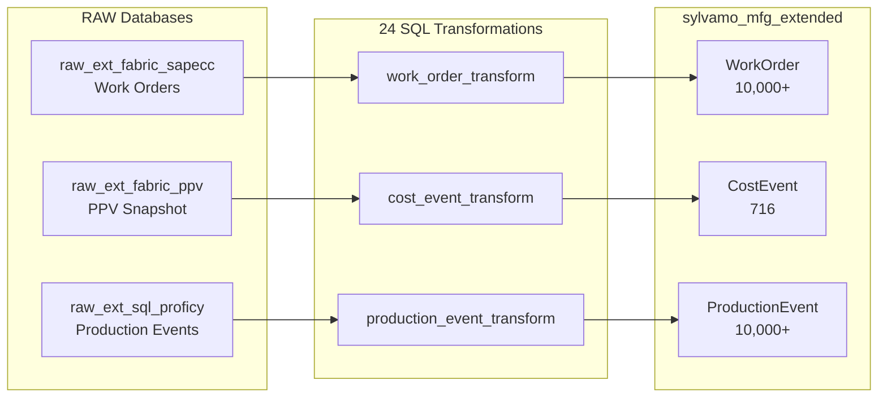

# sylvamo_mfg_extended Data Model

> **De-emphasized:** This model exists in CDF but is not the current focus. Sprint 3 priorities are on mfg_core.

> **Extended Model for PPV/Cost Analysis and Maintenance Activities**

This document describes the `sylvamo_mfg_extended` data model, which extends `sylvamo_mfg_core` with cost analysis and activity tracking capabilities.

> **Note (ADR-001):** The Equipment view has 0 instances. Equipment is modeled as Asset subtypes with `assetType='Equipment'` in mfg_core. See [ADR-001-ASSET-EQUIPMENT.md](decisions/ADR-001-ASSET-EQUIPMENT.md).

---

## Overview

| Component | Value |
|-----------|-------|
| **Schema Space** | `sylvamo_mfg_ext_schema` |
| **Instance Space** | `sylvamo_mfg_ext_instances` |
| **Data Model** | `sylvamo_mfg_extended/v1` |
| **Views** | 8 custom views |
| **Instances** | 50,000+ nodes |
| **Primary Use Case** | **PPV/Cost Analysis** |


> **Equipment (ADR-001):** Equipment-level hierarchy items are Asset with assetType=Equipment in mfg_core. The Equipment view here implements CogniteEquipment for SAP equipment (serial numbers, manufacturer) when physical asset tracking is needed. Currently 0 instances. See [ADR-001](decisions/ADR-001-ASSET-EQUIPMENT.md).

---

## Entity Relationship Diagram (mfg_extended ONLY)

```mermaid
erDiagram
    WorkOrder ||--o{ Operation : "operations"
    WorkOrder ||--o{ Notification : "notifications"
    WorkOrder }o--|| Asset : "asset (from mfg_core)"
    
    ProductionOrder ||--o{ ProductionEvent : "events"
    ProductionOrder }o--|| Reel : "reel (from mfg_core)"
    ProductionOrder }o--|| Asset : "asset (from mfg_core)"
    
    ProductionEvent }o--|| Reel : "reel (from mfg_core)"
    ProductionEvent }o--|| Asset : "asset (from mfg_core)"
    
    CostEvent }o--|| Material : "material (from mfg_core)"
    CostEvent }o--|| Asset : "plant (from mfg_core)"
    
    Equipment }o--|| Asset : "asset (from mfg_core)"
    note right of Equipment : Deprecated - Equipment modeled as Asset subtypes (ADR-001)
    
    MaintenanceActivity }o--|| Asset : "asset (from mfg_core)"
    MaintenanceActivity }o--|| WorkOrder : "workOrder"

    WorkOrder {
        string orderNumber PK
        string description
        string orderType
        string status
        string priority
        timestamp scheduledStart
        timestamp scheduledEnd
        relation asset FK
    }

    Operation {
        string operationNumber PK
        string description
        string status
        float plannedWork
        float actualWork
        relation workOrder FK
    }

    Notification {
        string notificationNumber PK
        string description
        string notificationType
        string status
        relation workOrder FK
    }

    ProductionOrder {
        string orderNumber PK
        string status
        float targetQuantity
        float actualQuantity
        relation reel FK
        relation asset FK
    }

    ProductionEvent {
        string eventId PK
        string eventType
        timestamp startTime
        timestamp endTime
        relation productionOrder FK
        relation reel FK
    }

    CostEvent {
        string externalId PK
        float ppvAmount
        float standardCost
        float actualCost
        string varianceType
        relation material FK
        relation asset FK
    }

    Equipment {
        string equipmentId PK
        string name
        string equipmentType
        string manufacturer
        relation asset FK
    }

    MaintenanceActivity {
        string activityId PK
        string activityType
        string description
        timestamp startTime
        timestamp endTime
        relation asset FK
        relation workOrder FK
    }
```

---

## Views in sylvamo_mfg_extended

| View | Description | Data Source | Population Status |
|------|-------------|-------------|-------------------|
| **WorkOrder** | SAP maintenance work orders | `raw_ext_fabric_sapecc/sapecc_work_orders` | ✅ 10,000+ |
| **ProductionOrder** | SAP production orders | `raw_ext_fabric_ppr/*` | ✅ 10,000+ |
| **ProductionEvent** | Proficy production events | `raw_ext_sql_proficy/*` | ✅ 10,000+ |
| **CostEvent** | PPV/cost variance records | `raw_ext_fabric_ppv/ppv_snapshot` | ✅ 716 |
| **Equipment** | CogniteEquipment for SAP equipment (serial numbers, manufacturer) | SAP Equipment table (pending) | ❌ 0 |
| **MaintenanceActivity** | Derived maintenance activities | WorkOrder derivation | ✅ 10,000+ |
| **Notification** | SAP notifications | (pending SAP IW29) | ❌ 0 |
| **Operation** | Work order operations | (pending AFKO join) | ❌ 0 |

---

## Relationship to mfg_core

The `mfg_extended` model **extends** the `mfg_core` model by:

1. **Referencing mfg_core entities** - CostEvent links to Material, WorkOrder links to Asset
2. **Adding activity layers** - Work orders, production orders, maintenance activities
3. **Enabling cost analysis** - PPV tracking through CostEvent → Material relationships

```
┌─────────────────────────────────────────────────────────────┐
│                    sylvamo_mfg_core                         │
│  ┌─────────┐  ┌──────────┐  ┌───────┐  ┌───────────────┐   │
│  │  Asset  │  │ Material │  │ Reel  │  │     Roll      │   │
│  └────┬────┘  └────┬─────┘  └───┬───┘  └───────────────┘   │
│       │            │            │                           │
└───────┼────────────┼────────────┼───────────────────────────┘
        │            │            │
        ▼            ▼            ▼
┌───────┼────────────┼────────────┼───────────────────────────┐
│       │            │            │                           │
│  ┌────┴────┐  ┌────┴─────┐  ┌───┴───┐                      │
│  │WorkOrder│  │CostEvent │  │ProdOrd│                      │
│  └─────────┘  └──────────┘  └───────┘                      │
│                    sylvamo_mfg_extended                     │
└─────────────────────────────────────────────────────────────┘
```

---

## Use Case: PPV/Cost Analysis

### What is PPV?

**Purchase Price Variance (PPV)** measures the difference between:
- **Standard Cost**: Expected price for materials
- **Actual Cost**: Price actually paid on purchase orders

```
PPV = (Standard Cost - Actual Cost) × Quantity
```

- **Favorable PPV** (positive): Bought cheaper than expected
- **Unfavorable PPV** (negative): Bought more expensive than expected

### How It's Modeled

1. **RAW Layer**: `raw_ext_fabric_ppv/ppv_snapshot` contains pre-calculated PPV
2. **CostEvent View**: Transforms PPV data into semantic entities
3. **Material Relationship**: Links PPV to specific materials from mfg_core
4. **Asset Relationship**: Links PPV to plant/location for analysis

### GraphQL Query Example

```graphql
{
  listCostEvent(filter: { varianceType: { eq: "PPV" } }) {
    items {
      externalId
      ppvAmount
      standardCost
      actualCost
      material {
        name
        materialType
      }
      asset {
        name
        plantCode
      }
    }
  }
}
```

---

## Data Flow



---

## What's NOT in mfg_extended

These entities belong to **mfg_core** and should NOT be duplicated:

| Entity | Belongs To | Reason |
|--------|------------|--------|
| Asset | mfg_core | Core entity - hierarchy, locations |
| Material | mfg_core | Core entity - products, raw materials |
| Reel | mfg_core | Production batch - quality traceability |
| Roll | mfg_core | Material lot - quality traceability |
| RollQuality | mfg_core | Quality tests - Use Case 1 |
| Event | mfg_core | Generic events |
| MfgTimeSeries | mfg_core | Process time series |

---

## Pending Data Sources

| Entity | Required Source | Status |
|--------|-----------------|--------|
| Equipment | SAP Equipment table | No source identified |
| Notification | SAP IW29 (QMEL) | Need to request from Sylvamo |
| Operation | SAP AFKO/AFVC join | Need transformation |

---

## Verified Statistics (Feb 2026)

| Entity | Count | Verified |
|--------|-------|----------|
| WorkOrder | 10,000+ | ✅ |
| ProductionOrder | 10,000+ | ✅ |
| ProductionEvent | 10,000+ | ✅ |
| CostEvent | 716 | ✅ |
| MaintenanceActivity | 10,000+ | ✅ |
| Equipment | 0 | ❌ |
| Notification | 0 | ❌ |
| Operation | 0 | ❌ |
| **TOTAL** | **50,000+** | |

---

*Updated: February 16, 2026*
*Verified against CDF sylvamo-dev project*
