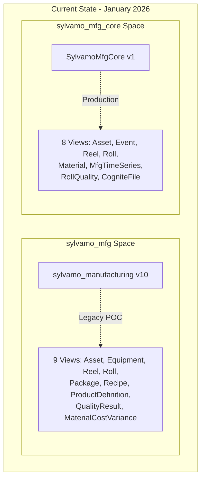
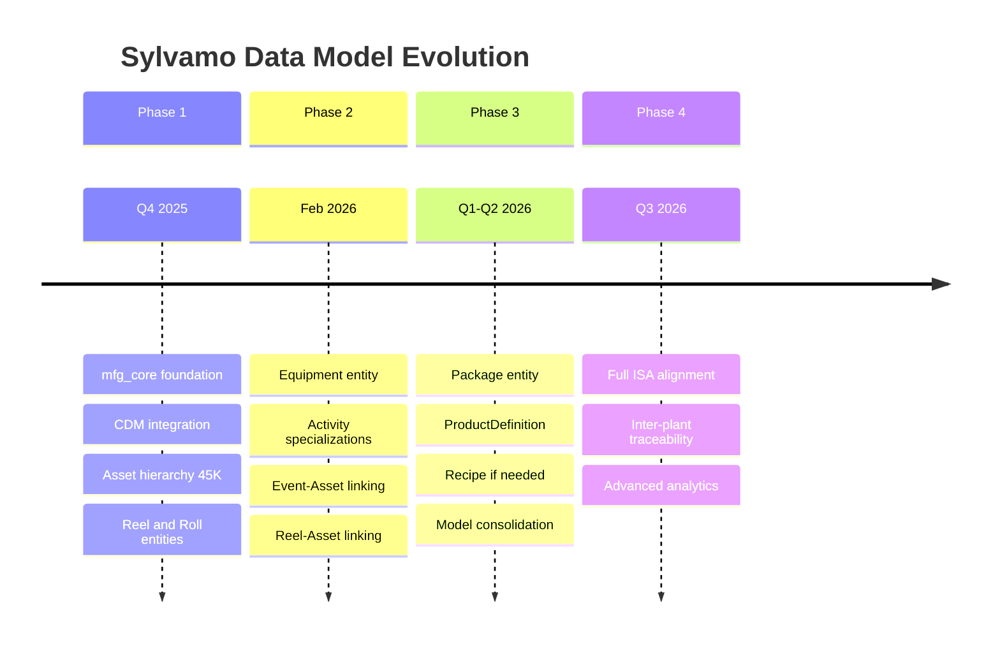
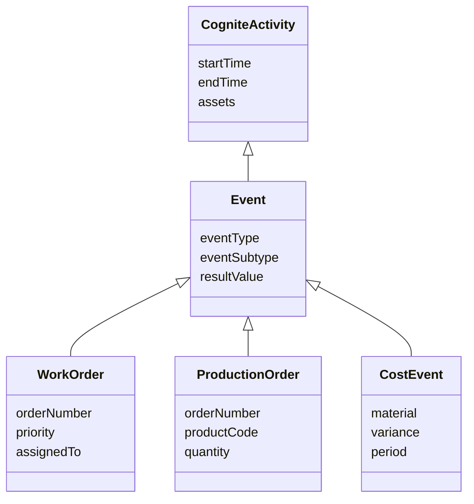
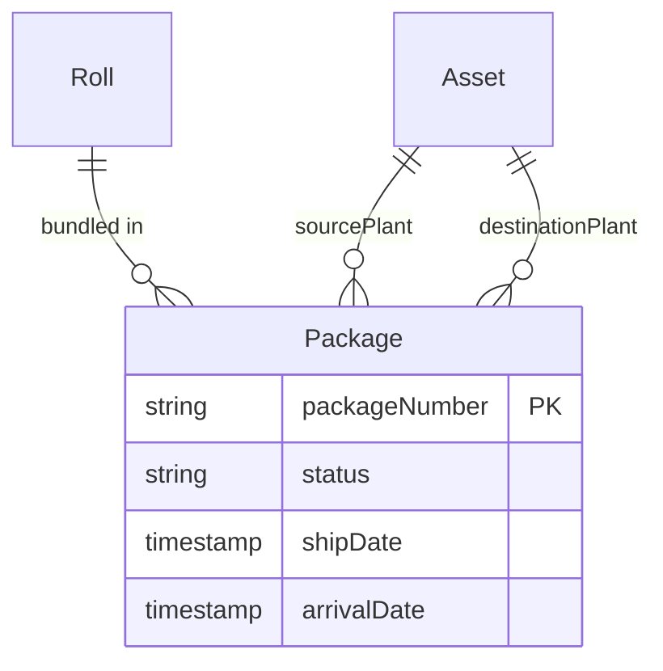
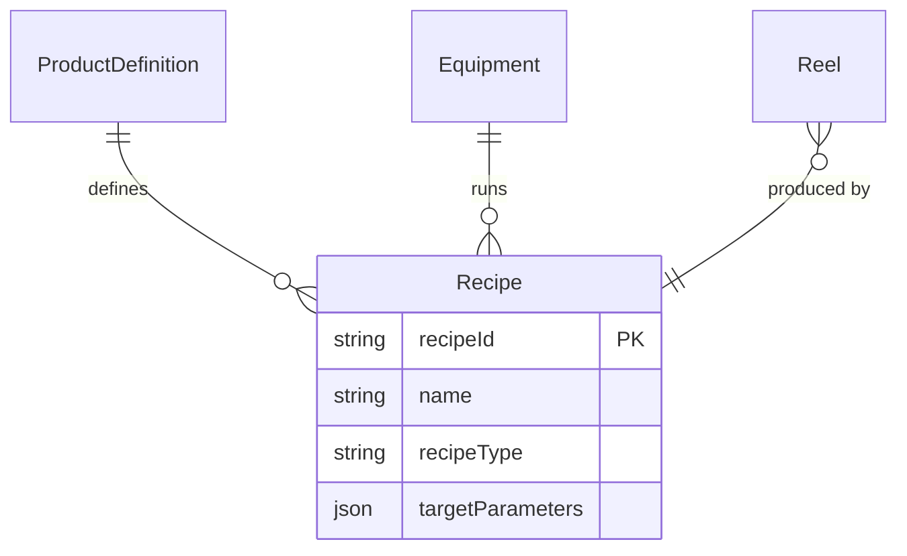
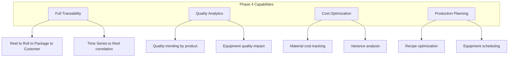

# Sylvamo Data Model Evolution Roadmap

> **Purpose:** Detailed roadmap for evolving Sylvamo data models toward full ISA-95 alignment  
> **Date:** January 31, 2026  
> **Status:** For Discussion

---

## Vision

Evolve the Sylvamo CDF implementation from the current dual-model state to a **unified, CDM-integrated, ISA-95 aligned** data model that supports:

1. Full asset hierarchy with equipment
2. Complete production traceability (Reel to Roll to Package)
3. Quality management integration
4. Inter-plant logistics
5. Cost and material management

---

## Current State Assessment

### Two Models in Production



### Model Maturity Assessment

| Capability | sylvamo_mfg | sylvamo_mfg_core | Target |
|------------|-------------|------------------|--------|
| CDM Integration | Partial | Full | Full |
| Asset Hierarchy | Basic | Complete (45K) | Complete |
| Equipment Linking | Separate | Via Asset.assetType | CogniteEquipment |
| Time Series | Basic | CDM + Preview | Full |
| Files | Not linked | CDM CogniteFile | Full |
| Events | Multiple types | Unified | Specialized |
| Production Tracking | Reel/Roll | Reel/Roll | + Package |
| Quality | QualityResult | Event + RollQuality | Unified |
| Recipes | Recipe entity | Not implemented | Future |
| Cost Management | MaterialCostVariance | Via Event | Unified |

---

## Roadmap Phases



---

## Phase 2: Extended Model (Current Focus)

### Timeline: February 2-13, 2026

### Objectives

1. Add Equipment entity implementing CogniteEquipment
2. Specialize Event into WorkOrder, ProductionOrder, CostEvent
3. Complete Asset-Event-Reel linking
4. Enhance Reel and Roll properties

### Deliverables

#### 2.1 Equipment Entity

```yaml
# New container: MfgEquipment.Container.yaml
externalId: MfgEquipment
usedFor: node
properties:
  equipmentClass:
    type: text
    description: PaperMachine, Winder, Sheeter, Boiler
  manufacturer:
    type: text
  model:
    type: text
  serialNumber:
    type: text
  installDate:
    type: timestamp
  asset:
    type: direct  # Parent asset in hierarchy
```

**ISA-95 Mapping:**
- Equipment = Physical equipment (PM1, PM2, Winder-1)
- Distinct from Asset (functional locations)
- Links to Asset hierarchy

#### 2.2 Activity Specializations



#### 2.3 Enhanced Relationships

| From | To | Relationship | Transformation Update |
|------|-----|--------------|----------------------|
| Reel | Asset | asset (direct) | Map paper machine |
| Roll | Reel | reel (direct) | Already implemented |
| Event | Asset | asset (direct) | Map functional location |
| Equipment | Asset | asset (direct) | Link to parent |
| RollQuality | Asset | asset (direct) | Map location |

### Implementation Tasks

| Task | Priority | Effort | Status |
|------|----------|--------|--------|
| CogniteEquipment container/view | High | 2 days | Planned |
| Equipment transformation | High | 1 day | Planned |
| WorkOrder specialization | Medium | 1 day | In Progress |
| ProductionOrder specialization | Medium | 1 day | In Progress |
| Reel-Asset linking | High | 0.5 day | Planned |
| Event-Asset linking (Proficy) | Medium | 1 day | In Progress |
| RollQuality-Asset linking | Low | 0.5 day | Planned |

---

## Phase 3: Full Production Model

### Timeline: Q1-Q2 2026

### Objectives

1. Add Package entity for inter-plant traceability
2. Add ProductDefinition for product specs
3. Add Recipe entity (if needed by use cases)
4. Consolidate sylvamo_mfg and sylvamo_mfg_core

### Deliverables

#### 3.1 Package Entity



**Properties:**
- packageNumber (unique)
- status (Created, Shipped, InTransit, Received)
- sourcePlant (Eastover)
- destinationPlant (Sumpter)
- rolls (multi-value relation)

#### 3.2 ProductDefinition Entity

```yaml
# New container: ProductDefinition.Container.yaml
externalId: ProductDefinition
properties:
  productId:
    type: text
  productName:
    type: text
  productType:
    type: text  # Bond, Offset, Cover
  basisWeight:
    type: float64
  caliper:
    type: float64
  brightness:
    type: float64
  grade:
    type: text
```

**ISA-95 Alignment:**
- ProductDefinition = ISA-95 ProductDefinition
- Links Reel to ProductDefinition (what was made)
- Links Recipe to ProductDefinition (how to make it)

#### 3.3 Recipe Entity (Optional)



**Types:**
- General Recipe (product definition)
- Master Recipe (site-specific)
- Control Recipe (equipment-specific)

### Model Consolidation Decision

**Option A: Single Model**
- Merge sylvamo_mfg into sylvamo_mfg_core
- Deprecate sylvamo_mfg space
- All entities in one model

**Option B: Layered Models**
- Keep sylvamo_mfg_core as operational layer
- sylvamo_mfg_extended for specialized entities
- Cross-space references

**Recommendation:** Option A (Single Model) for simplicity

---

## Phase 4: Advanced Capabilities

### Timeline: Q3 2026

### Objectives

1. Full ISA-95 Level 3 implementation
2. Advanced analytics support
3. Inter-plant optimization

### Capabilities



---

## ISA-95 Alignment Roadmap

### Current vs. Target

```mermaid
flowchart LR
    subgraph current [Current Implementation]
        direction TB
        C1["Site - Done"]
        C2["Area - Done"]
        C3["ProcessCell - Done"]
        C4["Unit - Done"]
        C5["Equipment - Pending"]
        C6["Batch/Reel - Done"]
        C7["MaterialLot/Roll - Done"]
    end
    
    subgraph target [Target Implementation]
        direction TB
        T1["Site - Done"]
        T2["Area - Done"]
        T3["ProcessCell - Done"]
        T4["Unit - Done"]
        T5["Equipment - Done"]
        T6["Batch/Reel - Done"]
        T7["MaterialLot/Roll - Done"]
        T8["Package - Done"]
        T9["Recipe - Done"]
        T10["ProductDefinition - Done"]
    end
    
    current -->|Phase 2-3| target
```



### ISA Compliance Checklist

| ISA-95 Entity | Current | Phase 2 | Phase 3 |
|---------------|---------|---------|---------|
| Enterprise | N/A | N/A | N/A |
| Site | Yes | Yes | Yes |
| Area | Yes | Yes | Yes |
| ProcessCell | Yes | Yes | Yes |
| Unit | Yes | Yes | Yes |
| EquipmentModule | Yes | Yes | Yes |
| Equipment | No | Yes | Yes |
| ProductDefinition | No | No | Yes |
| ProductRequest | No | No | Future |
| ProductSegment | No | No | Future |
| Recipe | No | No | Yes |
| Batch | Yes | Yes | Yes |
| MaterialLot | Yes | Yes | Yes |
| WorkOrder | Yes | Yes | Yes |

---

## Technical Decisions

### Decision 1: CDM-First Approach

**Context:** Cognite recommends using CDM interfaces for all entities.

**Decision:** All new entities will implement appropriate CDM interfaces.

**Implications:**
- Equipment implements CogniteEquipment
- Maintains compatibility with CDF applications
- Enables standard search, preview features

### Decision 2: Transformation-Based Population

**Context:** Data flows from extractors to RAW to data model.

**Decision:** Use CDF Transformations for all data population.

**Implications:**
- Single transformation per entity per source
- Clear lineage from RAW to data model
- Scheduled refresh (daily/hourly)

### Decision 3: External ID Conventions

**Context:** Need consistent identification across entities.

**Decision:** Use prefix-based external IDs.

**Prefixes:**
- `floc:` - Functional locations (Assets)
- `reel:` - Reels
- `roll:` - Rolls
- `mat:` - Materials
- `eq:` - Equipment
- `pkg:` - Packages
- `prod:` - Product definitions

---

## Risk Assessment

| Risk | Probability | Impact | Mitigation |
|------|-------------|--------|------------|
| Model complexity | Medium | Medium | Phased approach |
| Transformation failures | Low | High | Monitoring, alerts |
| Data quality issues | Medium | Medium | Validation rules |
| SAP data freeze | High | Medium | Work with available data |
| Scope creep | Medium | High | Clear phase boundaries |

---

## Success Metrics

### Phase 2 Success Criteria

| Metric | Target |
|--------|--------|
| Equipment entities created | > 50 |
| Event-Asset linkage rate | > 80% |
| Reel-Asset linkage rate | > 95% |
| All transformations running | 100% |

### Phase 3 Success Criteria

| Metric | Target |
|--------|--------|
| Package entities created | > 10,000 |
| Full traceability paths | > 90% |
| Model consolidation complete | Yes |

---

## Appendix: Entity Count Projections

| Entity | Current | Phase 2 | Phase 3 |
|--------|---------|---------|---------|
| Asset | 45,953 | 46,000 | 46,000 |
| Equipment | 0 | 100 | 200 |
| Event | 100,000+ | 150,000 | 200,000 |
| Reel | 61,335 | 70,000 | 100,000 |
| Roll | 100,000+ | 150,000 | 300,000 |
| Package | 0 | 0 | 50,000 |
| Material | 58,342 | 60,000 | 60,000 |
| ProductDefinition | 0 | 0 | 50 |
| Recipe | 0 | 0 | 100 |

---

*Roadmap prepared for Sylvamo Architecture Meeting*  
*Last updated: January 31, 2026*
