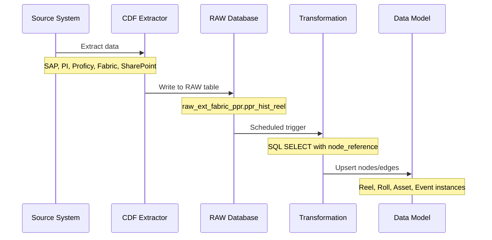
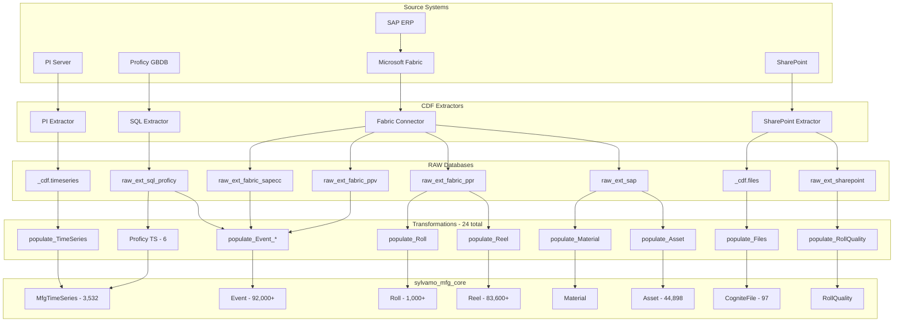
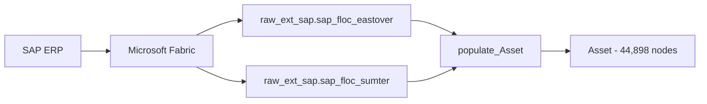
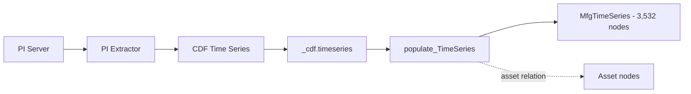
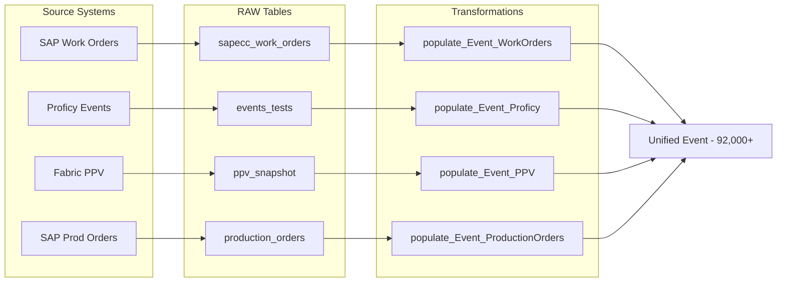
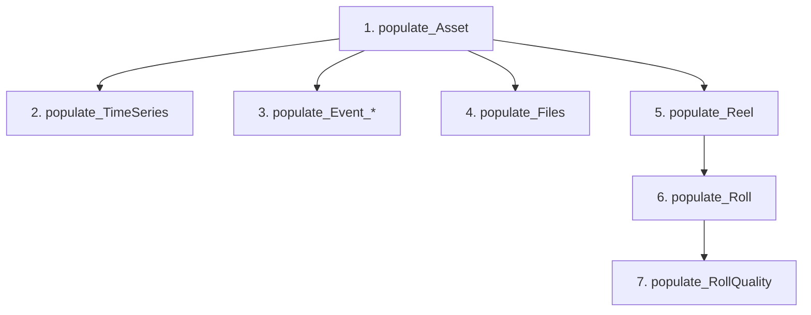

# Sylvamo Transformations: Complete Data Pipeline

> **Purpose:** Comprehensive documentation of all transformations from source systems to data model instances  
> **Model:** `sylvamo_mfg_core` (Production) and `sylvamo_mfg_extended` (Extended Events)  
> **Last Updated:** February 2026

---

## Table of Contents

1. [Overview](#1-overview)
2. [Architecture](#2-architecture)
3. [Complete Transformation Inventory](#3-complete-transformation-inventory)
4. [Transformation Details by Entity](#4-transformation-details-by-entity)
5. [Data Sources](#5-data-sources)
6. [Scheduling and Refresh](#6-scheduling-and-refresh)
7. [External ID Conventions](#7-external-id-conventions)
8. [Troubleshooting](#8-troubleshooting)

---

## 1. Overview

The Sylvamo CDF implementation uses **24 SQL transformations** across 3 toolkit modules to populate the data model from 5 source systems.

### Key Statistics

| Metric | Value |
|--------|-------|
| **Total Transformations** | 24 SQL transformations |
| **Toolkit Modules** | mfg_core, mfg_extended, infield |
| **Source Systems** | SAP, PI, Proficy, Fabric, SharePoint |
| **RAW Databases** | 6 databases |
| **Target Entities** | 10+ views |
| **Total Nodes Populated** | 450,000+ |

### Data Flow Overview



---

## 2. Architecture

### Complete Data Pipeline



### Toolkit Module Structure

```
sylvamo/modules/
├── mfg_core/transformations/           # Core data model - 19 transformations
│   ├── populate_Asset.Transformation.sql
│   ├── populate_Reel.Transformation.sql
│   ├── populate_Roll.Transformation.sql
│   ├── populate_TimeSeries.Transformation.sql
│   ├── populate_Event_WorkOrders.Transformation.sql
│   ├── populate_Event_Proficy.Transformation.sql
│   ├── populate_Event_PPV.Transformation.sql
│   ├── populate_Event_ProductionOrders.Transformation.sql
│   ├── populate_Files.Transformation.sql
│   ├── populate_Material.Transformation.sql
│   ├── populate_RollQuality.Transformation.sql
│   ├── populate_ProficyTimeSeries.Transformation.sql
│   ├── populate_ProficyDatapoints.Transformation.sql
│   ├── populate_ProficyEventIdTimeSeries.Transformation.sql
│   ├── populate_ProficyEventIdDatapoints.Transformation.sql
│   ├── create_ProficyTimeSeries_CDF.Transformation.sql
│   └── create_ProficyEventIdTimeSeries_CDF.Transformation.sql
│
├── mfg_extended/transformations/       # Extended events - 5 transformations
│   ├── populate_WorkOrder.Transformation.sql
│   ├── populate_ProductionOrder.Transformation.sql
│   ├── populate_ProductionEvent.Transformation.sql
│   ├── populate_CostEvent.Transformation.sql
│   └── populate_Operation.Transformation.sql
│
└── infield/cdf_infield_location/transformations/  # InField sync - 2 transformations
    ├── tr_asset_oid_workmate_infield_sync_assets_from_hierarchy_to_apm.Transformation.sql
    └── tr_workorder_oid_workmate_infield_sync_workorders_to_apm_activities.Transformation.sql
```

---

## 3. Complete Transformation Inventory

### mfg_core Module (19 transformations)

| Transformation | Source | Target | Records | Purpose |
|----------------|--------|--------|---------|---------|
| **populate_Asset** | raw_ext_sap.sap_floc_eastover, sap_floc_sumter | Asset | 44,898 | SAP functional location hierarchy |
| **populate_Reel** | raw_ext_fabric_ppr.ppr_hist_reel | Reel | 83,600+ | Paper reel production data |
| **populate_Roll** | raw_ext_fabric_ppr.ppr_hist_roll | Roll | 1,000+ | Cut roll data (limited for demo) |
| **populate_TimeSeries** | _cdf.timeseries | MfgTimeSeries | 3,532 | PI time series with asset links |
| **populate_Event_WorkOrders** | raw_ext_fabric_sapecc.sapecc_work_orders | Event | ~223 | SAP work orders |
| **populate_Event_Proficy** | raw_ext_sql_proficy.events_tests | Event | ~61 | Proficy events/tests |
| **populate_Event_PPV** | raw_ext_fabric_ppv.ppv_snapshot | Event | ~716 | Purchase price variance events |
| **populate_Event_ProductionOrders** | raw_ext_sap.production_orders | Event | ~50,000 | SAP production orders |
| **populate_Files** | _cdf.files | CogniteFile | 97 | Files with asset links |
| **populate_Material** | raw_ext_sap.materials | Material | TBD | SAP materials |
| **populate_RollQuality** | raw_ext_sharepoint.roll_quality | RollQuality | TBD | SharePoint quality reports |
| **populate_ProficyTimeSeries** | raw_ext_sql_proficy | MfgTimeSeries | - | Proficy time series nodes |
| **populate_ProficyDatapoints** | raw_ext_sql_proficy | CDF TimeSeries | - | Proficy datapoint ingestion |
| **populate_ProficyEventIdTimeSeries** | raw_ext_sql_proficy | MfgTimeSeries | - | Event-linked time series |
| **populate_ProficyEventIdDatapoints** | raw_ext_sql_proficy | CDF TimeSeries | - | Event-linked datapoints |
| **create_ProficyTimeSeries_CDF** | raw_ext_sql_proficy | CDF TimeSeries | - | Create classic TS resources |
| **create_ProficyEventIdTimeSeries_CDF** | raw_ext_sql_proficy | CDF TimeSeries | - | Create event-linked TS |

### mfg_extended Module (5 transformations)

| Transformation | Source | Target | Purpose |
|----------------|--------|--------|---------|
| **populate_WorkOrder** | Event (filtered) | WorkOrder | Specialized WorkOrder view |
| **populate_ProductionOrder** | Event (filtered) | ProductionOrder | Specialized ProductionOrder view |
| **populate_ProductionEvent** | Event (filtered) | ProductionEvent | Specialized ProductionEvent view |
| **populate_CostEvent** | Event (filtered) | CostEvent | Specialized CostEvent view |
| **populate_Operation** | Event (filtered) | Operation | Operation entity |

### infield Module (2 transformations)

| Transformation | Source | Target | Purpose |
|----------------|--------|--------|---------|
| **tr_asset_oid_workmate_infield_sync_assets_from_hierarchy_to_apm** | Asset hierarchy | APM Assets | Sync to InField |
| **tr_workorder_oid_workmate_infield_sync_workorders_to_apm_activities** | Work Orders | APM Activities | Sync WOs to InField |

---

## 4. Transformation Details by Entity

### 4.1 Asset Transformation

**Transformation:** `populate_Asset`  
**Source:** `raw_ext_sap.sap_floc_eastover`, `raw_ext_sap.sap_floc_sumter`  
**Target:** Asset view (MfgAsset container)  
**CDM Interface:** CogniteAsset

**Data Flow:**



**SQL Example:**

```sql
-- Create root nodes for each plant
SELECT
    'floc:0769' as externalId,
    'sylvamo_mfg_core_instances' as space,
    'Eastover Mill' as name,
    'Site' as assetType,
    '0769' as sapFunctionalLocation,
    cast(null as STRUCT<space: STRING, externalId: STRING>) as parent

UNION ALL

-- Populate child assets with parent references
SELECT
    concat('floc:', cast(`functional_location` as STRING)) as externalId,
    'sylvamo_mfg_core_instances' as space,
    cast(`functional_location_description` as STRING) as name,
    CASE 
        WHEN `hierarchy_level` = 2 THEN 'Area'
        WHEN `hierarchy_level` = 3 THEN 'ProcessCell'
        WHEN `hierarchy_level` <= 5 THEN 'Unit'
        ELSE 'Equipment'
    END as assetType,
    cast(`functional_location` as STRING) as sapFunctionalLocation,
    -- Parent derived by removing last FLOC segment
    node_reference('sylvamo_mfg_core_instances', 
        concat('floc:', regexp_replace(`functional_location`, '-[^-]+$', ''))) as parent
FROM `raw_ext_sap`.`sap_floc_eastover`
WHERE `functional_location` IS NOT NULL
```

**Key Patterns:**
- Root nodes created with `parent = null`
- Parent derived using `regexp_replace` to strip last segment
- `node_reference()` creates typed relation to parent
- `assetType` derived from `hierarchy_level`

---

### 4.2 Reel Transformation

**Transformation:** `populate_Reel`  
**Source:** `raw_ext_fabric_ppr.ppr_hist_reel`  
**Target:** Reel view (MfgReel container)

**Data Flow:**


**SQL Example:**

```sql
SELECT
    concat('reel:', cast(`REEL_NUMBER` as STRING), '_', 
           substring(cast(`REEL_MANUFACTURED_DATE` as STRING), 1, 4)) as externalId,
    'sylvamo_mfg_core_instances' as space,
    
    -- CDM Describable properties
    concat('Reel ', cast(`REEL_NUMBER` as STRING)) as name,
    
    -- MfgReel properties
    concat(cast(`REEL_NUMBER` as STRING), '_', 
           substring(cast(`REEL_MANUFACTURED_DATE` as STRING), 1, 4)) as reelNumber,
    to_utc_timestamp(
        to_timestamp(cast(`REEL_MANUFACTURED_DATE` as STRING), 'yyyyMMdd'), 
        'US/Eastern'
    ) as productionDate,
    cast(`REEL_FINISHED_WEIGHT` as DOUBLE) as weight,
    cast(`REEL_AVERAGE_BASIS_WEIGHT` as DOUBLE) as avgBasisWeight,
    
    -- Status mapping
    CASE 
        WHEN `REEL_STATUS_IND` = 'C' THEN 'Complete'
        WHEN `REEL_STATUS_IND` = 'P' THEN 'InProduction'
        WHEN `REEL_STATUS_IND` = 'H' THEN 'QualityHold'
        ELSE cast(`REEL_STATUS_IND` as STRING)
    END as status,
    
    -- Deduplication
    row_number() OVER (PARTITION BY `REEL_NUMBER`, 
                       substring(cast(`REEL_MANUFACTURED_DATE` as STRING), 1, 4) 
                       ORDER BY `REEL_MANUFACTURED_DATE` DESC) as rn
FROM `raw_ext_fabric_ppr`.`ppr_hist_reel`
WHERE `REEL_NUMBER` IS NOT NULL
```

**Key Patterns:**
- External ID includes year to ensure uniqueness across years
- Timestamp conversion from YYYYMMDD to UTC
- Status code mapping to human-readable values
- Deduplication using `row_number()` window function

---

### 4.3 TimeSeries Transformation

**Transformation:** `populate_TimeSeries`  
**Source:** `_cdf.timeseries` (CDF internal table)  
**Target:** MfgTimeSeries view

**Data Flow:**



**SQL Example:**

```sql
SELECT
    CASE 
        WHEN `externalId` IS NOT NULL THEN cast(`externalId` as STRING)
        ELSE concat('ts:', cast(`id` as STRING))
    END as externalId,
    'sylvamo_mfg_core_instances' as space,
    
    -- CDM CogniteTimeSeries properties
    CASE WHEN `isString` = true THEN 'string' ELSE 'numeric' END as type,
    coalesce(`isStep`, false) as isStep,
    
    -- Reference to CDF Time Series for preview/sparkline
    CASE 
        WHEN `externalId` IS NOT NULL THEN cast(`externalId` as STRING)
        ELSE cast(`id` as STRING)
    END as timeSeries,
    
    -- Asset relation based on PI tag prefix
    CASE
        WHEN `externalId` LIKE 'pi:471%'
        THEN array(node_reference('sylvamo_mfg_core_instances', 'floc:0769-06-01-010'))
        WHEN `externalId` LIKE 'pi:472%'
        THEN array(node_reference('sylvamo_mfg_core_instances', 'floc:0769-06-01-020'))
        ELSE array()
    END as assets
FROM `_cdf`.`timeseries`
```

**Key Patterns:**
- Uses `_cdf.timeseries` to access CDF classic time series
- `timeSeries` property enables sparkline preview in UI
- Asset linking based on PI tag prefix (471* = PM1, 472* = PM2)

---

### 4.4 Event Transformations

**Transformations:** 4 separate transformations for different event types

| Transformation | Source | eventType |
|----------------|--------|-----------|
| populate_Event_WorkOrders | raw_ext_fabric_sapecc.sapecc_work_orders | WorkOrder |
| populate_Event_Proficy | raw_ext_sql_proficy.events_tests | ProductionEvent |
| populate_Event_PPV | raw_ext_fabric_ppv.ppv_snapshot | CostEvent |
| populate_Event_ProductionOrders | raw_ext_sap.production_orders | ProductionOrder |

**Data Flow:**



**SQL Example (Work Orders):**

```sql
SELECT
    concat('wo-event:', cast(`ORDER` as STRING)) as externalId,
    'sylvamo_mfg_core_instances' as space,
    
    -- CDM Activity properties
    to_timestamp(cast(`CREATED_ON` as STRING)) as startTime,
    to_timestamp(cast(`COMPLETION_BY_DATE` as STRING)) as endTime,
    
    -- MfgEvent properties
    'WorkOrder' as eventType,
    cast(`NOTIFICATION_TYPE` as STRING) as eventSubtype,
    'SAP-Fabric' as sourceSystem,
    
    -- Asset relation via FUNCTIONAL_LOCATION
    CASE 
        WHEN `FUNCTIONAL_LOCATION` IS NOT NULL 
             AND `FUNCTIONAL_LOCATION` LIKE '0769%'
        THEN node_reference('sylvamo_mfg_core_instances', 
                            concat('floc:', cast(`FUNCTIONAL_LOCATION` as STRING)))
        ELSE cast(null as STRUCT<space: STRING, externalId: STRING>)
    END as asset
FROM `raw_ext_fabric_sapecc`.`sapecc_work_orders`
```

**Key Patterns:**
- Unified Event entity with `eventType` discriminator
- Different external ID prefixes per source (wo-event:, proficy-event:, etc.)
- Asset linking via FUNCTIONAL_LOCATION for Eastover (0769)

---

### 4.5 Files Transformation

**Transformation:** `populate_Files`  
**Source:** `_cdf.files` (CDF internal table)  
**Target:** CogniteFile (CDM view)

**SQL Example:**

```sql
SELECT
    externalId,
    'sylvamo_mfg_core_instances' as space,
    name,
    mimeType,
    directory,
    
    -- Asset relation based on directory path
    CASE
        WHEN directory LIKE '%/Eastover/%' OR directory LIKE '%:Eastover/%'
        THEN array(node_reference('sylvamo_mfg_core_instances', 'floc:0769'))
        ELSE array()
    END as assets
FROM `_cdf`.`files`
WHERE externalId IS NOT NULL AND externalId != ''
```

---

## 5. Data Sources

### RAW Database Inventory

| Database | Extractor | Tables | Description |
|----------|-----------|--------|-------------|
| **raw_ext_sap** | Fabric Connector | sap_floc_eastover, sap_floc_sumter, materials, production_orders | SAP master and transactional data |
| **raw_ext_fabric_ppr** | Fabric Connector | ppr_hist_reel, ppr_hist_roll, ppr_hist_package | Paper Production Reporting |
| **raw_ext_fabric_ppv** | Fabric Connector | ppv_snapshot | Purchase Price Variance |
| **raw_ext_fabric_sapecc** | Fabric Connector | sapecc_work_orders | SAP work orders |
| **raw_ext_sql_proficy** | SQL Extractor | events_tests, timeseries_config | Proficy GBDB |
| **raw_ext_sharepoint** | SharePoint Extractor | roll_quality | Quality reports |
| **_cdf.timeseries** | PI Extractor | (internal) | CDF classic time series |
| **_cdf.files** | SharePoint Extractor | (internal) | CDF classic files |

### Source System Data Volumes

| Source | Records | Entities |
|--------|---------|----------|
| SAP Functional Locations | 44,898 | Asset |
| PPR Reels | 83,600+ | Reel |
| PPR Rolls | 200,000+ (limited to 1,000 for demo) | Roll |
| SAP Work Orders | ~223 | Event (WorkOrder) |
| SAP Production Orders | ~50,000 | Event (ProductionOrder) |
| Proficy Events | ~61 | Event (ProductionEvent) |
| Fabric PPV | ~716 | Event (CostEvent) |
| PI Time Series | 3,532 | MfgTimeSeries |
| SharePoint Files | 97 | CogniteFile |

---

## 6. Scheduling and Refresh

### Transformation Schedule

| Transformation | Schedule | Estimated Runtime |
|----------------|----------|-------------------|
| populate_Asset | Daily 2:00 AM | 2-3 min |
| populate_Reel | Hourly | 5-10 min |
| populate_Roll | Hourly | 2-5 min |
| populate_TimeSeries | On PI extractor run | 1-2 min |
| populate_Event_* | Every 15 min | 1-5 min each |
| populate_Files | Daily | < 1 min |
| populate_Material | Weekly | 2-3 min |
| populate_RollQuality | Daily | < 1 min |

### Dependency Order



**Note:** Asset must run first as other transformations create relations to Asset nodes.

---

## 7. External ID Conventions

| Entity | Pattern | Example |
|--------|---------|---------|
| Asset | `floc:{functional_location}` | `floc:0769-06-01-010` |
| Reel | `reel:{reel_number}_{year}` | `reel:EM0011207003_2024` |
| Roll | `roll:{roll_number}` | `roll:R-20240115-12345` |
| Event (WorkOrder) | `wo-event:{order_number}` | `wo-event:12345678` |
| Event (Proficy) | `proficy-event:{event_id}` | `proficy-event:EVT-001` |
| Event (PPV) | `ppv-event:{id}` | `ppv-event:PPV-2024-001` |
| Event (ProdOrder) | `sap-po:{order_number}` | `sap-po:1000012345` |
| TimeSeries | `{externalId}` or `ts:{id}` | `pi:471.PM1.TEMP` |
| File | `{externalId}` | `sharepoint:file-123` |
| Material | `mat:{material_number}` | `mat:100012345` |

---

## 8. Troubleshooting

### Common Issues

#### 1. Transformation Fails with "Node not found"

**Cause:** Target node reference doesn't exist (e.g., asset relation to non-existent asset)

**Solution:** 
- Ensure parent transformations (e.g., populate_Asset) run first
- Check external ID format matches expected pattern
- Use `CASE WHEN ... ELSE null` to handle missing references

```sql
-- Safe asset reference
CASE 
    WHEN `FUNCTIONAL_LOCATION` IS NOT NULL 
         AND `FUNCTIONAL_LOCATION` LIKE '0769%'
    THEN node_reference('sylvamo_mfg_core_instances', 
                        concat('floc:', cast(`FUNCTIONAL_LOCATION` as STRING)))
    ELSE cast(null as STRUCT<space: STRING, externalId: STRING>)
END as asset
```

#### 2. Duplicate Key Violations

**Cause:** Multiple source rows map to same external ID

**Solution:** Use deduplication with window functions

```sql
SELECT * FROM (
    SELECT
        concat('reel:', REEL_NUMBER) as externalId,
        -- other columns
        row_number() OVER (PARTITION BY REEL_NUMBER ORDER BY MANUFACTURED_DATE DESC) as rn
    FROM source_table
) deduped
WHERE rn = 1
```

#### 3. Timestamp Parsing Errors

**Cause:** Source date format doesn't match expected pattern

**Solution:** Handle null/empty values and use correct format string

```sql
CASE 
    WHEN `DATE_FIELD` IS NOT NULL AND trim(cast(`DATE_FIELD` as STRING)) != ''
    THEN to_timestamp(cast(`DATE_FIELD` as STRING), 'yyyyMMdd')
    ELSE null
END as parsedDate
```

#### 4. Asset Links Not Appearing in UI

**Cause:** Reverse relation not defined or asset doesn't exist

**Solution:**
- Verify asset external ID exists in Asset view
- Check reverse relation is defined in container/view
- Verify instance space matches

### Monitoring Transformations

```bash
# Check transformation status via CDF API
cdf transformations list --project sylvamo-prod

# View transformation run history
cdf transformations runs list --transformation-id <id>

# Check for failed runs
cdf transformations runs list --status failed
```

---

## Related Documentation

| Document | Description |
|----------|-------------|
| [ARCHITECTURE_DECISIONS_AND_ROADMAP.md](ARCHITECTURE_DECISIONS_AND_ROADMAP.md) | Architecture decisions and ISA-95 roadmap |
| [EXTRACTORS.md](../extractors/EXTRACTORS.md) | Extractor configurations |
| [DATA_MODEL_SPECIFICATION.md](DATA_MODEL_SPECIFICATION.md) | Container and view definitions |

---

*Document generated: February 2026*  
*Version: 1.0*
