# Annotation Workflow & File Versioning

> How CDF manages annotations on engineering diagrams: creation, scoring, approval, and behavior across file revisions.

**Last updated:** February 10, 2026

---

## Table of Contents

- [Overview](#overview)
- [What Is an Annotation?](#what-is-an-annotation)
- [Annotation Types](#annotation-types)
- [Annotation Lifecycle (State Machine)](#annotation-lifecycle-state-machine)
- [Confidence Scoring Model](#confidence-scoring-model)
- [Approval Workflow](#approval-workflow)
- [Annotation Storage & Ownership](#annotation-storage--ownership)
- [File Versioning: What CDF Does and Does Not Do](#file-versioning-what-cdf-does-and-does-not-do)
- [Revision Scenarios](#revision-scenarios)
- [Re-Contextualization Pipeline](#re-contextualization-pipeline)
- [What Survives a Revision](#what-survives-a-revision)
- [Best Practices](#best-practices)
- [Annotation API Reference](#annotation-api-reference)
- [Frequently Asked Questions](#frequently-asked-questions)

---

## Overview

When CDF parses a P&ID or engineering diagram, it creates **annotations** — precise, structured links between specific regions on the document and CDF resources (assets, time series, other files). This document covers how those annotations are managed throughout their lifecycle, including what happens when the underlying document is revised.

---

## What Is an Annotation?

An annotation is a record that says:

> "At this exact location on this document, there is a tag that refers to this specific resource in CDF."

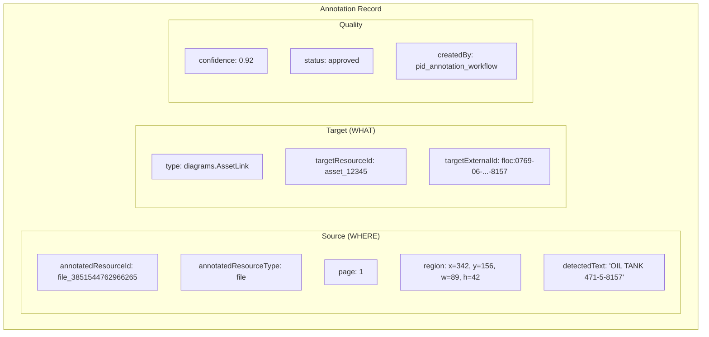

**Key properties:**
- **Bounding box** — pixel coordinates on the specific page
- **Detected text** — what OCR read at that location
- **Target** — the CDF resource this tag links to
- **Confidence** — how certain the match is (0.0 to 1.0)
- **Status** — whether the annotation is approved, suggested, or rejected

---

## Annotation Types

CDF uses three annotation types for engineering diagrams:

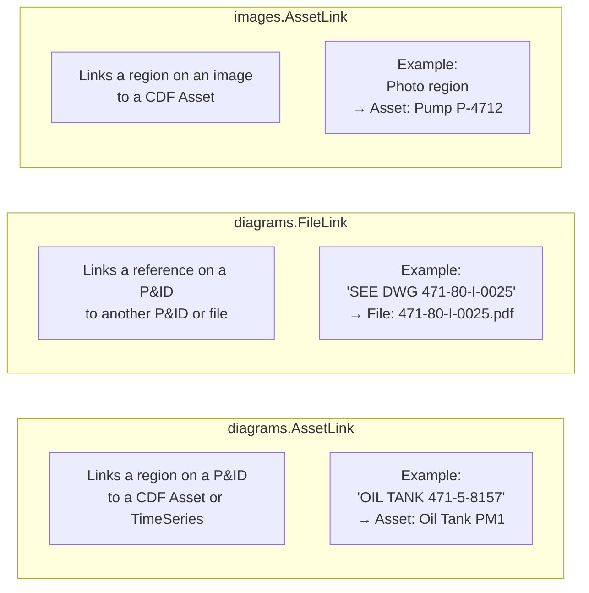

| Type | Use Case | Created By |
|------|----------|-----------|
| `diagrams.AssetLink` | Equipment/instrument tag → asset or time series | Diagrams API, Workflow, Manual |
| `diagrams.FileLink` | Drawing reference → other P&ID | Diagrams API, Workflow, Manual |
| `images.AssetLink` | Photo/image region → asset | Vision API, Manual |

---

## Annotation Lifecycle (State Machine)

Each annotation goes through a defined lifecycle:

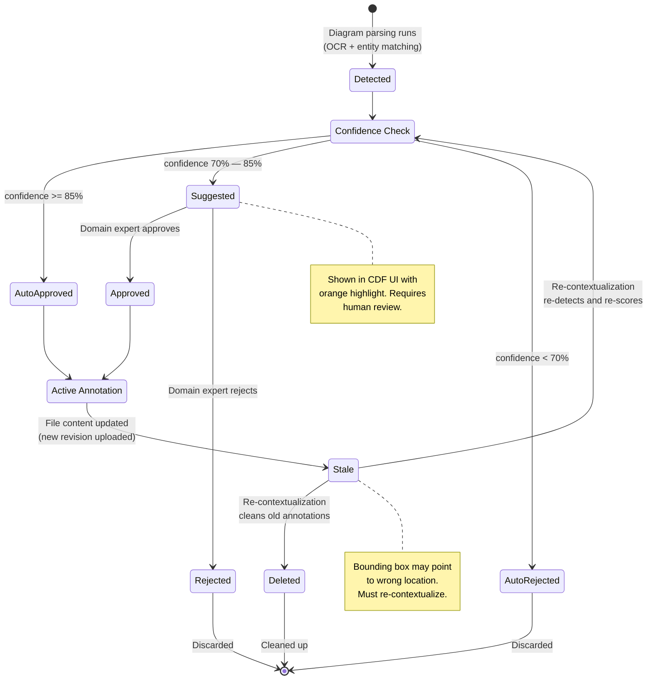

### State Definitions

| State | Description | Visible in UI? | Navigable? |
|-------|-------------|----------------|------------|
| **Detected** | Just created by detection; confidence not yet evaluated | No (transient) | No |
| **Auto-Approved** | High confidence; immediately active | Yes (blue outline) | Yes |
| **Suggested** | Medium confidence; needs review | Yes (orange outline) | No |
| **Approved** | Expert confirmed the link | Yes (blue outline) | Yes |
| **Auto-Rejected** | Low confidence; discarded | No | No |
| **Rejected** | Expert rejected the link | No | No |
| **Stale** | Document changed; annotation may be wrong | Yes (still shows) | Yes (but unreliable) |

---

## Confidence Scoring Model

### How Confidence Is Calculated

The Diagrams API calculates confidence based on:

1. **Text similarity** — how well the detected text matches the entity name/identifier
2. **Token overlap** — shared tokens between detection and entity
3. **Uniqueness** — whether the match is ambiguous (multiple candidates) or clear

### Recommended Two-Threshold System

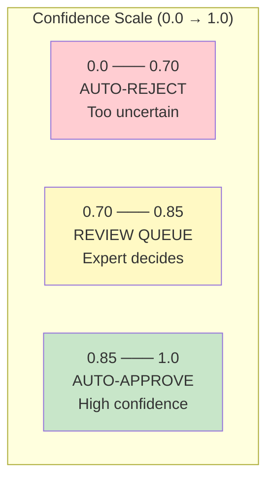

| Range | Action | Rationale |
|-------|--------|-----------|
| **< 70%** | Auto-reject | Too many false positives at lower thresholds |
| **70% — 85%** | Queue for review | Plausible but needs human confirmation |
| **>= 85%** | Auto-approve | High confidence; reliable for production use |

> **Anti-pattern:** Using a single low threshold (e.g., 0.20) for auto-approval produces many false positives and undermines trust in the interactive diagrams.

### Quality Metric

The overall quality of a parsed P&ID can be measured as:

```
Contextualization Quality = Matched Tags / Total Detected Tags
```

A well-contextualized P&ID typically achieves 70-90% quality, with the remainder being generic text (e.g., "PROCESS WATER", "NOTES") that should not link to any resource.

---

## Approval Workflow

### In the CDF UI

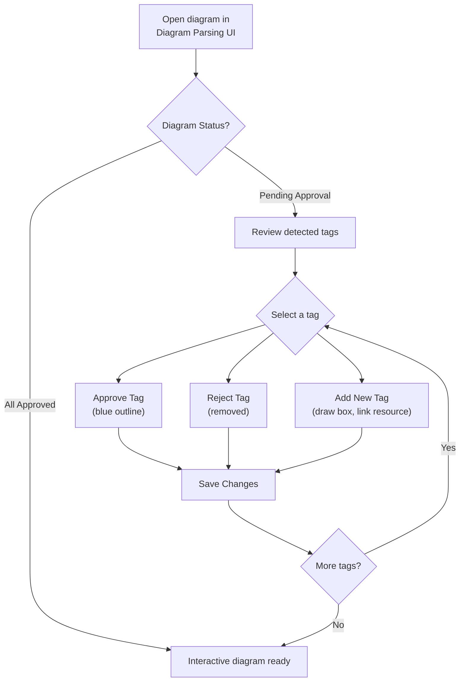

### Via the Automated Workflow (Deployment Pack)

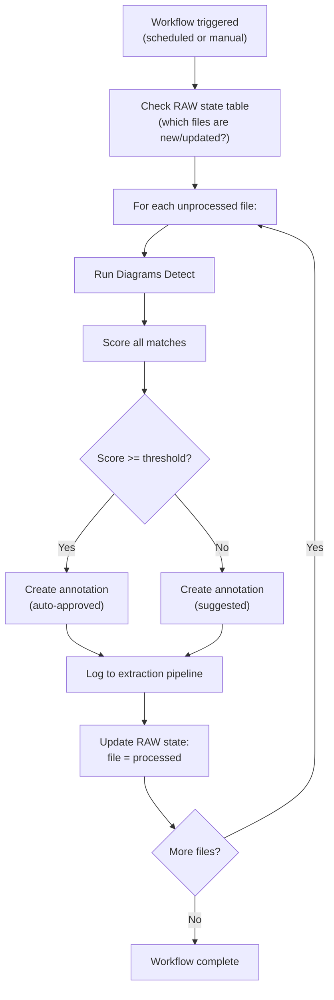

### Bulk Operations

The CDF UI supports bulk actions on diagrams:

| Action | Effect |
|--------|--------|
| **Approve All** | Approves all pending tags on selected diagrams |
| **Reject Pending** | Rejects all pending tags |
| **Clear All Tags** | Removes all annotations |
| **Recontextualize** | Re-runs detection from scratch |

---

## Annotation Storage & Ownership

### Where Annotations Live

Annotations are stored as CDF resources associated with a file:

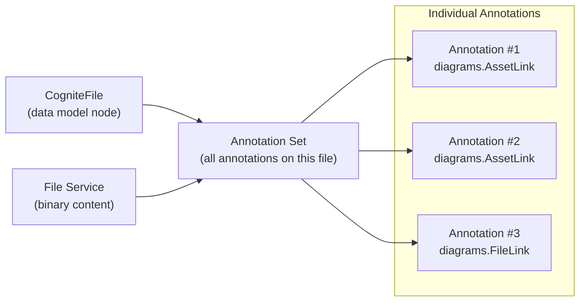

### Ownership and Cleanup Rules

When re-contextualizing, it's critical to know **who created** each annotation:

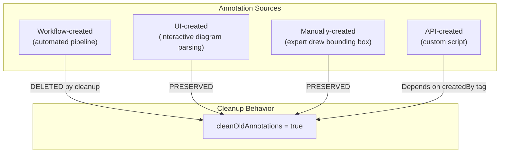

**Rule:** The automated workflow only deletes annotations **it created** (identified by the `createdBy` field). Manually created annotations and annotations from other tools are preserved.

---

## File Versioning: What CDF Does and Does Not Do

### What CDF Provides

| Feature | Available? | Details |
|---------|-----------|---------|
| Store file binary | Yes | Upload via File Service |
| Replace file content | Yes | Re-upload to same externalId |
| Track file metadata changes | Yes | `lastUpdatedTime` updates |
| Maintain revision history | **No** | Old content overwritten |
| Compare revisions (diff) | **No** | No built-in comparison |
| Auto-carry annotations to new revision | **No** | Must re-detect |
| Version numbering | **No** | Manual via metadata/externalId |

### The Versioning Gap

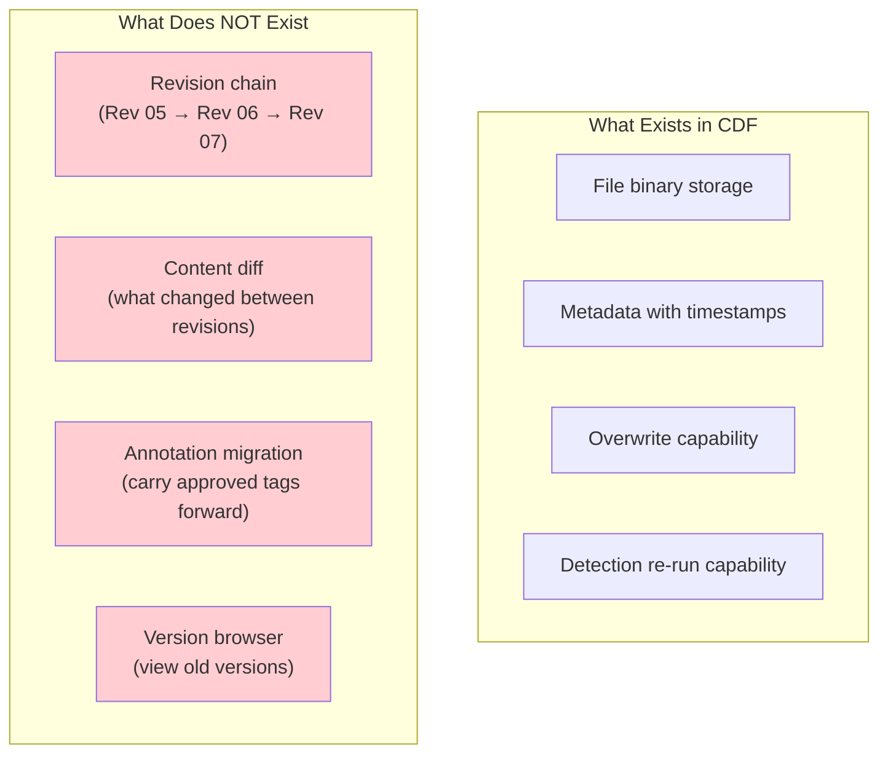

---

## Revision Scenarios

### Scenario 1: Minor Layout Change (Equipment Repositioned)

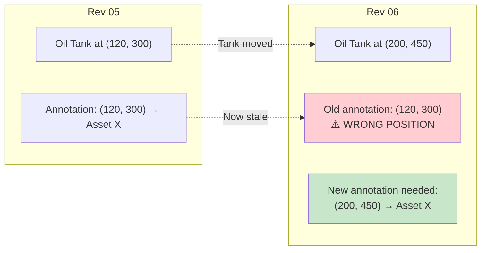

**Result:** Same asset link, but bounding box is wrong. Must re-detect to get correct coordinates.

### Scenario 2: Equipment Added

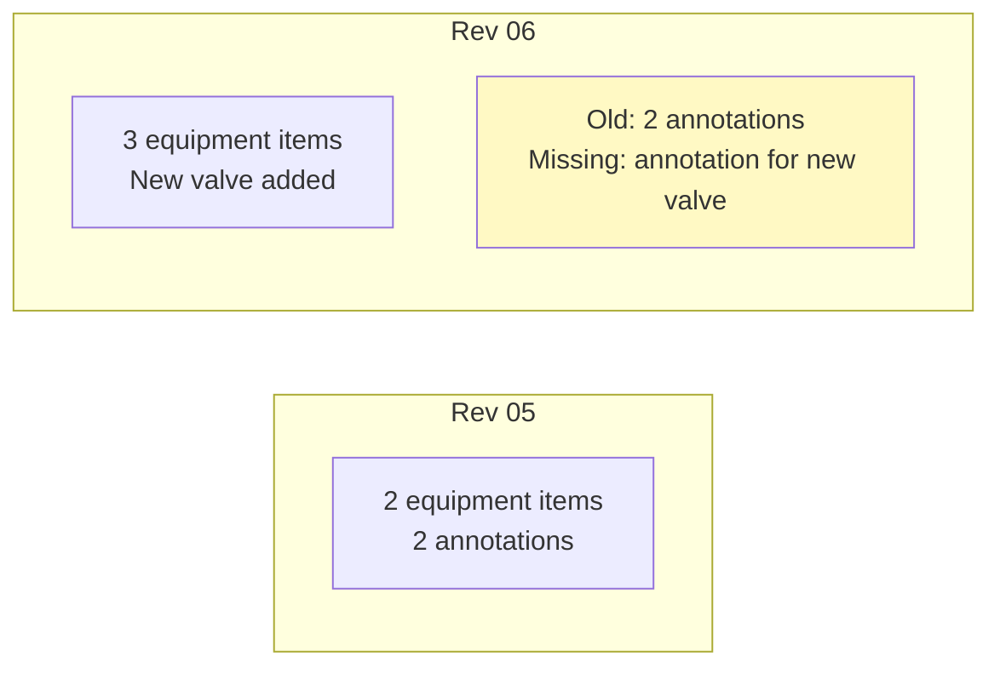

**Result:** New equipment has no annotation. Must re-detect to find the new tag.

### Scenario 3: Equipment Removed

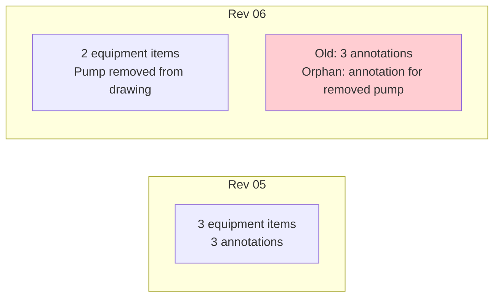

**Result:** An annotation exists for equipment no longer on the drawing. Must re-detect and clean old annotations.

### Scenario 4: Cross-Reference Changed

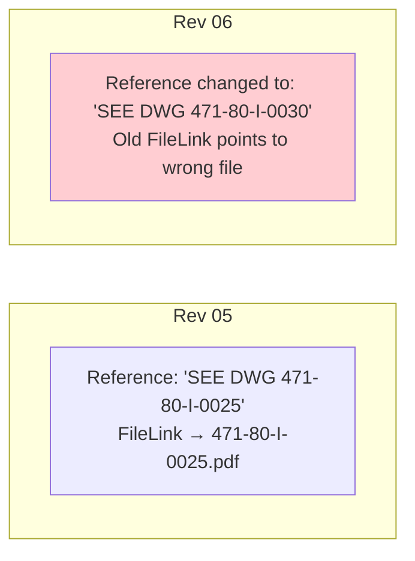

**Result:** FileLink annotation points to the wrong document. Must re-detect.

---

## Re-Contextualization Pipeline

### Full Sequence

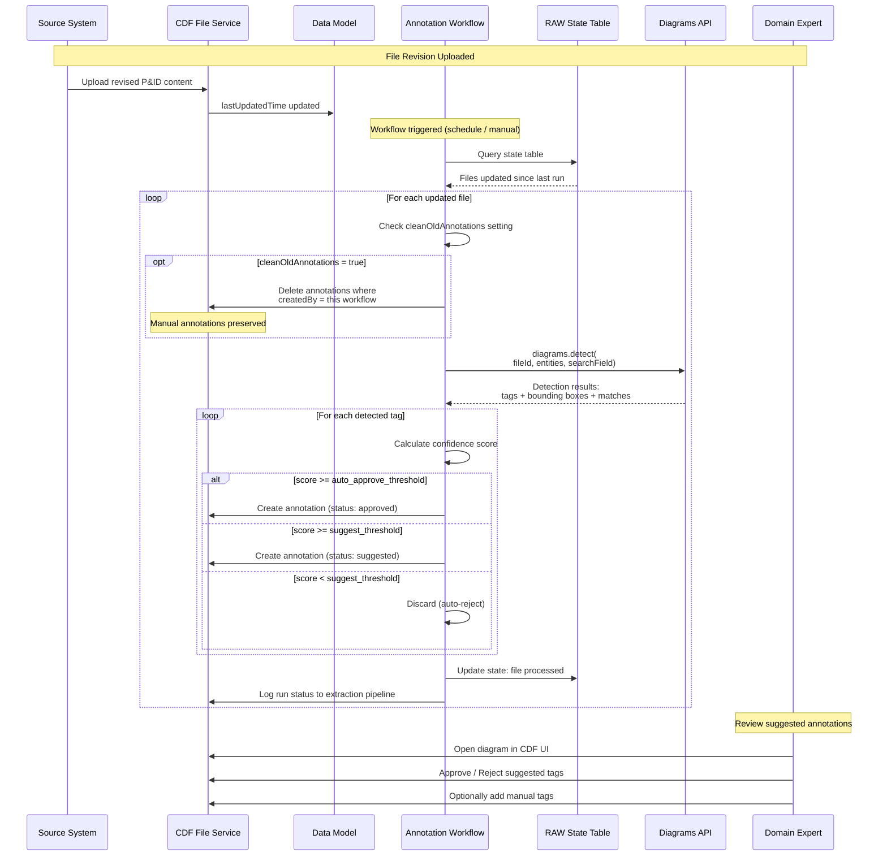

### Run Modes

| Mode | Behavior | When to Use |
|------|----------|-------------|
| **Incremental** | Only processes files with `lastUpdatedTime` newer than last run | Default; for ongoing operations |
| **ALL** | Clears RAW state and reprocesses every file | After major data model changes or bulk re-ingestion |
| **Full Cleanup** | Sets `cleanOldAnnotations = true` + ALL mode | When annotation quality needs full reset |

---

## What Survives a Revision

Summary of what persists and what is lost when a P&ID is revised:

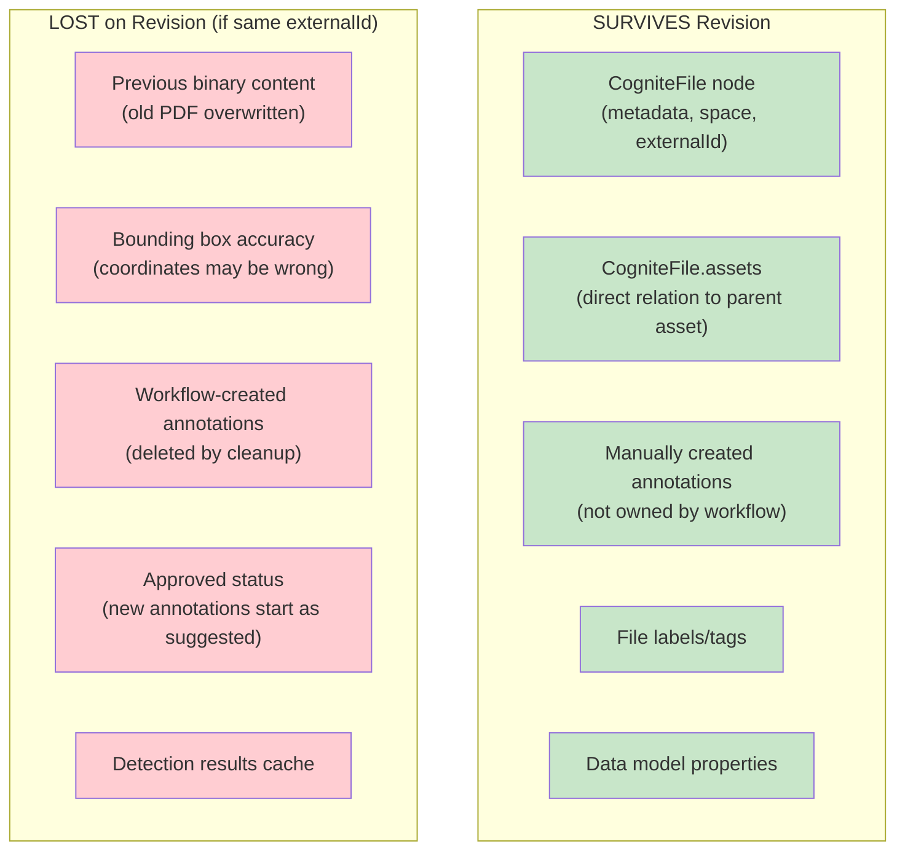

---

## Best Practices

### 1. Revision Strategy

| Approach | Pros | Cons | Recommended When |
|----------|------|------|------------------|
| **Overwrite (same ID)** | Simple; one file node | No history; annotations lost | Minor revisions; history not needed |
| **New ID per revision** | Full history preserved | Must manage revision chain; double annotations | Major revisions; audit trail required |

### 2. Annotation Quality

- **Use two thresholds** (reject < 70%, review 70-85%, approve >= 85%)
- **Blacklist generic terms** (e.g., "NOTES", "PROCESS WATER", "SCALE") to avoid false matches
- **Scope entity lists** to the same plant/area as the P&ID
- **Track quality metrics**: `Matched Tags / Total Detected Tags` per file

### 3. Operational Process

- **Schedule the annotation workflow** to run periodically (e.g., daily or weekly)
- **Use incremental mode** by default; run ALL mode only for resets
- **Always enable `cleanOldAnnotations`** when re-processing to avoid stale links
- **Monitor extraction pipeline logs** for failed files and low-confidence batches

### 4. Domain Expert Review

- Prioritize review of files with many **suggested** annotations
- Use the **"Recontextualize"** option in the UI if detection results look poor
- Add manual tags for equipment that OCR consistently misses
- Save approved diagrams as **SVG** for offline reference

---

## Annotation API Reference

### Create Annotation (Python SDK)

```python
from cognite.client.data_classes import Annotation

annotation = Annotation(
    annotated_resource_type="file",
    annotated_resource_id=file_id,
    annotation_type="diagrams.AssetLink",
    status="suggested",
    creating_app="pid_annotation_workflow",
    creating_app_version="1.0",
    creating_user=None,
    data={
        "fileRef": {"fileId": file_id},
        "assetRef": {"id": asset_id},
        "pageNumber": 1,
        "textRegion": {
            "xMin": 0.15,
            "yMin": 0.30,
            "xMax": 0.25,
            "yMax": 0.35,
        },
        "text": "OIL TANK 471-5-8157",
        "confidence": 0.92,
    },
)

client.annotations.create(annotation)
```

### Query Annotations for a File

```python
# Get all annotations on a specific file
annotations = client.annotations.list(
    filter={
        "annotated_resource_type": "file",
        "annotated_resource_ids": [{"id": file_id}],
        "annotation_type": "diagrams.AssetLink",
        "status": "approved",
    },
    limit=100,
)
```

### Query Files Linked to an Asset (Reverse)

```python
# Find all files annotated to a specific asset
annotations = client.annotations.list(
    filter={
        "annotation_type": "diagrams.AssetLink",
        "data": {"assetRef": {"id": asset_id}},
        "status": "approved",
    },
    limit=100,
)

file_ids = [a.annotated_resource_id for a in annotations]
```

### Delete Workflow Annotations

```python
# Delete only annotations created by a specific workflow
annotations = client.annotations.list(
    filter={
        "annotated_resource_type": "file",
        "annotated_resource_ids": [{"id": file_id}],
        "creating_app": "pid_annotation_workflow",
    },
    limit=-1,
)

if annotations:
    client.annotations.delete([a.id for a in annotations])
```

---

## Frequently Asked Questions

### Q: If I update a P&ID, do the annotations update automatically?
**No.** Annotations are a snapshot from the time of detection. When the document changes, you must re-run the contextualization pipeline to generate new annotations.

### Q: What happens to manually-added tags when I re-contextualize?
**They are preserved.** The automated cleanup only deletes annotations it created (identified by `creatingApp`). Manually added annotations are not touched.

### Q: Can I carry approved annotations forward to a new revision?
**Not automatically.** CDF does not compare revisions or migrate annotations. After re-detection, all annotations start fresh. The domain expert must re-approve suggested ones.

### Q: What if two P&IDs reference the same equipment?
**Both get their own annotations.** Querying that asset returns both files. The annotations are independent — updating one P&ID does not affect the other.

### Q: How do I know if annotations are stale?
**Check `lastUpdatedTime` on the file** vs. the annotation creation time. If the file was updated after the annotations were created, they may be stale.

### Q: Can I diff two versions of a P&ID?
**Not in CDF.** There is no built-in comparison tool for file content changes. You would need external tooling to compare PDFs.

---

## Related Documents

- [CDF File Management](CDF_FILE_MANAGEMENT.md) — File storage architecture and CogniteFile CDM
- [P&ID Contextualization Lifecycle](PID_CONTEXTUALIZATION_LIFECYCLE.md) — End-to-end lifecycle phases
- [Contextualization Primer](../CONTEXTUALIZATION_PRIMER.md) — Best practices and conceptual guidance
- [Contextualization Gap Analysis](../CONTEXTUALIZATION_GAP_ANALYSIS.md) — Sylvamo implementation vs. best practices

---

*This document describes Cognite CDF platform capabilities as of February 2026.*
