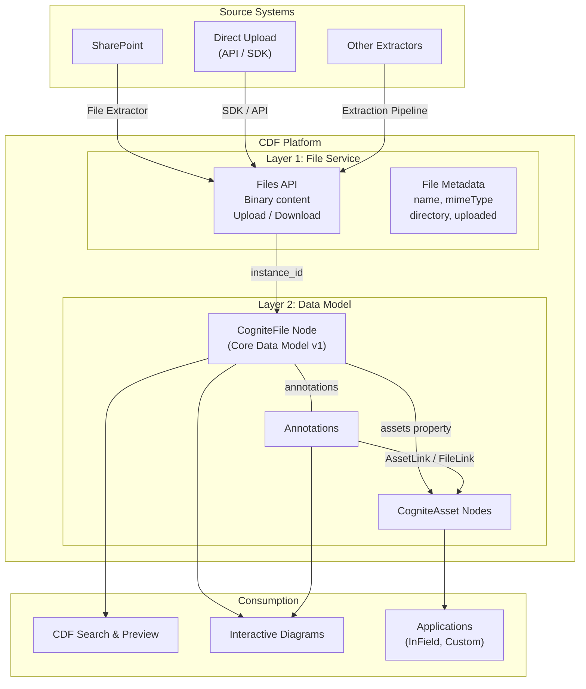
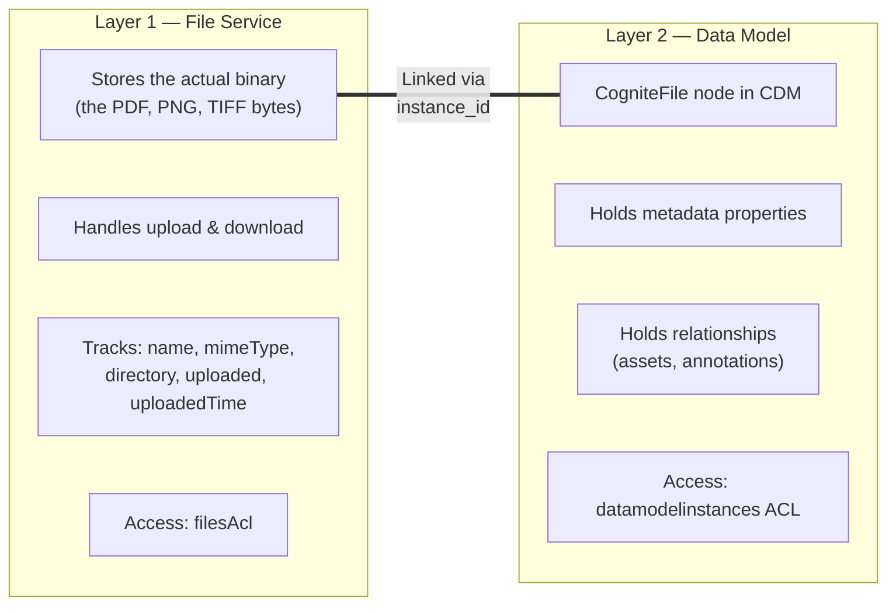
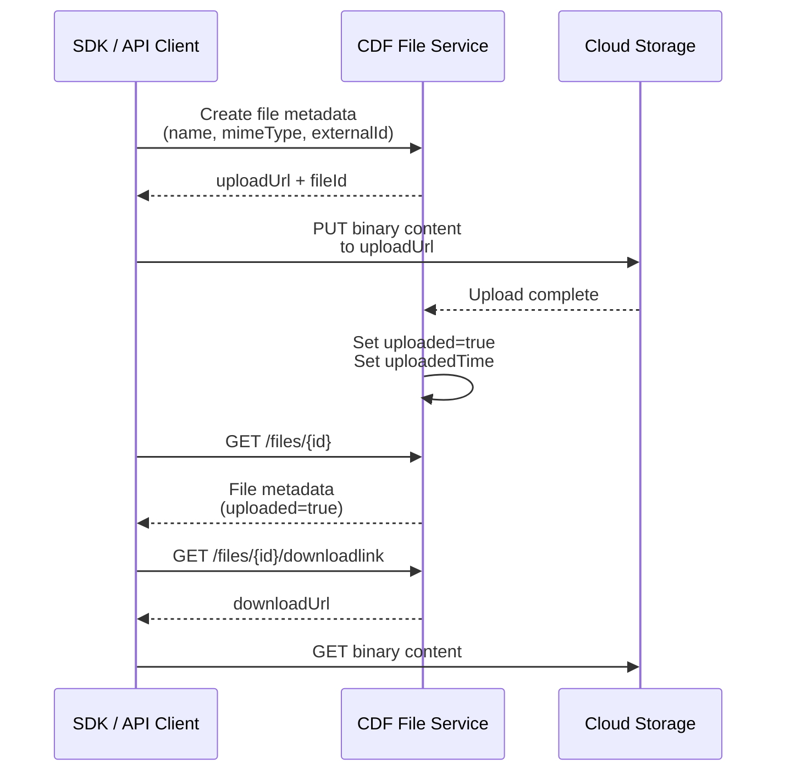
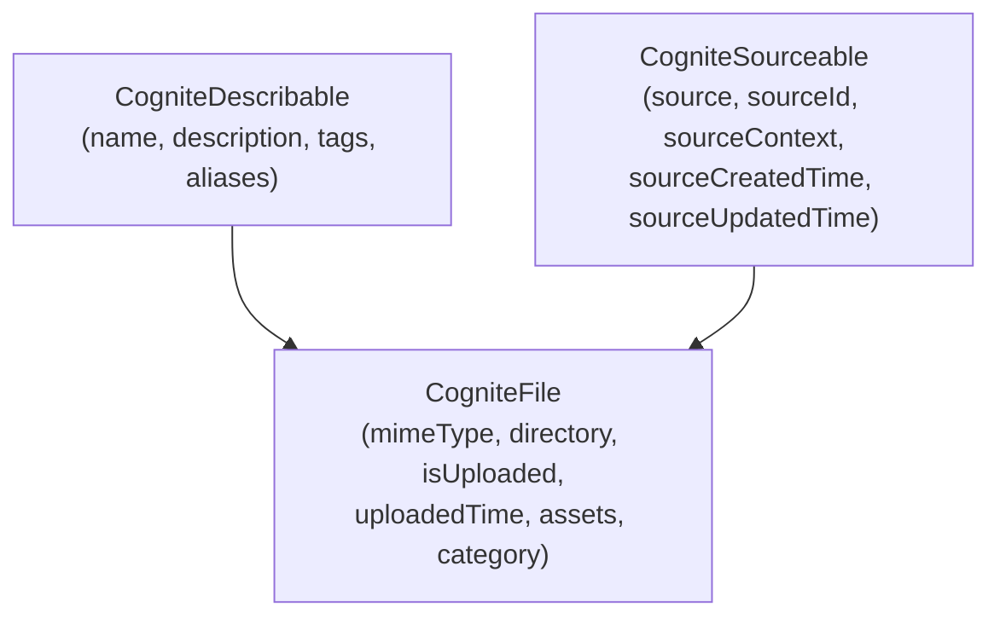
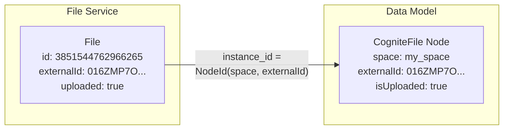
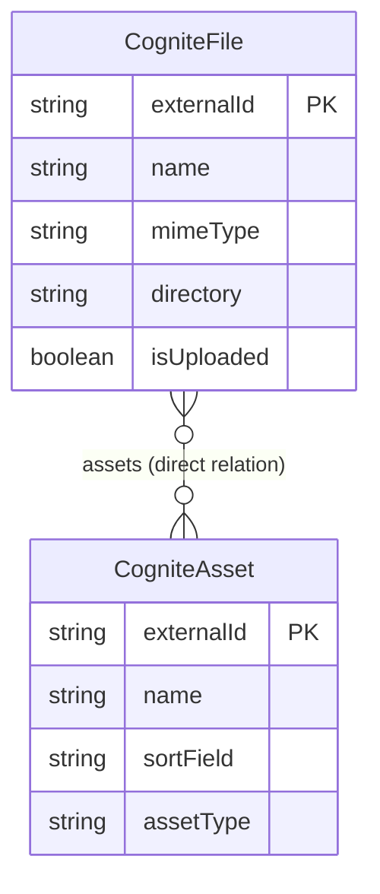
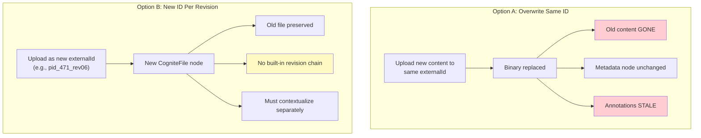

# CDF File Management Architecture

> How Cognite Data Fusion stores, organizes, and links files to the industrial data model.

**Last updated:** February 17, 2026 (aligned with codebase)

---

## Table of Contents

- [Overview](#overview)
- [Two-Layer Architecture](#two-layer-architecture)
- [Layer 1: File Service (Binary Storage)](#layer-1-file-service-binary-storage)
- [Layer 2: Data Model (CogniteFile)](#layer-2-data-model-cognitefile)
- [How the Two Layers Connect](#how-the-two-layers-connect)
- [CogniteFile Properties Reference](#cognitefile-properties-reference)
- [File-to-Asset Relationships](#file-to-asset-relationships)
- [File Ingestion Methods](#file-ingestion-methods)
- [Sylvamo File Ingestion Implementation](#sylvamo-file-ingestion-implementation)
- [Access Control](#access-control)
- [File Versioning](#file-versioning)
- [Key Limitations](#key-limitations)

---

## Overview

Cognite Data Fusion (CDF) manages files through a **dual-layer architecture** that separates binary content storage from metadata and relationships. Understanding this separation is essential for working with P&IDs, engineering drawings, PDFs, and any other document in CDF.



---

## Two-Layer Architecture

CDF uses two distinct systems for files. Each has its own API, access control, and purpose:



| Aspect | Layer 1: File Service | Layer 2: Data Model |
|--------|----------------------|---------------------|
| **What it stores** | Binary file content (bytes) | Metadata node + relationships |
| **API** | `client.files.*` | `client.data_modeling.instances.*` |
| **Identity** | `fileId` (numeric) or `externalId` | `NodeId(space, externalId)` |
| **Relationships** | `asset_ids` (legacy) | `assets` property → CogniteAsset[] |
| **Access control** | `filesAcl` | `datamodelinstances` ACL |
| **Versioning** | Overwrite only | No version tracking |
| **Preview in Search** | Requires `uploaded=true` | Requires `isUploaded=true`, `uploadedTime` |

---

## Layer 1: File Service (Binary Storage)

The File Service is the **storage backend** for all file content in CDF. It provides:

- **Upload**: Single-part (up to 5 GiB) or multi-part (larger files)
- **Download**: Stream binary content
- **Metadata**: Basic file attributes (`name`, `mimeType`, `directory`, `source`)
- **Search**: List/filter files by metadata

### File Service Lifecycle



---

## Layer 2: Data Model (CogniteFile)

`CogniteFile` is a **view** in Cognite's Core Data Model (CDM v1). It represents a file as a node in the data model with typed properties and direct relations to other nodes.

### CogniteFile in the CDM Hierarchy



`CogniteFile` inherits from both `CogniteDescribable` and `CogniteSourceable`, giving it standard naming, tagging, and source-tracking properties in addition to its file-specific ones.

---

## How the Two Layers Connect

The link between Layer 1 (binary) and Layer 2 (data model) is the **`instance_id`**:



When uploading content via the SDK:

```python
from cognite.client.data_classes.data_modeling import NodeId
from cognite.client.data_classes.data_modeling.cdm.v1 import CogniteFileApply

# Step 1: Create the data model node
client.data_modeling.instances.apply(
    CogniteFileApply(
        name="471-80-I-0026_05.pdf",
        space="my_space",
        external_id="pid_471_80_I_0026_05",
        mime_type="application/pdf",
        directory="/Eastover/Drawings/P&IDs",
    )
)

# Step 2: Upload binary content, linking to the node
client.files.upload_content(
    "471-80-I-0026_05.pdf",
    instance_id=NodeId("my_space", "pid_471_80_I_0026_05"),
)

# Step 3: Download content via the node
client.files.download_to_path(
    "downloaded.pdf",
    instance_id=NodeId("my_space", "pid_471_80_I_0026_05"),
)
```

---

## CogniteFile Properties Reference

| Property | Type | Source | Description |
|----------|------|--------|-------------|
| `externalId` | string | Required | Unique identifier (often matches File Service externalId) |
| `space` | string | Required | Data model space |
| `name` | string | CogniteDescribable | Display name |
| `description` | string | CogniteDescribable | Human-readable description |
| `tags` | string[] | CogniteDescribable | Labels/tags for filtering |
| `aliases` | string[] | CogniteDescribable | Alternative names |
| `source` | string | CogniteSourceable | Origin system (e.g., "SharePoint") |
| `sourceId` | string | CogniteSourceable | ID in the source system |
| `mimeType` | string | CogniteFile | MIME type (e.g., `application/pdf`) |
| `directory` | string | CogniteFile | Directory path in source |
| `isUploaded` | boolean | CogniteFile | Whether binary content is available |
| `uploadedTime` | datetime | CogniteFile | When content was uploaded |
| `assets` | DirectRelation[] | CogniteFile | Links to CogniteAsset nodes |
| `category` | DirectRelation | CogniteFile | File category classification |

> **Important for preview**: If `isUploaded` and `uploadedTime` are not populated on the CogniteFile node, CDF Search will not show a file preview — even if the binary content exists in the File Service.

---

## File-to-Asset Relationships

CDF supports two mechanisms for linking files to assets:

### 1. Direct Relation via Data Model (Recommended)

The `assets` property on CogniteFile creates direct relations to CogniteAsset nodes:



From the asset side, a **reverse relation** (`files`) enables querying all files linked to an asset:

```graphql
query {
  listCogniteAsset(filter: { externalId: { eq: "floc:0769-06-PM1" } }) {
    items {
      name
      files {
        items {
          name
          mimeType
          directory
        }
      }
    }
  }
}
```

### 2. Legacy: File Service `asset_ids` (Deprecated Pattern)

The File Service has its own `asset_ids` field from the asset-centric model. This is being superseded by the data model approach.

---

## File Ingestion Methods

```mermaid
graph TB
    subgraph "Method 1: File Extractor"
        E1["Configure extractor<br/>(SharePoint, network drive)"]
        E2["Extractor uploads binary<br/>to File Service"]
        E3["Transformation creates<br/>CogniteFile node"]
        E1 --> E2 --> E3
    end

    subgraph "Method 2: SDK Direct"
        S1["Create CogniteFile node<br/>via data_modeling API"]
        S2["Upload content<br/>with instance_id"]
        S1 --> S2
    end

    subgraph "Method 3: API"
        A1["POST /models/instances<br/>(create node)"]
        A2["POST /files/uploadlink<br/>(get upload URL)"]
        A3["PUT binary to URL"]
        A1 --> A2 --> A3
    end
```



---

## Sylvamo File Ingestion Implementation

The Sylvamo codebase provides two file ingestion paths:

### Path 1: cdf_sharepoint Module (RAW → Transformation)

- **Source**: RAW table `files_metadata` (from `rawSourceDatabase`)
- **Transformation**: `files.Transformation` (population)
- **Destination**: `{{ organization }}File` view (e.g., `CogniteFile` or org-specific file view) in instance space
- **Logic**: Selects rows with `mime_type = 'application/pdf'`; creates nodes with `externalId: VAL_<name>`, `name`, `sourceId`, `mimeType`
- **Use case**: Demo/sample data; can be configured for SharePoint metadata when extractor populates `files_metadata`

### Path 2: File Extractor + populate_Files (Production)

- **Extraction pipeline**: `ep_file_extractor` (File Extractor - SharePoint Documents)
- **Source**: SharePoint Online via FileExtractor Windows Service (PAMIDL02 VM)
- **RAW database**: `raw_ext_sharepoint` (tables: `documents`, `roll_quality`)
- **Transformation**: `tr_populate_Files` (Populate Files from CDF Files API)
- **Source for transformation**: `_cdf.files` (CDF internal files table)
- **Destination**: `CogniteFile` in `mfg_core` instance space
- **Logic**: Reads from CDF Files API; links files to assets based on directory path (e.g., Eastover directories → Eastover Mill asset)
- **Status**: Pending configuration (SVQS-230)

### File Upload Template

The `cdf_sharepoint` module includes `upload.CogniteFile.yaml` for file uploads: `externalId: VAL_$FILENAME`, `mimeType: application/pdf`.

---

## Access Control

| Operation | Required ACL | Scope |
|-----------|-------------|-------|
| Read file metadata (File Service) | `filesAcl: READ` | All or by dataset |
| Upload/update file content | `filesAcl: WRITE` | All or by dataset |
| Read CogniteFile node | `datamodelinstances: READ` | By space |
| Create/update CogniteFile node | `datamodelinstances: WRITE` | By space |
| Read annotations | `annotationsAcl: READ` | All or by dataset |
| Create annotations | `annotationsAcl: WRITE` | All or by dataset |

---

## File Versioning

CDF does **not** provide built-in file version tracking. When file content changes:



**Recommendation**: If revision history matters, use distinct `externalId` values per revision and track the revision chain in metadata properties or a RAW table.

---

## Key Limitations

| Limitation | Impact | Workaround |
|-----------|--------|------------|
| No file content versioning | Old versions lost on overwrite | Use unique IDs per revision |
| No `file` property on CogniteFile | Unlike CogniteTimeSeries, no built-in link to File Service resource | Matched by `externalId` convention |
| Preview requires `isUploaded` + `uploadedTime` | Missing these = no preview in Search | Populate in transformation |
| Annotations not auto-updated | Stale when document changes | Re-run contextualization pipeline |
| No diff between file versions | Cannot compare what changed | External tooling needed |

---

## Related Documents

- [P&ID Contextualization Lifecycle](PID_CONTEXTUALIZATION_LIFECYCLE.md) — How P&IDs are parsed, annotated, and linked
- [Annotation Workflow & Versioning](ANNOTATION_WORKFLOW_AND_VERSIONING.md) — Annotation states, confidence scoring, and revision handling
- [Contextualization Primer](../CONTEXTUALIZATION_PRIMER.md) — General contextualization concepts and best practices
- [Data Model Appendix](../data-model/APPENDIX_MFG_CORE_MODEL.md) — CogniteFile in the MFG Core model

---

*This document describes Cognite CDF platform capabilities as of February 2026.*
