# P&ID Contextualization Lifecycle

> End-to-end lifecycle of how Cognite CDF ingests, parses, annotates, and maintains P&ID documents.

**Last updated:** February 17, 2026 (rev 3 - aligned with codebase)

---

## Table of Contents

- [Overview](#overview)
- [Lifecycle at a Glance](#lifecycle-at-a-glance)
- [Phase 1: Ingestion](#phase-1-ingestion)
- [Phase 2: Preparation](#phase-2-preparation)
- [Phase 3: Detection (Diagram Parsing)](#phase-3-detection-diagram-parsing)
- [Phase 4: Entity Matching](#phase-4-entity-matching)
- [Phase 5: Annotation Creation & Scoring](#phase-5-annotation-creation--scoring)
- [Phase 6: Review & Approval](#phase-6-review--approval)
- [Phase 7: Consumption](#phase-7-consumption)
- [Phase 8: Revision Handling](#phase-8-revision-handling)
- [What CDF Tracks Inside a P&ID](#what-cdf-tracks-inside-a-pid)
- [Cross-Document References](#cross-document-references)
- [Detection Capabilities by File Type](#detection-capabilities-by-file-type)
- [Three Approaches to P&ID Contextualization](#three-approaches-to-pid-contextualization)
- [Sylvamo Implementation (Approach 3)](#sylvamo-implementation-approach-3)
- [Why Annotations Are Not Auto-Updated (Design Rationale)](#why-annotations-are-not-auto-updated-design-rationale)
- [What Customers Should Do: Operational Playbook](#what-customers-should-do-operational-playbook)
- [Real-World Scenarios Explained Simply](#real-world-scenarios-explained-simply)
- [Known Limitations](#known-limitations)

---

## Overview

A P&ID (Piping and Instrumentation Diagram) is a static engineering document that shows equipment, instruments, piping, and their interconnections. CDF transforms these static documents into **interactive, contextualized diagrams** where every tag on the drawing is linked to the corresponding asset, time series, or related document in the data model.

This lifecycle document describes how CDF manages P&IDs from initial upload through contextualization, approval, consumption, and revision handling.

---

## Lifecycle at a Glance

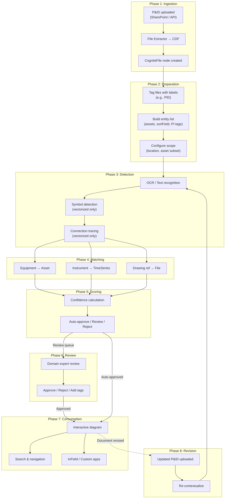

---

## Phase 1: Ingestion

P&ID files enter CDF through one of several paths:

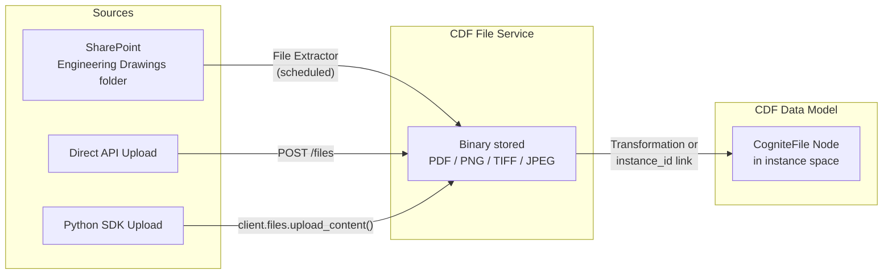

**What happens:**
1. The file binary (e.g., `471-80-I-0026_05.pdf`) is uploaded to the CDF File Service
2. A CogniteFile node is created in the data model (either via transformation or direct SDK call)
3. The node captures metadata: `name`, `mimeType`, `directory`, `sourceId`
4. The binary is linked to the node via `instance_id`

**Supported formats for diagram parsing:** `application/pdf`, `image/jpeg`, `image/png`, `image/tiff`

---

## Phase 2: Preparation

Before running detection, the system must be configured with what to look for:

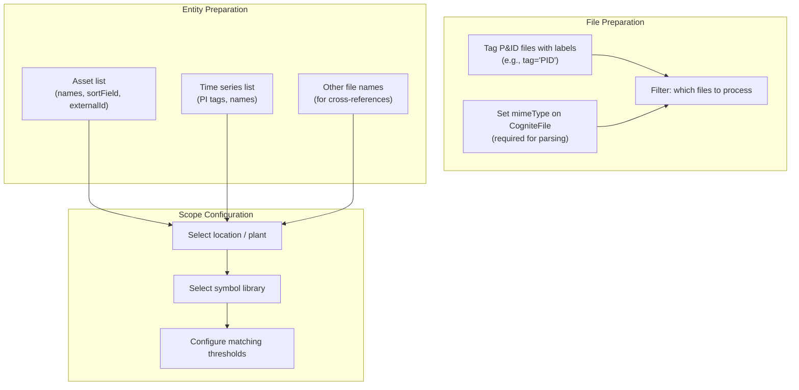

**Key principle:** Always pair a file subset with a matching asset subset from the same plant/area. This avoids false matches across different locations.

---

## Phase 3: Detection (Diagram Parsing)

CDF uses the **Diagrams API** to extract information from P&ID documents. The capabilities depend on whether the file is vectorized or rasterized:

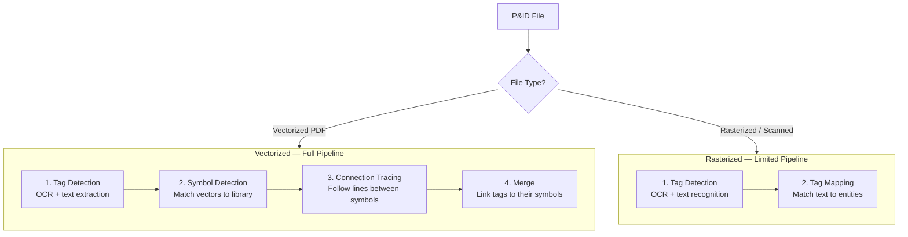

### Tag Detection

The Diagrams API performs OCR to find text on the drawing. For each detected text region, it records:

- **Text content** — what was read (e.g., "OIL TANK 471-5-8157")
- **Bounding box** — exact coordinates on the page (x, y, width, height)
- **Page number** — which page of the PDF

### Symbol Detection (Vectorized Only)

For vectorized PDFs, CDF can also detect **symbols** — standardized shapes representing equipment types (valves, pumps, instruments, etc.):

- Symbols are matched against a **symbol library** (project-specific or template)
- Each symbol has one or more **geometries** (visual variations)
- Detected symbols are classified by **asset class** and **asset type**

### Connection Tracing (Vectorized Only)

CDF traces lines and pipes between detected symbols to determine how equipment is connected in the process flow.

> **Limitation:** For vectorized files, only the **first page** is parsed. Multi-page PDFs should be split before parsing.

---

## Phase 4: Entity Matching

Detected tags are matched against the prepared entity list. CDF supports several matching strategies:

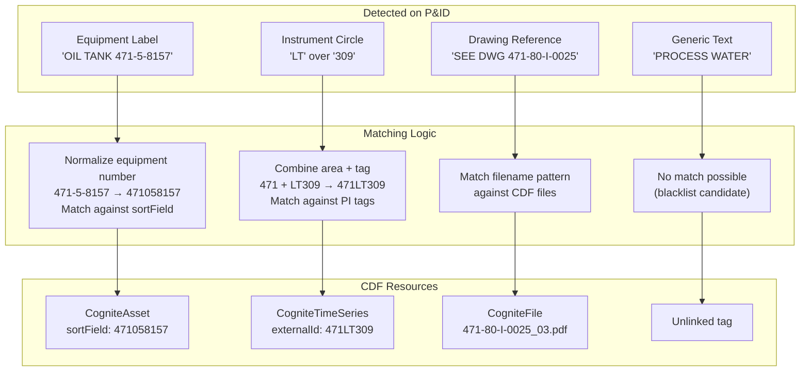

### Matching Models

CDF offers two matching models in the UI:

| Model | When to Use | Configuration |
|-------|-------------|---------------|
| **Standard** | Most P&IDs; uses default text similarity | None required |
| **Advanced** | Complex naming; partial matches needed | Token count, partial match settings, field matching |

### Matching via API (Programmatic)

```python
# CDF Diagrams Detect API
detect_job = client.diagrams.detect(
    entities=[
        {"name": "OIL TANK", "sortField": "471058157"},
        {"name": "471LT309"},
        # ... full entity list
    ],
    items=[{"fileId": 3851544762966265}],
    search_field="name",
    partial_match=True,
)
```

---

## Phase 5: Annotation Creation & Scoring

Each successful match becomes an **annotation** — a structured link between a specific region of the P&ID and a CDF resource.

### Annotation Structure

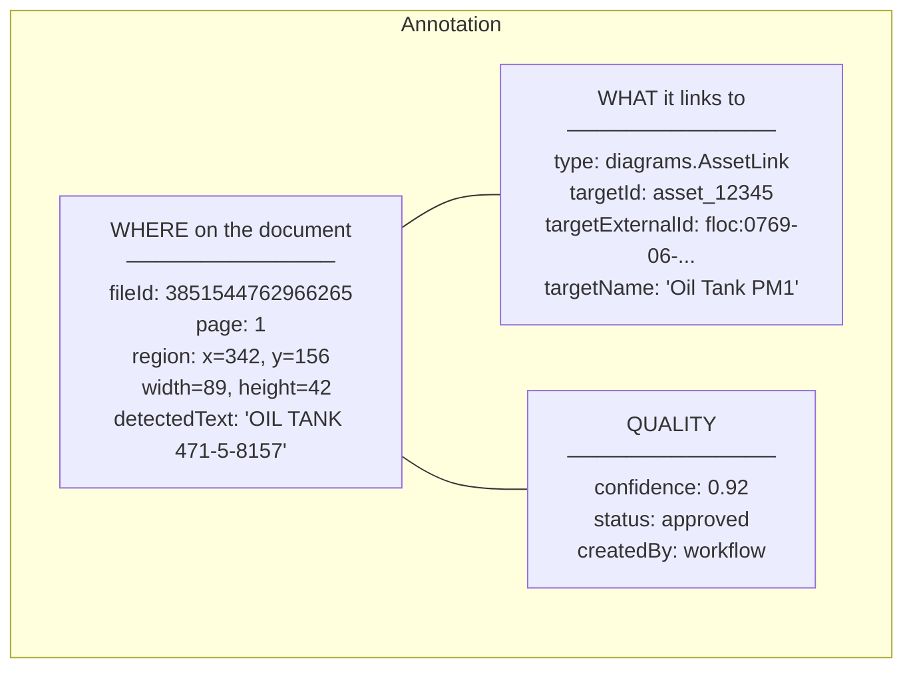

### Confidence Scoring & Thresholds

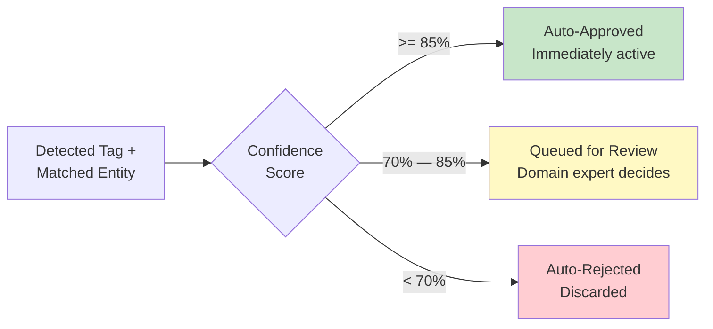

> **Note:** These thresholds are configurable. The recommended best practice is a two-threshold system (reject/review/approve). A single low threshold (e.g., 0.20) will produce many false positives.

---

## Phase 6: Review & Approval

Annotations that fall in the review zone are presented to domain experts in the CDF UI:

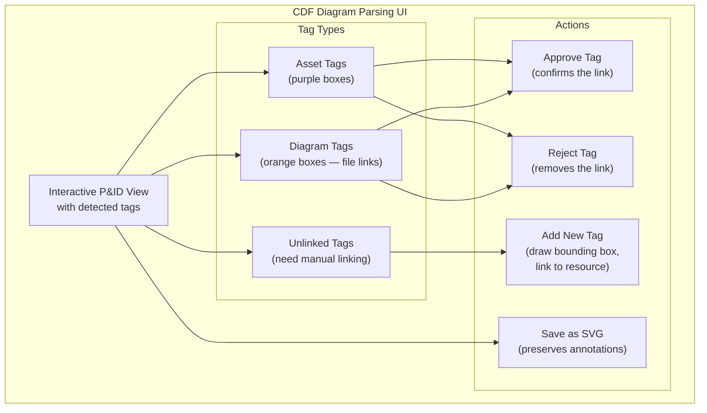

### Review Workflow

1. Select a diagram with status **"Pending approval"**
2. Review each detected tag:
   - **Blue outline** = verified/approved link
   - **Orange outline** = suggested link (pending)
3. Approve or reject individual tags
4. Optionally add new tags by drawing bounding boxes and linking to CDF resources
5. Save changes

---

## Phase 7: Consumption

Once annotations are approved, the P&ID becomes an **interactive document**:

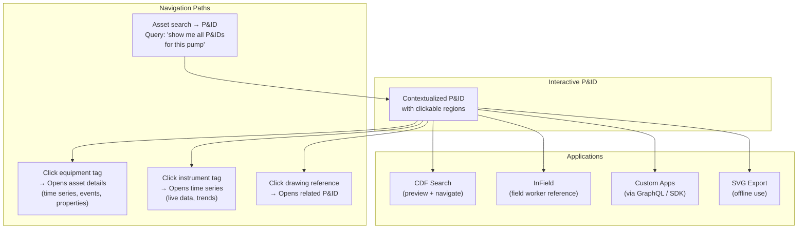

### Bidirectional Navigation

The annotation system enables queries in **both directions**:

| Direction | Query | How |
|-----------|-------|-----|
| **P&ID → Asset** | "What assets are on this P&ID?" | Follow annotations from file |
| **Asset → P&IDs** | "Which P&IDs show this pump?" | Reverse query: all annotations targeting this asset |
| **P&ID → Other P&IDs** | "What drawings does this P&ID reference?" | Follow `diagrams.FileLink` annotations |
| **Time Series → P&IDs** | "Which P&IDs show this instrument?" | Reverse query: annotations targeting this TS |

---

## Phase 8: Revision Handling

When a P&ID is revised (equipment moved, instruments added/removed, layout changed), the existing annotations reflect the **previous version** of the document. CDF handles this through a deliberate **detect-clean-reparse** cycle, described in detail below.

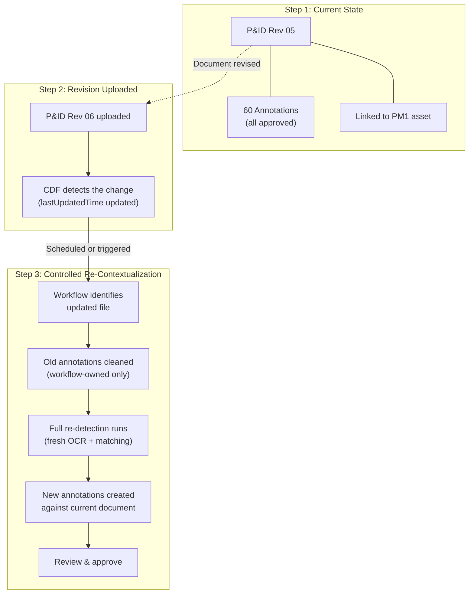

### Re-Contextualization Sequence


### What Changes and What Stays the Same

| Item | On Revision | Why |
|------|-------------|-----|
| **CogniteFile node** | Stays | The file's identity, space, and metadata persist |
| **CogniteFile.assets** (parent link) | Stays | The direct relation to the parent asset (e.g., PM1) is on the node, not tied to annotations |
| **Manually added tags** | Stays | Cleanup only removes workflow-owned annotations |
| **File labels/tags** | Stays | Metadata properties are not affected |
| **Workflow-created annotations** | Replaced | Old ones cleaned, new ones created from fresh detection |
| **Bounding box coordinates** | Regenerated | New detection produces coordinates matching the current layout |
| **Approved status** | Resets | New annotations go through the confidence scoring cycle again |

---

## Why Annotations Are Not Auto-Updated (Design Rationale)

A common question is: *"Why doesn't CDF just keep the old annotations and update them automatically when the document changes?"*

This is a **deliberate design choice**, not a limitation. Here's why:

### The Core Problem: Annotations Are Tied to Pixel Coordinates

Every annotation records the **exact position** on the document where a tag was found — down to pixel coordinates. When an engineer revises a P&ID:

- Equipment may move to a different location on the drawing
- New instruments may be added in empty spaces
- Old instruments may be removed entirely
- The entire layout may be restructured

There is **no reliable way** to automatically determine which tags on the new revision correspond to which tags on the old revision. The text may be the same, but the position is different. The position may be similar, but the text changed. Or both changed.

### Why a Fresh Detection Is the Right Approach

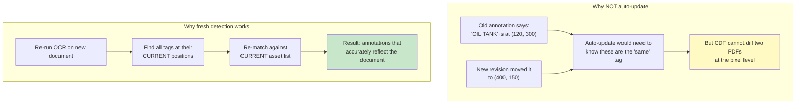

### The Design Guarantees

This approach provides several important guarantees:

| Guarantee | Explanation |
|-----------|-------------|
| **Accuracy** | Annotations always reflect what is actually on the current document — not a best-guess carry-over from an old version |
| **Completeness** | New equipment added in the revision is detected and matched — not missed because it didn't exist before |
| **No ghost links** | Removed equipment doesn't leave orphan annotations pointing to blank space |
| **Confidence is real** | The confidence score reflects the actual match quality on this document, not inherited from a different version |
| **Domain expert validation** | Human review happens on the actual current document, not on stale information |

### The Analogy

Think of it like a **building inspection**. When a building is renovated, the inspector doesn't update the old report with notes like "the kitchen moved to the second floor." They do a **new inspection** of the current building and produce a **new report**. The old report is still available for historical reference if needed, but the current report reflects reality.

CDF works the same way: each contextualization run produces a **fresh, accurate snapshot** of what's on the document right now.

---

## What Customers Should Do: Operational Playbook

### Setting Up the Revision Workflow

The recommended approach is to have the annotation workflow run on a **schedule** (daily or weekly), so revised P&IDs are automatically re-contextualized without anyone needing to remember to trigger it manually.

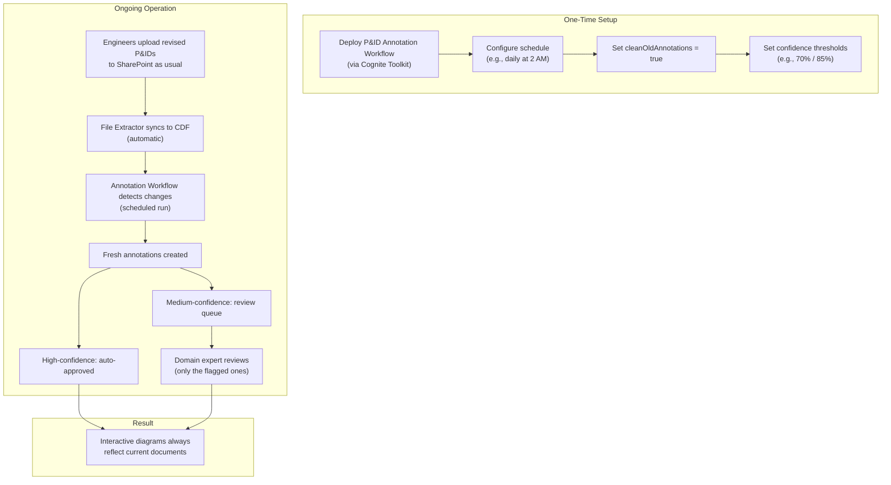

### Day-to-Day: What Each Role Does

| Role | What They Do | How Often |
|------|-------------|-----------|
| **Engineer** | Uploads revised P&IDs to SharePoint | As needed (normal workflow — no CDF steps required) |
| **File Extractor** | Automatically syncs files to CDF | Continuous (scheduled) |
| **Annotation Workflow** | Detects updated files, re-contextualizes | Scheduled (daily/weekly) |
| **Domain Expert** | Reviews annotations in the "Pending Approval" queue in CDF | After each workflow run (typically a few minutes) |
| **CDF Admin** | Monitors extraction pipeline logs, adjusts thresholds | Monthly or as needed |

### What to Do If Annotations Look Wrong

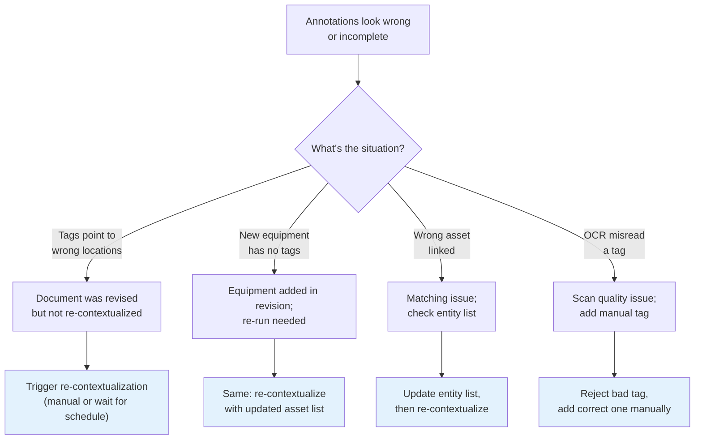

### Configuration Recommendations

| Setting | Recommended Value | Why |
|---------|-------------------|-----|
| **Schedule** | Daily (off-peak hours) | Catches revisions within 24 hours |
| **cleanOldAnnotations** | `true` | Prevents stale annotations from accumulating |
| **Auto-approve threshold** | >= 85% | High-confidence matches go live immediately |
| **Review threshold** | >= 70% | Catches plausible matches for expert validation |
| **Reject threshold** | < 70% | Avoids cluttering the review queue with bad matches |
| **Run mode** | Incremental | Only processes changed files (efficient) |

---

## Real-World Scenarios Explained Simply

These scenarios are written for people who work with P&IDs but may not be deeply familiar with how CDF handles them behind the scenes.

---

### Scenario 1: "The Engineer Updated a P&ID — What Happens?"

**The situation:** Sarah, a process engineer, updated P&ID `471-80-I-0026` to add a new pressure transmitter (PT 500) near the oil tank. She saved the new revision to SharePoint.

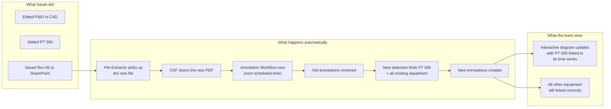

**Key point for Sarah:** She doesn't need to do anything special in CDF. She updates the P&ID the same way she always does. The system handles the rest.

**What if she needs it immediately?** A CDF admin or the domain expert can manually trigger the workflow instead of waiting for the next scheduled run.

---

### Scenario 2: "Two P&IDs Show the Same Pump — One Was Updated"

**The situation:** P&ID A and P&ID B both show Pump P-4712. P&ID A was just revised, but P&ID B was not.

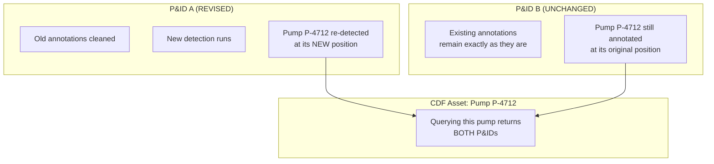

**Key point:** Updating one P&ID does **not** affect the other. Each P&ID has its own independent set of annotations. If you search for Pump P-4712, CDF returns both drawings — each with annotations that accurately reflect their own content.

---

### Scenario 3: "An Instrument Was Removed from the Drawing"

**The situation:** The flow indicator FI 328 was removed from P&ID `471-80-I-0026` in the latest revision because the instrument was decommissioned.

**What happens:**

| Step | What Occurs |
|------|-------------|
| 1. Old state | FI 328 had an annotation linking it to time series `471FI328` |
| 2. New revision uploaded | The drawing no longer shows FI 328 |
| 3. Workflow runs | Old annotations (including FI 328's) are cleaned |
| 4. Fresh detection | OCR scans the new document — FI 328 is not found |
| 5. Result | No annotation is created for FI 328 — it's cleanly gone |

**Key point:** The system doesn't leave a "ghost" annotation pointing to empty space. Because detection runs fresh on the current document, removed equipment simply doesn't produce annotations. This is cleaner than trying to figure out "which annotations should I delete?" from the old set.

---

### Scenario 4: "We Added 50 New Assets to SAP — Will the P&IDs Pick Them Up?"

**The situation:** The maintenance team added 50 new equipment records to SAP. Some of this equipment appears on existing P&IDs but was never matched because CDF didn't know about it.

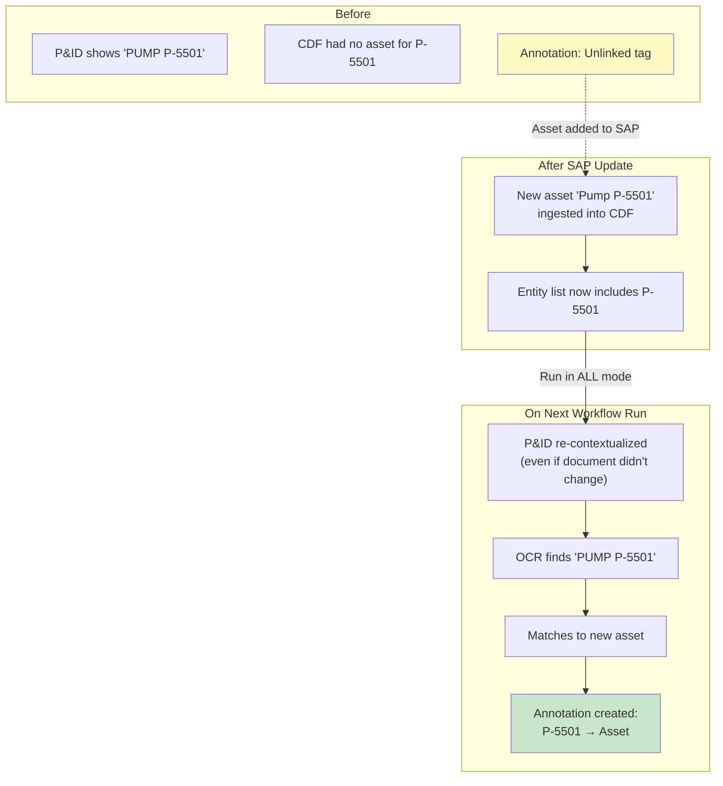

**Key point:** This is one reason why fresh detection is powerful — it's not just about document changes. When the **asset list grows**, re-running detection on existing P&IDs can find matches that weren't possible before. To trigger this, run the workflow in **ALL mode** (rather than incremental, which only catches changed files).

---

### Scenario 5: "I Approved 60 Tags Last Week — Do I Have to Re-Approve Them All?"

**The situation:** A domain expert spent time reviewing and approving tags on a P&ID. Now the document was revised (minor change — one valve was added). Do they need to redo all their work?

**The honest answer:** The automated annotations will go through the confidence scoring cycle again. However:

- **High-confidence matches (>= 85%) are auto-approved** — if the same equipment is on the document and the match is strong, it goes live without human intervention
- **Only medium-confidence matches** appear in the review queue
- **Manually added tags are preserved** — they are not affected by the workflow cleanup

**In practice**, if the revision was minor (one valve added, rest unchanged):
- Most of the 60 tags will be re-detected with high confidence and auto-approved
- The new valve will appear as a new suggestion
- The expert only reviews a few items, not all 60

**How to minimize re-work:**
- Set auto-approve threshold appropriately (85% catches most stable matches)
- For tags that OCR consistently struggles with, add them manually — manual tags survive re-contextualization

---

### Scenario 6: "How Do I Know If a P&ID's Annotations Are Current?"

**The situation:** A field technician is looking at a P&ID in InField. How do they know the annotations are up to date?

**Check these two timestamps:**

| Timestamp | Where to Find It | What It Tells You |
|-----------|-------------------|-------------------|
| **File `lastUpdatedTime`** | CogniteFile node metadata | When the document content was last changed |
| **Annotation creation time** | On each annotation record | When the annotation was created |

**If annotations were created AFTER the file was last updated** — they're current.
**If annotations were created BEFORE the file was last updated** — the document was revised and annotations may not reflect the latest content.

The annotation workflow's RAW state table also tracks the last processing time for each file, which an admin can check.

---

## What CDF Tracks Inside a P&ID

For every tag detected on a P&ID, CDF stores a separate annotation. Here's what a fully annotated P&ID looks like:

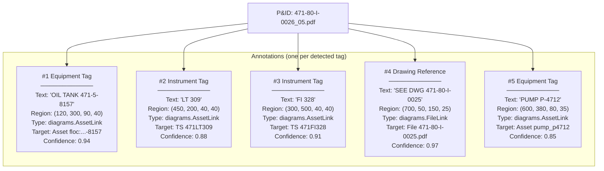

Each annotation is an **independent record** — it can be approved, rejected, or modified without affecting other annotations on the same file.

---

## Cross-Document References

When multiple P&IDs reference the same equipment, CDF maintains independent annotation sets on each file:

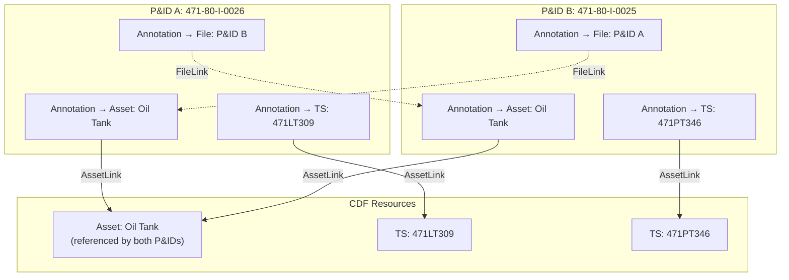

**Key behaviors:**
- Each P&ID has its **own annotations** — they are independent
- Both P&IDs can link to the **same asset**; querying that asset returns both files
- `FileLink` annotations create **cross-references** between P&IDs
- Updating one P&ID does **not** affect annotations on the other

---

## Detection Capabilities by File Type

| Capability | Vectorized PDF | Rasterized / Scanned |
|-----------|---------------|---------------------|
| Tag detection (OCR) | Yes | Yes |
| Symbol detection | Yes | No |
| Symbol library matching | Yes | No |
| Connection tracing | Yes | No |
| Tag-symbol merge | Yes | No |
| Multi-page support | First page only | All pages (tag detection) |
| Output quality | High (precise vectors) | Medium (depends on scan quality) |

---

## Three Approaches to P&ID Contextualization

CDF provides three ways to contextualize P&IDs, from manual to fully automated:

### Approach 1: CDF UI (Diagram Parsing)

**Best for:** Small batches, initial setup, manual review

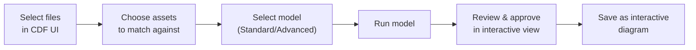

### Approach 2: Diagrams API (Programmatic)

**Best for:** Custom matching logic, integration into scripts

```mermaid
graph LR
    A["Build entity list<br/>(Python)"] --> B["Call diagrams.detect()"]
    B --> C["Process results"]
    C --> D["Create annotations<br/>(SDK)"]
    D --> E["Validate"]
```

### Approach 3: Automated Workflow (Deployment Pack)

**Best for:** Production-scale, recurring processing, CI/CD integration

```mermaid
graph LR
    A["Deploy via<br/>Cognite Toolkit"] --> B["Configure extraction<br/>pipeline"]
    B --> C["Tagging transformations<br/>(file + asset labels)"]
    C --> D["CDF Workflow runs<br/>(scheduled or triggered)"]
    D --> E["Incremental processing<br/>(state in RAW)"]
    E --> F["Annotations created<br/>(threshold-based approval)"]
```

| Feature | CDF UI | Diagrams API | Deployment Pack |
|---------|--------|-------------|-----------------|
| **Ease of setup** | Click-through | Code required | Toolkit deploy |
| **Scale** | Small batches | Medium | Large (1000s of files) |
| **Incremental** | Manual | Manual | Automatic (RAW state) |
| **Auto-approval** | No (all manual) | Custom | Threshold-based |
| **Cleanup** | Manual | Custom | `cleanOldAnnotations` flag |
| **Scheduling** | Manual | Cron / external | CDF Workflows |
| **Symbol detection** | Yes | No (tags only) | No (tags only) |

### Sylvamo Implementation (Approach 3)

The Sylvamo codebase implements the automated workflow via:

| Component | Value |
|-----------|-------|
| **Extraction pipeline** | `ctx_files_pandid_annotater` |
| **CDF Function** | `contextualization_p_and_id_annotater` |
| **Module** | `cdf_p_and_id_parser` (Cognite Toolkit `tk:contextualization`) |
| **Entity views** | CogniteFile, CogniteEquipment, CogniteAsset, CogniteTimeSeries |
| **Search property** | `name` |
| **Supported mime types** | `application/pdf`, `image/jpeg`, `image/png`, `image/tiff` |
| **Auto-approval threshold** | 0.85 (configurable) |
| **Auto-reject threshold** | 0.25 (configurable) |

The pipeline uses the Cognite Diagrams API (`client.diagrams.detect`) and writes annotations to the data model. A separate **Direct Relation Writer** (`ctx_files_direct_relation_write`) syncs approved annotations to direct relations (e.g., `CogniteFile.assets`, `CogniteEquipment.files`).

---

## Known Limitations

These are platform characteristics to be aware of when planning your P&ID contextualization strategy:

| Characteristic | Description | What to Do |
|---------------|-------------|------------|
| **Vectorized: first page only** | Only page 1 is parsed for vectorized PDFs | Split multi-page PDFs before ingestion |
| **Re-contextualization is workflow-driven** | Updating a file does not auto-trigger re-parsing; the annotation workflow must run | Schedule the workflow daily/weekly, or trigger manually when needed |
| **Full re-detection per run** | CDF does not diff revisions — it re-parses the entire document | This is by design for accuracy; incremental mode ensures only changed files are processed |
| **Annotations reset on re-detection** | New annotations go through confidence scoring again | High-confidence matches auto-approve; only edge cases need review |
| **Manual annotations preserved** | Only workflow-owned annotations are cleaned | Use manual tags for equipment that OCR consistently misses |
| **Symbol libraries are project-specific** | Must build/maintain library per project | Start with CDF templates; refine over time |
| **OCR quality depends on source** | Scanned/rasterized documents have lower accuracy | Use vectorized PDFs where possible; set lower auto-approve thresholds for scans |
| **Entity list must be current** | Matches depend on what's in the entity list | Keep asset/time series lists in sync with source systems (SAP, PI, etc.) |

---

## Related Documents

- [CDF File Management](CDF_FILE_MANAGEMENT.md) — How CDF stores and organizes files
- [Annotation Workflow & Versioning](ANNOTATION_WORKFLOW_AND_VERSIONING.md) — Annotation states, confidence model, revision workflow
- [Contextualization Primer](../CONTEXTUALIZATION_PRIMER.md) — Best practices and architectural guidance
- [Contextualization Gap Analysis](../CONTEXTUALIZATION_GAP_ANALYSIS.md) — Current Sylvamo implementation vs. best practices

---

*This document describes Cognite CDF platform capabilities as of February 2026.*
