# P&ID Contextualization Lifecycle

> End-to-end lifecycle of how Cognite CDF ingests, parses, annotates, and maintains P&ID documents.

**Last updated:** February 10, 2026

---

## Table of Contents

- [Overview](#overview)
- [Lifecycle at a Glance](#lifecycle-at-a-glance)
- [Phase 1: Ingestion](#phase-1-ingestion)
- [Phase 2: Preparation](#phase-2-preparation)
- [Phase 3: Detection (Diagram Parsing)](#phase-3-detection-diagram-parsing)
- [Phase 4: Entity Matching](#phase-4-entity-matching)
- [Phase 5: Annotation Creation & Scoring](#phase-5-annotation-creation--scoring)
- [Phase 6: Review & Approval](#phase-6-review--approval)
- [Phase 7: Consumption](#phase-7-consumption)
- [Phase 8: Revision Handling](#phase-8-revision-handling)
- [What CDF Tracks Inside a P&ID](#what-cdf-tracks-inside-a-pid)
- [Cross-Document References](#cross-document-references)
- [Detection Capabilities by File Type](#detection-capabilities-by-file-type)
- [Three Approaches to P&ID Contextualization](#three-approaches-to-pid-contextualization)
- [Known Limitations](#known-limitations)

---

## Overview

A P&ID (Piping and Instrumentation Diagram) is a static engineering document that shows equipment, instruments, piping, and their interconnections. CDF transforms these static documents into **interactive, contextualized diagrams** where every tag on the drawing is linked to the corresponding asset, time series, or related document in the data model.

This lifecycle document describes how CDF manages P&IDs from initial upload through contextualization, approval, consumption, and revision handling.

---

## Lifecycle at a Glance

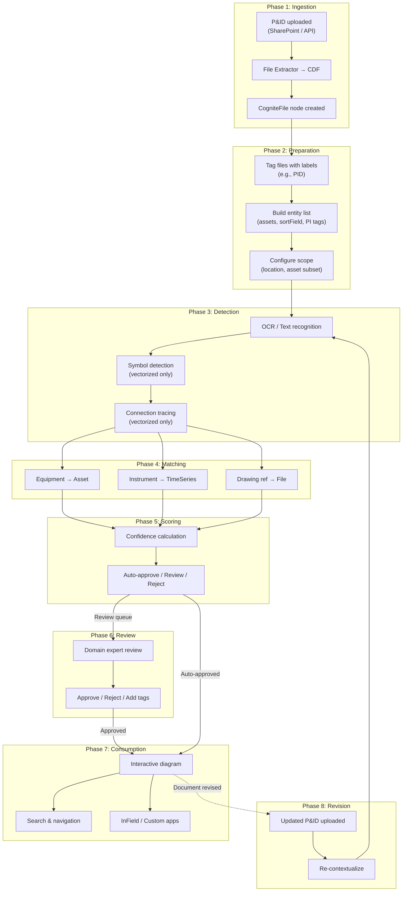

---

## Phase 1: Ingestion

P&ID files enter CDF through one of several paths:

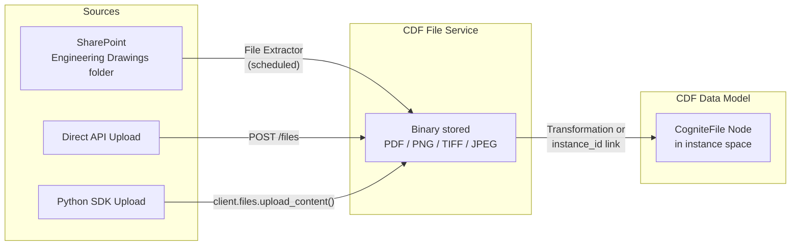

**What happens:**
1. The file binary (e.g., `471-80-I-0026_05.pdf`) is uploaded to the CDF File Service
2. A CogniteFile node is created in the data model (either via transformation or direct SDK call)
3. The node captures metadata: `name`, `mimeType`, `directory`, `sourceId`
4. The binary is linked to the node via `instance_id`

**Supported formats for diagram parsing:** `application/pdf`, `image/jpeg`, `image/png`, `image/tiff`

---

## Phase 2: Preparation

Before running detection, the system must be configured with what to look for:

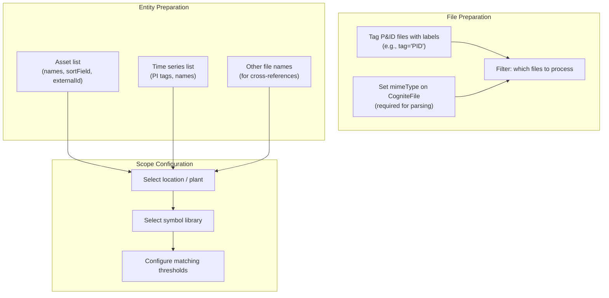

**Key principle:** Always pair a file subset with a matching asset subset from the same plant/area. This avoids false matches across different locations.

---

## Phase 3: Detection (Diagram Parsing)

CDF uses the **Diagrams API** to extract information from P&ID documents. The capabilities depend on whether the file is vectorized or rasterized:

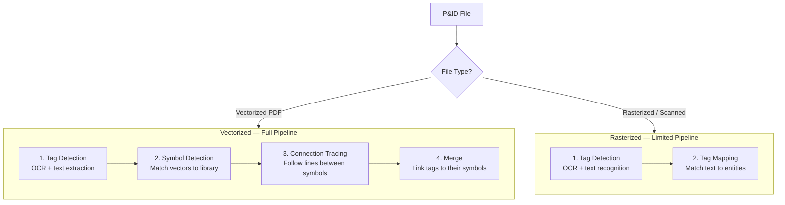

### Tag Detection

The Diagrams API performs OCR to find text on the drawing. For each detected text region, it records:

- **Text content** — what was read (e.g., "OIL TANK 471-5-8157")
- **Bounding box** — exact coordinates on the page (x, y, width, height)
- **Page number** — which page of the PDF

### Symbol Detection (Vectorized Only)

For vectorized PDFs, CDF can also detect **symbols** — standardized shapes representing equipment types (valves, pumps, instruments, etc.):

- Symbols are matched against a **symbol library** (project-specific or template)
- Each symbol has one or more **geometries** (visual variations)
- Detected symbols are classified by **asset class** and **asset type**

### Connection Tracing (Vectorized Only)

CDF traces lines and pipes between detected symbols to determine how equipment is connected in the process flow.

> **Limitation:** For vectorized files, only the **first page** is parsed. Multi-page PDFs should be split before parsing.

---

## Phase 4: Entity Matching

Detected tags are matched against the prepared entity list. CDF supports several matching strategies:

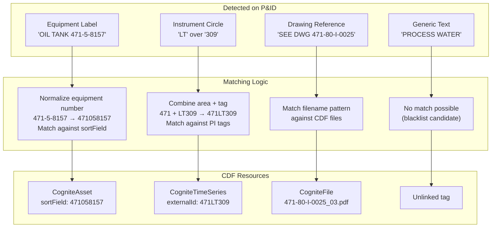

### Matching Models

CDF offers two matching models in the UI:

| Model | When to Use | Configuration |
|-------|-------------|---------------|
| **Standard** | Most P&IDs; uses default text similarity | None required |
| **Advanced** | Complex naming; partial matches needed | Token count, partial match settings, field matching |

### Matching via API (Programmatic)

```python
# CDF Diagrams Detect API
detect_job = client.diagrams.detect(
    entities=[
        {"name": "OIL TANK", "sortField": "471058157"},
        {"name": "471LT309"},
        # ... full entity list
    ],
    items=[{"fileId": 3851544762966265}],
    search_field="name",
    partial_match=True,
)
```

---

## Phase 5: Annotation Creation & Scoring

Each successful match becomes an **annotation** — a structured link between a specific region of the P&ID and a CDF resource.

### Annotation Structure

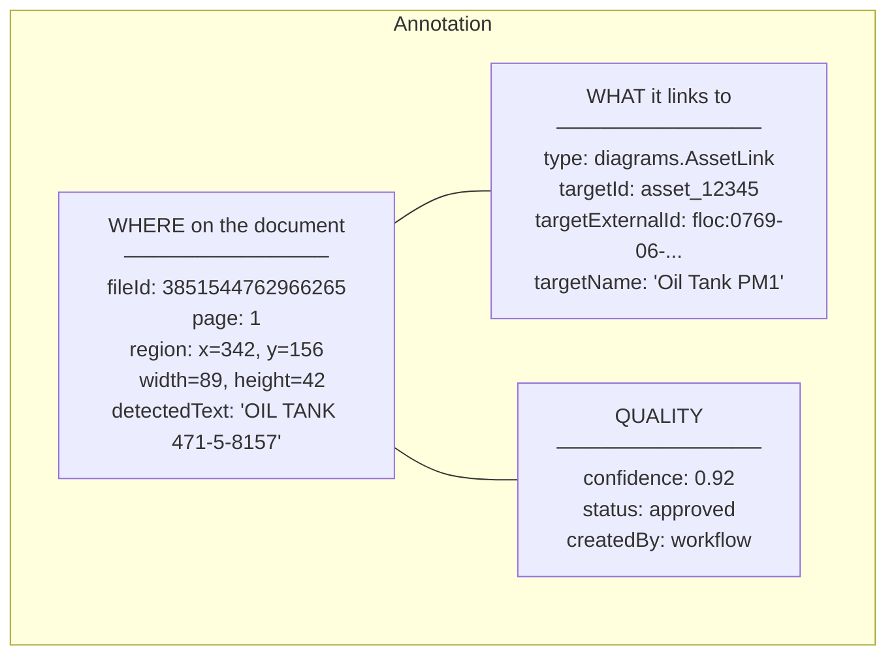

### Confidence Scoring & Thresholds

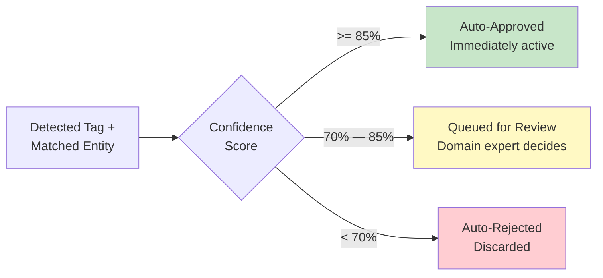

> **Note:** These thresholds are configurable. The recommended best practice is a two-threshold system (reject/review/approve). A single low threshold (e.g., 0.20) will produce many false positives.

---

## Phase 6: Review & Approval

Annotations that fall in the review zone are presented to domain experts in the CDF UI:

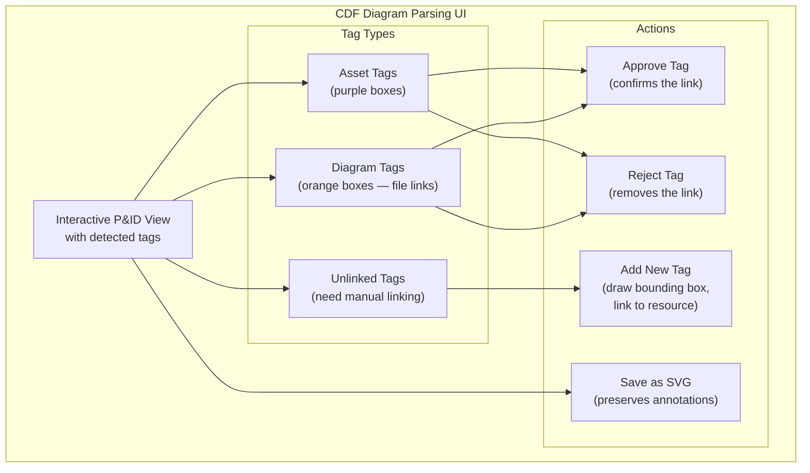

### Review Workflow

1. Select a diagram with status **"Pending approval"**
2. Review each detected tag:
   - **Blue outline** = verified/approved link
   - **Orange outline** = suggested link (pending)
3. Approve or reject individual tags
4. Optionally add new tags by drawing bounding boxes and linking to CDF resources
5. Save changes

---

## Phase 7: Consumption

Once annotations are approved, the P&ID becomes an **interactive document**:

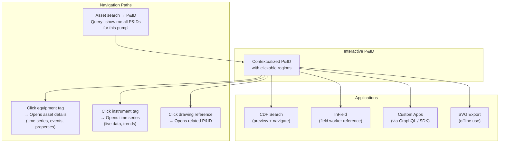

### Bidirectional Navigation

The annotation system enables queries in **both directions**:

| Direction | Query | How |
|-----------|-------|-----|
| **P&ID → Asset** | "What assets are on this P&ID?" | Follow annotations from file |
| **Asset → P&IDs** | "Which P&IDs show this pump?" | Reverse query: all annotations targeting this asset |
| **P&ID → Other P&IDs** | "What drawings does this P&ID reference?" | Follow `diagrams.FileLink` annotations |
| **Time Series → P&IDs** | "Which P&IDs show this instrument?" | Reverse query: annotations targeting this TS |

---

## Phase 8: Revision Handling

When a P&ID is revised (e.g., equipment moved, instruments added/removed), the existing annotations become stale:

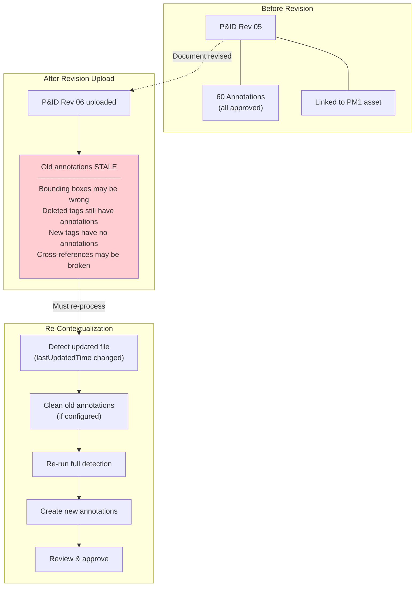

### Re-Contextualization Process

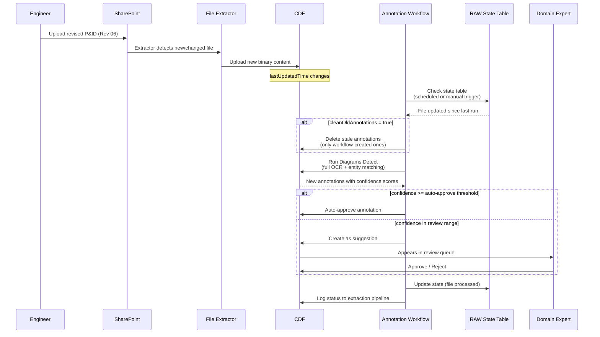

### What Is Lost on Revision

| Item | Behavior | Mitigation |
|------|----------|------------|
| **Bounding box positions** | Stale if layout changed | Re-detect regenerates all positions |
| **Approved annotation status** | Lost — new annotations start as suggested | Domain expert must re-approve |
| **Manually added tags** | Preserved (only workflow annotations are cleaned) | Manual annotations survive |
| **File-to-asset direct relation** | Preserved (on CogniteFile node) | Not affected by re-detection |
| **Previous revision content** | Lost if same externalId (overwrite) | Use unique IDs per revision |

---

## What CDF Tracks Inside a P&ID

For every tag detected on a P&ID, CDF stores a separate annotation. Here's what a fully annotated P&ID looks like:

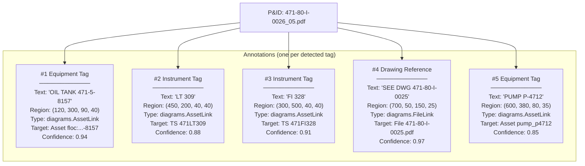

Each annotation is an **independent record** — it can be approved, rejected, or modified without affecting other annotations on the same file.

---

## Cross-Document References

When multiple P&IDs reference the same equipment, CDF maintains independent annotation sets on each file:

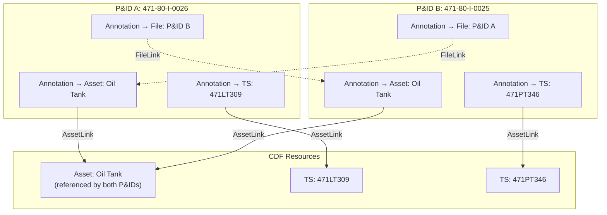

**Key behaviors:**
- Each P&ID has its **own annotations** — they are independent
- Both P&IDs can link to the **same asset**; querying that asset returns both files
- `FileLink` annotations create **cross-references** between P&IDs
- Updating one P&ID does **not** affect annotations on the other

---

## Detection Capabilities by File Type

| Capability | Vectorized PDF | Rasterized / Scanned |
|-----------|---------------|---------------------|
| Tag detection (OCR) | Yes | Yes |
| Symbol detection | Yes | No |
| Symbol library matching | Yes | No |
| Connection tracing | Yes | No |
| Tag-symbol merge | Yes | No |
| Multi-page support | First page only | All pages (tag detection) |
| Output quality | High (precise vectors) | Medium (depends on scan quality) |

---

## Three Approaches to P&ID Contextualization

CDF provides three ways to contextualize P&IDs, from manual to fully automated:

### Approach 1: CDF UI (Diagram Parsing)

**Best for:** Small batches, initial setup, manual review

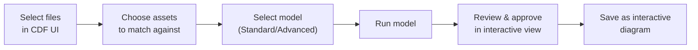

### Approach 2: Diagrams API (Programmatic)

**Best for:** Custom matching logic, integration into scripts

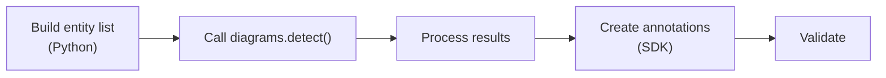

### Approach 3: Automated Workflow (Deployment Pack)

**Best for:** Production-scale, recurring processing, CI/CD integration

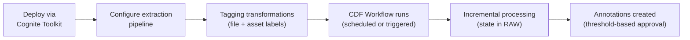

| Feature | CDF UI | Diagrams API | Deployment Pack |
|---------|--------|-------------|-----------------|
| **Ease of setup** | Click-through | Code required | Toolkit deploy |
| **Scale** | Small batches | Medium | Large (1000s of files) |
| **Incremental** | Manual | Manual | Automatic (RAW state) |
| **Auto-approval** | No (all manual) | Custom | Threshold-based |
| **Cleanup** | Manual | Custom | `cleanOldAnnotations` flag |
| **Scheduling** | Manual | Cron / external | CDF Workflows |
| **Symbol detection** | Yes | No (tags only) | No (tags only) |

---

## Known Limitations

| Limitation | Description | Impact |
|-----------|-------------|--------|
| **Vectorized: first page only** | Only page 1 is parsed for vectorized PDFs | Critical info on later pages is missed; split files first |
| **No automatic re-contextualization** | Updating a file does NOT trigger re-parsing | Stale annotations until pipeline re-runs |
| **No diff/change tracking** | Cannot compare what changed between revisions | Full re-parse required; no delta |
| **Approved status lost on re-detect** | New annotations start as suggested | Domain expert must re-approve |
| **No built-in annotation carry-over** | Unchanged tags are not preserved across revisions | All annotations regenerated from scratch |
| **Symbol libraries are project-specific** | Must build/maintain library per project | Initial effort to set up; templates help |
| **OCR quality varies** | Scanned documents may have recognition errors | Lower confidence scores; more manual review |
| **No cross-site matching** | Entity list must be scoped to the same location | Prevents false matches but requires careful setup |

---

## Related Documents

- [CDF File Management](CDF_FILE_MANAGEMENT.md) — How CDF stores and organizes files
- [Annotation Workflow & Versioning](ANNOTATION_WORKFLOW_AND_VERSIONING.md) — Annotation states, confidence model, revision workflow
- [Contextualization Primer](../CONTEXTUALIZATION_PRIMER.md) — Best practices and architectural guidance
- [Contextualization Gap Analysis](../CONTEXTUALIZATION_GAP_ANALYSIS.md) — Current Sylvamo implementation vs. best practices
- [P&ID Annotation Plan](../../../docs/reference/sylvamo-pid-sortfield-call/PLAN-pid-annotation-and-asset-linkage.md) — Sylvamo-specific POC results

---

*This document describes Cognite CDF platform capabilities as of February 2026.*
