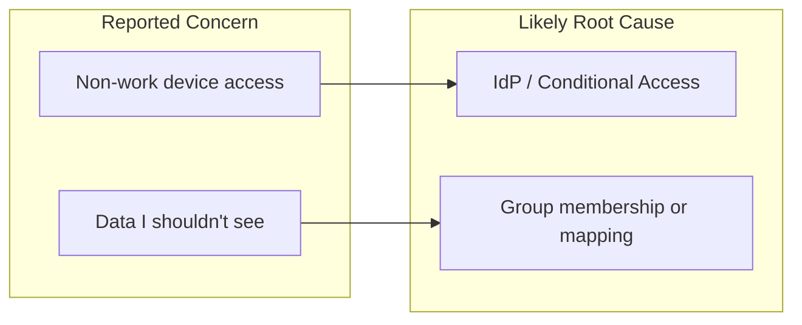
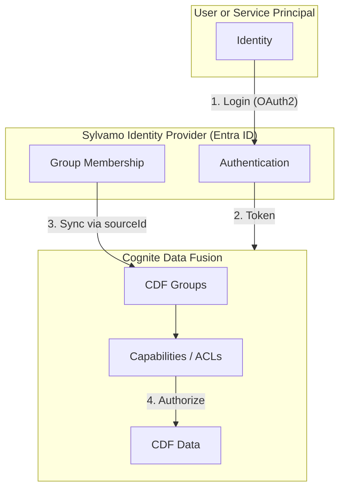
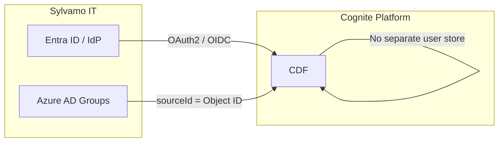
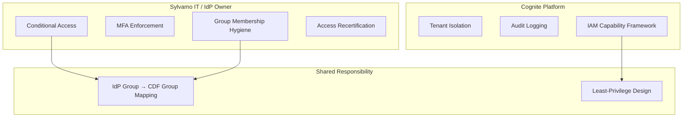
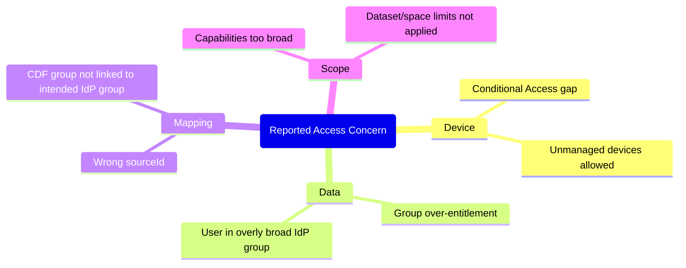
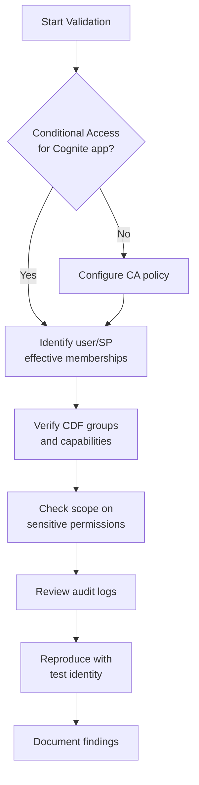
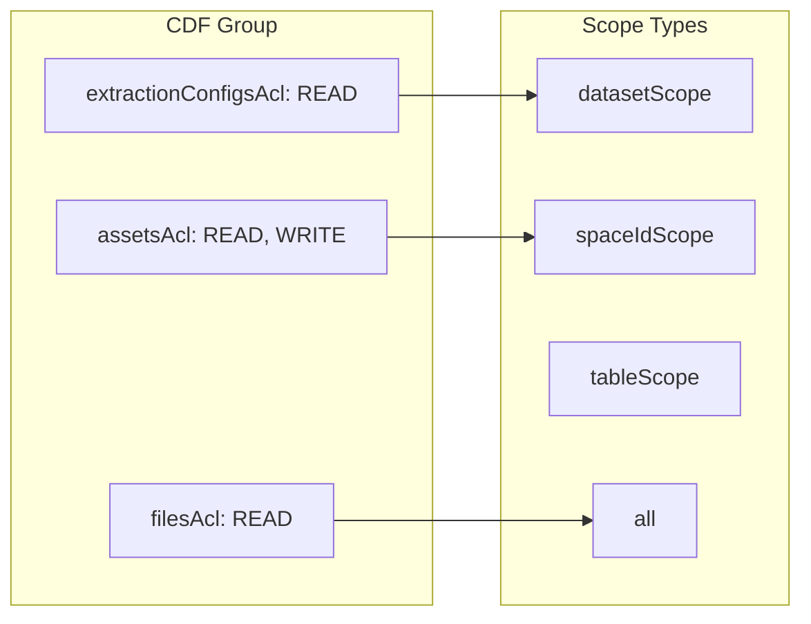
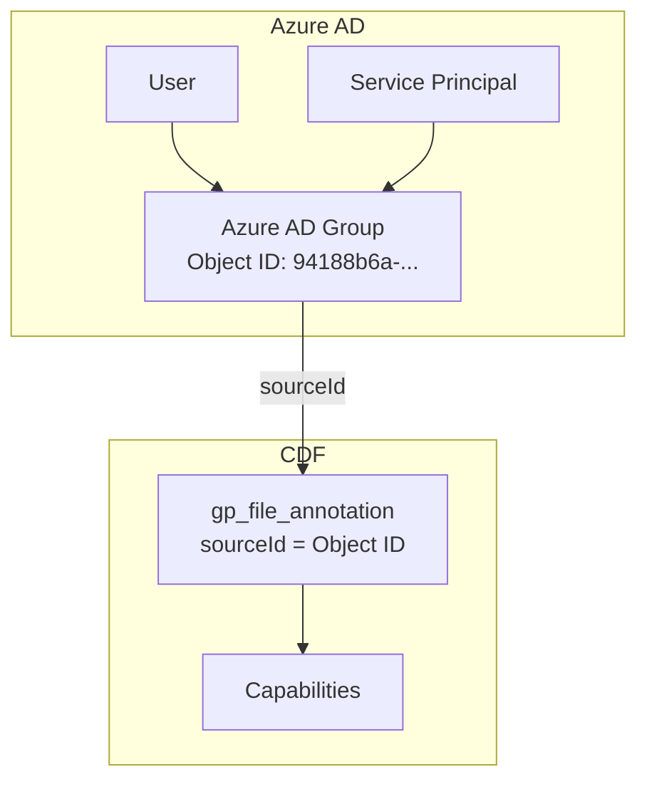

# CDF Security Briefing

**Meeting-ready primer for explaining Cognite Data Fusion security in the context of stakeholder concerns**

> **Purpose:** Support meetings where security, identity, or access concerns are raised. Use this document to explain the CDF security model, responsibility split, and validation approach. Convert sections into slides as needed.

---

## Table of Contents

1. [What Triggered the Concern](#1-what-triggered-the-concern)
2. [Plain-Language Issue Statement](#2-plain-language-issue-statement)
3. [CDF Security Model Overview](#3-cdf-security-model-overview)
4. [Responsibility Split](#4-responsibility-split)
5. [Root-Cause Hypotheses](#5-root-cause-hypotheses)
6. [Validation Checklist](#6-validation-checklist)
7. [Immediate Controls to Propose](#7-immediate-controls-to-propose)
8. [Meeting Narrative](#8-meeting-narrative)
9. [Q&A Prep](#9-qa-prep)
10. [Technical Deep Dive](#10-technical-deep-dive)

---

## 1. What Triggered the Concern

A forwarded email thread raised two core concerns:

| Concern | Description |
|---------|-------------|
| **Device access** | A team member reportedly accessed Cognite from a non-work (personal) computer |
| **Data access** | A team member reportedly accessed data they believed they should not be able to access |

> **Source:** Internal email thread (Suliman raised concerns; Torgrim provided Cognite’s response on identity and RBAC.)

---

## 2. Plain-Language Issue Statement

The concern is likely **not** “CDF is wide open,” but rather a potential mismatch in **identity governance and access mapping**:

- **Device access path** is controlled primarily by corporate IdP and Conditional Access policy.
- **Data authorization in CDF** is controlled by CDF groups and capabilities, often synced from IdP group memberships.
- If access seems too broad, typical causes are:
  - Permissive IdP group membership
  - Incorrect CDF group mapping (`sourceId` / group linkage)
  - Overly broad CDF capabilities or scopes

---

## 3. CDF Security Model Overview

### High-Level Architecture

### Key Concepts

| Concept | Description |
|---------|-------------|
| **Authentication** | Who are you? Handled by Sylvamo’s IdP (Entra ID / OAuth2). |
| **Authorization** | What can you do? Handled by CDF IAM groups and capabilities (ACLs). |
| **Group-based access** | Access is granted via groups, not individual user hardcoding. |
| **Service principals** | Apps, pipelines, and functions are identities too; they must be governed like users. |
| **Scope** | Capabilities can be limited to datasets, spaces, tables, or projects. |

### CDF as Service Provider (SP)

> **Cognite acts as a Service Provider (SP)** that integrates directly with Sylvamo’s Identity Provider (IdP). CDF does not maintain a separate user store; it relies on your enterprise identity and group membership.

---

## 4. Responsibility Split

Understanding who owns what is critical for addressing concerns and assigning remediation.

### Responsibility Matrix

| Area | Sylvamo IT | Cognite | Shared |
|------|------------|---------|--------|
| **Device-based access** (work vs non-work laptop) | ✅ Owner | — | — |
| **Conditional Access, MFA, compliant device** | ✅ Owner | — | — |
| **Group membership and hygiene** | ✅ Owner | — | — |
| **Platform security, tenant isolation** | — | ✅ Owner | — |
| **Audit logging, SOC 2** | — | ✅ Owner | — |
| **Mapping IdP groups to CDF capabilities** | — | — | ✅ Shared |
| **Least-privilege role design** | — | — | ✅ Shared |

---

## 5. Root-Cause Hypotheses

Use these as discussion points when investigating reported issues:

| Hypothesis | Owner | Validation |
|------------|-------|------------|
| **Conditional Access gap** | Sylvamo IT | Check IdP policy for Cognite app: managed device, MFA, location |
| **Group over-entitlement** | Sylvamo IT | Identify user’s effective group memberships in IdP |
| **CDF mapping issue** | Shared | Verify `sourceId` on CDF groups matches intended Azure AD group Object ID |
| **Scope too broad** | Shared | Review capability scopes (dataset, space, table) vs. `all: {}` |

---

## 6. Validation Checklist

Evidence-oriented steps to verify security posture:

| Step | Action | Owner |
|------|--------|-------|
| 1 | Confirm Conditional Access policy for Cognite app (managed device, MFA, location/risk) | Sylvamo IT |
| 2 | Identify user/SP effective memberships in IdP | Sylvamo IT |
| 3 | Verify mapped CDF groups and their capabilities | Shared |
| 4 | Check scope on sensitive permissions (dataset vs. `all`) | Shared |
| 5 | Review audit logs for who accessed what, from where | Shared |
| 6 | Reproduce suspected access with a test identity (controlled) | Shared |
| 7 | Document findings and assign remediation | Shared |

---

## 7. Immediate Controls to Propose

| Control | Description | Owner |
|---------|-------------|-------|
| **Conditional Access** | Enforce managed-device-only access for CDF via IdP policy | Sylvamo IT |
| **Separate identities** | Ensure human and machine identities are distinct; no shared credentials | Shared |
| **Least privilege** | Remove broad `all` scopes where possible; apply dataset/space limits | Shared |
| **Access recertification** | Quarterly review of high-impact group memberships | Sylvamo IT |
| **Alerting** | Unusual sign-ins and privilege changes | Sylvamo IT |

---

## 8. Meeting Narrative

Suggested 3-part structure for the meeting:

### Part 1: Clarify the Concern

> "We take this seriously. We’re treating it as an identity and authorization validation exercise, not assuming a platform flaw."

### Part 2: Explain Architecture

> "CDF enforces group-based access. The device gate and sign-in policy are controlled by our IdP and Conditional Access. CDF does not bypass those policies."

### Part 3: Commit to Actions

> "We will run a focused audit and return with findings, remediation, and owners."

---

## 9. Q&A Prep

| Question | Suggested Answer |
|----------|------------------|
| **Can Cognite bypass our corporate access rules?** | Generally no. The login flow depends on your IdP policies. If unmanaged devices can log in, that is an IdP/ Conditional Access configuration choice. |
| **Why could someone see too much?** | Usually entitlement or mapping misconfiguration—e.g., user in an overly broad IdP group, or CDF group linked to the wrong IdP group. |
| **Can AI see data users cannot?** | No. Cognite’s AI uses identity delegation: it only sees data the logged-in user can access. |
| **Can we lock this down quickly?** | Yes. Conditional Access + least-privilege + mapping validation can be applied in a short cycle. |

---

## 10. Technical Deep Dive

### Groups and Capabilities

Each CDF group has a list of **capabilities** (ACLs). Each capability has:

- **Actions:** e.g. `READ`, `WRITE`, `LIST`, `CREATE`, `DELETE`
- **Scope:** limits where it applies (dataset, space, table, or `all`)

### sourceId → IdP Group Link

- `sourceId` on a CDF group = **Object ID** of the Azure AD group
- CDF syncs membership from that IdP group
- Users/SPs in the IdP group receive the CDF group’s capabilities

### Common Failure Modes (4xx)

| Failure | Cause | Fix |
|---------|-------|-----|
| **4xx on extraction pipeline config** | Workflow SP lacks `extractionConfigsAcl: READ` | Add SP to Azure AD group whose Object ID is the group’s `sourceId` |
| **403 Forbidden** | Identity not in group or group missing capability | Verify SP/user in Azure AD group; verify CDF group has required capability |
| **Group has no members** | `sourceId` placeholder or wrong Object ID | Set `groupSourceId` to correct Azure AD group Object ID |
| **401 Unauthorized** | Wrong credentials or token | Check `IDP_CLIENT_ID`, `IDP_CLIENT_SECRET`, `IDP_TENANT_ID` |

### Scoping Types (Least Privilege)

| Scope Type | Example | Use Case |
|------------|---------|----------|
| `all: {}` | Full access | Use sparingly; admin bootstrap only |
| `datasetScope: { ids: [ds_xxx] }` | Specific datasets | Extraction pipelines, workflows |
| `spaceIdScope: { spaceIds: [...] }` | Specific data model spaces | Transformations, data model access |
| `tableScope: { dbsToTables: {...} }` | Specific RAW tables | Extractor-specific access |

---

## References

- [CI/CD Overview](../cicd/CICD_OVERVIEW.md) — Pipeline auth, service principals
- [CI/CD Hands-On Learnings](../cicd/CICD_HANDS_ON_LEARNINGS.md) — CDF IAM groups, restricted capabilities
- [Pipeline Troubleshooting](../cicd/CICD_PIPELINE_TROUBLESHOOTING.md) — Invalid capabilities, 4xx handling
- Sylvamo IDL repo: `scripts/validate_file_annotation_permissions.py` — Example permission validation

---

*Last updated: February 2026*
