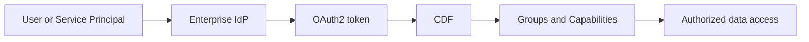
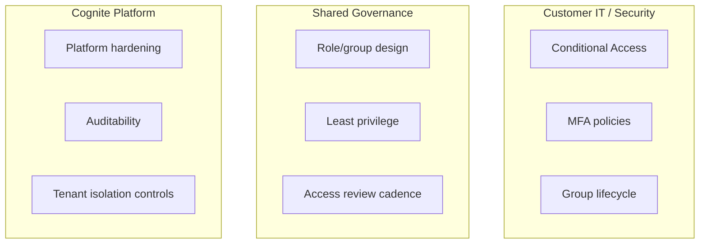
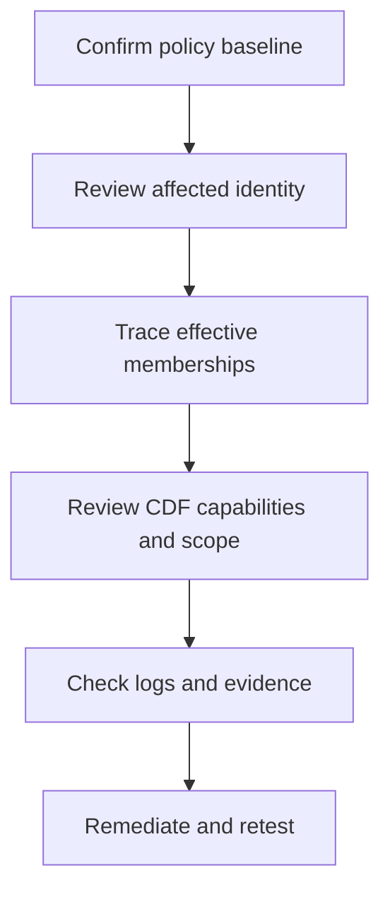

# CDF Security Briefing

**Meeting version for customer discussions on identity, access, and controls in Cognite Data Fusion (CDF).**

> **This document is designed for live meetings.** It is intentionally concise, uses plain language, and includes optional detail boxes for deeper discussion when needed.

---

## 1) Executive Summary

- CDF uses enterprise identity (IdP) for sign-in and CDF roles/groups for authorization.
- Device restrictions (work laptop vs personal device) are primarily controlled by customer IdP Conditional Access policy.
- Data visibility is controlled by group membership + capability scope (least privilege).
- When access seems too broad, root cause is usually entitlement or mapping configuration, not platform bypass.

> [!NOTE]
> **Detail Box A: 30-second opener**
> “CDF follows your enterprise identity model. Authentication comes from your IdP, and authorization is enforced in CDF through scoped roles and groups. If we see unexpected access, we investigate policy, group membership, and mapping first.”

---

## 2) Security Model at a Glance

### What this means

| Layer | What it answers | Primary owner |
|------|------------------|---------------|
| **Authentication** | Who are you? | Customer IdP team |
| **Authorization** | What can you do? | CDF access model (shared governance) |
| **Data scope** | Which data can you access? | Shared governance (least privilege) |

> [!TIP]
> **Detail Box B: clarify “not wide open”**
> “Successful login does not mean full data access. Access still depends on role/group capabilities and scope.”

---

## 3) Responsibility Split (Customer + Platform)

| Area | Customer IT/Security | Cognite | Shared |
|------|----------------------|---------|--------|
| Device compliance controls | Yes | No | No |
| IdP sign-in policy (MFA/CA) | Yes | No | No |
| Platform security controls | No | Yes | No |
| Access model design and scoping | No | No | Yes |

> [!IMPORTANT]
> **Detail Box C: meeting alignment point**
> “This is a shared-responsibility model. We get the best outcomes when IdP policy and CDF role scoping are reviewed together.”

---

## 4) Typical Concern Patterns and How We Explain Them

| Concern raised in meeting | Most common explanation | Suggested response |
|--------------------------|-------------------------|--------------------|
| “Someone logged in from a personal computer” | Conditional Access policy allows that login path | “Let’s verify managed-device and compliance rules for the Cognite app registration.” |
| “Someone saw data they shouldn’t” | Group membership too broad, mapping mismatch, or over-broad scope | “Let’s trace effective membership and capability scope for that identity.” |
| “Can AI see more than users?” | AI acts with delegated identity permissions | “AI can only access what the signed-in identity is authorized to access.” |

---

## 5) Validation Approach

### Checklist

- Confirm IdP Conditional Access for the CDF enterprise application.
- Confirm MFA/device compliance policy is enforced as intended.
- Review effective group memberships for user/service principal.
- Verify CDF capability scopes (dataset/space/table) follow least privilege.
- Validate with test identity after remediation.

> [!NOTE]
> **Detail Box D: evidence-first language**
> “We will validate with logs, effective access, and controlled test identities before concluding root cause.”

---

## 6) Live Demonstration

The detailed screen-by-screen walkthrough is available in a separate guide:

- [CDF Security Live Demo Walkthrough](CDF_SECURITY_LIVE_DEMO_WALKTHROUGH.md)

This keeps the main briefing concise and easy to share with customers while preserving a practical demo script for live sessions.

---

## 7) Control Recommendations

1. Enforce managed-device and MFA policies for all CDF access paths.
2. Separate human and machine identities; avoid shared credentials.
3. Reduce broad “all scope” permissions where scoped alternatives exist.
4. Run periodic access recertification for high-impact groups.
5. Enable alerting for unusual sign-ins and privilege changes.

---

## 8) Meeting Slide Outline

1. **Why we’re discussing security now**
2. **How CDF security works (simple architecture)**
3. **Who owns what (responsibility split)**
4. **Likely root causes for reported concerns**
5. **Validation plan and timeline**
6. **Controls we recommend implementing next**

---

## 9) Closing Statement

“We treat these concerns seriously and transparently. Our approach is to validate identity policy, effective access, and CDF scoping together, then close any gaps with clear owners and timelines.”

---

*Last updated: February 2026*
