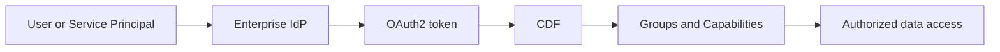
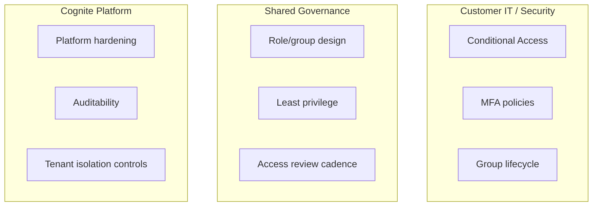
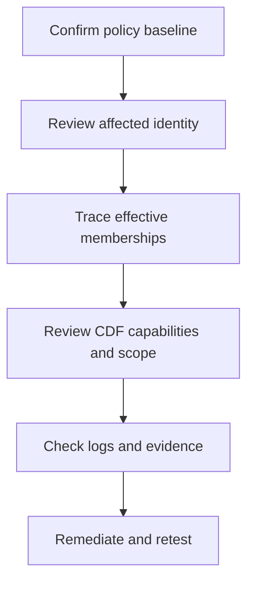
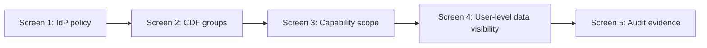

# CDF Security Briefing (Customer-Facing)

**Meeting version for customer discussions on identity, access, and controls in Cognite Data Fusion (CDF).**

> **Use this document during live meetings.** It is intentionally concise, uses plain language, and includes “detail boxes” you can expand on when needed.

---

## 1) Executive Summary

- CDF uses enterprise identity (IdP) for sign-in and CDF roles/groups for authorization.
- Device restrictions (work laptop vs personal device) are primarily controlled by customer IdP Conditional Access policy.
- Data visibility is controlled by group membership + capability scope (least privilege).
- When access seems too broad, root cause is usually entitlement or mapping configuration, not platform bypass.

> [!NOTE]
> **Detail Box A: 30-second opener**
> “CDF follows your enterprise identity model. Authentication comes from your IdP, and authorization is enforced in CDF through scoped roles and groups. If we see unexpected access, we investigate policy, group membership, and mapping first.”

---

## 2) Security Model at a Glance

### What this means

| Layer | What it answers | Primary owner |
|------|------------------|---------------|
| **Authentication** | Who are you? | Customer IdP team |
| **Authorization** | What can you do? | CDF access model (shared governance) |
| **Data scope** | Which data can you access? | Shared governance (least privilege) |

> [!TIP]
> **Detail Box B: clarify “not wide open”**
> “Successful login does not mean full data access. Access still depends on role/group capabilities and scope.”

---

## 3) Responsibility Split (Customer + Platform)

| Area | Customer IT/Security | Cognite | Shared |
|------|----------------------|---------|--------|
| Device compliance controls | Yes | No | No |
| IdP sign-in policy (MFA/CA) | Yes | No | No |
| Platform security controls | No | Yes | No |
| Access model design and scoping | No | No | Yes |

> [!IMPORTANT]
> **Detail Box C: meeting alignment point**
> “This is a shared-responsibility model. We get the best outcomes when IdP policy and CDF role scoping are reviewed together.”

---

## 4) Typical Concern Patterns and How We Explain Them

| Concern raised in meeting | Most common explanation | Suggested response |
|--------------------------|-------------------------|--------------------|
| “Someone logged in from a personal computer” | Conditional Access policy allows that login path | “Let’s verify managed-device and compliance rules for the Cognite app registration.” |
| “Someone saw data they shouldn’t” | Group membership too broad, mapping mismatch, or over-broad scope | “Let’s trace effective membership and capability scope for that identity.” |
| “Can AI see more than users?” | AI acts with delegated identity permissions | “AI can only access what the signed-in identity is authorized to access.” |

---

## 5) Validation Plan You Can Present

### Checklist

- Confirm IdP Conditional Access for the CDF enterprise application.
- Confirm MFA/device compliance policy is enforced as intended.
- Review effective group memberships for user/service principal.
- Verify CDF capability scopes (dataset/space/table) follow least privilege.
- Validate with test identity after remediation.

> [!NOTE]
> **Detail Box D: evidence-first language**
> “We will validate with logs, effective access, and controlled test identities before concluding root cause.”

---

## 6) Live Demo Walkthrough (CDF Security Screens)

Use this walkthrough when you need to demonstrate security controls directly in CDF and related identity tooling.

### Demo objective

Show, with evidence, that:

1. Authentication is controlled by enterprise identity.
2. Authorization in CDF is role/group-based and scoped.
3. Effective access can be validated and retested after changes.

### Screen-by-screen script

| Step | Screen to show | What to say | Evidence to capture |
|------|----------------|-------------|---------------------|
| 1 | **IdP / Entra Conditional Access** | “This is where device compliance and MFA are enforced for Cognite sign-in.” | Policy name, assignments, grant controls |
| 2 | **CDF Access Management - Groups** | “CDF authorization is group-based; identities inherit capabilities from groups.” | Group names and linked source IDs |
| 3 | **Group capability details** | “Capabilities are scoped (dataset/space/table), not necessarily global.” | Example capability with explicit scope |
| 4 | **CDF Search / Explorer with test user** | “This user can see only what their group allows.” | Allowed data and denied paths |
| 5 | **Audit/log evidence** | “We can trace who accessed what and when.” | Access event, identity, timestamp |

> [!TIP]
> **Detail Box E: keep the demo safe**
> Use pre-created test identities (e.g., `read_only_user`, `restricted_user`) to avoid changing production roles live.

### Suggested 10-12 minute run-of-show

- **Minute 0-2:** Brief model recap (IdP for auth, CDF for authz).
- **Minute 2-5:** Show Conditional Access and MFA policy.
- **Minute 5-8:** Show CDF group/capability scoping.
- **Minute 8-10:** Show test user visibility differences.
- **Minute 10-12:** Show logs/evidence + close with actions.

### Demo prep checklist (before customer call)

- Prepare 2 test identities with clearly different access levels.
- Pre-open tabs/screens to avoid navigation delays.
- Have one “allowed access” example and one “denied/restricted” example.
- Verify no sensitive secrets or admin tokens are visible on shared screen.
- Prepare a fallback screenshot pack in case live systems are slow.

> [!IMPORTANT]
> **Detail Box F: phrasing for difficult questions**
> “If someone can sign in, that confirms identity policy allowed login. It does not imply broad data access. Data access is separately controlled by CDF group capabilities and scope.”

---

## 7) Customer-Facing Control Recommendations

1. Enforce managed-device and MFA policies for all CDF access paths.
2. Separate human and machine identities; avoid shared credentials.
3. Reduce broad “all scope” permissions where scoped alternatives exist.
4. Run periodic access recertification for high-impact groups.
5. Enable alerting for unusual sign-ins and privilege changes.

---

## 8) Meeting Slide Outline (ready to copy)

1. **Why we’re discussing security now**
2. **How CDF security works (simple architecture)**
3. **Who owns what (responsibility split)**
4. **Likely root causes for reported concerns**
5. **Validation plan and timeline**
6. **Controls we recommend implementing next**

---

## 9) Suggested Closing Statement

“We treat these concerns seriously and transparently. Our approach is to validate identity policy, effective access, and CDF scoping together, then close any gaps with clear owners and timelines.”

---

*Last updated: February 2026*
