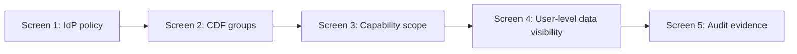

# CDF Security Live Demo Walkthrough

**Practical screen-by-screen guide for live demonstrations of CDF security controls.**

---

## Demo objective

Show, with evidence, that:

1. Authentication is controlled by enterprise identity.
2. Authorization in CDF is role/group-based and scoped.
3. Effective access can be validated and retested after changes.

## Screen-by-screen script

| Step | Screen to show | Presenter narrative | Evidence to capture |
|------|----------------|---------------------|---------------------|
| 1 | **IdP / Entra Conditional Access** | “This is where device compliance and MFA are enforced for Cognite sign-in.” | Policy name, assignments, grant controls |
| 2 | **CDF Access Management - Groups** | “CDF authorization is group-based; identities inherit capabilities from groups.” | Group names and linked source IDs |
| 3 | **Group capability details** | “Capabilities are scoped (dataset/space/table), not necessarily global.” | Example capability with explicit scope |
| 4 | **CDF Search / Explorer with test user** | “This user can see only what their group allows.” | Allowed data and denied paths |
| 5 | **Audit/log evidence** | “We can trace who accessed what and when.” | Access event, identity, timestamp |

> [!TIP]
> **Demo safety**
> Use pre-created test identities (e.g., `read_only_user`, `restricted_user`) to avoid changing production roles live.

## 10-12 minute run-of-show

- **Minute 0-2:** Brief model recap (IdP for auth, CDF for authz).
- **Minute 2-5:** Show Conditional Access and MFA policy.
- **Minute 5-8:** Show CDF group/capability scoping.
- **Minute 8-10:** Show test user visibility differences.
- **Minute 10-12:** Show logs/evidence + close with actions.

## Demo prep checklist

- Prepare 2 test identities with clearly different access levels.
- Pre-open tabs/screens to avoid navigation delays.
- Have one “allowed access” example and one “denied/restricted” example.
- Verify no sensitive secrets or admin tokens are visible on shared screen.
- Prepare a fallback screenshot pack in case live systems are slow.

> [!IMPORTANT]
> **Difficult-question phrasing**
> “If someone can sign in, that confirms identity policy allowed login. It does not imply broad data access. Data access is separately controlled by CDF group capabilities and scope.”

---

*Last updated: February 2026*
